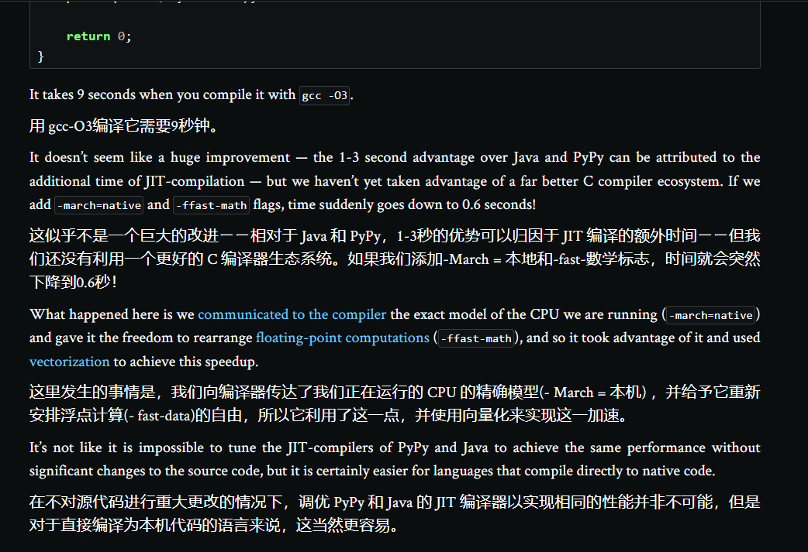
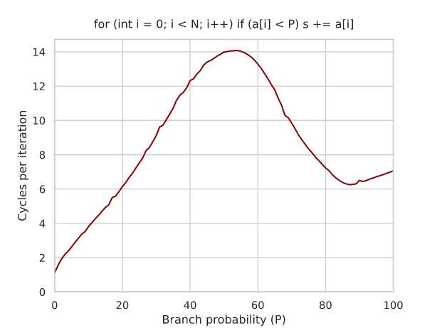

现代硬件算法

1. 复杂性模型(Complexity Models)

- 渐近复杂性不再是唯一的决定因素
- CPU 的时钟频率是 1.4 GHz，这意味着它每秒钟可以运行`1.4*10^9`次指令
  要估计一个程序的实际运行时间，需要对其执行的指令的所有延迟进行求和，并用时钟频率除以它，即特定 CPU 每秒执行的周期数。
- 

  > 向量化是一种通过使用 SIMD（Single Instruction Multiple Data）指令来并行执行多个操作的技术，以提高代码的运行效率。
  > 在编写代码时，如果可以将一些`循环操作转换为向量运算`，就可以`利用现代 CPU 的 SIMD 指令集来并行执行操作`，从而加速代码的运行。例如，可以使用向量化来实现一些矩阵运算、向量加法、向量点乘等操作。
  > 下面是一个向量化的示例，实现了两个向量的加法：

  ```python
  import numpy as np

  # 生成两个长度为1000000的随机向量
  x = np.random.rand(1000000)
  y = np.random.rand(1000000)

  # 使用向量化进行加法运算
  z = x + y

  # 输出结果
  print(z)
  ```

  > 在上述代码中，我们使用了 NumPy 库来生成随机向量并进行向量加法运算。`由于 NumPy 使用了向量化技术，因此可以自动利用 CPU 的 SIMD 指令来并行执行加法运算`，从而加速代码的运行。
  > 总的来说，向量化是一种非常有用的技术，可以提高代码的运行效率，特别是在涉及到大量数值计算的情况下，能够显著提高程序的运行速度。

2. 计算机体系结构(Computer Architecture)

- 抽象帮助我们将所有这些复杂性降低到一个接口，该接口描述某个模块在不修复具体实现的情况下可以做什么。这带来了双重好处:
  从事高级模块的工程师只需要知道(小得多的)接口。
  只要遵守合同，从事模块本身工作的工程师可以自由地优化和重构其实现。
- 硬件工程师也喜欢抽象。`中央处理器的抽象称为指令集架构(ISA)` ，它从程序员的角度定义了计算机应该如何工作。与软件界面类似，它让计算机工程师有能力改进现有的 CPU 设计，同时也让用户ーー我们程序员ーー有信心相信，以前成功的东西不会在较新的芯片上坏掉。
- 循环和条件句
  循环展开(Loop Unrolling)：通过将迭代分组在一起来展开循环(数组要预先开大一点)
  ```cpp
  for (int i = 0; i < n; i += 4) {
      s += a[i];
      s += a[i + 1];
      s += a[i + 2];
      s += a[i + 3];
  }
  ```
- 函数和递归

3. 指令层级并行(Instruction-Level Parallelism)

- 分支预测

  ```cpp
  for (int i = 0; i < N; i++)
  if (a[i] < P)
      s += a[i];
  ```

  
  请注意，`检查从未或几乎从未发生的情况几乎不需要花费任何成本`。这就是为什么程序员如此频繁地使用运行时异常和基本用例检查: **如果它们确实很罕见，那么它们实际上不会花费任何成本。**
  CPU 无法有效预测的分支是昂贵的，因为它们可能导致长时间的管道停滞，以便在分支错误预测后获取新的指令。

- 无分支编程(Branchless Programming)

  1. 删除不必要的分支
     **消除 if 语句引起的分支**

  ```cpp
  // 计算小于 50 的元素的和
  for (int i = 0; i < N; i++)
    s += (a[i] < 50) * a[i];
  ```

  3. 保留预测概率大的分支(75%)
  4. 使用哨兵减少分支
     所有带空字符串的字符串运算都必须读取无用的零字节，但这仍然比分支错误预测便宜得多。

4. 汇编(Compilation)

- 情境优化
  循环展开
  函数内联
  提示分支的可能性 `[[likely]]` `[[unlikely]]`

5. 算术(Arithmetic)

- 平方根倒数速算法(Fast Inverse Square Root)
  https://en.algorithmica.org/hpc/arithmetic/rsqrt/

6. 内存和 CPU 缓存

- 缓存相关性
  时间局部性指的是很可能很快将再次请求同一个内存位置，而空间局部性指的是很可能很快将请求附近的位置。
  对于大幂为 2 的倍数的所有指数，其性能都有所下降
  最常用的单元格都有可以被两的大幂整除的索引，`因此它们被别名到同一个缓存集中，相互排斥，有效地减少了缓存大小。`
  消除这种效果的一种方法是在布局中插入“洞”
  https://en.algorithmica.org/hpc/data-structures/segment-trees/#wide-segment-trees
- 根据经验法则，将类型定义从最小的数据类型放到最大的类型中,有利于内存对齐
- SOA(Structure of Arrays)和 AOS(Array of Structures)
  **SOA 通常是数据结构的首选**
  在大多数情况下，在实现树操作时，`访问一个节点，然后很快访问其全部或大部分内部数据`。如果这些字段是单独存储的，这意味着它们也位于不同的内存块中。如果某些请求的字段恰好被缓存，而其他字段没有被缓存，`那么您仍然必须等待获取速度最慢的字段。`
  AOS 虽然它对搜索不利，但是对线性扫描要好得多

  ```cpp
  // SOA
  struct Node {
    int left_child, right_child, key, size;
  };
  Node t[maxn];

  // AOS
  int left_child[maxn], right_child[maxn], key[maxn], size[maxn];
  ```

  这种设计上的差异在数据处理应用中很重要。例如，数据库可以面向行或面向列(也称为柱状) :

  - 当您需要在大型数据集中搜索数量有限的对象和/或获取它们的全部或大部分字段时，可以使用面向行的存储格式。例如: PostgreSQL，MongoDB。
  - 柱状存储格式用于大数据处理和分析，您需要扫描所有内容以计算某些统计数据。例子: ClickHouse，Hbase。

- 在递归函数中传递 5 个变量似乎有些笨拙，但是性能的提高显然是值得的
- 内存请求可以在时间上重叠: 当您等待读请求完成时，您可以发送其他一些请求，这些请求将与读请求同时执行。`这就是为什么线性迭代比指针跳转快得多的主要原因: CPU 知道接下来需要获取哪些内存位置，并提前很长时间发送内存请求。`
- 组合内存布局和迭代顺序(memory layout and iteration order )至关重要(参考 st 表的构建)

```cpp
int mn[logn][maxn];

memcpy(mn[0], a, sizeof a);

for (int l = 0; l < logn - 1; l++)
    for (int i = 0; i + (2 << l) <= n; i++)
        mn[l + 1][i] = min(mn[l][i], mn[l][i + (1 << l)]);
```

- 递归的确很慢，但是对于这个算法和许多类似的“分而治之”算法来说，情况并非如此。尽管迭代方法的优点是只执行顺序 I/O，`但递归方法的时间局部性要好得多`: 当一个段完全适合缓存时，它会在所有较低的递归层中保持在那里，从而在以后`获得更好的访问时间。`
- cache line
  CPU 缓存系统中数据传输的基本单位不是单个的位和字节，而是缓存线路(cache line)。`缓存线路的大小通常为 64 字节，但是在某些处理器上可能为 128 字节。`这意味着所有内存都被分割成 64 字节的块，每当你请求(读或写)一个字节时，不管你是否需要它们，你都会获取它的所有 63 个缓存线路邻居。
- 指针的替代品

7. 数据结构案例研究

- 隐式线段树
  https://en.algorithmica.org/hpc/data-structures/segment-trees/#wide-segment-trees
- `B-ary segment tree` O(logBn)
  在一个节点中存储多个数据点。这使我们可以降低树的高度，并在降序或升序时执行更少的迭代
  我们可以在每个节点中存储 B 前缀和(i 是第一个(i + 1)子节点的和)。
  https://en.algorithmica.org/hpc/data-structures/segment-trees/#wide-segment-trees

  TODO:实装
  https://github.dev/sslotin/amh-code
