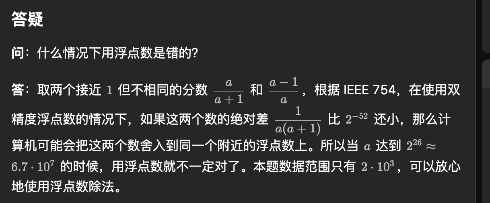

https://github.com/upupming/algorithm/blob/master/template-typescript.md
https://github.com/harttle/contest.js
https://ikatakos.com/pot/programming_algorithm/data_structure/balancing_binary_search_tree/tree_free

## todo

JS,TS 大数问题可用 BigInt 或者求余解决
遇到 1e9+7 的题目最好全部用 BigInt，避免产生溢出问题

如果数组长度不用变化，则可使用 **new TypedArray(分配连续内存的数组，长度固定)**
防止数组索引越界 grid[row+1]?.[col]
数组赋值 root[bit]![2] = 1
赋值
`cur.children[char] ??= new TrieNode()`

分析算法，找到算法的瓶颈部分，然后选取合适的数据结构和算法来优化

数据结构：线性/树/图
可视化
https://visualgo.net/zh
JavaScript 实现数据结构与算法

在 leetcode 中使用 JS
datastructures-js/queue 官方可用的堆队列库

```JS
/**
 * @description 特点
 * @description 应用场景
 * @description 时间复杂度
 * @description 空间复杂度
 */
```

时间复杂度:普通算法看最差(有一组数据 100%恶化) 随机算法看期望(没有一组数据能 100%恶化)
例如:单路快排 O(n^2) 双路快排 O(nlogn)

数据规模
10^9 是可接受的规模 10^9
C 语言大约是 4 秒
**要想在 1s 内解决问题，需要是 10^8 次的计算**
空间复杂度指的是存储了多少个变量(例如二维矩阵就是 O(n^2))

空间换时间，时间换空间
降维打击:数学方法

vscode 断点调试:
快捷键|名称|作用
-----|-----|-----
F5|继续|跳到下一个断点处
F10|单步跳过|一行一行执行代码
F11|单步调试|进入函数
Shift+F11|单步跳出|跳出函数

```JS
Math.floor 与 ~~(双按位非)的区别
~将input截取为32位(>=2^32就不成立)  谨慎使用  作用是是数字向0取整
很想Math.trunc 但是~~失败时返回0 而Math.trunc失败时返回NaN
```

不像 Math 的其他三个方法： Math.floor()、Math.ceil()、Math.round() ，`Math.trunc() 的执行逻辑很简单，仅仅是删除掉数字的小数部分和小数点`，不管参数是正数还是负数。
Math.hypot() 函数返回所有参数的平方和的平方根
Math.clz32() 函数返回一个数字在转换成 32 无符号整形数字的二进制形式后, 开头的 0 的个数

## acwing 数据范围

[由数据范围反推算法复杂度以及算法内容](https://www.acwing.com/blog/content/32/)
一般 ACM 或者笔试题的时间限制是 1 秒或 2 秒。
在这种情况下，C++代码中的操作次数控制在 107~10 为最佳。
下面给出在不同数据范围下，代码的时间复杂度和算法该如何选择:
1.n ≤30,指数级别, dfs+剪枝，状态压缩 dp，回溯，枚举
2.n ≤100 => O(n^3)，floyd，dp
3.n <1e3=>O(n^2)，O(n2logn)，dp，二分，Bellman-Ford
5.n <1e6 =>O(nlogn)，各种 sort，线段树、树状数组、setmap、heap、拓扑排序、djkstratheap、prim+heap、Kruskal、spfa、求凸包、二分
6.n < 1e7 =>O(n),以及常数较小的 O(nlogn)算法 ,贪心、单调队列、hash、双指针扫描、并查集，kmp、AC 自动机，常数比较小的 O(nlogn)的做法: sort、树状数组、heap、dijkstra、spfa、
7.n <1e8 => O(n)，双指针扫描、kmp、AC 自动机、线性筛素数

8.n ≤10^9=> o(√n)，判断质数
9.n <10^18=> O(logn)，最大公约数，快速幂，数位 DP
10.n <10^1000 => o((logmr)2)，高精度加减乘除
11.n ≤10^100000 -> O(logk x loglogk)，k 表示位数，高精度加减、FFT/NTT

`1000 不可能是贪心 ，可能是 dp；贪心至少 10000`

**面试前一定要问数据范围**

C++
int 的最大值 是 `2e9`
longlong 的最大值是 `9e18`
具有 4GB 内存的电脑可以开 `1e9` 的 int 型数组

## 数据范围不大时采用的解法

- 状压 dfs(index,state)
  `6007_数组的最大与和-不是枚举是状压dp`
- 回溯甜甜圈
  `1655. 分配重复整数`
  `1815. 得到新鲜甜甜圈的最多组数-回溯+记忆化`
- 枚举子集好人
  `5992. 基于陈述统计最多好人数`
- 折半枚举接近和
  `1755. 最接近目标值的子序列和`

## python 几个关键的容器的抽象基类

实现了 `__len__` **Sized**
实现了 `__iter__` **Iterable**
实现了 `__len__`和`__iter__` **Collection**
实现了 `__len__`和`__iter__`和`__getitem__` **Sequence**

```py
# https://stackoverflow.com/questions/1528932/how-to-create-inline-objects-with-properties
# python中像js一样创建对象

# 1. type
res: IXORTrie = type('', (), {'insert': insert, 'search': search, 'discard': discard})
# 2. SimpleNamespace
res: IXORTrie = SimpleNamespace(insert=insert, search=search, discard=discard)
# 3.namedtuple
namedtuple('Res', ['insert', 'search', 'discard'])(insert, search, discard)
```

## scipy 库的数学操作

SciPy 是基于 Python 的 NumPy 扩展构建的数学算法和便利函数的集合
https://zzz5.xyz/2020/05/30/python/scipy/python-scipy-01/

- 一个有用的命令是 dir，可用于查看模块或包的命名空间
- scipy.integrate 积分
- scipy.optimize
  - 多元标量函数的约束/无约束最小化 (minimize )
  - `scipy.optimize.linear_sum_assignment`
- scipy.interpolate 插值

python global 与 nonlocal
`nonlocal`:表示变量不是当前函数作用域的，是`上一级函数中`的局部变量
`global`：可以用在任何地方，包括最上层函数中和嵌套函数中，找到`全局变量`

## 前缀和写法

前者快一些

```Python
list(accumulate(piles[i], initial=0)
[0]+list(accumulate(piles[i])
```

## js 防止堆溢出(MLE)的方法

- 用 dp 而不是 dfs
- 用数组而不是对象(XORTrie)
- 用 TypedArray

```JS
const dp = Array.from({ length: n + 1 }, () => new Uint32Array(sqrt + 1))
// const dp = Array.from({ length: n + 1 }, () => Array(sqrt + 1).fill(0))
```

## py 里平方根的写法，sqrt 最快

## 为什么迭代器很慢

## 严格递增与非严格递增:

严格递增的第 i 个数减 i 就变成了非严格递增
a[i]-=i

## python 里自定义 object 默认 hashable

到底用 eq 去重，还是 hash 去重
hashCode 为了性能，equals 保证稳定性？
查重的时候先比较哈希，如果相同，继续比较对象
因此要重写 hashCode 保证：如果 equals 判断是相等的，那 hashCode 值也要相等

为什么需要两个呢？
equals - 保证比较对象`是否是绝对相等的`
hashCode - `保证在最快的时间`内判断两个对象是否相等，可能有误差值

无论是 Effective Java，还是阿里巴巴 Java 规范手册都是要求重写 equals，必须重写 hashCode。
两个相等的对象必须具有相等的散列码（Java 关键约定）

## CPU cache 数是 2 的幂，N + 5 是一个奇数，与之互素，这样可以减少 cache 冲突概率，提高速度。

https://stackoverflow.com/questions/11413855/why-is-transposing-a-matrix-of-512x512-much-slower-than-transposing-a-matrix-of/48029152#48029152

## 别用 input() 数据量大点就会超时，用 sys.stdin.readline()或其他输入

## ord 是 unicode ordinal 的缩写，即编号；chr 是 character 的缩写，即缩写

# heappop 与 heappush

```Python
def heappushpop(heap, item):
    """Fast version of a heappush followed by a heappop."""
    if heap and heap[0] < item:
        item, heap[0] = heap[0], item
        _siftup(heap, 0)
    return item


def heapreplace(heap, item):
    """Pop and return the current smallest value, and add the new item.

    This is more efficient than heappop() followed by heappush(), and can be
    more appropriate when using a fixed-size heap.  Note that the value
    returned may be larger than item!  That constrains reasonable uses of
    this routine unless written as part of a conditional replacement:

        if item > heap[0]:
            item = heapreplace(heap, item)
    """
    returnitem = heap[0]  # raises appropriate IndexError if heap is empty
    heap[0] = item
    _siftup(heap, 0)
    return returnitem

```

## numpy 处理大数组超级快

https://leetcode.cn/problems/maximum-trailing-zeros-in-a-cornered-path/solution/by-freeyourmind-pqc9/

## 空间消耗

leetcode 统计内存消耗的时候只会计入被访问过的内存块,所以即使我们开了一个 5·108 那么大的 int 数组(理论值为约 200OMB)，如果只使用其中的少量元素的话也不会超出内存限制。那么在一些情况下可以直接拿数组当哈希表用，让代码跑得更快。

# python 里排序 指定 key 会更快 不指定 key 会默认比较 list

# 注意临时变量占用空间 leetcode 上 JS 内存限制 182MB

```JS
// 注意js不要直接开1e9 容易MLE
const tmp = tiles.flat() // !注意这样写会产生临时变量占用额外空间 尽量不要这样写
const tree = new SegmentTree(Math.min(...tmp), Math.max(...tmp))

const tree = new SegmentTree(Math.min(...tiles.flat()), Math.max(...tiles.flat()))  // 不占用额外空间

```

`pythono位移好慢 导致线段树特别慢 还是用乘法比较好`

**js 的动态数组和对象占用内存差不多 无法用动态数组优化对象的 MLE**

`2^53-1 约等于 9e15`

- atcoder 上的 python 解释器
  cpython / pypy

- 封装函数时，重要的参数放在前面，有的参数可以加默认值

- 把 1<<63(9223372036854775808) 改小成 1<<63-1(9223372036854775807)
  快了 700ms
  **pypy3 碰到超过 2^63-1 的 int 就会变慢**

- ts 类的成员方法书写顺序规则

  1. public => protected => private
  2. static => instance

大致上是:
`静态成员 => 示例成员 => 构造函数 => 静态方法 => 实例方法 => 属性访问符/魔法方法`

- lc 的 python 参数
  lc 上 python 的 recursion_limit 是 550000

  /usr/lib/gcc/x86_64-linux-gnu/4.9.1/.cache/trace_safe --binary=/usr/lib/gcc/x86_64-linux-gnu/4.9.1/.cache/prog_joined.py --lang=python3 --data_input=/usr/lib/gcc/x86_64-linux-gnu/4.9.1/.cache/data/data.in --time_limit=10000 --memory_limit=800000000 --stack_limit=500000000 --recursion_limit=550000

  `open('/proc/' + str(os.getppid()) + '/cmdline').read()`

- sqrt 计算精度
  sqrt 因为精度问题会导致开根计算出错
  `isqrt可以避免精度问题`(注意 cpp 里的 `std::sqrt(x * x) == x (x>0)` )
  E:\test\js\算法\js\js-algorithm\20\_杂题\atc 競プロ\AtCoder Beginner Contest\243\G - Sqrt.py

  > double 精度表示不了 int64 范围的，double 范围够大，但是 IEEE 754 double 尾数是 52 位,可以表示 53 个 bit，int64 有 63 个 bit

  https://atcoder.jp/contests/panasonic2020/tasks/panasonic2020_c

- 力扣代码长度上限是 100KB

- 排序后再二重循环会快很多(cache,和指令缓存有关,当数组中的元素是随机的，分支预测就无法有效工作，而当数组元素都是是顺序的，分支预测器会动态地根据历史命中数据对未来进行预测，这样命中率就会很高。)
  https://leetcode.cn/problems/count-pairs-with-xor-in-a-range/

  ```js
  /**
   * @param {number[]} nums
   * @param {number} low
   * @param {number} high
   * @return {number}
   */
  var countPairs = function (nums, low, high) {
    let res = 0
    // nums.sort((a,b)=>a-b);
    for (let i = 0; i < nums.length - 1; i++) {
      for (let j = i + 1; j < nums.length; j++) {
        let sum = nums[i] ^ nums[j]
        if (sum >= low && sum <= high) {
          res++
        }
      }
    }
    return res
  }
  ```

  加了排序后,从 7276 ms 变成了 2188 ms
  https://xiaolincoding.com/os/1_hardware/how_to_make_cpu_run_faster.html#cpu-cache-%E6%9C%89%E5%A4%9A%E5%BF%AB

- 多重循环中 javascript 向上查找局部变量会慢一些(400ms)

  ```JS
  /**
   * @param {number[]} nums
   * @param {number} low
   * @param {number} high
   * @return {number}
   */
  function countPairs(nums, low, high) {
    let res = 0
    nums.sort((a, b) => a - b)
    for (let i = 0; i < nums.length - 1; i++) {
      for (let j = i + 1; j < nums.length; j++) {
        const xor = nums[i] ^ nums[j]
        if (xor >= low && xor <= high) {
          res++
        }
      }
    }
    return res
  }


  /**
   * @param {number[]} nums
   * @param {number} low
   * @param {number} high
   * @return {number}
   */
  function countPairs(nums, low, high) {
    const n = nums.length
    let res = 0
    nums.sort((a, b) => a - b)
    for (let i = 0; i < n - 1; i++) {
      const a = nums[i]
      for (let j = i + 1; j < n; j++) {
        const xor = a ^ nums[j]
        if (xor >= low && xor <= high) {
          res++
        }
      }
    }
    return res
  }

  ```

  上面两个函数,第一个函数比第二个函数快 400ms，用 **nums.length 不声明局部变量的写法会快一些**
  这个似乎只有 js 特有,java 和 golang 查找局部变量更快,可能是 js 查变量比较慢(

- golang 浅拷贝数组 append 比 copy 快
- `> 0 比!==0 快` (因为前者只需要比较符号)

```ts
function enumerateBits(int32: number, callback: (bit: number) => void): void {
  // !这里不用 int32 > 0会快0.5s
  while (int32) {
    const i = 31 - Math.clz32(int32 & -int32)
    callback(i)
    int32 ^= 1 << i
  }
}

if (require.main === module) {
  console.time('enumerateBits')
  for (let i = 0; i < 1e8; i++) {
    enumerateBits(i, bit => {})
  }
  console.timeEnd('enumerateBits')
}
```

- 需要开很大的布尔数组时(1e9) 使用 bitset
  https://leetcode.cn/problems/sum-of-matrix-after-queries/
- 为了防止 MLE，可以使用全局数组 (pool), 在函数开头 memset(fill) 初始化
  `不过一般 MLE 的都会 TLE`，最好是想别的方法
  空间占用太大会导致 GC 频繁(一般指小对象)，从而降低执行效率

- 如果只知道 less 函数，能否使用`!less(a,b) && !less(b,a) => a==b`判断两个对象是否相等？
  **不能，反例：less 只决定了一维偏序，但是两个对象可能在另一维上不等**

---

有时候给定一条边，需要给边加上 id 用于排序，这种时候可以不新创建一个 withId 的边，**而是直接对 order 排序**，时空间都得到了优化

---

128MB ~1e7 个 int64
256MB ~3e7 个 int64
512MB ~6e7 个 int64
1GB ~1e8 个 int64

函数内的递归 lambda 会额外消耗非常多的内存（100~200MB / 1e6 递归深度）

---

golang 手动释放内存:

```go
// method 1
runtime.GC()

// method 2
defer debug.FreeOSMemory()
```

---

golang 的 map 比较慢，python、js 的 map 比较快
https://leetcode.cn/problems/find-the-maximum-sequence-value-of-array/

---

atcoder 上，CPP 1e10 只要 1s 左右
https://atcoder.jp/contests/abc381/submissions/60091587

---

`sqrt的误差/平方根误差`
https://atcoder.jp/contests/abc400/editorial/12642

---

力扣评测流程
https://leetcode.cn/problems/serialize-and-deserialize-binary-tree/solutions/2125871/tou-gong-jian-liao-de-zuo-fa-li-yong-pin-gd7e/

---

什么情况下用浮点数是错的？
https://leetcode.cn/problems/count-number-of-trapezoids-ii/solutions/3728529/tong-ji-zhi-xian-qu-diao-zhong-fu-tong-j-a3f9/

