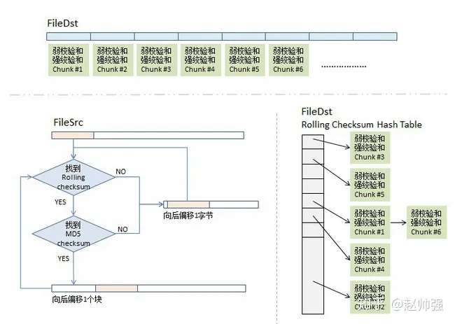

daltao-blog

https://taodaling.github.io/blog/categories/

1. [统计学习方法](https://taodaling.github.io/blog/2022/08/18/%E7%BB%9F%E8%AE%A1%E5%AD%A6%E4%B9%A0%E6%96%B9%E6%B3%95/)
2. [一些可能有点用的算法](https://taodaling.github.io/blog/2022/12/17/%E4%B8%80%E4%BA%9B%E5%8F%AF%E8%83%BD%E6%9C%89%E7%82%B9%E7%94%A8%E7%9A%84%E7%AE%97%E6%B3%95/)

   - 组合数随机选取问题
     `random.sample(arr, k): 按照 k 的大小采取两种解法-> k大，洗牌算法；k小，维护大小为k的集合.`
     时间复杂度`O(k)`
   - 红包算法(微信红包)
     n 元红包分给 k 个人
     先将金额转化为分(`*100`)，然后变成小球与隔板问题：`有N+K−1个不同的球，从中选择K−1个不同的球，每种选法的概率相等。`
     这个问题就是 `random.sample` 问题.
   - 桌游 rating 算法
     - `Elo rating` 算法
     - ∑wixi (wi = 1/(i+T)；xi:胜利为 1，失败为-1) 对所有比赛进行加权求和
   - 数值信息压缩问题
     cost(l,r)表示将灰度 l 到 r 映射到同一颜色的最少惩罚值
     dp[i][j]表示前 j 小的颜色用 i 个不同的颜色表示的最小惩罚值
     可以用决策单调性来优化

3. [实现一个现代编译器](https://taodaling.github.io/blog/2022/04/09/%E5%AE%9E%E7%8E%B0%E4%B8%80%E4%B8%AA%E7%8E%B0%E4%BB%A3%E7%BC%96%E8%AF%91%E5%99%A8/)
4. [Rust 学习笔记](https://taodaling.github.io/blog/2021/11/21/rust%E5%AD%A6%E4%B9%A0%E7%AC%94%E8%AE%B0/)
5. 环上匹配问题、环上连通问题 (atcoder 某次的 d 题?)
   https://taodaling.github.io/blog/2021/07/26/%E4%B8%80%E4%BA%9B%E5%9C%86%E7%8E%AF%E9%97%AE%E9%A2%98/
6. **一类撤销问题**
   https://taodaling.github.io/blog/2020/10/11/%E4%B8%80%E7%B1%BB%E6%92%A4%E9%94%80%E9%97%AE%E9%A2%98/
7. 正则表达式
   https://taodaling.github.io/blog/2020/08/04/%E6%AD%A3%E5%88%99%E8%A1%A8%E8%BE%BE%E5%BC%8F/
8. Java 的基础运算性能
   https://taodaling.github.io/blog/2020/09/22/java-competitive-program/

   执行操作 1e8 次

   ```
   plusMultiway finished in 38ms (循环展开实现的加法)
   empty finished in 46ms
   and finished in 47ms
   subtract finished in 48ms
   plus finished in 50ms
   longPlus finished in 80ms
   mul finished in 106ms
   longMul finished in 109ms
   invoke finished in 149ms
   choose finished in 187ms
   doubleMul finished in 279ms
   doublePlus finished in 284ms
   doubleDiv finished in 462ms
   div finished in 896ms
   mod finished in 919ms
   ```

   empty 是循环体带来的时间，所有时间减去 empty 的时间就是其方法体的时间。
   可以发现在 java 中加减和位运算非常快。
   长整数会使得运算时间翻倍，但是依旧在可以接受的范围中。
   函数调用和分支跳转更慢，但是依旧不会影响你的程序的总体时间。所以爱咋用就咋用。
   浮点数的运算时间非常慢，比函数调用还慢。但是浮点数的除法却比整数除法快很多，可能是算法不同。
   **整数除法和取模异常慢**，所以尽量避免。在取模运算的时候用 long 来存储累积和，只有在发生除法的时候才进行必要的取模。

9. 浮点数加法精度误差
   https://taodaling.github.io/blog/2020/06/16/%E6%B5%AE%E7%82%B9%E6%95%B0%E5%8A%A0%E6%B3%95%E7%B2%BE%E5%BA%A6%E8%AF%AF%E5%B7%AE/
   https://oi-wiki.org/misc/kahan-summation/
   在浮点加法计算中，交换律（commutativity）成立，但结合律（associativity）不成立。
   计算机在执行浮点数加法的时候，由于 double 类型只有 52 个有效位，因此精度是有限的（不到 16 位十进制有效数字），在执行加法运算的时候，较低的位会被省略掉，比如 1e10+(1+1e−10)，其结果为 1e10+1，而 1e−10 就被省略了。虽然看起来的省略项微不足道，但是如果有许多这样的项合在一起就变成了明显的精度误差了。
   `kahan summation` 算法可以用于一些计算浮点数的和，同时其造成的误差是 O(1)，即与加总的次数无关
   其具体代码如下：

   ```java

    public static double sum(double[] arr, int l, int r) {
        double sum = 0;
        double err = 0;  // 通过一个单独变量用来累积误差
        for (int i = l; i < r; i++) {
            double x = arr[i] - err;
            double t = sum + x;
            err = (t - sum) - x;
            sum = t;
        }
        return sum;
    }
   ```

   java 中利用 DoubleStream#sum 来计算浮点数和

10. Binary Lifting
    https://taodaling.github.io/blog/2020/03/18/binary-lifting/

    - 倍增技术：如果仅仅为了二分的话，倍增可以做到 O(n)的预处理空间复杂度和处理时间复杂度，参考 https://codeforces.com/blog/entry/74847
    - 倍增结构：
      倍增技术的强大是基于一个很简单的倍增结构。这个结构实际上还有额外的用处。
      记 jump(u,i)，它表示 u 沿着出边移动 2^i 步所在的位置，link(u,i)表示从 u 出发，通过少于 i 次的 next 转移能抵达的所有结点的集合。将 jump(u,i)视作一个结点，它覆盖了所有从 link(u,2^i)上的结点，称 i 为这个结点的高度。
      每一个倍增结点可以包含 2^i 个结点，其中 i 为倍增的次数。
      (u,v) 对应的区间可以转化为 O(logn)个倍增结点.

      现在有这样的一些问题，我们需要处理若干个请求，每个请求要求修改路径 link(u,l)上的所有结点。在所有请求完成后，要求输出所有结点的权值。
      我们实际上可以发现 u,v 对应的区间可以截断为 O(log2n)个倍增结构上的结点，我们只需要在这些结点上打上标记就可以了。并且考虑到标记只需要从高度较大的结点下推到高度较小的结点，因此在最后阶段我们可以从高到低处理结点。
      当然这个问题平平无奇，LCT 数据结构也可以做到 O(nlog2n)，但是倍增结构可以处理存在环的情况，而 LCT 就需要比较复杂的特殊处理。

      1. 并行并查集问题：给定 n 个结点，之后有 q 个请求。每个请求给定两端等长区间(a,b)和(c,d) ，表示对于所有 0≤i≤b−a，结点 a+i 和 c+i 在同一个连通块中。接下来要求计算最多可能存在多少个连通块。
         https://www.luogu.com.cn/problem/solution/P3295
      2. 树上最大流问题：现在有 n 个人，以及一颗大小为 m 的树。第 i 个人可以居住在 ui 和 vi 之间的路径上的任意一个顶点中，且一个顶点最多居住一个人。现在希望让尽可能多人居住在树上，问最多有多少人可以居住在树上。
      3. 倍增优化建图
         https://www.luogu.com.cn/problem/P5344
         类比线段树拆区间，倍增结构拆倍增链上的一段路径

      TODO: **DivideFunctionalGraph**

11. 二分中的相对和绝对误差
    https://taodaling.github.io/blog/2019/09/12/%E4%BA%8C%E5%88%86/
    现在很多输出浮点数的题目都会提供两种 AC 条件，一种是输出与真实结果的绝对误差不超过阈值，一种是输出与真实结果的相对误差不超过阈值。
    相对误差在输出结果很大的时候会发挥巨大的作用。众所周知双精度浮点型共 64 位，其中 1 位用于表示符号，11 位表示指数，其余的 52 位用于表示有效数字。简单换算就可以知道双精度浮点型可以精确表示大概 15 位十进制整数。
    现在考虑一个问题，最终结果为 10^8 ，但是要求绝对误差小于 10^−8，这现实吗。事实上尾部的数值由于有效数值不足会被舍去。这就会导致二分的时候，(l+r)/2 可能会等于 l 或等于 r，从而导致二分进入死循环。
    但是有了相对误差，情况就会大为不同，当输出为 10^8 时，我们可以不需要保留任意小数。
12. 缝隙二分
    二分还能作用在非单调函数上查找缝隙。
    所谓的缝隙是指这样一个整数 x，满足 check(x−1)≠check(x)。
    要执行缝隙二分的前提是，一开始给定的 l 和 r 满足 check(l)≠check(r)。

    在执行缝隙而二分的过程，利用 l 和 r 算出 mid=(l+r)/2 后，如果 check(mid)=check(l)，那么就令 l=mid，否则令 r=mid。
    容易发现这样做始终能保证 check(l)≠check(r)。
    由于区间在不断缩小，因此最终一定能找到一个缝隙。当然我们无法确定找到的是哪个缝隙，但是这不重要。

    https://atcoder.jp/contests/ddcc2020-qual/tasks/ddcc2020_qual_e

13. trie 合并
    https://www.luogu.com.cn/problem/CF778C
14. lca
    - 判断某个顶点 x 是否落在 u,v 的唯一路径上：
      首先 x 一定处在 lca(u,v)子树内，且 x 一定是 u 或 v 的祖先。
    - 判断 x1,y1 的路径与 x2,y2 的路径是否有交点：
      两条路径假如有交点，记任意交点为 z，很显然 z 一定是 x1 或 y1 的祖先，且 z 还是 x2 或 y2 的祖先。
      因此可以推出 lca(x2,y2)一定是 x1 或 y1 的祖先，且 lca(x1,y1)还是 x2 或 y2 的祖先。
      在一棵树上，对于路径 (x,y) 和路径 (u,v)，判断它们相交，等价于判断是否满足：
      **lca(u,v) 在路径 (x,y) 上，或者 lca(x,y) 在路径 (u,v) 上**
15. paxos (有点像桌游规则)
    https://taodaling.github.io/blog/2018/10/25/paxos/
    Paxos 算法是 Leslie Lamport 于 1990 年提出的一种基于消息传递且具有高度容错特性的**一致性算法**。

    - 背景：
      在分布式系统中就某个值达成一致非常困难。
    - 应用场景：
      在已知不存在错误消息（拜占庭错误）的情况下，Paxos 算法可以在一个可能发生上述异常的系统中**令所有节点对某个值达成一致**。
    - 算法流程：
      Paxos 将节点角色分为 Proposer，Acceptor，Learner，一个节点可以同时有多个角色。
      只有 Proposer 可以发起提案，Acceptor 负责接受提案，而 Learner 只能学习被批准的提案。
      一个提案被批准当且仅当半数以上的 Acceptor 接受了该提案。

      提案定义为(n,v)，其中 n 是唯一序号，而 v 是提案的值。n 可以本地自动生成后拼装上节点 ID。

      Paxos 算法分为两个阶段：

      **阶段一：**
      Proposer 选择一个提案序号 n，之后向半数以上的 Acceptor 发送编号为 N 的 Prepare 请求。
      如果一个 Acceptor 收到一个编号为 N 的 `prepare` 请求，若 N 大于该 Acceptor 已经响应过的所有 Prepare 请求的编号，那么它就将它已经接受过的编号最大的提案（如果存在）作为响应反馈给 Proposer，同时该 Acceptor 承诺不再接受任何编号小于 N 的提案。`(类似 chmax 返回 true)`

      **阶段二：**
      如果 Proposer 收到半数以上 Acceptor 对其编号为 n 的提案的 prepare 请求的响应，那么它就发送一个提案(n,v)的 `Accept` 请求给半数以上的 Acceptor。如果所有返回的 prepare 请求响应都不带之前提案的信息，则 v 可以为 proposer 自定义的值，否则 v 为编号最大的提案的值。
      如果 Acceptor 收到一个编号为 n 的提案的 Accept 请求，只要该 Acceptor 没有对编号大于 n 的 prepare 请求做出过响应，那么它就将接受该提案。

16. rsync 增量同步算法:如何减少同步文件时的**网络传输量**
    https://taodaling.github.io/blog/2018/10/14/rsync/
    https://zhuanlan.zhihu.com/p/59086295
    如果服务器之间需要保持某些文件的一致，我们可以使用 scp 来复制，如果需要长期保持一致，可以配合 crontab 脚本来使用。但是此时我们有更优的方式，就是 rsync+crontab 来实现定时增量传输保持文件一致。
    rsync 是 linux 下同步文件的一个高效算法，用于同步更新两处计算机的文件和目录，并适当利用查找文件中的不同块以减少数据传输。rsync 的主要特点就是增量传输，只对变更的部分进行传送。
    假如我们现在需要同步两个文件保持一致，并且只想传送不同的部分，那么我们就需要对两边的文件做 **diff**，但是这两个问题在两台不同的机器上，无法做 diff。如果我们做 diff，就要把一个文件传到另一台机器上做 diff，但这样一来，我们就传了整个文件，这与我们只想传输不同部的初衷相背。于是我们就要想一个办法，让这两边的文件见不到面，但还能知道它们间有什么不同。这就是 rsync 的算法。

    - 分块 Checksum 算法
      把 fileDst 的文件平均切分成若干个小块，比如每块 512 个字节（最后一块会小于这个数），然后对每块计算两个 checksum，弱的 checksum 是用来`快速区别不同`，而强的是用来`确认相同`
    - 传输算法
      同步目标端会把 fileDst 的一个 checksum 列表传给同步源，这个列表里包括了三个东西，rolling checksum(32bits)，md5 checksume(128bits)，文件块编号。

    ***

    假设有两台机器 A，B。A 上和 B 上共享了同一份文件 old。如果我们在 A 上编辑了这个文件，并需要 B 上的文件也同步，那么我们必须将 A 上修改后的文件 new 发送给 B。

    但是假如文件是一个视频，非常大，但是我们可能仅仅编辑了其几帧的画面，换言之实际上改变的二进制数据量非常少。这样的话，我们通过网络发送整个文件性价比就非常低，而且浪费的的流量也是难以承受的。

    假如 A 上有 old 的备份，我们可以利用一般的 diff 算法计算得到增量(例如 git 的 diff 算法)，并仅发送增量包，这样可以节省流量，但是假如没有 old 的备份，我们自然也不可能要求 B 将 old 发送过来。rsync 中的算法就可以用于解决这个问题，下面讲讲 rsync 的流程。

    首先我们要求 B 将文件 old 切分为块，每一块的大小为 B。每一块大小一致，除了最后一块。之后我们为每一个文件块都计算摘要，使用两种摘要算法，分别是弱摘要和强摘要。弱摘要使用滚动算法计算。

    之后的比较算法非常关键：

    1. B 将所有块对应的两种摘要和偏移都发送到 A 机器上。
    2. A 得到 old 上每一块的摘要后，将摘要置入哈希表中。
    3. A 开始处理 new 中的二进制数据。通过滚动算法计算窗口的弱摘要，如果在哈希表中包含对应的弱摘要，我们就再计算窗口的强摘要，之后再`利用强摘要来比对找出 new 窗口对应 old 中块的偏移`。
       
    4. 之后我们追加一个命令 `copy 偏移量`，之后窗口向后平移一个块的距离。如果没有在 old 中找到对应的块，就直接发送窗口头部的第一个字节，之后窗口右平移一个字节。

    之后 A 将变相的增量包发送到 B，让 B 根据命令列表在 old 上做一系列操作更新 old 到 new。由于`两边网络交互的主要内容均是摘要和操作，因此耗费的流量将大大减少`。
