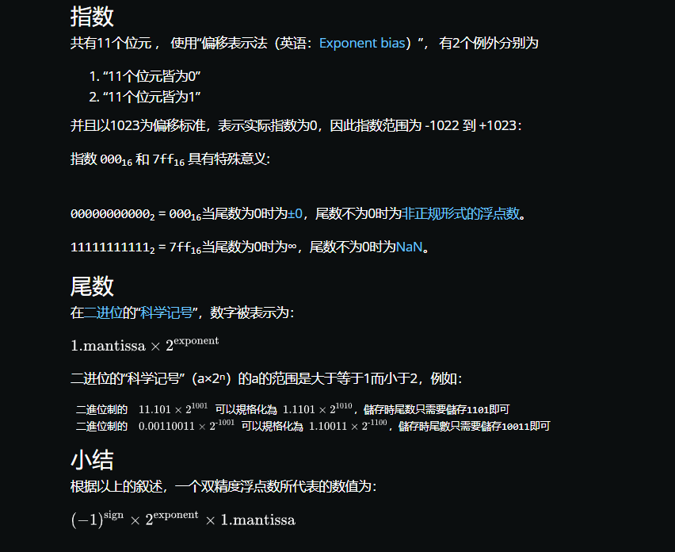

https://www.wikiwand.com/zh-hans/%E9%9B%99%E7%B2%BE%E5%BA%A6%E6%B5%AE%E9%BB%9E%E6%95%B8
http://www.codebaoku.com/it-java/it-java-231635.html

```JS
由此可知 double 的最大值
// 1.7976931348623157e+308
console.log(Number.MAX_VALUE) 即 1.000000...0*2^(1023)

// 5e-324
console.log(Number.MIN_VALUE) 即 1.000000...0*2^(-1024)
```

符号位 1+指数为 11+小数位 52 这种存储方式
任意一个数可表示为 `(-1)^(符号位)*1.(小数位)*2^(指数位)`

```JS
1. 对于整数而言
   由于 js 里的整数也是当 double 存的 尾数最多 52 位 二进制下的科学计数法表示为 **1.M**
   `4.5 转换成二进制就是 100.1，科学计数法表示是 1.001*2^2 其中 指数为 2 尾数为 001`
   所以 js 里最大安全数字 2^53-1 `（1.1111...111*2^0）符号位为0 指数位为0 尾数位为52个1`

2. 对于小数而言

- float 的小数位只有 23 位，即二进制的 23 位，能表示的最大的十进制数为 2 的 23 次方，即 8388608，即十进制的 7 位，
  严格点，精度只能百分百保证十进制的 `6 位运算`。
- double 的小数位有 52 位，对应十进制最大值为 4 503 599 627 370 496，这个数有 16 位，所以计算精度只能百分百保证十进制的 `15 位运算`。
```
