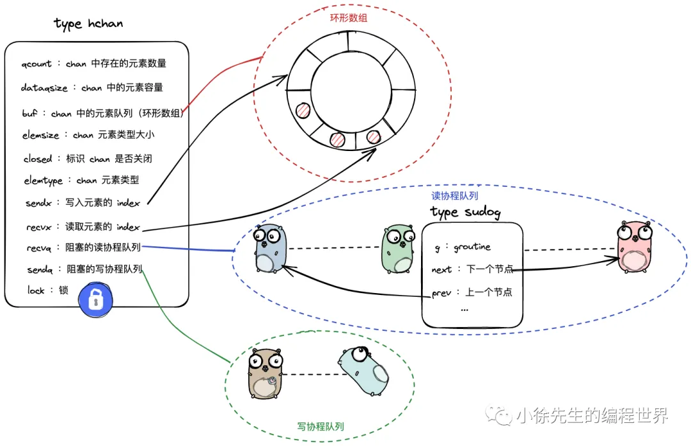
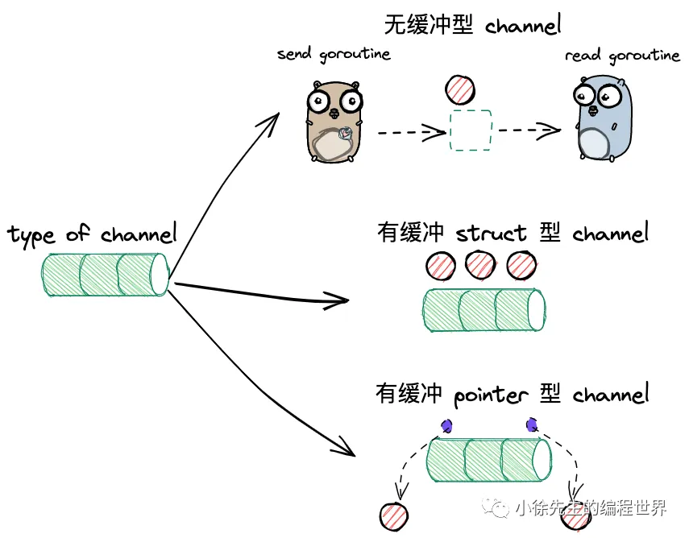
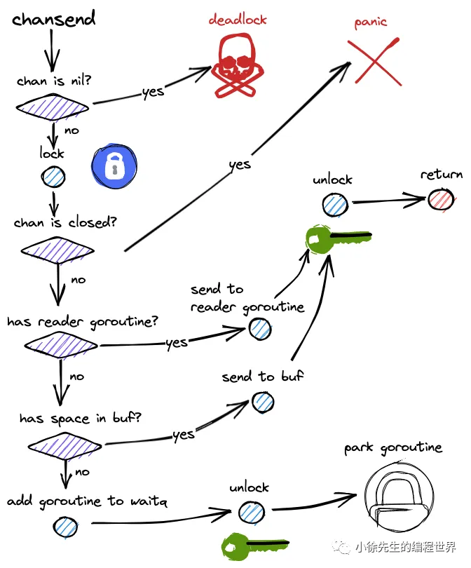
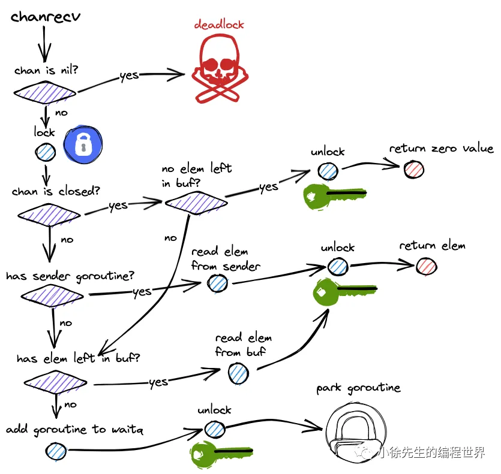
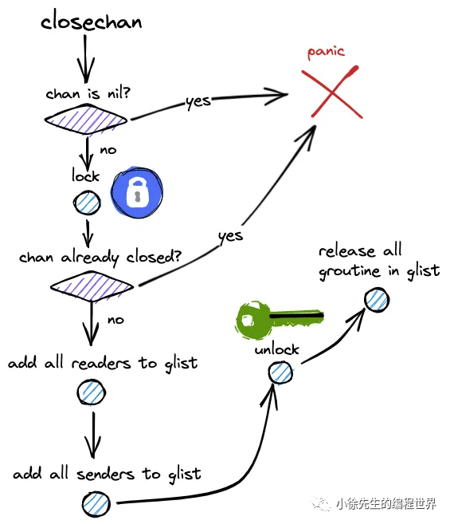

https://mp.weixin.qq.com/s?__biz=MzkxMjQzMjA0OQ==&mid=2247483770&idx=1&sn=fa999e22d5de4624544488562d6f799d

`使用通信来共享内存，而不是使用共享内存来通信。`这是 Go 语言的设计哲学之一，也是 Go 语言的并发模型的核心思想。
在 Go 语言中，通道（Channel）是一种类型，它是一种引用类型，可以用来在多个 Goroutine 之间传递数据。通道是 Go 语言在语言级别提供的 Goroutine 间的通信方式，我们可以使用通道在多个 Goroutine 之间传递数据。

## 1. channel 使用

- 构造

```go
// 创建一个无缓冲的channel
ch := make(chan int)

// 创建一个有缓冲的channel，容量为缓冲大小
ch := make(chan int, 100)
```

- 读

```go
val := <-ch
<-ch
val, ok := <-ch
```

读一个已经关闭且没有数据的 channel 会立即返回零值，`ok` 为 `false`。
读一个已经关闭且有数据的 channel 会返回数据和 `true`。
读一个未关闭且没有数据的 channel 会阻塞。
读一个未关闭且有数据的 channel 会返回数据。
读一个 nil channel(未初始化) 会死锁。

- 写

```go
ch <- 1
```

写一个已经关闭的 channel 会触发 panic。
写一个已满的 channel 会阻塞。
写一个 nil channel(未初始化) 会死锁。

- 关闭

```go
close(ch)
```

关闭 channel 后，不能再发送数据，但可以接收剩余的数据。
接收方通过 ok 值判断 channel 是否已关闭。

- select

```go
// 随机选择从ch1读数据或者向ch2写数据
// 如果都没有准备好，走default.
// 如果没有default，会阻塞直到有一个case准备好.
select {
  case <-ch1:
      // ch1 有数据
  case ch2 <- 1:
      // ch2 可写
  default:
      // 都没有
}
```

## 2. 核心数据结构



- 环形缓冲区 (存储数据)
- 发送队列双向链表 (维护写操作阻塞的 Goroutine)
- 接收队列双向链表 (维护读操作阻塞的 Goroutine)
- 锁

---

如何让一个 Goroutine 阻塞等待 Channel 数据呢？
调用 `goPark` 将 Goroutine 的状态设置为`Gwaiting`，并将其加入等待队列。当 Channel 有数据时，会调用`goready`将其唤醒。

## 3. 构造器函数



```go
func makechan(t *chantype, size int) *hchan {
    elem := t.elem

    // 判断申请内存空间大小是否越界
    mem, overflow := math.MulUintptr(elem.size, uintptr(size))
    if overflow || mem > maxAlloc-hchanSize || size < 0 {
        panic(plainError("makechan: size out of range"))
    }

    var c *hchan
    // 初始 channel，分为 无缓冲型、有缓冲元素为 struct 型、有缓冲元素为 pointer 型 channel;
    switch {
    case mem == 0:
        // 申请一个大小为默认值 96 的空间
        // Queue or element size is zero.
        c = (*hchan)(mallocgc(hchanSize, nil, true))
        // Race detector uses this location for synchronization.
        c.buf = c.raceaddr()
    case elem.ptrdata == 0:
        // 一次性分配好 96 + mem 大小的空间，并且调整 chan 的 buf 指向 mem 的起始位置
        // Elements do not contain pointers.
        // Allocate hchan and buf in one call.
        c = (*hchan)(mallocgc(hchanSize+mem, nil, true))
        c.buf = add(unsafe.Pointer(c), hchanSize)
    default:
        // 分别申请 chan 和 buf 的空间，两者无需连续
        // Elements contain pointers.
        c = new(hchan)
        c.buf = mallocgc(mem, elem, true)
    }

    c.elemsize = uint16(elem.size)
    c.elemtype = elem
    c.dataqsiz = uint(size)

    lockInit(&c.lock, lockRankHchan)

    return
}
```

---

`malloc`通过向操作系统请求连续的内存区域实现动态内存分配，典型流程包括：

1. 管理堆内存：维护空闲块、已分配块等元数据。
2. 查找合适的空闲块：根据所需大小在空闲链表或其他结构中找到可用的连续空间。
3. 分割或合并：若空闲块足够大，分割出匹配大小；若不够，则可能向操作系统申请更多内存或进行内存合并。
4. 更新元数据：标记相应块已被分配并返回指针给调用方。

## 4. 写流程

1. 两类异常情况处理

```go
func chansend1(c *hchan, elem unsafe.Pointer) {
    chansend(c, elem, true, getcallerpc())
}

func chansend(c *hchan, ep unsafe.Pointer, block bool, callerpc uintptr) bool {
    // 对于未初始化的 chan，写入操作会引发死锁；
    if c == nil {
        gopark(nil, nil, waitReasonChanSendNilChan, traceEvGoStop, 2)
        throw("unreachable")
    }

    lock(&c.lock)

    //  对于已关闭的 chan，写入操作会引发 panic.
    if c.closed != 0 {
        unlock(&c.lock)
        panic(plainError("send on closed channel"))
    }
}
```

2. 写流程串联
   

## 5. 读流程



## 6. 阻塞与非阻塞模式

1. 非阻塞模式逻辑区别
   非阻塞模式下，读/写 channel 方法通过一个 bool 型的响应参数，用以标识是否读取/写入成功.

   • 所有需要使得当前 goroutine 被挂起的操作，在非阻塞模式下都会返回 false；
   • 所有是的当前 goroutine 会进入死锁的操作，在非阻塞模式下都会返回 false；
   • 所有能立即完成读取/写入操作的条件下，非阻塞模式下会返回 true.

2. 何时进入非阻塞模式
   默认情况下，读/写 channel 都是阻塞模式，只有**在 select 语句组成的多路复用分支中，与 channel 的交互会变成非阻塞模式：**

   ```go
   ch := make(chan int)
   select{
     case <- ch:
     default:
   }
   ```

   在 select 语句包裹的多路复用分支中，读和写 channel 操作会被编译为 selectnbrecv 和 selectnbsend 方法，底层同样复用 chanrecv 和 chansend 方法，但此时由于第三个入参 `block` 被设置为 false，导致后续会走进非阻塞的处理分支.

   ```go
   func selectnbsend(c *hchan, elem unsafe.Pointer) (selected bool) {
      return chansend(c, elem, false, getcallerpc())
   }

   func selectnbrecv(elem unsafe.Pointer, c *hchan) (selected, received bool) {
      return chanrecv(c, elem, false)
   }

   func chansend(c *hchan, ep unsafe.Pointer, block bool, callerpc uintptr) bool {
      if c == nil {
          // 非阻塞模式下，直接返回 false
          if !block {
              return false
          }
          gopark(nil, nil, waitReasonChanSendNilChan, traceEvGoStop, 2)
          throw("unreachable")
      }

      // ...
   }
   ```

## 7. 两种读 channel 的协议

读取 channel 时，可以根据第二个 bool 型的返回值用以判断当前 channel 是否已处于关闭状态

```go
ch := make(chan int, 2)
got1 := <- ch
got2,ok := <- ch
```

两种格式下，读 channel 操作会被汇编成不同的方法：

```go
func chanrecv1(c *hchan, elem unsafe.Pointer) {
    chanrecv(c, elem, true)
}

//go:nosplit
func chanrecv2(c *hchan, elem unsafe.Pointer) (received bool) {
    _, received = chanrecv(c, elem, true)
    return
}
```

## 8. 关闭


• 关闭未初始化过的 channel 会 panic；
• 加锁；
• 重复关闭 channel 会 panic；
• 将阻塞读协程队列中的协程节点统一添加到 glist；
• 将阻塞写协程队列中的协程节点统一添加到 glist，`注意会触发 panic`
• 唤醒 glist 当中的所有协程.

注意不可能同时存在阻塞读和阻塞写的情况。

```go
func closechan(c *hchan) {
    if c == nil {
        panic(plainError("close of nil channel"))
    }

    lock(&c.lock)
    if c.closed != 0 {
        unlock(&c.lock)
        panic(plainError("close of closed channel"))
    }

    c.closed = 1

    var glist gList
    // release all readers
    for {
        sg := c.recvq.dequeue()
        if sg == nil {
            break
        }
        if sg.elem != nil {
            typedmemclr(c.elemtype, sg.elem)
            sg.elem = nil
        }
        gp := sg.g
        gp.param = unsafe.Pointer(sg)
        sg.success = false
        glist.push(gp)
    }

    // release all writers (they will panic)
    for {
        sg := c.sendq.dequeue()
        if sg == nil {
            break
        }
        sg.elem = nil
        gp := sg.g
        gp.param = unsafe.Pointer(sg)
        sg.success = false
        glist.push(gp)
    }
    unlock(&c.lock)

    // Ready all Gs now that we've dropped the channel lock.
    for !glist.empty() {
        gp := glist.pop()
        gp.schedlink = 0
        goready(gp, 3)
    }

    // ...
}
```
