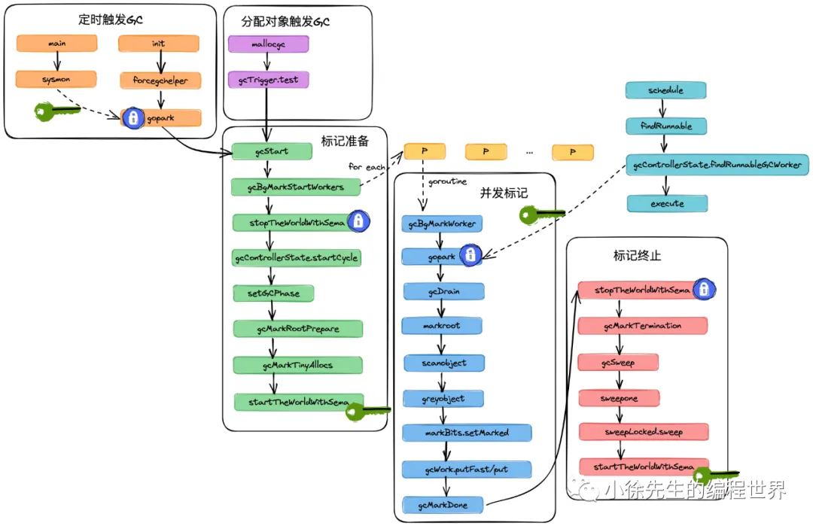

https://mp.weixin.qq.com/s?__biz=MzkxMjQzMjA0OQ==&mid=2247484000&idx=1&sn=e5050d2a63068edef20f0198674e672a
https://mp.weixin.qq.com/s?__biz=MzkxMjQzMjA0OQ==&mid=2247484011&idx=1&sn=494c5f1aff5ecac8a9eee26bf7c00c85&chksm=c10c4cb5f67bc5a36bf2512fa97f19669f1029239074f14bffc2e243317217e0673a65025f67&cur_album_id=2782506153607118852&scene=189#wechat_redirect

# Golang 垃圾回收原理分析 + 源码走读

## 1. 源码框架



## 2. 触发GC

| 类型           | 触发事件                          | 校验条件             |
| -------------- | --------------------------------- | -------------------- |
| gcTriggerHeap  | 分配对象时触发                    | 堆已分配内存达到阈值 |
| gcTriggerTime  | 由 forcegchelper 守护协程定时触发 | 每2分钟触发一次      |
| gcTriggerCycle | 用户调用 runtime.GC 方法          | 上一轮 GC 已结束     |

```go
type gcTriggerKind int

const (
    // 根据堆分配内存情况，判断是否触发GC
    gcTriggerHeap gcTriggerKind = iota
    // 定时触发GC
    gcTriggerTime
    // 手动触发GC
    gcTriggerCycle
)

// 校验条件
func (t gcTrigger) test() bool {
    // ...
    switch t.kind {
    case gcTriggerHeap:
        // ...
        trigger, _ := gcController.trigger()
          // 倘若堆中已使用的内存大小达到了阈值，则会真正执行 gc
        return atomic.Load64(&gcController.heapLive) >= trigger
    case gcTriggerTime:
        if gcController.gcPercent.Load() < 0 {
          return false
        }
        lastgc := int64(atomic.Load64(&memstats.last_gc_nanotime))
        // 每 2 min 发起一轮 gc
        return lastgc != 0 && t.now-lastgc > forcegcperiod
    case gcTriggerCycle:
          // 上一轮GC已经完成，此时能够开启新一轮GC任务
        return int32(t.n-work.cycles) > 0
    }
    return true
}
```

1. 定时触发GC

   - 启动定时触发协程并阻塞等待
     runtime 包**init**的时候，即会异步开启一个守护协程 **forcegchelper**，通过 for 循环 + park 的方式，循环阻塞等待被唤醒

     ```go
     func forcegchelper() {
         forcegc.g = getg()
         lockInit(&forcegc.lock, lockRankForcegc)
         for {
             lock(&forcegc.lock)
             // ...
             atomic.Store(&forcegc.idle, 1)
             // 令 forcegc.g 陷入被动阻塞，g 的状态会设置为 waiting，当达成 gc 条件时，g 的状态会被切换至 runnable，方法才会向下执行
             goparkunlock(&forcegc.lock, waitReasonForceGCIdle, traceEvGoBlock, 1)
             // g 被唤醒了，则调用 gcStart 方法真正开启 gc 主流程
             gcStart(gcTrigger{kind: gcTriggerTime, now: nanotime()})
         }
     }
     ```

   - sysmon 定时唤醒 forcegchelper 协程
     runtime 包下的 **main** 函数会通过 systemstack 操作切换至 g0，并调用 **sysmon** 方法，轮询尝试将 forcegchelper 协程添加到 gList 中，并在 injectglist 方法内将其唤醒

     ```go
     func sysmon() {
         // ...
         for {
             // 通过 gcTrigger.test 方法检查是否需要发起 gc，触发类型为 gcTriggerTime：定时触发
             if t := (gcTrigger{kind: gcTriggerTime, now: now}); t.test() && atomic.Load(&forcegc.idle) != 0 {
                 lock(&forcegc.lock)
                 forcegc.idle = 0
                 var list gList
                 // 需要发起 gc，则将 forcegc.g 注入 list 中, injectglist 方法内部会执行唤醒操作
                 list.push(forcegc.g)
                 injectglist(&list)
                 unlock(&forcegc.lock)
             }
             // ...
         }
     }
     ```

2. 对象分配触发GC
   mallocgc -> gcTrigger.test -> gcStart

   ```go
   func mallocgc(size uintptr, typ *_type, needzero bool) unsafe.Pointer {
       // ...
       shouldhelpgc := false
       // ...
       if size <= maxSmallSize {
           if noscan && size < maxTinySize {
               // ...
               if v == 0 {
                   // 倘若 mcache 中对应 spanClass 的 mspan 已满，置 true
                   v, span, shouldhelpgc = c.nextFree(tinySpanClass)
               }
               // ...
           } else {
               // ...
               if v == 0 {
                   // 倘若 mcache 中对应 spanClass 的 mspan 已满，置 true
                   v, span, shouldhelpgc = c.nextFree(spc)
               }
               // ...
           }
       } else {
           // 申请大小大于 32KB 的大对象，直接置为 true
           shouldhelpgc = true
           // ...
       }


       // ...
       // 尝试触发 gc，类型为 gcTriggerHeap，触发校验逻辑同样位于 gcTrigger.test 方法中
       if shouldhelpgc {
           if t := (gcTrigger{kind: gcTriggerHeap}); t.test() {
               gcStart(t)
           }
       }


      // ...
   }
   ```

3. 手动触发GC
   runtime.GC -> gcTrigger.test -> gcStart

   ```go
   func GC() {
       // ...
       gcStart(gcTrigger{kind: gcTriggerCycle, n: atomic.Load(&work.cycles)})
   }
   ```

## 3. 标记准备

| 方法                         | 文件                 | 作用                                                             |
| ---------------------------- | -------------------- | ---------------------------------------------------------------- |
| gcStart                      | runtime/mgc.go       | 标记准备阶段主流程方法                                           |
| gcBgMarkStartWorkers         | runtime/mgc.go       | 批量启动标记协程，数量对应于 P 的个数                            |
| gcBgMarkWorker               | runtime/mgc.go       | 标记协程主流程方法，启动之初会先阻塞挂起，待被唤醒后真正执行任务 |
| stopTheWorldWithSema         | runtime/mgc.go       | 即STW，停止P.                                                    |
| gcControllerState.startCycle | runtime/mgcspacer.go | 限制标记协程执行频率，目标是令标记协程对CPU的占用率趋近于 25%    |
| setGCPhase                   | runtime/mgc.go       | 更新GC阶段。当为标记阶段（GCMark）时会启用混合写屏障             |
| gcMarkTinyAllocs             | runtime/mgc.go       | 标记 mcache 中的 tiny 对象                                       |
| startTheWorldWithSema        | runtime/mgc.go       | 与STW相反，会重新唤醒各个P                                       |

- gcStart
- **gcBgMarkStartWorkers** (启动标记协程、挂起)
- stopTheWorldWithSema
- gcControllerState.startCycle
- setGCPhase
- gcMarkRootPrepare
- gcMarkTinyAllocs
- startTheWorldWithSema

1.  主流程

```go
func gcStart(trigger gcTrigger) {
    // ...
    // 检查是否达到 GC 条件，会根据 trigger 类型作 dispatch，常见的包括堆内存大小、GC 时间间隔、手动触发的类型
    for trigger.test() && sweepone() != ^uintptr(0) {
        sweep.nbgsweep++
    }

    // 上锁
    semacquire(&work.startSema)
    // 加锁 double check
    if !trigger.test() {
        semrelease(&work.startSema)
        return
    }

    // ...
    // 由于进入了 GC 模式，会根据 P 的数量启动多个 GC 并发标记协程，但是会先阻塞挂起，等待被唤醒
    gcBgMarkStartWorkers()

    // ...
    // 切换到 g0，执行 Stop the world 操作
    systemstack(stopTheWorldWithSema)
    // ...

    // 限制标记协程占用 CPU 时间片的比例为趋近 25%
    gcController.startCycle(now, int(gomaxprocs), trigger)

    // 设置GC阶段为_GCmark，启用混合写屏障
    setGCPhase(_GCmark)

    // ...
    // 对 mcache 中的 tiny 对象进行标记
    gcMarkTinyAllocs()

    // 切换至 g0，重新 start the world
    systemstack(func() {
        now = startTheWorldWithSema(trace.enabled)
       // ...
    })
    // ...
}
```

2. **启动标记协程**
   gcBgMarkWorker 方法中将g包装成一个node天添加到全局的gcBgMarkWorkerPool中，保证标记协程与P的一对一关联，并调用 gopark 方法将当前 g 挂起，等待被唤醒.

```go
func gcBgMarkStartWorkers() {
    // 开启对应于 P 个数标记协程，但是内部将 g 添加到全局的 pool 中，并通过 gopark 阻塞挂起
    for gcBgMarkWorkerCount < gomaxprocs {
        go gcBgMarkWorker()
        // 挂起，等待 gcBgMarkWorker 方法中完成标记协程与 P 的绑定后唤醒
        notetsleepg(&work.bgMarkReady, -1)
        noteclear(&work.bgMarkReady)

        gcBgMarkWorkerCount++
    }
}

func gcBgMarkWorker() {
    gp := getg()
    node := new(gcBgMarkWorkerNode)
    gp.m.preemptoff = ""
    node.gp.set(gp)
    node.m.set(acquirem())
    // 唤醒外部的 for 循环
    notewakeup(&work.bgMarkReady)

    for {
        // 当前 g 阻塞至此，直到 gcController.findRunnableGCWorker 方法被调用，会将当前 g 唤醒
        gopark(func(g *g, nodep unsafe.Pointer) bool {
            node := (*gcBgMarkWorkerNode)(nodep)
            // ...
            // 将当前 g 包装成一个 node 添加到 gcBgMarkWorkerPool 中
            gcBgMarkWorkerPool.push(&node.node)
            return true
        }, unsafe.Pointer(node), waitReasonGCWorkerIdle, traceEvGoBlock, 0)
        // ...
    }
}
```

3. Stop the world
   gcStart 方法在调用gcBgMarkStartWorkers方法异步启动标记协程后，会执行STW操作停止所有用户协程。倘若有 p 无法被抢占，则阻塞直到将其统统抢占完成。
4. 控制标记协程频率
   gcStart方法中，还会通过gcController.startCycle方法，将标记协程对CPU的占用率控制在 25% 左右。
   • 倘若P的个数能被4整除，则简单将标记协程的数量设置为P/4
   • 倘若P的个数不能被4整除，则通过控制标记协程执行时长的方式，来使全局标记协程对CPU的使用率趋近于25%
5. 设置写屏障

   ```go
   func setGCPhase(x uint32) {
       atomic.Store(&gcphase, x)
       writeBarrier.needed = gcphase == _GCmark || gcphase == _GCmarktermination
       writeBarrier.enabled = writeBarrier.needed || writeBarrier.cgo
   }
   ```

6. Tiny 对象标记
   遍历所有的P，对mcache中的Tiny对象分别调用greyobject方法进行置灰

   ```go
   func gcMarkTinyAllocs() {
       assertWorldStopped()


       for _, p := range allp {
           c := p.mcache
           if c == nil || c.tiny == 0 {
               continue
           }
           // 获取 tiny 对象
           _, span, objIndex := findObject(c.tiny, 0, 0)
           gcw := &p.gcw
           // tiny 对象置灰(标记 + 添加入队)
           greyobject(c.tiny, 0, 0, span, gcw, objIndex)
       }
   }
   ```

7. Start the world

## 4. 并发标记

标记协程在被唤醒后，需要执行的任务细节

1. **调度标记协程**
   GMP调度的主干方法

   - schedule
   - findRunnable
   - gcController.findRunnableGCWorker
   - execute

   ```go
   // 在GMP调度的主干方法schedule中，会通过g0调用findRunnable方法P寻找下一个可执行的协程，找到后会调用execute方法，内部完成由g0->g的切换，真正执行用户协程中的任务
   func schedule() {
       // ...
       gp, inheritTime, tryWakeP := findRunnable()
       // ...
       execute(gp, inheritTime)
   }

   // 通过全局标识gcBlackenEnabled发现当前开启GC模式时，会调用 gcControllerState.findRunnableGCWorker唤醒并取得标记协程
   // 在gcControllerState.findRunnableGCWorker方法中，会从全局的标记协程池 gcBgMarkWorkerPool获取到一个封装了标记协程的node
   func findRunnable() (gp *g, inheritTime, tryWakeP bool) {
      // ...
      if gcBlackenEnabled != 0 {
          gp, now = gcController.findRunnableGCWorker(_p_, now)
          if gp != nil {
              return gp, false, true
          }
      }
      // ...
   }
   ```

2. 并发标记启动

- gcBgMarkWorker
  标记协程主方法
- gcDrain
  循环处理gcw队列主方法
- markRoot
- scanobject
- greyobject
- markBits.setMarked
- gcWork.pushFast/put
  将一个对象加入gcw队列

```go
type gcDrainFlags int
const (
    gcDrainUntilPreempt gcDrainFlags = 1 << iota
    gcDrainFlushBgCredit
    gcDrainIdle
    gcDrainFractional
)

func gcBgMarkWorker() {
        // ...


        node.m.set(acquirem())
        pp := gp.m.p.ptr() // P can't change with preemption disabled.


       // ...

       // 根据不同的运作模式，执行 gcDrain 方法：
        systemstack(func() {
            casgstatus(gp, _Grunning, _Gwaiting)
            switch pp.gcMarkWorkerMode {
            default:
                throw("gcBgMarkWorker: unexpected gcMarkWorkerMode")
            case gcMarkWorkerDedicatedMode:
               // 先按照可抢占模式执行标记协程，倘若被抢占，则将抢占协程添加到全局队列中，之后再以不可抢占模式执行标记协程
                gcDrain(&pp.gcw, gcDrainUntilPreempt|gcDrainFlushBgCredit)
                if gp.preempt {
                    // 将 p 本地队列中的 g 添加到全局队列
                    if drainQ, n := runqdrain(pp); n > 0 {
                        lock(&sched.lock)
                        globrunqputbatch(&drainQ, int32(n))
                        unlock(&sched.lock)
                    }
                }
                // Go back to draining, this time
                // without preemption.
                gcDrain(&pp.gcw, gcDrainFlushBgCredit)
            case gcMarkWorkerFractionalMode:
                gcDrain(&pp.gcw, gcDrainFractional|gcDrainUntilPreempt|gcDrainFlushBgCredit)
            case gcMarkWorkerIdleMode:
                gcDrain(&pp.gcw, gcDrainIdle|gcDrainUntilPreempt|gcDrainFlushBgCredit)
            }
            casgstatus(gp, _Gwaiting, _Grunning)
        })


        // ...
    }
}
```

3. 标记主流程

```go
func gcDrain(gcw *gcWork, flags gcDrainFlags) {
    // ...

    gp := getg().m.curg
    // 模式标记
    preemptible := flags&gcDrainUntilPreempt != 0
    flushBgCredit := flags&gcDrainFlushBgCredit != 0
    idle := flags&gcDrainIdle != 0


    // 在空闲模式（idle）和分时模式（fractional）下，会提前设好 check 函数（pollWork 和 pollFractionalWorkerExit）
    var check func() bool
    if flags&(gcDrainIdle|gcDrainFractional) != 0 {
        // ...
        if idle {
            check = pollWork
        } else if flags&gcDrainFractional != 0 {
            check = pollFractionalWorkerExit
        }
    }


    // 倘若根对象还未标记完成，则先进行根对象标记
    if work.markrootNext < work.markrootJobs {
        // Stop if we're preemptible or if someone wants to STW.
        for !(gp.preempt && (preemptible || atomic.Load(&sched.gcwaiting) != 0)) {
            job := atomic.Xadd(&work.markrootNext, +1) - 1
            if job >= work.markrootJobs {
                break
            }
            // 标记根对象
            markroot(gcw, job, flushBgCredit)
            // ...
        }
    }


    // 循环从gcw缓存队列中取出灰色对象，执行scanObject方法进行扫描标记
    for !(gp.preempt && (preemptible || atomic.Load(&sched.gcwaiting) != 0)) {
        // work balance
        if work.full == 0 {
            gcw.balance()
        }


        // 尝试从 p 本地队列中获取灰色对象，无锁
        b := gcw.tryGetFast()
        if b == 0 {
            // 尝试从全局队列中获取灰色对象，加锁
            b = gcw.tryGet()
            if b == 0 {
                // 因为缺灰，会释放写屏障缓存，进行补灰操作
                wbBufFlush(nil, 0)
                b = gcw.tryGet()
            }
        }
        if b == 0 {
            // 已无对象需要标记
            break
        }
        // 进行对象的标记，并顺延指针进行后续对象的扫描
        scanobject(b, gcw)


        // 定期检查check 函数，判断标记流程是否应该被打断
        if gcw.heapScanWork >= gcCreditSlack {
            gcController.heapScanWork.Add(gcw.heapScanWork)
            // ...
            if checkWork <= 0 {
                // ...
                if check != nil && check() {
                    break
                }
            }
        }
    }


done:
    //
}
```

4. 灰对象缓存队列 gcw
   灰对象缓存队列分为两层：

   • 每个P私有的gcWork，实现上由两条单向链表构成，采用轮换机制使用 -> tryGetFast
   • 全局队列workType.full，底层是一个通过CAS操作维护的栈结构，由所有P共享 -> tryGet

5. 三色标记实现
   每个对象会有其从属的mspan，在mspan中，有着两个bitmap存储着每个对象大小的内存的状态信息

   - allocBits：标识内存的闲忙状态，一个bit位对应一个object大小的内存块，值为1代表已使用；值为0代表未使用
   - gcmakrBits：只在GC期间使用. 值为1代表占用该内存块的对象被标记存活.`清扫时，将mspan的gcmarkBits赋给allocBits，并创建出一个空白的bitmap作为新的gcmarkBits.`

   • 黑色：对象在mspan.gcmarkBits中bit位值为1，且对象已经离开灰对象缓存队列
   • 灰色：对象在mspan.gcmarkBits中bit位值为1，且对象仍处于灰对象缓存队列中
   • 白色：对象在mspan.gcmarkBits中bit位值位0.

   实现框架
   • 扫描根对象，将gcmarkBits中的bit位置1，并添加到灰对象缓存队列
   • 依次从灰对象缓存队列中取出灰对象，将其指向对象的gcmarkBits 中的bit位置1并添加到会对象缓存队列

6. 中止标记协程（check）
   gcDrain方法中，针对空闲模式idle和分时模式fractional，会设定check函数，在循环扫描的过程中检测是否需要中断当前标记协程
   - idle模式的check函数是pollwork，方法中判断P本地队列存在就绪的g或者存在就绪的网络协程，就会对当前标记协程进行中断
   - fractional 模式的check函数是pollFractionalWorkerExit，倘若当前标记协程执行的时间比例大于 1.2 倍的 fractionalUtilizationGoal 阈值，就会中止标记协程.
7. 扫描根对象 markroot
   Golang中的根对象包括如下几项：
   • .bss段内存中的未初始化全局变量
   • .data段内存中的已初始化变量
   • span 中的 finalizer
   • 各协程栈
8. 扫描普通对象 scanobject
   gcDrain 方法中，会持续从灰对象缓存队列中取出灰对象，然后采用scanobject 方法进行处理.

   ```go
   const (
       bitPointer = 1 << 0
       bitScan    = 1 << 4
   )

   func scanobject(b uintptr, gcw *gcWork) {
       // 通过地址映射到所属的页
       // 通过 heapArena 中的映射信息，从页映射到所属的 mspan
       hbits := heapBitsForAddr(b)
       s := spanOfUnchecked(b)
       n := s.elemsize
       // ...


       // 顺延当前对象的成员指针，扫描后续的对象
       var i uintptr
       for i = 0; i < n; i, hbits = i+goarch.PtrSize, hbits.next() {
           // 通过 heapArena 中的 bitmap 记录的信息，加速遍历过程
           bits := hbits.bits()
           if bits&bitScan == 0 {
               break // no more pointers in this object
           }
           if bits&bitPointer == 0 {
               continue // not a pointer
           }


           obj := *(*uintptr)(unsafe.Pointer(b + i))

           if obj != 0 && obj-b >= n {
               // 对于遍历到的对象，将其置灰，并添加到队列中，等待后续扫描
               if obj, span, objIndex := findObject(obj, b, i); obj != 0 {
                   greyobject(obj, b, i, span, gcw, objIndex)
               }
           }
       }
       // ...
   }
   ```

   两项细节:

   - 通过对象地址找到其所属的mspan

   ```go
    type heapArena struct {
      spans [pagesPerArena]*mspan  // 从页映射到mspan的索引
    }

    func findObject(p, refBase, refOff uintptr) (base uintptr, s *mspan, objIndex uintptr) {
        s = spanOf(p)
        // ...
        return
    }

    func spanOf(p uintptr) *mspan {
        // ...
        ri := arenaIndex(p)
        // ...
        l2 := mheap_.arenas[ri.l1()]
        // ...
        ha := l2[ri.l2()]
        // ...
        return ha.spans[(p/pageSize)%pagesPerArena]
    }
   ```

   - 加速扫描过程
     在heapArena中，通过一个额外的bitmap存储了内存信息
     bitmap中，`每两个bit记录一个指针大小的内存空间的信息（8B），其中一个bit标志了该位置是否是指针；另一个bit标志了该位置往后是否还存在指针`

9. 对象置灰

```go
func greyobject(obj, base, off uintptr, span *mspan, gcw *gcWork, objIndex uintptr) {
    // ...
    // 在其所属的 mspan 中，将对应位置的 gcMark bitmap 位置为 1
    mbits.setMarked()

    // ...
    // 将对象添加到当前 p 的本地队列
    if !gcw.putFast(obj) {
        gcw.put(obj)
    }
}
```

## 5. 辅助标记

1. 辅助标记策略
   在并发标记阶段，由于用户协程与标记协程共同工作，因此在极端场景下可能存在一个问题——倘若用户协程分配对象的速度快于标记协程标记对象的速度，这样`标记阶段岂不是永远无法结束？`
   为规避这一问题，Golang GC引入了辅助标记的策略，建立了一个兜底的机制：**在最坏情况下，一个用户协程分配了多少内存，就需要完成对应量的标记任务.**
   在每个用户协程 g 中，有一个字段 `gcAssisBytes`，象征GC期间可分配内存资产的概念，每个 g 在GC期间辅助标记了多大的内存空间，就会获得对应大小的资产，使得其在GC期间能多分配对应大小的内存进行对象创建.

   ```go
   type g struct {
       // ...
       gcAssistBytes int64
   }

   func mallocgc(size uintptr, typ *_type, needzero bool) unsafe.Pointer {
       // ...
       var assistG *g
       if gcBlackenEnabled != 0 {
           assistG = getg()
           if assistG.m.curg != nil {
               assistG = assistG.m.curg
           }
           // 每个 g 会有资产
           assistG.gcAssistBytes -= int64(size)


           if assistG.gcAssistBytes < 0 {
               gcAssistAlloc(assistG)  // 辅助标记执行
           }
       }
   }
   ```

## 6. 标记终止

- gcMarkDone
  所有标记任务完成后处理
- stopTheWorldWithSema
  停止所有用户协程
- gcMarkTermination
  进入标记终止阶段
- gcSweep
  唤醒后台清扫协程
- sweepone
  每次清扫一个mspan
- sweepLocked.sweep
  完成mspan中的bitmap更新
- startTheWorldWithSema
  将所有用户协程恢复为可运行态

```go
func bgsweep(c chan int) {
    sweep.g = getg()

    lockInit(&sweep.lock, lockRankSweep)
    lock(&sweep.lock)
    sweep.parked = true
    c <- 1
    // 执行 gopark 操作，等待 GC 并发标记阶段完成后将当前协程唤醒
    goparkunlock(&sweep.lock, waitReasonGCSweepWait, traceEvGoBlock, 1)

    // 当在标记终止阶段被唤醒后，会进入for循环，每轮完成一个mspan的清扫工作，随后就调用Gosched方法主动让渡P的执行权，采用这种懒清扫的方式逐步推进标记清扫流程
    for {
        // 每清扫一个 mspan 后，会发起主动让渡
        for sweepone() != ^uintptr(0) {
            sweep.nbgsweep++
            Gosched()
        }
        // ...
        lock(&sweep.lock)
        if !isSweepDone() {
            // This can happen if a GC runs between
            // gosweepone returning ^0 above
            // and the lock being acquired.
            unlock(&sweep.lock)
            continue
        }
        // 清扫完成，则继续 gopark 被动阻塞
        sweep.parked = true
        goparkunlock(&sweep.lock, waitReasonGCSweepWait, traceEvGoBlock, 1)
    }
}

// 将mspan的gcmarkBits赋给allocBits，并创建出一个空白的bitmap作为新的gcmarkBits.
func (sl *sweepLocked) sweep(preserve bool) bool {
    // ...
    s.allocBits = s.gcmarkBits
    s.gcmarkBits = newMarkBits(s.nelems)
    // ...
}
```

## 7. 系统驻留内存清理

Golang 进程从操作系统主内存（Random-Access Memory，简称 RAM）中申请到堆中进行复用的内存部分称为驻留内存（Resident Set Size，RSS）. 显然，RSS 不可能只借不还，应当遵循实际使用情况进行动态扩缩.
`Golang 运行时会异步启动一个回收协程，以趋近于 1% CPU 使用率作为目标，持续地对RSS中的空闲内存进行回收.`

```go
func main() {
    // ...
    gcenable()
    // ...
}

func gcenable() {
    // ...
    go bgscavenge(c)
    <-c
    // ...
}

// 在 bgscavenge 方法中，通过for循环 + sleep的方式，控制回收协程的执行频率在占用CPU 时间片的1%左右. 其中回收RSS的核心逻辑位于scavengerState.run方法.
func bgscavenge(c chan int) {
    scavenger.init()

    c <- 1
    scavenger.park()
    // 如果当前操作系统分配内存＞目标内存
    for {
        // 释放内存
        released, workTime := scavenger.run()
        if released == 0 {
            scavenger.park()
            continue
        }
        atomic.Xadduintptr(&mheap_.pages.scav.released, released)
        scavenger.sleep(workTime)
    }
}

// 通过findScavengeCandidate 方法寻找到待回收的页，通过 sysUnused 方法发起系统调用进行内存回收.
func (p *pageAlloc) scavengeOne(ci chunkIdx, searchIdx uint, max uintptr) uintptr {
    // ...
    lock(p.mheapLock)
    if p.summary[len(p.summary)-1][ci].max() >= uint(minPages) {
        // 找到待回收的部分
        base, npages := p.chunkOf(ci).findScavengeCandidate(pallocChunkPages-1, minPages, maxPages)


        // If we found something, scavenge it and return!
        if npages != 0 {
            // Compute the full address for the start of the range.
            addr := chunkBase(ci) + uintptr(base)*pageSize
            // ...
            unlock(p.mheapLock)


            if !p.test {
                // 发起系统调用，回收内存
                sysUnused(unsafe.Pointer(addr), uintptr(npages)*pageSize)


                // 更新状态信息
                nbytes := int64(npages) * pageSize
                gcController.heapReleased.add(nbytes)
                gcController.heapFree.add(-nbytes)


                stats := memstats.heapStats.acquire()
                atomic.Xaddint64(&stats.committed, -nbytes)
                atomic.Xaddint64(&stats.released, nbytes)
                memstats.heapStats.release()
            }


            // 更新基数树信息
            lock(p.mheapLock)
            p.free(addr, uintptr(npages), true)
            p.chunkOf(ci).scavenged.setRange(base, npages)
            unlock(p.mheapLock)


            return uintptr(npages) * pageSize
        }
    }
   //
}
```

回收细节：
回收时，可能需要同时回收多个页. 此时会利用基数树的特性,帮助快速找到连续的空闲可回收的页位置.

```go
type pallocData struct {
    pallocBits  // 一个页是否被占用了（1 占用、0空闲）
    scavenged pageBits  // 一个页是否已经被操作系统回收了（1 已回收、0 未回收）
}
```
