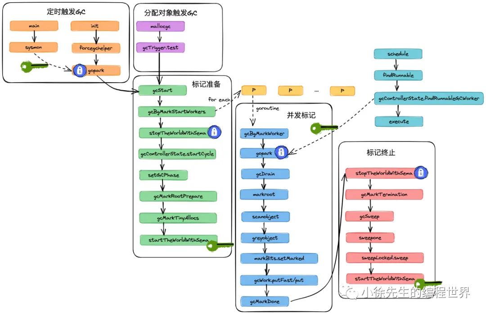

下面是一篇对 **Golang 1.19 垃圾回收源码**的较为系统且详细的总结梳理，涵盖了从 **GC 触发**、**标记准备**、**并发标记**、**辅助标记** 到 **标记终止、清扫** 以及 **内存回收（Scavenge）** 等整个流程的关键实现细节与源码逻辑。希望能帮助你快速回顾和理解 Go GC 的整体原理及核心实现。

---

## 1. 概览


**GC 源码主要分散在 `runtime/` 目录**，核心文件如下：

- **`runtime/mgc.go`**：GC 各主要流程入口和控制逻辑，如 `gcStart`、三种触发检测、标记准备、标记完成等
- **`runtime/mgcpacer.go`**：GC 调度步进策略，控制并发标记对 CPU 的占用比例
- **`runtime/mgcmark.go`**：并发标记主要流程，如 `gcDrain`、`markroot`、`scanobject` 等
- **`runtime/mgcsweep.go`**：清扫（sweep）逻辑，如 `sweepone`、`sweepLocked.sweep` 等
- **`runtime/mbitmap.go`**：位图（bitmap）相关操作封装
- **`runtime/mbwbuf.go`**：写屏障的缓存（wbBuf）及其刷新机制
- **`runtime/mgcscavenge.go`**：驻留内存回收（Scavenge）的相关逻辑

从高层来讲，Golang GC 实际采用三色标记 + 并发 + 混合写屏障（Hybrid Write Barrier）的方式完成。其核心流程可拆分为：

1. **触发 GC**
2. **标记准备（Stop The World，设置写屏障等）**
3. **并发标记**（由多个标记协程完成）
4. **辅助标记**（用户协程在分配大对象或分配频繁时，被动协助）
5. **标记终止（再次 Stop The World）**
6. **清扫和内存回收**（驻留内存及空闲页回收）

下文将按顺序对这些流程进行重点总结。

---

## 2. 触发 GC

GC 触发有三种主要类型，对应 `gcTrigger.kind` 的三种值：

1. **gcTriggerHeap**（根据堆分配量触发）

   - 当 **堆已分配的内存** 达到预期阈值时触发（由上一轮 GC 确定下轮阈值）。
   - 实现在 `mallocgc` 函数中，当新分配对象过大（>32 KB）或某些小对象分配耗尽 mcache 时，会检查是否达到 heap 触发条件，若达成则执行 `gcStart`。

2. **gcTriggerTime**（定时触发）

   - Go 运行时会在启动时创建一个叫 `forcegchelper` 的守护协程，每隔 **2 分钟**（120s）触发一次 GC。
   - 通过 `sysmon` 周期性唤醒 `forcegchelper` 协程，再调用 `gcStart(gcTriggerTime)` 进入 GC 流程。

3. **gcTriggerCycle**（手动触发）
   - 用户显示调用 `runtime.GC()` 时触发，前提是上一轮 GC 已经结束。
     `不一定能立刻触发，因为 GC 可能正在进行。`

三种事件在触发时都会先调用 `gcTrigger.test()` 校验具体条件（堆大小、时间间隔或上一轮周期）。

---

## 3. 标记准备

标记准备阶段对应 `gcStart(trigger gcTrigger)` 方法完成**大致七步**：

1. **Double-check 触发条件**

   - 再次使用 `gcTrigger.test()` 校验是否真的要开始一轮新的 GC。

2. **批量启动标记协程**

   - 方法 `gcBgMarkStartWorkers()` 根据 P 的数量，创建同等数量的标记协程（`gcBgMarkWorker`），但这些协程会先阻塞在 `gopark`，等待后续真正被唤醒。

3. **Stop the world** (加锁)
   gcStart 方法在调用gcBgMarkStartWorkers方法异步启动标记协程后，会执行STW操作停止所有用户协程

   - `stopTheWorldWithSema()` 实现 STW：获取调度锁、设置 `sched.gcwaiting=1`，抢占所有用户协程的 G，将全部 P 置为 `_Pgcstop` 等；若有抢占失败则等待重试，直至全部抢占。

4. **控制并发标记协程数量与占用率**

   - 调用 `gcController.startCycle(...)` 为并发标记阶段做“节奏管控”，目标是使标记协程总 CPU 占用率接近 **25%**。可能会将一部分标记协程设为“分时模式”。

5. **设置 GC 阶段为 `_GCmark` 并开启写屏障**
   gcStart方法会调用setGCPhase方法，标志GC正式进入并发标记（GCmark）阶段.

   - `setGCPhase(_GCmark)`，此时会开启 **混合写屏障**（Hybrid Write Barrier）。
   - 写屏障：在有新对象或向指针字段写入时，会把相关对象纳入“灰对象”队列，确保并发标记过程中不漏标。

6. **标记 mcache 中的 Tiny 对象**

   - 调用 `gcMarkTinyAllocs()`，对每个 P 的 mcache.tiny 对象执行 `greyobject` 操作。

7. **Start the world**（解锁）
   - `startTheWorldWithSema(...)` 重新启动所有 P，使用户协程和标记协程并发运行。

---

## 4. 并发标记

### 4.1 标记协程的调度唤醒

- 当调度器（`schedule`）准备从全局或本地队列获取可运行 G 时，若发现 **`gcBlackenEnabled != 0`**（表示正在 GC 的标记期），则调用 `gcController.findRunnableGCWorker` 从全局标记协程池中 **弹出一个“等待标记的协程”** 并唤醒，将其置为 `\_Grunnable，并返回给 g0 用于执行。
- 标记协程在 `gcBgMarkWorker` 中的 for 循环内 `gopark` 挂起。被唤醒后才真正进入并发标记的执行体。

### 4.2 并发标记模式

- **专一模式（dedicated）**：标记协程不可被抢占，优先执行完标记任务，但在一开始会尝试“可抢占模式”，若真被抢占则清空本地队列后转为不可抢占。
- **分时模式（fractional）**：协程只在一定时间配额内工作，超时则退出；退出条件由 `pollFractionalWorkerExit` 检测。
- **空闲模式（idle）**：空闲模式. 随时可以被抢占.

### 4.3 标记主循环：`gcDrain`

循环处理gcw队列主方法

- **标记根对象**  
  在循环标记正式开始前，若根对象（`work.markrootNext < work.markrootJobs`）未扫描完，则先扫描根（全局变量、bss、data、栈、finalizer 等）。
- **标记普通对象**  
  标记协程在循环中不停从本地工作队列 `gcWork` （或全局队列 `work.full`）取灰色对象，调用 `scanobject` 遍历其所有指针，对新发现的可达对象执行 `greyobject`（设置 `gcmarkBits` 并放入灰队列）。
- **写屏障刷新**  
  若发现待扫描灰对象不够，会刷新写屏障缓存（`wbBufFlush`），从而拿到更多需要标记的对象。
- **可中止检查**  
  针对空闲模式或分时模式，循环中会定期调用 `check()` 判断是否该让出 CPU（如有可执行 G、超过时间配额等）。

### 4.4 灰对象缓存队列gcw

灰对象缓存队列分为两层：
• 每个P私有的gcWork，实现上由两条单向链表构成，采用轮换机制使用
• 全局队列workType.full，底层是一个通过CAS操作维护的栈结构，由所有P共享

- **每个 P 维护 `gcWork`（`wbuf1`, `wbuf2`）**，无锁使用。
- 当本地队列耗尽时，再从**全局队列** `work.full`（一个无锁栈）中获取新的 `workbuf`。
- 当标记结束或协程被动退出时，会把剩余的本地 `wbuf` 归还到空闲池。

### 4.5 三色标记

- **白色**：对象还未被标记 (`gcmarkBits = 0`)
- **灰色**：对象已标记但是还在灰队列中，等待扫描
- **黑色**：对象已扫描完毕，其所有引用对象也都被标记了

Go 通过对象从属的 mspan 中的两个 bitmap **`allocBits`**（是否分配） 和 **`gcmarkBits`**（此轮 GC 的标记）来实现。扫描中若发现指针，`greyobject()` 会 `gcmarkBits.setMarked()` 并 `gcWork.putFast()` 入队。

```go
type gcBits uint8

type mspan struct {
    // ...
    allocBits  *gcBits
    gcmarkBits *gcBits
    // ...
}
```

三色标记法的实现框架：
• 扫描根对象，将gcmarkBits中的bit位置1，并添加到灰对象缓存队列
• 依次从灰对象缓存队列中取出灰对象，将其指向对象的gcmarkBits 中的bit位置1并添加到会对象缓存队列

### 4.6 新分配对象直接置黑

在 GC 期间，`mallocgc` 会调用 `gcmarknewobject()` 把新对象直接置黑，避免频繁重复扫描。

---

## 5. 辅助标记

### 5.1 辅助标记背景

- 并发标记阶段，用户协程也在不停分配新对象，若分配太快，标记跟不上，导致堆膨胀。
- 为避免最坏情况，Go 设定 **“辅助标记”**：任何 goroutine 分配时，都会计算“配额”（`gcAssistBytes`），超额后就须主动帮忙做一部分标记工作。建立了一个兜底的机制：在最坏情况下，一个用户协程分配了多少内存，就需要完成对应量的标记任务.

### 5.2 实现：`gcAssistAlloc`

- 当 `assistG.gcAssistBytes < 0` 时，会调 `gcAssistAlloc`。
- 先从全局“背景扫描信用”（`gcController.bgScanCredit`）扣些“资产”；若不足，再切到 g0，执行 `gcAssistAlloc1 -> gcDrainN`，真正做标记工作来抵偿分配“欠款”。
- 辅助标记完成后，若发现所有任务都已做完，可触发 `gcMarkDone()` 检查是否能够进入下一阶段。

---

## 6. 标记终止

### 6.1 标记完成检查

- 在并发标记过程中，当发现最后一个标记协程把所有灰对象都扫描完且队列空，就会调用 `gcMarkDone()`。
- **`gcMarkDone()`** 会先 STW，刷新所有 P 的写屏障缓存；如果又出现新增灰对象，则回退继续标记；如果确实都清完，则继续下一个阶段。

### 6.2 标记终止：`gcMarkTermination()`

- STW 状态下将 GC 阶段置为 **`_GCmarktermination`**，然后调用 `setGCPhase(_GCoff)` 关闭标记期。
- 此后进入 `gcSweep(work.mode)` 唤醒后台 Sweep 协程做清扫；再调用 `gcControllerCommit()` 设置下一轮 GC 的堆触发阈值；最后 `startTheWorldWithSema(...)` 重启所有协程。

### 6.3 标记清扫：`sweepone()`

- 后台协程 `bgsweep` 一直循环执行 `sweepone`：
  - 每次清扫一个 mspan，通过 `sweelLocked.sweep` 把该 mspan 的 `gcmarkBits` 覆盖到 `allocBits`，并分配一块新的 `gcmarkBits`。
  - 清扫一个 span 后就 `Gosched()` 主动让出，使清扫相对平滑。

### 6.4 设置下轮 GC 阈值

- `gcControllerCommit()` 根据本轮标记到的堆大小 `heapMarked` 及 `GOGC`/`gcPercent` 来动态计算 **“下一轮触发 GC 的堆使用阈值”**。
- 新一轮 GC 当 `heapLive >= trigger` 时再触发。

---

## 7. 系统驻留内存回收（Scavenge）

Go 进程从操作系统拿到的物理内存（RSS，Resident Set Size），在堆内存大量释放后，可能需要 **回收给操作系统**，否则只在 Go 内部空闲无法被其他进程使用。

- **回收协程**：启动于 `gcenable -> bgscavenge`，它在空闲时机以 ~1% 的 CPU 占用率的目标去回收空闲页。
- **回收流程**：在 `bgscavenge` 的循环里，每次调用 `scavenger.run()`，再调用 `p.scavenge(nbytes)` 找到空闲的连续页，用 `sysUnused(...)` 还给操作系统；同时更新相应的 `scavenged` bitmap。

---

## 8. 总结

1. **触发阶段**：有堆大小、时间、手动三种触发方式。
2. **标记准备**：启动标记协程、STW、设定写屏障、标记 mcache 中 tiny 对象等；然后恢复世界。
3. **并发标记**：标记协程配合用户协程并发执行，使用三色标记法维护对象状态，每个 P 都有私有的标记队列，若不够则从全局队列获取。
4. **辅助标记**：保证极端情况下，分配越多、标记越多，不会让堆无限制地增长。
5. **标记终止**：标记完后再次 STW，进入 `_GCmarktermination`，清扫并设置下一轮阈值。
6. **内存清扫**：后台协程以懒加载的方式一段段清扫 span 并更新 `gcmarkBits -> allocBits`。
7. **系统内存回收**：另有独立的 scavenge 机制低频地向操作系统归还空闲页，降低 RSS。

整个流程围绕 **三色标记法** 并借助了 **位图**（两份 bitmap）优化对象扫描；引入 **混合写屏障** 避免写入丢失；结合 **辅助标记** 防止分配过快导致 GC 无法完成；多处使用 **无锁队列**、**CAS**、**STW** 等手段，力求在不影响程序主流程性能的前提下，完成对无用对象的高效回收。

这也体现了 Go 垃圾回收的核心设计理念：**并行 & 并发**、**尽量减少全局停顿时间**、**自适应内存占用**，以及 **保证 GC 不会滞后于分配速度**。至此，Go GC 的源码阅读全貌基本覆盖完毕。
