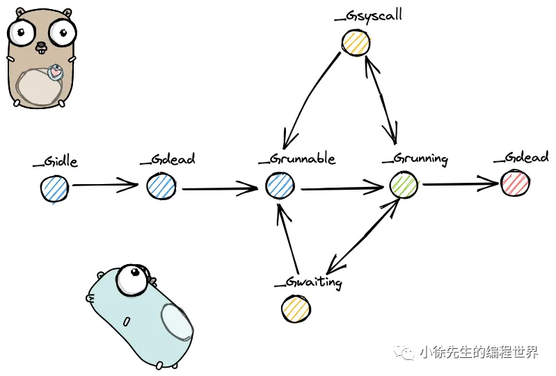

在 Go 语言中，**Goroutine（G）** 的生命周期由 Go 运行时调度器（GMP 模型）管理，其状态会经历从创建到销毁的一系列变化。以下是 Goroutine 的完整生命周期及其关键状态和转换逻辑：

---



```
（1）_Gidle 值为 0，为协程开始创建时的状态，此时尚未初始化完成；

（2）_Grunnable 值 为 1，协程在待执行队列中，等待被执行；

（3）_Grunning 值为 2，协程正在执行，同一时刻一个 p 中只有一个 g 处于此状态；

（4）_Gsyscall 值为 3，协程正在执行系统调用；

（5）_Gwaiting 值为 4，协程处于挂起态，需要等待被唤醒. gc、channel 通信或者锁操作时经常会进入这种状态；

（6）_Gdead 值为 6，协程刚初始化完成或者已经被销毁，会处于此状态；

（7）_Gcopystack 值为 8，协程正在栈扩容流程中；

（8）_Greempted 值为 9，协程被抢占后的状态.
```

### 1. **Goroutine 的创建**

- **触发条件**：通过 `go func() { ... }` 显式创建。
- **初始化**：
  - 分配栈空间（初始大小约 2KB，可动态扩展）。
  - 设置函数入口（`func` 的地址）和参数。
  - 初始化 `g` 结构体的上下文（`sched` 字段，保存寄存器状态）。
- **初始状态**：`_Gidle` → 立即转为 `_Grunnable`（可运行状态）。
- **入队逻辑**：
  - 优先放入当前 P 的本地队列（`runq`）。
  - 若本地队列满（容量 256），则放入全局队列（`sched.runq`）。

---

### 2. **Goroutine 的运行**

- **触发条件**：被调度器选中执行。
- **状态转换**：`_Grunnable` → `_Grunning`。
- **执行逻辑**：
  - M 绑定 P 后，从 P 的本地队列获取 G。
  - M 的 `curg` 字段指向当前运行的 G。
  - 执行 G 的函数代码。
- **上下文切换**：
  - 若 G 主动让出（如调用 `runtime.Gosched()`），状态转为 `_Grunnable`，重新入队。
  - 若 G 被抢占（时间片用完，默认 10ms），状态转为 `_Grunnable`，重新入队。

---

### 3. **Goroutine 的阻塞**

当 G 需要等待外部事件时，会进入阻塞状态，具体场景包括：

#### **3.1 系统调用阻塞**

- **场景**：如文件 I/O、网络 I/O（未使用 netpoller 时）。
- **状态转换**：`_Grunning` → `_Gsyscall`。
- **处理逻辑**：
  - M 解绑 P，进入系统调用阻塞状态。
  - P 被释放，可绑定其他空闲的 M 继续运行其他 G。
  - 系统调用结束后，M 尝试重新绑定 P：
    - 成功：G 状态转为 `_Grunnable`，重新入队。
    - 失败：G 放入全局队列，M 休眠。

#### **3.2 Channel 操作阻塞**

- **场景**：向无缓冲 Channel 发送数据（无接收者）或接收数据（无发送者）。
- **状态转换**：`_Grunning` → `_Gwaiting`。
- **处理逻辑**：
  - G 被移出运行队列，加入 Channel 的等待队列（`sudog` 结构）。
  - 当 Channel 就绪时（如另一端有操作），G 被唤醒并转为 `_Grunnable`，重新入队。

#### **3.3 同步原语阻塞**

- **场景**：如 `sync.Mutex`、`sync.WaitGroup` 等。
- **状态转换**：`_Grunning` → `_Gwaiting`。
- **处理逻辑**：类似 Channel 阻塞，G 加入锁的等待队列，解锁后唤醒。

---

### 4. **Goroutine 的唤醒**

- **触发条件**：阻塞事件就绪（如 Channel 有数据、锁被释放）。
- **状态转换**：`_Gwaiting` → `_Grunnable`。
- **处理逻辑**：
  - 被唤醒的 G 重新加入 P 的本地队列或全局队列。
  - 调度器在后续调度周期中重新选中该 G。

---

### 5. **Goroutine 的终止**

- **触发条件**：函数执行完毕或发生 panic 未被捕获。
- **状态转换**：`_Grunning` → `_Gdead`。
- **处理逻辑**：
  - 释放 G 占用的栈空间（若栈为动态分配）。
  - 清理 `g` 结构体，将其放回空闲 G 池（`gFree` 列表）以便复用。
  - **注意**：G 的销毁由 GC 间接管理，并非立即回收。

---

### 6. **Goroutine 的状态汇总**

| 状态名（`atomicstatus`） | 描述                     | 常见场景                    |
| ------------------------ | ------------------------ | --------------------------- |
| `_Gidle`                 | 初始状态（短暂存在）     | 刚创建但未初始化完成        |
| `_Grunnable`             | 可运行状态（等待被调度） | 在运行队列中等待 M 执行     |
| `_Grunning`              | 正在运行状态             | 当前被 M 执行               |
| `_Gsyscall`              | 系统调用中               | 执行阻塞式系统调用          |
| `_Gwaiting`              | 阻塞/等待状态            | 等待 Channel、锁、IO 等     |
| `_Gdead`                 | 终止状态                 | 函数执行完毕或 panic 未恢复 |
| `_Gcopystack`            | 栈复制中（栈扩容或缩容） | 动态调整栈大小时            |

---

### 7. **关键生命周期转换图**

```plaintext
创建 → _Gidle → _Grunnable → _Grunning → (正常结束 → _Gdead)
                |           ↑          |
                |           |          ↓
                |           ← _Grunnable ← (主动让出或抢占)
                |
                ↓
         (阻塞事件) → _Gsyscall/_Gwaiting → 事件就绪 → _Grunnable
```

---

### 8. **Goroutine 泄漏的常见原因**

1. **Channel 阻塞未释放**：
   - 例如：发送到无缓冲 Channel 但无接收者，或接收者提前退出。
2. **死锁**：
   - 多个 Goroutine 互相等待对方释放资源。
3. **未处理的 panic**：
   - 若主 Goroutine 退出，其他阻塞的 Goroutine 可能无法终止。
4. **无限循环未让出 CPU**：
   - 未调用 `runtime.Gosched()` 或包含阻塞操作。

---

### 9. **调试 Goroutine 生命周期**

- **查看所有 Goroutine 状态**：
  ```go
  import "runtime"
  buf := make([]byte, 1<<20)
  runtime.Stack(buf, true) // 获取所有 Goroutine 的堆栈信息
  ```
- **使用 pprof**：
  ```go
  import _ "net/http/pprof"
  go http.ListenAndServe(":6060", nil)
  ```
  访问 `http://localhost:6060/debug/pprof/goroutine?debug=2` 查看详细状态。

---

### 10. **总结**

Goroutine 的生命周期由 Go 运行时调度器精细管理，通过状态机实现高效调度和资源复用。理解其状态转换和阻塞场景，有助于编写高性能、无泄漏的并发代码。关键点：

1. **轻量创建**：复用 `g` 结构体，减少内存分配。
2. **高效阻塞**：通过 `netpoller` 和 Channel 机制避免线程浪费。
3. **自动伸缩**：栈动态扩展/收缩，适应不同任务需求。
