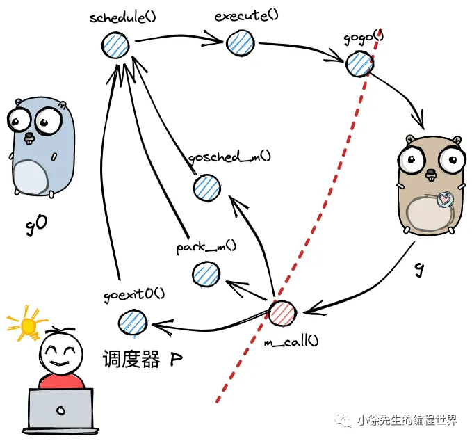

https://mp.weixin.qq.com/s?__biz=MzkxMjQzMjA0OQ==&mid=2247483889&idx=1&sn=dd5066f7c27a6b29f57ff9fecb699d77

## 1.概念梳理

- 线程
  - 操作系统最小调度单元
  - 创建、销毁、调度交由内核完成
  - 可充分利用多核，实现并行
- 协程
  
  - 用户态线程，由用户空间库实现
  - 从属同一个内核级线程，无法并行；一个协程阻塞会导致从属同一线程的所有协程无法执行
- Goroutine
  
  经 Golang 优化后的特殊“协程”
  - 创建、销毁、调度在用户态完成，对内核透明，足够轻便
  - `可利用多个线程，实现并行`。与线程存在映射关系，为 M：N。
  - 通过调度器的斡旋，实现和线程间的动态绑定和灵活调度
  - 栈空间大小可动态扩缩

| 模型      | 弱依赖内核 | 可并行 | 可应对阻塞 | 栈可动态扩缩 |
| --------- | ---------- | ------ | ---------- | ------------ |
| 线程      | ❌         | ✅     | ✅         | ❌           |
| 协程      | ✅         | ❌     | ❌         | ❌           |
| Goroutine | ✅         | ✅     | ✅         | ✅           |

## 2.gmp 模型

中介者模式，通过三个核心组件实现职责分离。

- g 需要绑定到 p 才能执行，在 g 的视角中，p 就是它的 cpu。
  对 m 而言，p 是其执行代理，为其提供必要信息的同时（可执行的 g、内存分配情况等），并隐藏了繁杂的调度细节；
- p 的数量决定了 g 最大并行数量，可由用户通过 GOMAXPROCS 进行设定（超过 CPU 核数时无意义）


G 的存放队列有三类：P 的本地队列；全局队列；和 wait 队列（图中未展示，为 io 阻塞就绪态 goroutine 队列）；
M 调度 G 时，`优先取 P 本地队列，其次取全局队列，最后取 wait 队列`；这样的好处是，`取本地队列时，可以接近于无锁化`，减少全局锁竞争；

## 3. 核心数据结构

runtime/runtime2.go

### 1. **GMP 模型的核心组件**

#### **1.1 Goroutine (G)**

- **定义**：轻量级用户态线程，由 Go 运行时管理，初始栈大小约 2KB（可动态扩展）。
- **关键结构**：

  ```go
  type g struct {
      stack       stack   // Goroutine 的栈信息
      m           *m      // 当前绑定的 M（可能为空）
      sched       gobuf   // 保存 Goroutine 的上下文（寄存器状态）
      atomicstatus uint32 // 状态（运行、阻塞、就绪等）
      // 其他字段（如调度参数、GC 标记等）
  }

  type gobuf struct {
      sp   uintptr  // 保存 CPU 的 rsp 寄存器的值，指向函数调用栈栈顶
      pc   uintptr  // 保存 CPU 的 rip 寄存器的值，指向程序下一条执行指令的地址
      ret  uintptr  // 保存系统调用的返回值
      bp   uintptr // 保存 CPU 的 rbp 寄存器的值，存储函数栈帧的起始位置.
  }
  ```

- **特点**：
  - 创建和销毁成本极低（比 OS 线程轻量 1000 倍以上）。
  - 调度由 Go 运行时控制，不依赖操作系统。

```go
const(
  _Gidle = itoa // 0，协程开始创建时的状态，此时尚未初始化完成
  _Grunnable // 1，协程在待执行队列中，等待被执行
  _Grunning // 2
  _Gsyscall // 3
  _Gwaiting // 4
  _Gdead // 6
  _Gcopystack // 8
  _Gpreempted // 9
)
```

#### **1.2 Machine (M)**

- **定义**：直接关联一个操作系统线程（OS Thread），负责执行 Goroutine 的代码。
- **关键结构**：
  ```go
  type m struct {
      g0      *g       // 调度器专用的 Goroutine（执行调度逻辑）. 一类特殊的调度协程，不用于执行用户函数，负责执行 g 之间的切换调度.
      tls     [tlsSlots]uintptr // thread-local storage (for x86 extern register)
      curg    *g       // 当前正在执行的 Goroutine
      p       puintptr // 关联的 P（Processor）
      nextp   puintptr // 临时 P（用于绑定）
      // 其他字段（如线程本地存储、锁状态等）
  }
  ```
- **特点**：
  - M 的数量默认限制为 `10000`（可通过 `SetMaxThreads` 调整）。
  - M 必须绑定一个 P 才能执行 G。

#### **1.3 Processor (P)**

- **定义**：逻辑处理器，管理本地 Goroutine 队列和运行上下文。
- **关键结构**：

  ```go
  type p struct {
      m           muintptr   // 关联的 M

      runqhead    uint32     // 本地运行队列头
      runqtail    uint32     // 本地运行队列尾
      runq        [256]guintptr // 本地 Goroutine 队列（固定容量）

      runnext     guintptr   // 高优先级 Goroutine（插队执行）
      // 其他字段（如 GC 标记、计时器等）
  }
  ```

- **特点**：
  - P 的数量默认等于 CPU 核数（通过 `GOMAXPROCS` 设置）。
  - 每个 P 维护一个本地 Goroutine 队列（**无锁操作**，高效）。

#### **1.4 schedt（全局 goroutine 队列）**

```go
type schedt struct {
    // 全局 Goroutine 队列
    runq     gQueue // 全局可运行 Goroutine 队列
    runqsize int32  // 全局队列中的 Goroutine 数量

    lock mutex
    // 其他字段（如锁、调试信息等）
}
```

## 4. 调度流程

1. 两种 g 的转换
   
   m 通过 p 调度执行的 goroutine 永远在普通 g 和 g0 之间进行切换，当 g0 找到可执行的 g 时，会调用 gogo 方法，调度 g 执行用户定义的任务；
   当 g 需要主动让渡或被动调度时，会触发 mcall 方法，将执行权重新交还给 g0.
   ```go
   func gogo(buf *gobuf)
   // ...
   func mcall(fn func(*g))
   ```
2. 调度类型
   
   调度器 p 实现从执行一个 g 切换到另一个 g 的过程.

   - 协作式调度（Cooperative Scheduling）
     调用 runtime.Gosched() 主动让出 CPU
     Goroutine 主动让出 CPU，调度器不会强制中断正在运行的 Goroutine
     `由 m 下的 g0 完成。`
   - 抢占式调度（Preemptive Scheduling）
     在 Golang 进程会有一个全局监控协程 monitor g 的存在，这个 g 会越过 p 直接与一个 m 进行绑定，不断轮询对所有 p 的执行状况进行监控.
     时间片用完了。当一个 g 执行时间超过 10ms 时，调度器会强制中断当前 g 的执行，将执行权交给其他 g.

3. 宏观调度流程
   
   （1）以 g0 -> g -> g0 的一轮循环为例进行串联；

   （2）g0 执行 schedule() 函数，`findRunnable()`寻找到用于执行的 g；
   
   （3）g0 执行 execute() 方法，更新当前 g、p 的状态信息，并调用 gogo() 方法，将执行权交给 g；
   
   （4）g 因主动让渡( gosche_m() )、被动调度( park_m() )、正常结束( goexit0() )等原因，调用 m_call 函数，执行权重新回到 g0 手中；

   （5）g0 执行 schedule() 函数，开启新一轮循环.
