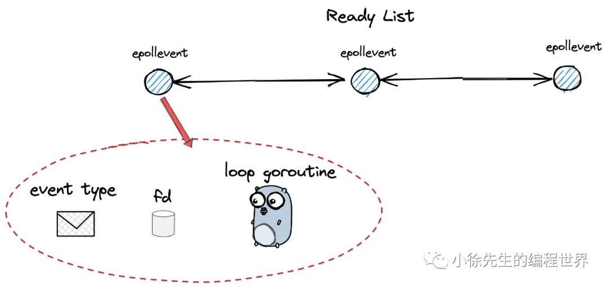
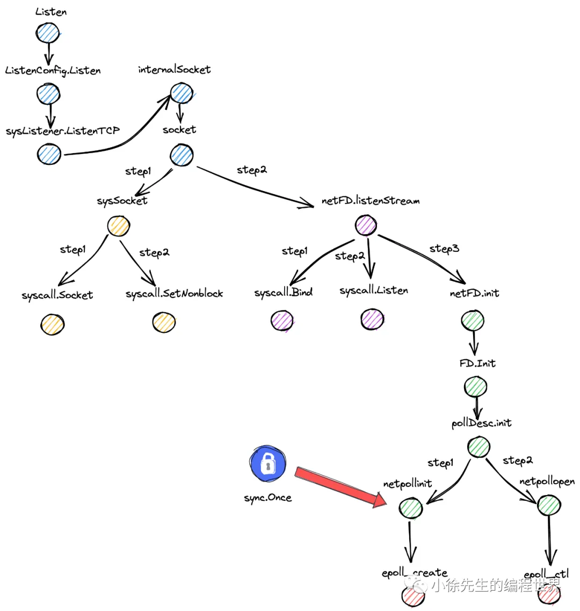
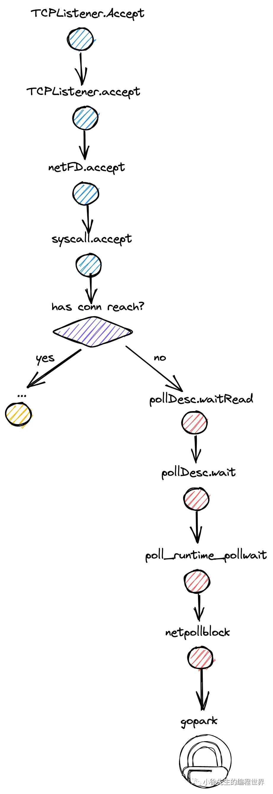

# 解析 Golang 网络 IO 模型之 EPOLL


## 1. IO 多路复用

1. 何为 IO 多路复用
   多路复用指的是，由一个执行单元，同时对多个对象提供服务，形成一对多的服务关系
   
   • 多路：存在多个需要处理 io event 的 fd（linux 中，一切皆文件，所有事物均可抽象为一个文件句柄 file descriptor，简称 fd）
   • 复用：复用一个 loop thread ，同时为多个 fd 提供处理服务（线程 thread 是内核视角下的最小调度单位；多路复用通常为循环模型 loop model，因此称为 loop thread）
2. IO 多路复用的简单实现

- 阻塞 IO
  ```go
    // 多个待服务的 fd (多路)
    fds = [fd1,fd2,fd3,...]
    // 遍历 fd 列表，末尾和首部相连，形成循环
    i = 0
    for {  // 复用
       // 获取本轮待处理的 fd
       fd = fds[i]
       // 从 fd 中读数据(阻塞)
       data = read(fd)
       // 处理数据
       handle(data)
       // 推进遍历
       i++
       if i == len(fds){
         i = 0
       }
    }
  ```
- 非阻塞 IO

```go
    // 多个待服务的 fd
    fds = [fd1,fd2,fd3,...]
    // 遍历 fd 列表，末尾和首部相连，形成循环
    i = 0
    for {
       // 获取本轮待处理的 fd
       fd = fds[i]
       // 尝试从 fd 中读数据，失败时不阻塞，而是抛出错误
       data,err = tryRead(fd)
       // 读取数据成功，处理数据
       if err == nil{
          handle(data)
       }
       // 小睡一秒后再推进流程
       sleep(1 second)
       // 推进遍历
       i++
       if i == len(fds){
         i = 0
       }
    }
```

倘若把此处的休眠操作去除了如何?
倘若不限制轮询的执行频率，那么不轮 fd 中是否有 io event，程序都会一直高强度运行，这会导致 `CPU 空转，造成很大程度的资源浪费`.

---

正解：
需要引入`操作系统内核`的帮助，通过几个内核对外暴露的接口，来进行 IO 多路复用的优雅实现，做到真正意义上的“随叫随到”.

3. IO 多路复用的优雅实现
   

- select
  - 最多处理1024个fd
  - loop thread 无法精准感知到哪些 fd 就绪，需要遍历一轮 fd 列表，时间复杂度 O(N)
  - 托付给内核的 fd 列表只具有一轮交互的时效. 新的轮次中，loop thread 需要重新将监听的 fd 列表再传递给内核一次
- epoll
  - 无 fd 数量限制
  - loop thread 被唤醒时，能明确知道哪些 fd 需要处理，减少了一次额外遍历的操作，时间复杂度由 O(N) 优化到 O(1)
  - epoll 通过将创建池子和添加 fd两个操作解耦，实现了池中 fd 数据的复用，减少了用户态与内核态间的数据拷贝成本

## 2. EventPoll 原理

1. 核心指令
   - epoll_create：创建一个 epoll 池，用于存放和管理 fd
   - epoll_ctl：向 epoll 池中添加、修改或删除待监听的 fd，同时设置关注的事件（例如 \_EPOLLIN、\_EPOLLOUT）
   - epoll_wait：从对应 epoll 池子中获取就绪的 epollevent，阻塞直到有就绪的事件发生
2. 核心数据结构
   - epoll 池红黑树
     linux 内核中，实现 epoll 池的数据结构采用的是红黑树
   - 就绪事件队列
     
3. 事件回调机制
   当用户调用 epoll_wait 时，能够准确地获取到这部分就绪的 epollevent，进而能够将对应的 loop thread 唤醒

## 3. Golang 网络 IO 源码走读

1. 启动 TCP 服务器
   Listen + Accept

```go
// 启动一个 tcp 服务端代码示例
func main(){
   // 创建一个 tcp 端口监听器
   l,_ := net.Listen("tcp",":8080")
   // 主动轮询模型
   for{
       // 等待 tcp 连接到达
       conn,_ := l.Accept()
       // 开启一个 goroutine 负责一笔客户端请求的处理
       go serve(conn)
   }
}


// 处理一笔 tcp 连接
func serve(conn net.Conn){
    defer conn.Close()
    var buf []byte
    // 读取连接中的数据
    _,_ = conn.Read(buf)
    // ...
}
```

2. 创建 TCP 端口监听器 (Listen)
   

   1. 创建 socket
   2. 绑定、监听端口
   3. 创建 epoll 池 (epoll_create)
   4. socket fd 入池 (epoll_ctl)

3. 获取 TCP 连接 (Accept)
   

   1. 尝试获取 tcp 连接
      倘若没有就绪的 tcp 连接，会抛出 syscall.EAGAIN 错误，此时会走入 pollDesc.waitRead 分支，最终通过 **gopark 操作**令当前 goroutine 陷入被动阻塞状态
   2. conn fd 入池
      tcp 封装成 netFD，netFD 通过 runtime_pollOpen 将其 fd 入池，实现对事件的监听

4. TCP 连接读、写数据 (Read)
   1. 读/写 tcp 连接数据
      如果数据未就绪，gopark 进入阻塞状态，等待 epoll 通知数据到达
5. 唤醒阻塞的 IO 协程
   陷入被动阻塞状态的 goroutine 将会在什么时机得到唤醒的机会？

   - 全局监控任务 sysmon
     runtime/proc.go
     **每隔 10ms 调用 `netpoll` 函数**，通过 epoll_wait 获取就绪的事件，通过 `netpollready` 进行唤醒操作，阻塞态 -> 就绪态，注入到可运行队列中
     ```go
     func sysmon() {
          // ...
          for {
              // 每 10 ms 周期性执行一次
              lastpoll := int64(atomic.Load64(&sched.lastpoll))
              if netpollinited() && lastpoll != 0 && lastpoll+10*1000*1000 < now {
                  atomic.Cas64(&sched.lastpoll, uint64(lastpoll), uint64(now))
                  // 取出就绪的 loop goroutine
                  list := netpoll(0)
                  // ...
                  // 唤醒 list 中的 goruotine
                  injectglist(&list)
              }
              // ...
          }
      }
     ```
   - gmp调度主流程
     在 GMP 调度中，当本地队列和全局队列没有待执行的 goroutine 时，`findrunnable()`会调用 `netpoll` 来检查是否有刚刚被唤醒的网络 IO 协程，并将其调度执行

     ```go
     func netpoll(delay int64) gList {
         // ...
         var events [128]epollevent
     retry:
         // 非阻塞调用 epoll_wait，接收到就绪的事件列表
         n := epollwait(epfd, &events[0], int32(len(events)), waitms)
         // ...
         var toRun gList
         for i := int32(0); i < n; i++ {
             ev := &events[i]
             // 添加关心的事件模式
             var mode int32
             if ev.events&(_EPOLLIN|_EPOLLRDHUP|_EPOLLHUP|_EPOLLERR) != 0 {
                 mode += 'r'
             }
             if ev.events&(_EPOLLOUT|_EPOLLHUP|_EPOLLERR) != 0 {
                 mode += 'w'
             }
             // 从 event 中获取已就绪的 fd，调用 netpollready 方法将 fd 添加到 gList 中用于返回，在上层进行唤醒和执行
             if mode != 0 {
                 pd := *(**pollDesc)(unsafe.Pointer(&ev.data))
                 pd.setEventErr(ev.events == _EPOLLERR)
                 netpollready(&toRun, pd, mode)
             }
         }
         return toRun
     }
     ```

   - gc start the world

   ```go
   func startTheWorldWithSema(emitTraceEvent bool) int64 {
      // ...
       if netpollinited() {
           list := netpoll(0) // non-blocking
           // 唤醒 list 中的 goruotine
           injectglist(&list)
       }
       // ...
   }
   ```

---

注意 gopark <-> goready 是一对
