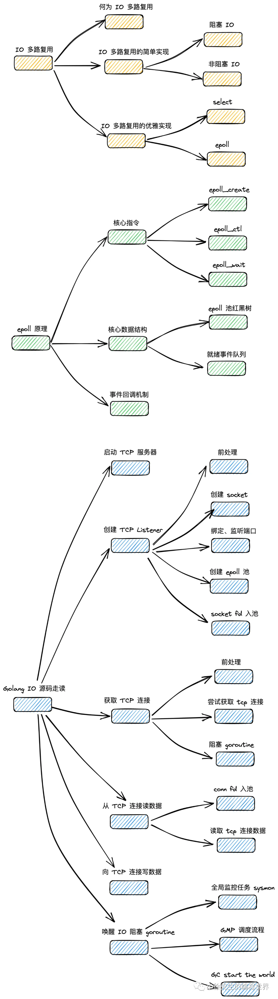

# 解析 Golang 网络 IO 模型之 EPOLL



## 1. IO 多路复用

1. 何为 IO 多路复用
   多路复用指的是，由一个执行单元，同时对多个对象提供服务，形成一对多的服务关系
   
   • 多路：存在多个需要处理 io event 的 fd（linux 中，一切皆文件，所有事物均可抽象为一个文件句柄 file descriptor，简称 fd）
   • 复用：复用一个 loop thread ，同时为多个 fd 提供处理服务（线程 thread 是内核视角下的最小调度单位；多路复用通常为循环模型 loop model，因此称为 loop thread）
2. IO 多路复用的简单实现

- 阻塞 IO
  ```go
    // 多个待服务的 fd (多路)
    fds = [fd1,fd2,fd3,...]
    // 遍历 fd 列表，末尾和首部相连，形成循环
    i = 0
    for {  // 复用
       // 获取本轮待处理的 fd
       fd = fds[i]
       // 从 fd 中读数据(阻塞)
       data = read(fd)
       // 处理数据
       handle(data)
       // 推进遍历
       i++
       if i == len(fds){
         i = 0
       }
    }
  ```
- 非阻塞 IO

```go
    // 多个待服务的 fd
    fds = [fd1,fd2,fd3,...]
    // 遍历 fd 列表，末尾和首部相连，形成循环
    i = 0
    for {
       // 获取本轮待处理的 fd
       fd = fds[i]
       // 尝试从 fd 中读数据，失败时不阻塞，而是抛出错误
       data,err = tryRead(fd)
       // 读取数据成功，处理数据
       if err == nil{
          handle(data)
       }
       // 小睡一秒后再推进流程
       sleep(1 second)
       // 推进遍历
       i++
       if i == len(fds){
         i = 0
       }
    }
```

倘若把此处的休眠操作去除了如何?
倘若不限制轮询的执行频率，那么不轮 fd 中是否有 io event，程序都会一直高强度运行，这会导致 `CPU 空转，造成很大程度的资源浪费`.

---

正解：
需要引入`操作系统内核`的帮助，通过几个内核对外暴露的接口，来进行 IO 多路复用的优雅实现，做到真正意义上的“随叫随到”.

3. IO 多路复用的优雅实现
