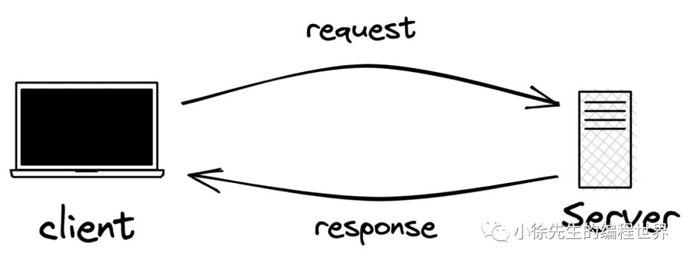
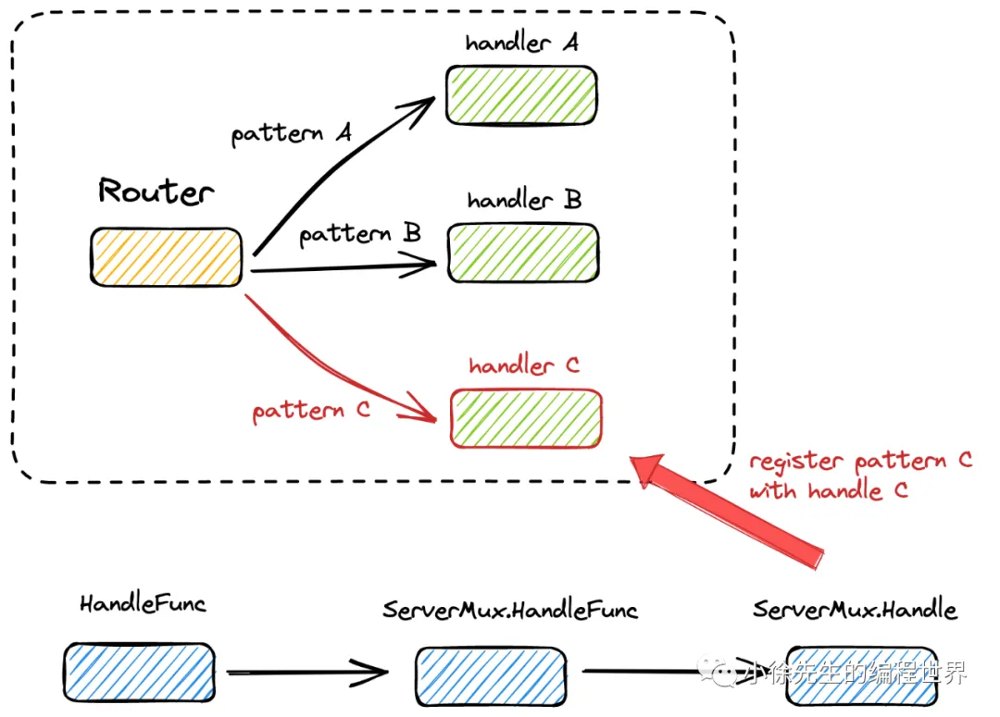
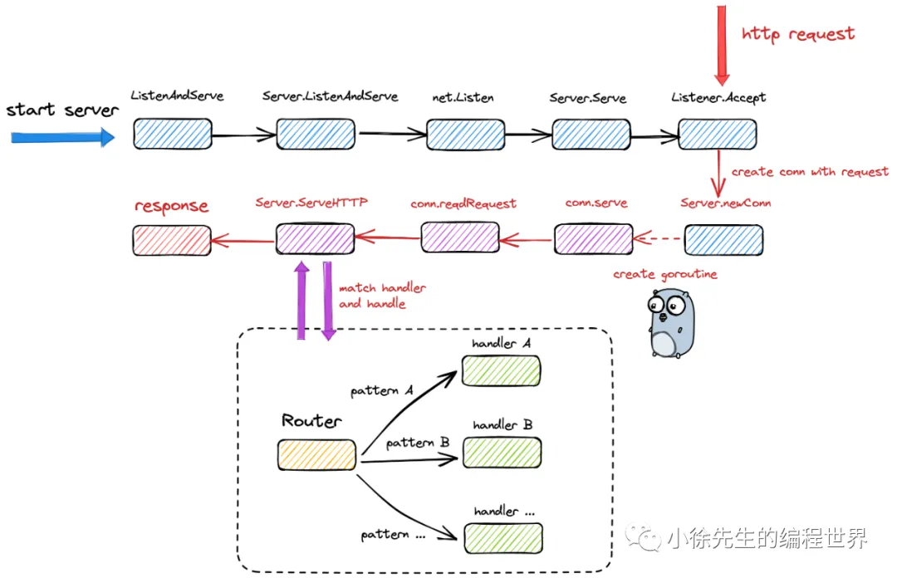
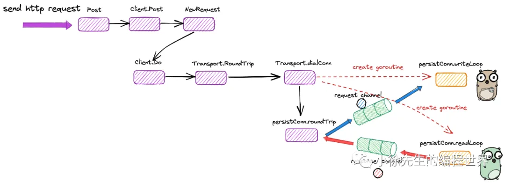
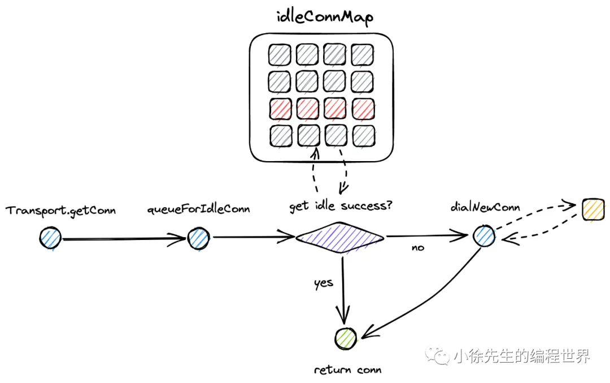
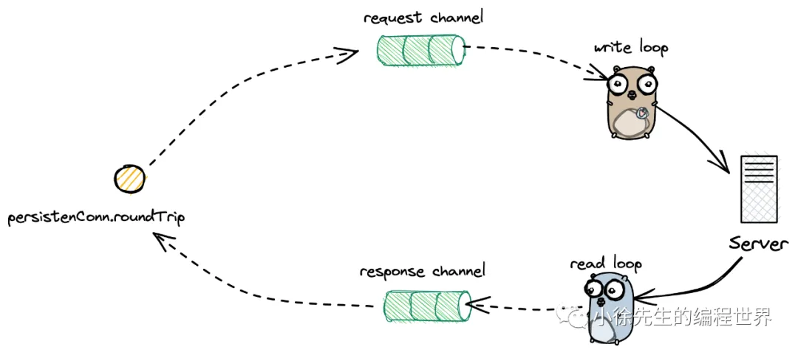

# Golang net/http 标准库实现原理

## 1. 整体框架

1. C-S架构
   

## 2. 服务端

1. 核心数据结构

- Server
- Handler
- ServeMux
- muxEntry

```go
// 根据 http 请求 Request 中的请求路径 path 映射到对应的 handler 处理函数，对请求进行处理和响应
type Handler interface {
   ServeHTTP(ResponseWriter, *Request)
}

type Server struct {
    // server 的地址
    Addr string
    // 路由处理器.
    Handler Handler // handler to invoke, http.DefaultServeMux if nil
    // ...
}

// Handler 的具体实现
type ServeMux struct {
   mu sync.RWMutex
   m map[string]muxEntry
   es []muxEntry // slice of entries sorted from longest to shortest.
   hosts bool // whether any patterns contain hostnames
}

// handler 单元，内部包含了请求路径 path + 处理函数 handler 两部分
type muxEntry struct {
    h Handler
    pattern string
}
```

2. 注册 handler
   

   ```go
   var DefaultServeMux = &defaultServeMux

   var defaultServeMux ServeMux // 全局单例
   ```

   当用户直接通过公开方法 http.HandleFunc 注册 handler 时，则会将其注册到 DefaultServeMux 当中

   ```go
   func HandleFunc(pattern string, handler func(ResponseWriter, *Request)) {
       DefaultServeMux.HandleFunc(pattern, handler)
   }

   type HandlerFunc func(ResponseWriter, *Request)

   // ServeHTTP calls f(w, r).
   func (f HandlerFunc) ServeHTTP(w ResponseWriter, r *Request) {
       f(w, r)
   }

   func (mux *ServeMux) HandleFunc(pattern string, handler func(ResponseWriter, *Request)) {
       mux.Handle(pattern, HandlerFunc(handler))  // 将 handler 包装为 HandlerFunc 类型，实现 ServeHTTP 方法
   }

   func (mux *ServeMux) Handle(pattern string, handler Handler) {
       mux.mu.Lock()
       defer mux.mu.Unlock()
       // ...

       e := muxEntry{h: handler, pattern: pattern}
       mux.m[pattern] = e
       if pattern[len(pattern)-1] == '/' {
           mux.es = appendSorted(mux.es, e)
       }
       // ...
   }

   func appendSorted(es []muxEntry, e muxEntry) []muxEntry {
       n := len(es)
       i := sort.Search(n, func(i int) bool {
           return len(es[i].pattern) < len(e.pattern)
       })
       if i == n {
           return append(es, e)
       }
       es = append(es, muxEntry{}) // try to grow the slice in place, any entry works.
       copy(es[i+1:], es[i:])      // Move shorter entries down
       es[i] = e
       return es
   }
   ```

3. 启动 server
   

   ```go
   // 根据用户传入的端口，申请到一个监听器 listener
   func (srv *Server) ListenAndServe() error {
       // ...
       addr := srv.Addr
       if addr == "" {
           addr = ":http"
       }
       ln, err := net.Listen("tcp", addr)
       // ...
       return srv.Serve(ln)
   }
   ```

   Server.Serve 方法很核心，体现了 http 服务端的运行架构：**for + listener.accept 模式**

   ```go
   var ServerContextKey = &contextKey{"http-server"}

   type contextKey struct {
       name string
   }

   func (srv *Server) Serve(l net.Listener) error {
       // ...
       ctx := context.WithValue(baseCtx, ServerContextKey, srv)
       for {
           rw, err := l.Accept()
           // ...
           connCtx := ctx
           // ...
           c := srv.newConn(rw)
           // ...
           go c.serve(connCtx)
       }
   }
   ```

   当通过路由字典 Server.m 未命中 handler 时，此时会启动模糊匹配模式，两个核心规则如下：
   • 以 '/' 结尾的 pattern 才能被添加到 Server.es 数组中，才有资格参与模糊匹配
   • 模糊匹配时，会找到一个与请求路径 path 前缀完全匹配且长度最长的 pattern，其对应的handler 会作为本次请求的处理函数.

   ```go
   func (mux *ServeMux) match(path string) (h Handler, pattern string) {
       v, ok := mux.m[path]
       if ok {
           return v.h, v.pattern
       }

       // ServeMux.es 本身是按照 pattern 的长度由大到小排列的
       for _, e := range mux.es {
           if strings.HasPrefix(path, e.pattern) {
               return e.h, e.pattern
           }
       }
       return nil, ""
   }
   ```

## 3. 客户端

1. 核心数据结构

- Client

```go
type Client struct {
    // Transport 是一个接口，负责整个网络交互流程
    Transport RoundTripper
    // Cookie 管理
    Jar CookieJar
    // 超时设置
    Timeout time.Duration
    // ...
}
```

- RoundTripper

```go
type RoundTripper interface {
    RoundTrip(*Request) (*Response, error)
}
```

在 Go 语言的 `net/http` 包中，`RoundTripper` 是一个接口，它定义了如何执行一次 HTTP 交易，即从发送 HTTP 请求到接收 HTTP 响应的过程。它的主要作用包括：

- **抽象 HTTP 请求的执行过程**：`RoundTripper` 接口规定了一个方法 `RoundTrip(*Request) (*Response, error)`，这个方法接收一个 HTTP 请求并返回相应的响应（或错误）。
- **底层传输实现**：HTTP 客户端在发送请求时会调用实现了 `RoundTripper` 接口的具体对象。默认的实现是 `http.Transport`，它负责处理底层的网络连接、重定向、代理、TLS 加密等细节。
- **灵活扩展与定制**：你可以通过实现 `RoundTripper` 接口来自定义 HTTP 请求的传输方式，比如添加日志、统计数据、修改请求或响应，或者实现特定的重试逻辑等。

简单来说，`RoundTripper` 是 HTTP 客户端中用于“来回传递”请求和响应的核心接口。每当你调用 HTTP 客户端的 `Do` 或 `Get` 方法时，客户端内部最终会调用 `RoundTripper` 来完成一次完整的 HTTP 请求/响应周期。

- Transport
  RoundTripper 的实现类

  ```go
  type Transport struct {
      // 空闲连接 map，实现复用
      idleConn     map[connectMethodKey][]*persistConn
      // 新连接生成器
      DialContext func(ctx context.Context, network, addr string) (net.Conn, error)
      // ...
  }
  ```

- Request

  ```go
  type Request struct {
      // 方法
      Method string
      // 请求路径
      URL *url.URL
      // 请求头
      Header Header
      // 请求参数内容
      Body io.ReadCloser
      // 服务器主机
      Host string
      // query 请求参数
      Form url.Values
      // 响应参数 struct
      Response *Response
      // 请求链路的上下文
      ctx context.Context
      // ...
  }
  ```

- Response

  ```go
  type Response struct {
      // 请求状态，200 为 请求成功
      StatusCode int    // e.g. 200
      // http 协议，如：HTTP/1.0
      Proto      string // e.g. "HTTP/1.0"
      // 请求头
      Header Header
      // 响应参数内容
      Body io.ReadCloser
      // 指向请求参数
      Request *Request
      // ...
  }
  ```

2. 方法链路总览
   
   客户端发起一次 http 请求大致分为几个步骤：

   - 构造 http 请求参数
   - 获取用于与服务端交互的 tcp 连接
   - 通过 tcp 连接发送请求参数
   - 通过 tcp 连接接收响应结果

3. Client.Post

```go
var DefaultClient = &Client{}

func Post(url, contentType string, body io.Reader) (resp *Response, err error) {
    return DefaultClient.Post(url, contentType, body)
}

func (c *Client) Post(url, contentType string, body io.Reader) (resp *Response, err error) {
    req, err := NewRequest("POST", url, body)
    // ...
    req.Header.Set("Content-Type", contentType)
    return c.Do(req)
}
```

4. NewRequest

```go
func NewRequestWithContext(ctx context.Context, method, url string, body io.Reader) (*Request, error) {
    // ...
    u, err := urlpkg.Parse(url)
    // ...
    rc, ok := body.(io.ReadCloser)
    // ...
    req := &Request{
        ctx:        ctx,
        Method:     method,
        URL:        u,
        // ...
        Header:     make(Header),
        Body:       rc,
        Host:       u.Host,
    }
    // ...
    return req, nil
}
```

5. Client.Do

```go
// 在 Client.send 方法中，会在通过 send 方法发送请求之前和之后，分别对 cookie 进行更新
func (c *Client) send(req *Request, deadline time.Time) (resp *Response, didTimeout func() bool, err error) {
    // 设置 cookie 到请求头中
    if c.Jar != nil {
        for _, cookie := range c.Jar.Cookies(req.URL) {
            req.AddCookie(cookie)
        }
    }

    // 发送请求
    resp, didTimeout, err = send(req, c.transport(), deadline)
    if err != nil {
        return nil, didTimeout, err
    }

    // 更新 resp 的 cookie 到请求头中
    if c.Jar != nil {
        if rc := resp.Cookies(); len(rc) > 0 {
            c.Jar.SetCookies(req.URL, rc)
        }
    }
    return resp, nil, nil
}
```

6. Transport.getConn 获取 tcp 连接
   

```go
func (t *Transport) getConn(treq *transportRequest, cm connectMethod) (pc *persistConn, err error) {
    // 获取连接的请求参数体
    w := &wantConn{
        cm:         cm,
        // key 由 http 协议、服务端地址等信息组成
        key:        cm.key(),
        ctx:        ctx,
        // 标识连接构造成功的信号发射器
        ready:      make(chan struct{}, 1),
    }
    // 倘若连接获取失败，在 wantConn.cancel 方法中，会尝试将 tcp 连接放回队列中以供后续复用
    defer func() {
        if err != nil {
            w.cancel(t, err)
        }
    }()
    // 尝试复用指向相同服务端地址的空闲连接
    if delivered := t.queueForIdleConn(w); delivered {
        pc := w.pc
        // ...
        return pc, nil
    }
    // 异步构造新的连接
    t.queueForDial(w)
    select {
    // 通过阻塞等待信号的方式，等待连接获取完成
    case <-w.ready:
        // ...
        return w.pc, w.err
    // ...
    }
}
```



7. persistConn.roundTrip
