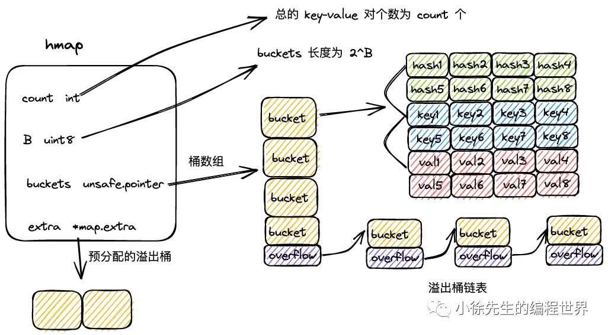

下面是一篇对原文的**浓缩总结**，便于快速回顾其主要内容与核心要点。

---

## 1. 基本用法

- **初始化**
  - `make(map[int]int, 2)`：通过 `make` 初始化并指定容量。
  - `make(map[int]int)`：未指定容量，默认为 0。
  - 直接字面量初始化：
    ```go
    m := map[int]int{
      1: 2,
      3: 4,
    }
    ```
- **Key 类型限制**：Key 必须为可比较类型（如 int、string、struct 等），`slice`、`map`、`func` 等不可比较，不可作为 Key。
  chan 是可以作为 Key 的(比较地址)。
- **读**：
  - `v := m[key]` 读 Value，若 key 不存在返回 Value 类型零值。
  - `v, ok := m[key]` 若 ok 为 false，表示 key 不存在。
- **写**：
  - `m[key] = val`；若 map 未初始化会 panic。
- **删**：
  - `delete(m, key)`；Key 不存在或 map 未初始化都不会报错，直接结束。
- **遍历**：
  - `for k, v := range m { ... }` 或 `for k := range m { ... }`；遍历顺序不保证固定。
- **并发冲突**：
  - 并发读 _可以_；并发读写或并发写写会触发 `fatal error: concurrent map writes` 或 `concurrent map read and map write`，无法用 `recover` 捕获。

---

## 2. 核心原理

- **基本思路**：基于哈希（hash）将 Key 映射到桶（bucket），再在桶内部存储对应的 key-value。
- **hash 冲突与拉链法**：Go 采用“**桶+溢出桶链表**”的形式，结合“拉链法”与“开放寻址”思想。
  - 每个桶可以容纳 8 个 key-value。若满，则通过 `overflow` 指针指向下一个溢出桶继续存放。
    
- **扩容**：通过检测负载因子（load factor）、溢出桶数量等触发`“渐进式扩容”`，保证平均 O(1) 操作。

---

## 3. 关键数据结构

1. **hmap**（`runtime.map.go` 中的核心结构）
   

   - `count`：map 中 key-value 数量。
   - `flags`：标识位，含并发安全检测、扩容方式等信息。
   - `B`：桶数组大小的指数（`buckets` 长度为 `2^B`）。
   - `buckets`：指向当前桶数组。
   - `oldbuckets`：指向旧桶数组（扩容期间）。
   - `nevacuate`：记录已完成迁移的旧桶数量。
   - `hash0`：哈希的随机种子。

2. **mapextra**

   - 存放预先申请的溢出桶（`overflow`、`oldoverflow`、`nextOverflow` 等）。

3. **bmap**（桶的结构）
   - `tophash [8]uint8`：存储每个 key 的高 8 位哈希值，用于快速比较。
   - （通过内存偏移存储 8 个 key、8 个 value 以及 `overflow` 指针）。

---

## 4. 创建（makemap）

1. `makemap` 核心逻辑：

   - 根据 `hint`（用户期望容量）和“负载因子阈值”动态确定 `B`；
   - 分配 `buckets`；可能同时分配一批溢出桶；
   - 设置 `hmap` 各项字段，如 `hash0`（随机因子）。

2. **overLoadFactor** 判断：

   - 保证 `count <= 6.5 * (2^B)`，超过就增大 `B`。

3. **makeBucketArray**：
   - 分配桶数组以及可能需要的溢出桶。
   - 当 `B >= 4` 时，预先申请一定数量的溢出桶。

---

## 5. 读（mapaccess）

1. 计算 `hash = hasher(key, h.hash0)`。
2. 桶索引 `bucket = hash & (2^B - 1)`。
3. 若处于扩容中，则可能需要从旧桶数组 `oldbuckets` 查找对应的桶；判断桶是否已搬迁（`evacuated`），若还没搬迁则从旧桶读数据。
4. 在桶及其溢出桶链表中依次比较 `tophash`，再比较真实 key，匹配即返回值，否则返回零值。

---

## 6. 写（mapassign）

1. 判断 map 是否空或是否有其他并发写（`flags & hashWriting`）。
2. 计算 hash，定位桶；若在扩容，则先做部分桶的搬迁（渐进式）；
3. 在桶链表上遍历：
   - 若找到相同 key，执行更新；
   - 否则找空位插入；如果桶满，再分配溢出桶。
4. 写入后，若装载因子或溢出桶数超限，则触发扩容（增量或等量）。
5. 最后清除写标记，结束。

---

## 7. 删（mapdelete）

1. 若 map 空或 count=0，直接返回。
2. 计算 hash；若扩容中，先搬迁。
3. 在相应桶链表中查找 key；
4. 找到后清理 key、value，并将对应 `tophash` 标为 `emptyOne (1)`；
5. 若该位置恰好后面全是空位 (`emptyRest (0)`)，则向前回溯把连续的 `emptyOne` 也变为 `emptyRest`；
6. `count--`，删除完成。

---

## 8. 遍历（range）

1. 遍历器 `hiter`：存储当前遍历位置（桶指针 bptr、桶索引 i、key/elem 指针等）。
   `通过取随机数的方式，决定遍历的起始桶号，以及起始 key-value 对索引号.`
   
2. `mapiterinit`：
   - 随机确定起始桶和桶内 offset；
   - 保存到迭代器；
   - 立刻调用 `mapiternext` 开始遍历。
3. `mapiternext`：
   - 若遍历完全部桶，返回。
   - 若正在扩容，需要同时检查或迭代旧桶。
   - 依次跳到下一个桶，遍历其 8 个位置或溢出桶，每找到一个非空 key-value 即返回给上层。

---

## 9. 渐进式扩容


1. **何时扩容**：
   - 写入或删除时，若 `count+1` 超过 `6.5 * 2^B` 触发**增量扩容**（桶翻倍）；
   - 或溢出桶过多时触发**等量扩容**（桶数不变）。
2. **如何开启**：
   - `hashGrow()` 设置 `h.oldbuckets = h.buckets`，分配 `h.buckets` 为新的桶数组。
   - `h.flags` 中记录是增量 (`B++`) 还是等量 (`sameSizeGrow`)。
   - `h.nevacuate = 0` 表示尚未完成搬迁。
3. **迁移规则**：
   - 若增量扩容，hash 的低位多一位决定放到 `x` 桶（旧索引）还是 `y` 桶（旧索引 + 原桶数组长度）。
   - 若等量扩容，索引不变，只是减少溢出桶使用。
4. **渐进式**：
   - 每次对 map 的写或删操作，都会执行 `growWork()`：
     - 先搬迁当前要访问的桶；
     - 再搬迁一个最先未搬迁的桶（由 `nevacuate` 标记）。
   - 当 `nevacuate == 2^(B')` 全部搬迁完毕，再将 `oldbuckets` 清空、标记扩容完成。

---

## 10. 总结

1. **数据结构**：Go 的 map 由 `hmap` 统领，内部通过定长的 `bmap`（8 个 key-value 对）以及溢出桶管理所有数据。
2. **操作流程**：
   - 读/写/删前都会计算 hash，再根据桶索引和 `tophash` 精确定位。
   - 写时若需要，会触发或继续扩容；删时也会尝试清理空桶以保持高效。
3. **渐进式扩容**：平摊了扩容的成本，避免了大规模搬迁导致的卡顿。
4. **并发安全**：Go 原生 `map` **不**支持并发写，同时读写也会引发 fatal error，需借助锁或 `sync.Map`。
5. **时间复杂度**：在装载因子合理、未极端冲突的情况下，平均 O(1)；极端情况下（很多溢出桶）会退化。

这篇文章从 **使用层面**（增删改查、遍历）到 **底层实现**（哈希、桶、溢出桶、扩容机制）都做了非常详细的阐述。通过理解 Go 语言中 `map` 的存储结构、哈希流程以及渐进式扩容策略，可以更好地写出高效、健壮的 Go 代码，也能在发生性能或并发问题时更准确地定位和处理。
