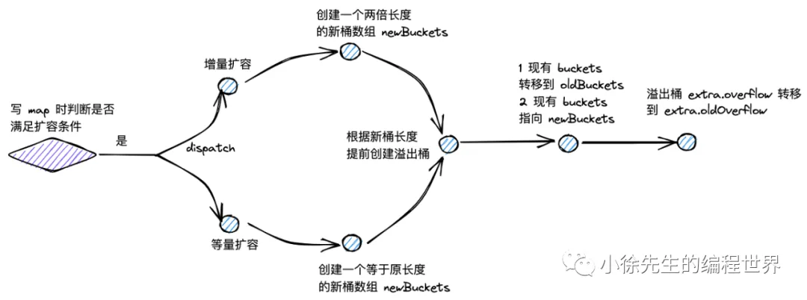
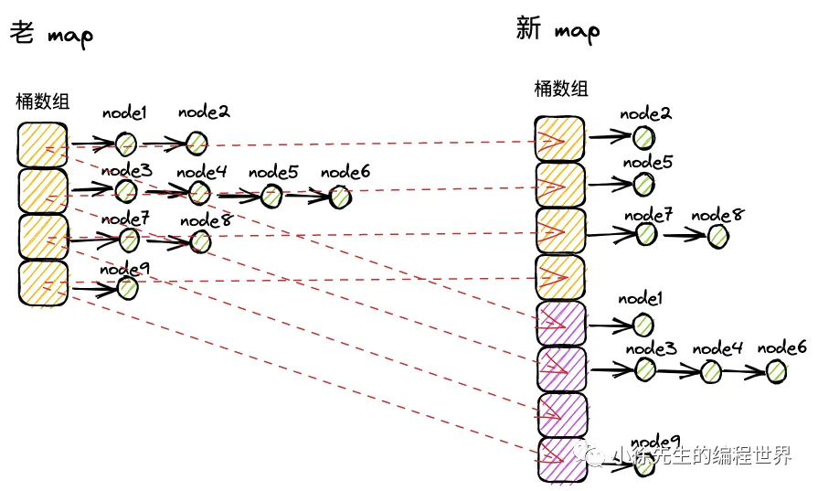

扩容分为增量扩容和等量扩容


- 增量扩容：
  当桶内 key-value 总数/桶数组长度`(负载因子)` > 6.5 时发生增量扩容，桶数组长度增长为原值的两倍；
  目的：降低每个桶中 key-value 对的数量，优化 map 操作的时间复杂度.
- 等量扩容：
  当`溢出桶数量` >= 2^B 时发生等量扩容，桶数组长度不变，但是溢出桶的数量会下降。
  目的：提高桶主体结构的数据填充率，减少溢出桶数量，避免发生内存泄漏.
- 采用渐进扩容的方式，当桶被实际操作到时，由使用者负责完成数据迁移，避免因为一次性的全量数据迁移引发性能抖动.



---

下面给出 Go 语言中（以 Go1.18/1.19/1.20 的版本实现为主进行概述）的 `map` 进行扩容（rehash/grow）的整体过程和核心细节。本文主要围绕以下内容展开：

1. **`map` 的核心结构与扩容条件**
2. **扩容时的主要字段变化**
3. **“渐进式”扩容（incremental rehashing）的原理**
4. **真正进行数据搬移（evacuate）的过程**
5. **小结与关键优化点**

---

## 1. `map` 的核心结构与扩容条件

在 Go 源码的 `runtime/map.go` 文件中，`hmap` 是 `map` 的底层结构之一。伪代码表示为（做了一些简化）：

```go
type hmap struct {
    count     int    // map中存储的元素总数
    B         uint8  // buckets 的数量 = 2^B
    buckets   unsafe.Pointer // 指向buckets数组（主存储桶）
    oldbuckets unsafe.Pointer // 旧的buckets数组，用于渐进式扩容
    nevacuate uintptr // 扩容过程中，下一个需要搬移的桶下标
    ...
}
```

- **`buckets`**：是一个数组，长度是 `2^B` 个“桶”（bucket）。
- **`B`**：决定当前 `buckets` 大小（桶个数）是 `2^B`。当 map 需要扩容时，会令 `B++`，从而使桶数翻倍。
- **`oldbuckets`**：在渐进式扩容进行中，`oldbuckets` 还存放旧的桶数组。只有等数据都搬移完后，`oldbuckets` 才会被清理掉。
- **`nevacuate`**：表示**下一个待搬移**的桶下标。因为扩容不是一次性整体搬，而是“渐进式”进行。

**扩容触发条件**大体有以下几个方面：

1. 当插入新元素导致负载因子（Load Factor，= 元素数 / 桶个数）过高时，需要扩容。Go 默认设定的阈值大约是当加载因子 > 6.5（前后版本略有差异）就会触发扩容。
2. 当删除元素导致负载因子太低，也可能发生**收缩**（shrink），原理类似，但收缩在 64 位平台上并不常发生。
3. 当出现**哈希冲突**很严重、溢出桶（overflow bucket）过多时，也会触发强制扩容。

---

## 2. 扩容时的主要字段变化

当决定要进行扩容（增长）时：

1. `hmap.B++`：将 `B` 加 1。因为桶数要从 `2^B` 翻倍到 `2^(B+1)`.
2. 分配新的 `buckets` 数组，大小是 `2^B`（此时 B 已经自增过）。
3. 将旧的 `buckets` 指针放入 `oldbuckets` 字段；同时将 `nevacuate` 置为 0，表示还没有开始搬移数据。
4. 此后，**新插入元素**会先去访问新的 `buckets`，如果对应的桶还没被搬移，就会在插入时触发搬移操作（见下）。

此时，map 的结构有两个桶区：

- `oldbuckets`：旧的桶数组；
- `buckets`：新的桶数组，尚未完全搬移过去；
- 部分元素还停留在 `oldbuckets` 的某些桶里，需要**渐进式**搬移到 `buckets` 里。

---

## 3. “渐进式”扩容（incremental rehashing）的原理

Go 不会在一次操作中把所有旧桶的数据都迁移到新桶；这是因为如果数据量很大，单次搬移代价过高，会引发长时间卡顿。  
取而代之的是一种**渐进式**（或称增量式 incremental）策略：

- 每当对 map 做一次插入、删除、或者访问操作时，Go runtime 就会“顺手”把 `oldbuckets[nevacuate]` 这个桶搬移到 `buckets` 中，对应的 `nevacuate++`。
- 搬移完一个桶的数据后，下一次操作再搬移下一个桶……直至 `nevacuate` 等于 `2^(B-1)`，说明旧桶全部搬移完，扩容完成，然后 `oldbuckets = nil`。

在这个过程里，如果你的 map 很少被访问，扩容也会进展得很慢；相反，如果 map 频繁操作，就能很快把旧桶搬移完。

### 搬移哪个桶？

- `nevacuate` 指向**下一个**需要搬移的桶索引。每次 map 操作若检测到 `oldbuckets != nil`，则会搬移几个桶（通常只搬移一个，有时可能多搬点以优化性能）并让 `nevacuate++`。
- 当 `nevacuate` 到达上限（旧桶数），即表示全部搬完。

---

## 4. 真正进行数据搬移（evacuate）的过程

假设旧桶数组大小是 `oldBucketCount = 2^(B-1)`，新桶数组大小是 `newBucketCount = 2^B`。当要搬移 `oldbuckets[i]` 时，有两种情况：

1. **`oldbuckets[i]` 已经被标记为“已搬空”**：可能是之前的某次操作就迁移了它，那就跳过。
2. **还没搬空，需要把桶里的元素搬到新桶里**。

对于其中每个键值对 `(k, v)`，Go 会用新的哈希值来决定它应该放到**新桶**哪个位置。在哈希映射中，扩容后，高一位的哈希比特（第 `B-1` 位）决定了元素会放到**`i`**或**`i + oldBucketCount`**这两个位置之一。大致过程是：

1. 读取该元素 `hash = hash(k)`.
2. 取出 `hash` 的第 `(B-1)` 位（从低位往上数第 B-1 位），若该位为 0，就搬到新的桶下标是 `i`；若为 1，就搬到新的桶下标是 `i + oldBucketCount`。
3. 搬运时在目标桶里找空余位置（或者使用溢出桶），把 `(k, v)` 放入。

搬运完后，会把旧桶 `oldbuckets[i]` 标记为“已搬空”或在旧桶里留下一些已知的占位信息，这样之后再操作时，就不会重复搬同一个桶。

---

## 5. 小结与关键优化点

1. **每个桶容纳 8 个 `key-value` 槽位**，当桶满了就用**溢出桶**链接继续存放。
2. **当负载因子过高**或者**溢出桶过多**时，会令 `B++`，分配新的桶数组(`buckets`)，将旧桶数组放到 `oldbuckets`。
3. **“渐进式扩容”**：不一次性搬空旧桶，而是通过 `nevacuate` 逐个桶地搬。每次对 map 的操作，都会顺便做一点搬运工作 (evacuate)。
4. 数据搬运过程中，通过查看哈希值的高位比特决定“元素落到哪个新的桶”。搬完则标记桶已搬空。
5. 当全部搬运完成 (`nevacuate == oldBucketCount`)，才会清理掉 `oldbuckets`，扩容结束。

这种机制既**保证了访问性能**（通过翻倍减少冲突）又在**避免长时间锁死**（一次性迁移）的同时，使用**增量搬移**把扩容带来的性能“抖动”均摊到各次操作上，从而提升整体的平滑性和可扩展性。
