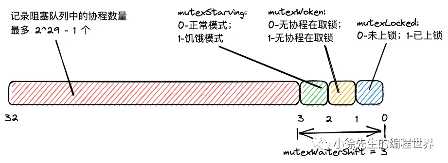
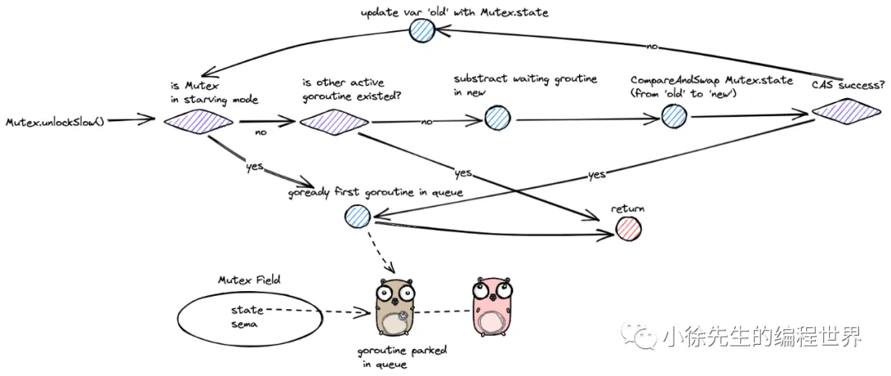
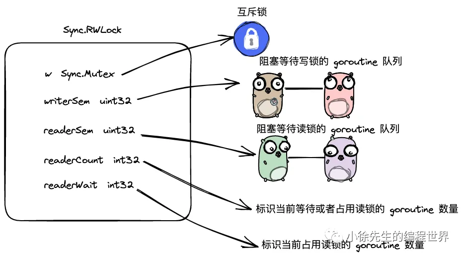

https://mp.weixin.qq.com/s?__biz=MzkxMjQzMjA0OQ==&mid=2247483797&idx=1&sn=34274d44bced0835ea302376a137219b

## 1.Sync.Mutex

1. 由自旋到阻塞的升级过程

   针对 goroutine 加锁时发现锁已被抢占的这种情形，此时摆在面前的策略有如下两种：

   • 阻塞/唤醒：将当前 goroutine 阻塞挂起，直到锁被释放后，以回调的方式将阻塞 goroutine 重新唤醒，进行锁争夺；

   • 自旋 + CAS：基于自旋结合 CAS 的方式，重复校验锁的状态并尝试获取锁，始终把主动权握在手中.
   | 锁竞争方案 | 优势 | 劣势 | 适用场景 |
   |------------|--------------------------|-------------------------------------------|------------------------|
   | 阻塞/唤醒 | 精准打击，不浪费 CPU 时间片 | 需要挂起协程，进行上下文切换，操作较重 | 并发竞争激烈的场景 |
   | 自旋+CAS | 无需阻塞协程，短期来看操作较轻 | 长时间争而不得，会浪费 CPU 时间片 | 并发竞争强度低的场景 |

   sync.Mutex 结合两种方案的使用场景，制定了一个`自适应(self-adaptive)`锁升级的过程，反映了面对并发环境通过持续试探逐渐`由乐观逐渐转为悲观的态度`，具体方案如下：

   • 首先保持乐观，goroutine 采用自旋 + CAS 的策略争夺锁；
   • 尝试持续受挫达到一定条件后，判定当前过于激烈，则由自旋转为 阻塞/挂起模式.

   由自旋模式转为阻塞模式的具体条件拆解如下：

   • 自旋累计达到 4 次仍未取得战果；
   • CPU 单核或仅有单个 P 调度器；（此时自旋，其他 goroutine 根本没机会释放锁，自旋纯属空转）；
   • 当前 P 的执行队列中仍有待执行的 G. （避免因自旋影响到 GMP 调度效率）.

2. 饥饿模式
   对【公平性】的问题探讨.

   • 正常模式/非饥饿模式：这是 sync.Mutex 默认采用的模式. 当有 goroutine 从阻塞队列被唤醒时，`会和此时先进入抢锁流程的 goroutine 进行锁资源的争夺`，假如抢锁失败，会重新回到阻塞队列头部.
   • 饥饿模式：这是 sync.Mutex 为拯救陷入饥荒的老 goroutine 而启用的特殊机制，饥饿模式下，`锁的所有权按照阻塞队列的顺序进行依次传递. 新 goroutine 进行流程时不得抢锁，而是进入队列尾部排队`.

   两种模式的转换条件
   • 默认为正常模式；
   • 正常模式 -> 饥饿模式：当阻塞队列存在 goroutine 等锁超过 1ms 而不得，则进入饥饿模式；
   • 饥饿模式 -> 正常模式：当阻塞队列已清空，或取得锁的 goroutine 等锁时间已低于 1ms 时，则回到正常模式.

   正常模式灵活机动，性能较好,不用挂起、加锁等操作；
   饥饿模式严格死板，但能捍卫公平的底线.

3. goroutine 唤醒标识
   为尽可能缓解竞争压力和性能损耗，sync.Mutex 会不遗余力在可控范围内`减少一些无意义的并发竞争和操作损耗`.
   在实现上，sync.Mutex 通过一个 mutexWoken 标识位，标志出当前是否已有 goroutine 在自旋抢锁或存在 goroutine 从阻塞队列中被唤醒；
   倘若 mutexWoken 为 true，且此时有解锁动作发生时，就`没必要再额外唤醒阻塞的 goroutine `从而引起竞争内耗.

## 2.数据结构

```go
type Mutex struct {
    state int32
    sema  uint32
}
```

• state：锁中最核心的状态字段，不同 bit 位分别存储了 mutexLocked(是否上锁)、mutexWoken（是否有 goroutine 从阻塞队列中被唤醒）、mutexStarving（是否处于饥饿模式）的信息；
• sema：用于阻塞和唤醒 goroutine 的信号量.

---

```go
const (
    mutexLocked = 1 << iota // mutex is locked
    mutexWoken
    mutexStarving
    mutexWaiterShift = iota  // 右侧存在 3 个 bit 位标识特殊信息，分别为上述的 mutexLocked、mutexWoken、mutexStarving

    starvationThresholdNs = 1e6  // sync.Mutex 进入饥饿模式的等待时间阈值
)
```



• state & mutexLocked：判断是否上锁；
• state | mutexLocked：加锁；
• state & mutexWoken：判断是否存在抢锁的协程；
• state | mutexWoken：更新状态，标识存在抢锁的协程；
• state &^ mutexWoken：更新状态，标识不存在抢锁的协程；
• state & mutexStarving：判断是否处于饥饿模式；
• state | mutexStarving：置为饥饿模式；
• state >> mutexWaiterShift：获取阻塞等待的协程数；
• state += 1 << mutexWaiterShift：阻塞等待的协程数 + 1.

## 3. Mutex.Lock()

```go
func (m *Mutex) Lock() {
	// Fast path: grab unlocked mutex.
	if atomic.CompareAndSwapInt32(&m.state, 0, mutexLocked) {
		if race.Enabled {
			race.Acquire(unsafe.Pointer(m))
		}
		return
	}

	// Slow path (outlined so that the fast path can be inlined)
	m.lockSlow()
}

func (m *Mutex) lockSlow() {
	var waitStartTime int64
	starving := false
	awoke := false  // 当前是否已有协程在等锁
	iter := 0  // goroutine 参与自旋的次数
	old := m.state

	for {
		// 有锁，且不处于饥饿模式，且当前 goroutine 可以自旋
		if old&(mutexLocked|mutexStarving) == mutexLocked && runtime_canSpin(iter) {
		  // 阻塞队列有协程，但未被唤醒，则标记当前协程已唤醒，避免再有其他协程被唤醒和自己抢锁
			if !awoke && old&mutexWoken == 0 && old>>mutexWaiterShift != 0 &&
				atomic.CompareAndSwapInt32(&m.state, old, old|mutexWoken) {
				awoke = true
			}
      // 告知调度器 P 当前处于自旋模式
			runtime_doSpin()
			iter++
			old = m.state
			continue
		}

    // 自旋抢锁失败后处理 ...
    // state 新值构造，乐观
		new := old
		if old&mutexStarving == 0 {
      // 抢锁
			new |= mutexLocked
		}
		if old&(mutexLocked|mutexStarving) != 0 {
      // 阻塞等待的协程数 + 1
			new += 1 << mutexWaiterShift
		}
		if starving && old&mutexLocked != 0 {
			new |= mutexStarving
		}
		if awoke {
			if new&mutexWoken == 0 {
				throw("sync: inconsistent mutex state")
			}
			new &^= mutexWoken
		}

    // state 新旧值替换
		if atomic.CompareAndSwapInt32(&m.state, old, new) {
      // 正常模式抢锁成功
			if old&(mutexLocked|mutexStarving) == 0 {
				break
			}

			queueLifo := waitStartTime != 0  // queueLifo 如果为 true，则添加到队列头部，否则到尾部 -> 当前 goroutine 是从阻塞队列被唤起的老客还是新进流程的新客
			if waitStartTime == 0 {
				waitStartTime = runtime_nanotime()
			}
      // !阻塞等待，老客则挂入队头，新客则挂入队尾
			runtime_SemacquireMutex(&m.sema, queueLifo, 1)
      // 从阻塞队列被唤醒了
			starving = starving || runtime_nanotime()-waitStartTime > starvationThresholdNs
			old = m.state
			if old&mutexStarving != 0 {
				if old&(mutexLocked|mutexWoken) != 0 || old>>mutexWaiterShift == 0 {
					throw("sync: inconsistent mutex state")
				}
        // 饥饿模式抢锁成功
				delta := int32(mutexLocked - 1<<mutexWaiterShift)
				if !starving || old>>mutexWaiterShift == 1 {
          // 退出饥饿模式
					delta -= mutexStarving
				}
				atomic.AddInt32(&m.state, delta)
				break
			}
			awoke = true  // 标记当前协程已唤醒(从阻塞队列被唤醒了)
			iter = 0
		} else {
      // CAS 替换失败(旧值被其他协程介入提前修改导致不符合预期)
			old = m.state
		}
	}

	if race.Enabled {
		race.Acquire(unsafe.Pointer(m))
	}
}
```

## 4. Mutex.UnLock()



```go
func (m *Mutex) Unlock() {
	if race.Enabled {
		_ = m.state
		race.Release(unsafe.Pointer(m))
	}

	// Fast path: drop lock bit.
	new := atomic.AddInt32(&m.state, -mutexLocked)
	if new != 0 {
		m.unlockSlow(new)
	}
}

func (m *Mutex) unlockSlow(new int32) {
	if (new+mutexLocked)&mutexLocked == 0 {
		fatal("sync: unlock of unlocked mutex")
	}

	if new&mutexStarving == 0 {
		old := new
		for {
      // !问题：是否需要唤醒阻塞队列中的首个 goroutine

      // 阻塞队列无goroutine等待 或者 有任何一个标志位被设置(在此期间有其他协程抢锁)，则不唤醒
			if old>>mutexWaiterShift == 0 || old&(mutexLocked|mutexWoken|mutexStarving) != 0 {
				return
			}

			// Grab the right to wake someone.
			new = (old - 1<<mutexWaiterShift) | mutexWoken
			if atomic.CompareAndSwapInt32(&m.state, old, new) {
        // 唤起阻塞队列头部的 goroutine
				runtime_Semrelease(&m.sema, false, 1)
				return
			}
			old = m.state
		}
	} else {
    // 饥饿模式下，直接唤醒阻塞队列中的首个 goroutine
		runtime_Semrelease(&m.sema, true, 1)
	}
}
```

## 5. RWMutex

1. 核心机制
   • 从逻辑上，可以把 RWMutex 理解为一把读锁加一把写锁；
   • 写锁具有严格的排他性，当其被占用，其他试图取写锁或者读锁的 goroutine 均阻塞；
   • 读锁具有有限的共享性，当其被占用，试图取写锁的 goroutine 会阻塞，试图取读锁的 goroutine 可与当前 goroutine 共享读锁；
   • 综上可见，RWMutex 适用于读多写少的场景，最理想化的情况，当所有操作均使用读锁，则可实现去无化；最悲观的情况，倘若所有操作均使用写锁，则 RWMutex 退化为普通的 Mutex.
2. 数据结构
   

   ```go
   const rwmutexMaxReaders = 1 << 30

   type RWMutex struct {
    w           Mutex         // 互斥锁，用于写操作的独占控制
    writerSem   uint32        // 写者信号量，写者等待读者完成
    readerSem   uint32        // 读者信号量，读者等待写者完成
    readerCount atomic.Int32  // 读者计数器（正：活跃读者数；负：有写者等待）
    readerWait  atomic.Int32  // 写者需要等待的剩余读者数
   }
   ```

3. 加读锁

```go
func (rw *RWMutex) RLock() {
    if atomic.AddInt32(&rw.readerCount, 1) < 0 {
        runtime_SemacquireMutex(&rw.readerSem, false, 0)
    }
}
```

4. 解读锁

```go
func (rw *RWMutex) RUnlock() {
    if r := atomic.AddInt32(&rw.readerCount, -1); r < 0 {
        rw.rUnlockSlow(r)
    }
}

func (rw *RWMutex) rUnlockSlow(r int32) {
    // 没有加过读锁
    if r+1 == 0 || r+1 == -rwmutexMaxReaders {
        fatal("sync: RUnlock of unlocked RWMutex")
    }
    if atomic.AddInt32(&rw.readerWait, -1) == 0 {
        runtime_Semrelease(&rw.writerSem, false, 1)
    }
}
```

5. 加写锁

```go
func (rw *RWMutex) Lock() {
    rw.w.Lock()
    r := atomic.AddInt32(&rw.readerCount, -rwmutexMaxReaders) + rwmutexMaxReaders
    if r != 0 && atomic.AddInt32(&rw.readerWait, r) != 0 {
        runtime_SemacquireMutex(&rw.writerSem, false, 0)
    }
}
```

6. 解写锁

```go
func (rw *RWMutex) Unlock() {
    r := atomic.AddInt32(&rw.readerCount, rwmutexMaxReaders)
    // 要么当前 RWMutex 未上过写锁，要么介入读锁流程的 goroutine 数量已经超限
    if r >= rwmutexMaxReaders {
        fatal("sync: Unlock of unlocked RWMutex")
    }
    for i := 0; i < int(r); i++ {
        runtime_Semrelease(&rw.readerSem, false, 0)
    }
    rw.w.Unlock()
}
```

7. 读写交互
   假设读写到来的顺序为：R、R、R、W、R、W、W、R、R
   下面以你提供的读写顺序 `R、R、R、W、R、W、W、R、R` 为例，详细分析 `sync.RWMutex` 的加锁解锁过程：

   ***

   ### **初始状态**

   ```go
   readerCount = 0  // 没有读者
   readerWait  = 0  // 没有写者等待
   writerSem   = 0  // 无阻塞的写者
   readerSem   = 0  // 无阻塞的读者
   w（底层Mutex）未被锁定
   ```

   ***

   ### **步骤 1：R（获取读锁）**

   - **操作**：`RLock()`
   - **结果**：
     ```go
     readerCount = 1  // 直接获得读锁
     ```
   - **状态**：读者 1 持有读锁，无阻塞。

   ***

   ### **步骤 2：R（获取读锁）**

   - **操作**：`RLock()`
   - **结果**：
     ```go
     readerCount = 2  // 直接获得读锁
     ```
   - **状态**：读者 1 和读者 2 并发读取，无阻塞。

   ***

   ### **步骤 3：R（获取读锁）**

   - **操作**：`RLock()`
   - **结果**：
     ```go
     readerCount = 3  // 直接获得读锁
     ```
   - **状态**：读者 1、2、3 并发读取，无阻塞。

   ***

   ### **步骤 4：W（获取写锁）**

   - **操作**：`Lock()`
   - **过程**：
     1. 获取底层 `w.Lock()`（阻止其他写者）。
     2. 将 `readerCount` 减去 `rwmutexMaxReaders`：
        ```go
        readerCount = 3 - 1<<30 ≈ -1,073,741,821  // 负值表示有写者等待
        ```
     3. 计算当前活跃读者数 `r = 3`。
     4. 设置 `readerWait = 3`（需要等待 3 个读者释放）。
     5. 因为 `readerWait != 0`，写者 1 阻塞在 `writerSem` 信号量。
   - **状态**：
     - 读者 1、2、3 仍在读取。
     - 写者 1 等待在 `writerSem`，阻止新读者。

   ***

   ### **步骤 5：R（尝试获取读锁）**

   - **操作**：`RLock()`
   - **过程**：
     1. `readerCount.Add(1)` 结果为 `-1,073,741,821 + 1 = -1,073,741,820`（仍为负）。
     2. 读者 4 阻塞在 `readerSem` 信号量。
   - **状态**：
     - 读者 1、2、3 仍在读取。
     - 写者 1 等待，读者 4 等待。

   ***

   ### **步骤 6：W（尝试获取写锁）**

   - **操作**：`Lock()`
   - **过程**：
     1. 尝试获取底层 `w.Lock()`，但已被写者 1 持有，写者 2 阻塞在 `w` 的锁上。
   - **状态**：
     - 读者 1、2、3 仍在读取。
     - 写者 1 等待，读者 4 等待，写者 2 等待。

   ***

   ### **步骤 7：W（尝试获取写锁）**

   - **操作**：`Lock()`
   - **过程**：
     1. 尝试获取底层 `w.Lock()`，写者 3 同样阻塞在 `w` 的锁上。
   - **状态**：
     - 读者 1、2、3 仍在读取。
     - 写者 1、2、3 均等待，读者 4 等待。

   ***

   ### **步骤 8：R（尝试获取读锁）**

   - **操作**：`RLock()`
   - **过程**：
     1. `readerCount.Add(1)` 仍为负，读者 5 阻塞在 `readerSem`。
   - **状态**：
     - 读者 1、2、3 仍在读取。
     - 写者 1、2、3 等待，读者 4、5 等待。

   ***

   ### **步骤 9：R（尝试获取读锁）**

   - **操作**：`RLock()`
   - **过程**：
     1. `readerCount.Add(1)` 仍为负，读者 6 阻塞在 `readerSem`。
   - **状态**：
     - 读者 1、2、3 仍在读取。
     - 写者 1、2、3 等待，读者 4、5、6 等待。

   ***

   ### **关键解锁过程**

   #### **读者 1 释放读锁（RUnlock）**

   ```go
   readerCount = -1,073,741,821 + 1 = -1,073,741,820
   readerWait = 3 - 1 = 2  // 未归零，不唤醒写者
   ```

   #### **读者 2 释放读锁（RUnlock）**

   ```go
   readerCount = -1,073,741,820 + 1 = -1,073,741,819
   readerWait = 2 - 1 = 1  // 未归零，不唤醒写者
   ```

   #### **读者 3 释放读锁（RUnlock）**

   ```go
   readerCount = -1,073,741,819 + 1 = -1,073,741,818
   readerWait = 1 - 1 = 0  // 归零，唤醒写者1！
   ```

   - **结果**：
     - 写者 1 从 `writerSem` 被唤醒，持有写锁。
     - 写者 1 开始写入。

   ***

   #### **写者 1 释放写锁（Unlock）**

   ```go
   readerCount = -1,073,741,818 + 1<<30 = 3  // 恢复为正数
   // 唤醒所有阻塞的读者（4、5、6）：
   for i := 0; i < 3; i++ {
       runtime_Semrelease(&readerSem)  // 唤醒3个读者
   }
   // 释放底层 w.Unlock()
   ```

   - **结果**：
     - 读者 4、5、6 被唤醒，获得读锁。
     - 写者 2 和写者 3 开始竞争底层 `w.Lock()`（假设写者 2 获胜）。

   ***

   ### **最终状态**

   - **活跃操作**：
     - 读者 4、5、6 并发读取。
     - 写者 2 持有底层 `w.Lock()`，等待现有读者释放。
     - 写者 3 继续等待底层 `w.Lock()`。

   ***

   ### **设计特点总结**

   1. **写者优先**：一旦写者等待，新读者会被阻塞。
   2. **批量唤醒**：写者释放锁时一次性唤醒所有等待的读者。
   3. **底层 Mutex 竞争**：多个写者通过底层互斥锁（`w`）序列化。
   4. **避免饥饿**：写者等待期间阻止新读者，确保写者最终能获得锁。

   通过这个例子，可以清晰看到 `sync.RWMutex` 在复杂读写交替场景下的行为逻辑。
