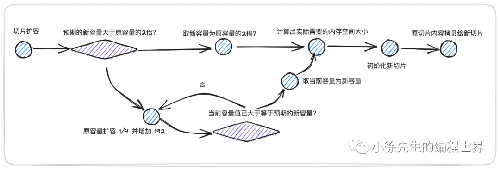

下面是一篇针对以上内容的**总结/回顾**，帮助你在阅读了整篇文章后对 Go 语言切片（slice）形成更清晰的整体认识。

---

## 1\. 核心特征

1. **数据结构**  
   Go 语言中的切片由一个 **slice header** 结构体表示，包含：

   - `array`：指向底层内存空间首地址的指针
   - `len`：切片的逻辑长度（已使用的元素个数）
   - `cap`：切片的物理容量（底层为其分配的可用元素个数）

2. **引用类型**  
   切片在方法间传递时，会拷贝一个新的 slice header，但其中的 `array` 仍指向相同内存区域，因此属于“引用传递”。这意味着：

   - 如果只是“复制”或“截取”切片，会共享同一底层数据；修改副本的元素会影响原切片；
   - 若在副本上执行引发**扩容**的操作(append 等)，可能会导致副本迁移到新分配的空间；此后它们就各自独立，不再共享数据。

3. **len 与 cap 的区别**
   - `len` 代表当前实际存放的元素个数，访问索引范围是 `[0, len)`;
   - `cap` 代表底层已分配空间能容纳的元素最大数量；若再添加元素超出 `cap`，便会引发扩容；
   - 即使某些位置在 `[len, cap)` 范围之内已经分配了内存，也并不代表逻辑上可以访问——访问会触发 **panic**（越界）。

---

## 2\. 常见操作与行为

1. **初始化**

   - `s := make([]int, length[, capacity])`
     - 若未指定容量，`cap == len`；
     - 若指定了容量且 `cap > len`，则 `[0..len)` 被初始化为零值，`[len..cap)` 并无逻辑元素。
   - `s := []int{…}`
     - 直接完成初始化与赋值，`cap == len`。

   ```go
   func makeslice(et *_type, len, cap int) unsafe.Pointer {
       // 根据 cap 结合每个元素的大小，计算出消耗的总容量
       mem, overflow := math.MulUintptr(et.size, uintptr(cap))
       if overflow || mem > maxAlloc || len < 0 || len > cap {
           // 倘若容量超限，len 取负值或者 len 超过 cap，直接 panic
           mem, overflow := math.MulUintptr(et.size, uintptr(len))
           if overflow || mem > maxAlloc || len < 0 {
               panicmakeslicelen()
           }
           panicmakeslicecap()
       }
       // 走 mallocgc 进行内存分配以及切片初始化
       return mallocgc(mem, et, true)
   }
   ```

2. **截取 (slicing)**

   - `s1 := s[a:b]` 取切片 `[a, b)` 范围内的元素；底层与原切片共享存储；
   - `len(s1) = b-a`，而 `cap(s1)` = `cap(s) - a`（前提 `a < len(s)`）；
   - 截取不会复制数据，只是生成一个新的 slice header。

3. **append 追加**

   - 先尝试在剩余 `cap - len` 空间里追加；若不够，则**触发扩容**；
   - 一旦扩容成功，会返回**新**的底层数组，原切片不变；

4. **扩容策略**
   

   - 若预期新容量 `>` 原容量的 2 倍，直接用“新容量”；
   - 若原容量 `< 256`，一般倍增；
   - 若原容量 `>= 256`，按照一定增量（约 `oldCap + oldCap/4 + 3*256/4` …）循环增加，直到满足需求；
   - 分配内存后会调用 `memmove` 把旧数据复制到新数组。

5. **删除元素**

   - 没有“内置方法”，常见做法是使用 “截取 + append” 来拼接出不包含目标元素的切片：
     ```go
     // 删除 index=2 的元素
     s = append(s[:2], s[3:]...)
     ```
   - 删除首尾元素可以直接对原切片做截取 `s = s[1:]` 或 `s = s[:len(s)-1]` 等操作。

6. **拷贝 (copy)**

   - 内置函数 `copy(dst, src)` 可以做**完整拷贝**：把 `src` 的元素复制到 `dst` 的底层空间，二者从此独立；
   - 直接 `s2 := s` 或 `s2 := s[a:b]` 属于“浅拷贝”/“同底层共享”。

7. **并发安全**
   - 切片属于**非并发安全**结构，如多个 goroutine 同时读写、扩容，可能造成竞态 (race)；需自行加锁或使用更安全的数据结构。

---

## 3\. 针对文中示例问题的要点

文章列举了 **12 个常见的“切片行为”** 测验点，核心结论简要如下：

1. 当 `len == cap` 的切片执行 append，会**触发扩容**；
2. 当 `len < cap` 的切片执行 append，通常不会立刻扩容，只是直接使用已有冗余空间；
3. `s[a:]`、`s[:b]` 等截取操作**共享底层**，改变其中元素会反映到另一个切片；
4. 访问 `[len(s)]` 下标必定 **panic**，即便 `cap(s)` 更大；
5. 如果**被截取出来的**切片在 append 时触发了扩容，它会迁移到底层新分配的区域，与原切片再无关联；
6. 函数参数传递切片时是**值拷贝 header**，如果只在函数内对**传入的切片做 append**（而不返回）——对外部原切片不起作用；如果在函数内**修改元素**（不扩容），则会影响外部原切片。

---

## 4\. 结语

- Go 的切片是一个功能强大、使用灵活的核心数据结构：长度可变、支持高效的“浅拷贝截取”，且在大多数情况下能够提供足够的性能与便利性。
- 理解切片的**引用语义**、`len` / `cap` 区分、以及其**扩容机制**，可以帮助我们更好地编写健壮、高效的 Go 代码。
- 在实际使用中，最好能**预估所需容量**，避免频繁扩容，同时注意**并发使用的安全问题**。

这样，你就能更从容地应对切片在日常开发中各种常见而又微妙的“坑”与场景了。
