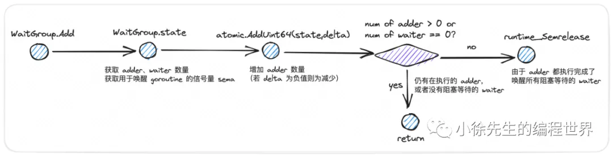

# Go并发编程之sync.WaitGroup

https://mp.weixin.qq.com/s/oPVmOT3rpkulraz_pDqWsA

类似 Promise.All
父 goroutine 在创建一系列子 goroutine 后，可以选择在一个合适的时机对所有子 goroutine 的执行结果进行等待聚合，直到所有子 goroutine 都执行完成之后，父 goroutine 才会继续往前推进.

## 1 场景问题探讨


channel实现的缺点：

- 主 goroutine 需要在一开始就明确启动的子 goroutine 数量
- channel 中的信号量消费是一次性的，无法重复利用

## 2 sync.WaitGroup 使用教程

Add(n)、Done()、Wait()


- 在使用 sync.WaitGroup 时，有两类错误操作是需要规避的：

1. 需要保证添加计数器数值的 WaitGroup.Add 操作是在 WaitGroup.Wait 操作之前执行
   由于子 goroutine 是异步启动的，所以有可能出现 Wait 方法先于 Add 方法执行，此时由于计数器值为 0，Wait 方法会被直接放行，导致产生预期之外的执行流程

   ```go
   func Test_waitGroup(t *testing.T) {
       var wg sync.WaitGroup
       for i := 0; i < 10; i++ {
           go func() {
               wg.Add(1)  // 错误操作
               defer wg.Done()
               <-time.After(time.Second)
           }()
       }

       wg.Wait()
   }
   ```

2. 需要保证 WaitGroup 计数器数值始终是一个非负数.

---

- WaitGroup + channel 完成数据聚合
  leader 光是知道 follower 已经完成工作这一事件还不够，还需要切实接收到来自 follower 传递的“工作成果”. 这部分内容就涉及到的 goroutine 之间的数据传递，这里我个人倾向于通过组合使用 WaitGroup 和 channel 的方式来完成工作.

## 3 sync.WaitGroup 实现源码

1. 数据结构
   

   ```go
    type WaitGroup struct {
      	noCopy noCopy

      	state atomic.Uint64 // high 32 bits are counter, low 32 bits are waiter count.
      	sema  uint32        // semaphore for completion
    }
   ```

2. 方法(删除了race相关代码)
   
   

```go
func (wg *WaitGroup) Add(delta int) {
	state := wg.state.Add(uint64(delta) << 32)  // 任务数量加 delta
	v := int32(state >> 32)  // 多少个 goroutine 在执行任务
	w := uint32(state)  // 多少个 goroutine 执行了 WaitGroup.Wait 在阻塞等待
  // WaitGroup 计数器出现负值，直接 panic
	if v < 0 {
		panic("sync: negative WaitGroup counter")
	}
  // 倘若首次 Add 操作是在有 goroutine 因 Wait 操作而陷入阻塞时才执行，抛出 panic
	if w != 0 && delta > 0 && v == int32(delta) {
		panic("sync: WaitGroup misuse: Add called concurrently with Wait")
	}
  // 倘若当前没有 goroutine 在 Wait，或者任务执行计数器仍大于 0，则直接返回
	if v > 0 || w == 0 {
		return
	}

  // 唤醒所有等待的 goroutine

  // 在执行过 WaitGroup.Wait 操作的情况下，WaitGroup.Add 操作不应该并发执行，否则可能导致 panic
	if wg.state.Load() != state {
		panic("sync: WaitGroup misuse: Add called concurrently with Wait")
	}
	wg.state.Store(0)
	for ; w != 0; w-- {
    // 唤醒 goroutine 使用的方法是 runtime_Semrelease 方法，底层会执行 goready 操作，属于 goroutine 的被动调度模式
		runtime_Semrelease(&wg.sema, false, 0)
	}
}

// Done decrements the WaitGroup counter by one.
func (wg *WaitGroup) Done() {
	wg.Add(-1)
}

// Wait blocks until the WaitGroup counter is zero.
func (wg *WaitGroup) Wait() {
  // for 循环开启自旋流程
	for {
		state := wg.state.Load()
		v := int32(state >> 32)
		w := uint32(state)
    // 倘若当前需要等待完成任务的计数器值为 0，则无需 wait 直接返回
		if v == 0 {
			return
		}

		// wait 阻塞等待 waitGroup 的计数器加一，然后陷入阻塞，挂起
		if wg.state.CompareAndSwap(state, state+1) {
      // runtime_Semacquire 方法，内部会通过 go park 操作，将当前 goroutine 阻塞挂起，属于被动调度模式
			runtime_Semacquire(&wg.sema)
      // 从阻塞中回复，倘若前一轮 wait 操作还没结束，waitGroup 又被使用了，则会 panic
			if wg.state.Load() != 0 {
				panic("sync: WaitGroup is reused before previous Wait has returned")
			}
			return
		}
	}
}
```
