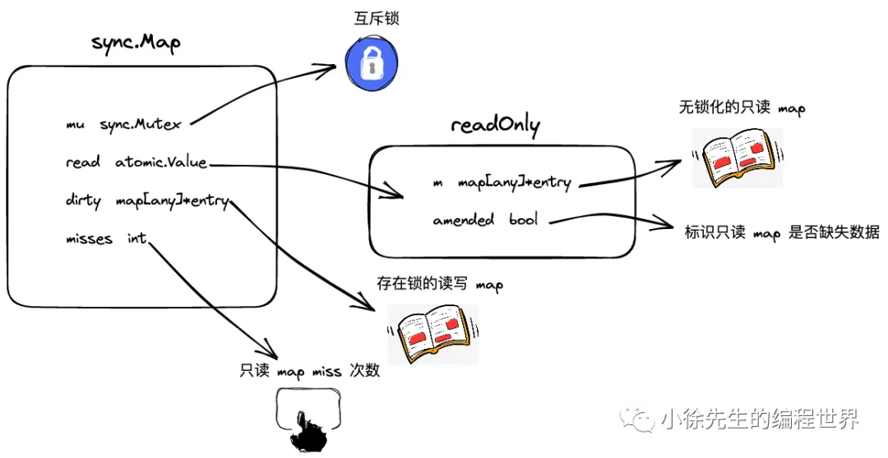
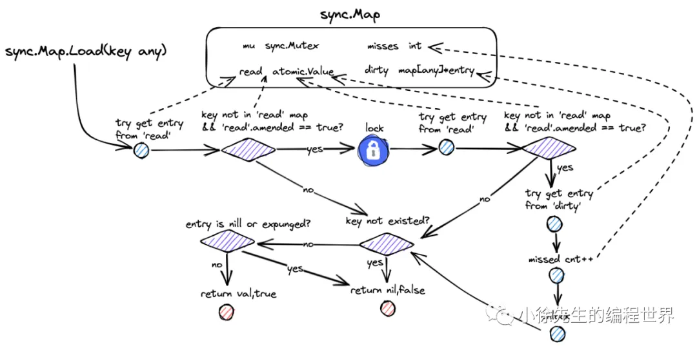
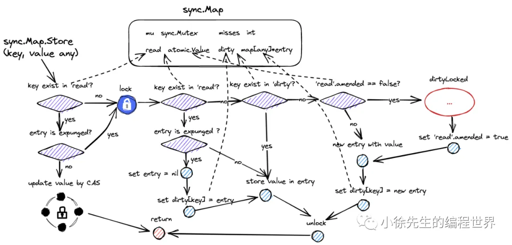
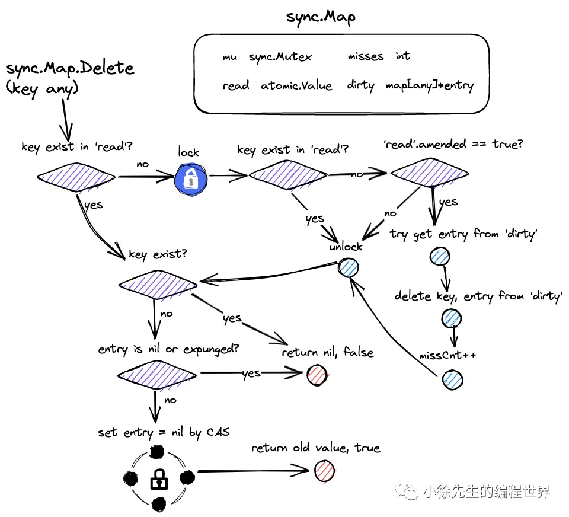
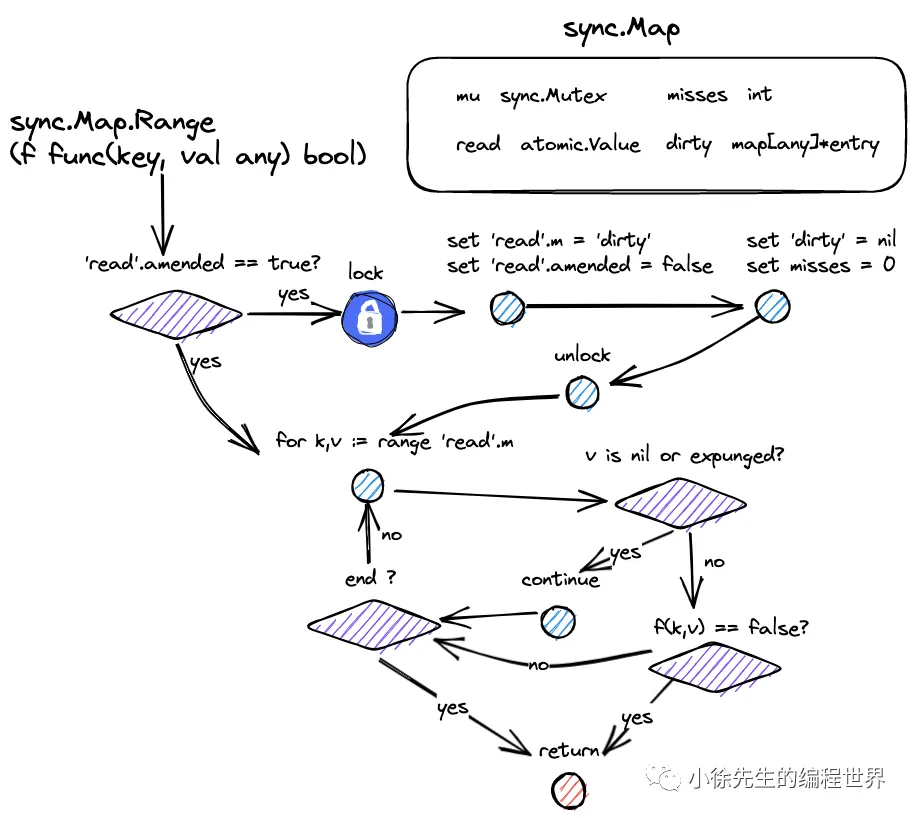
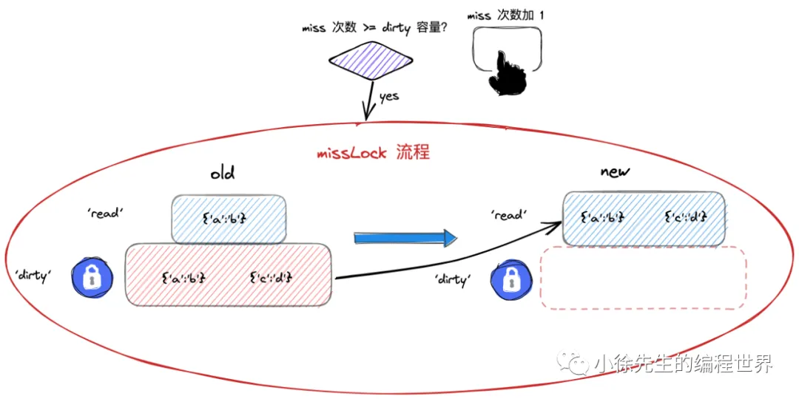
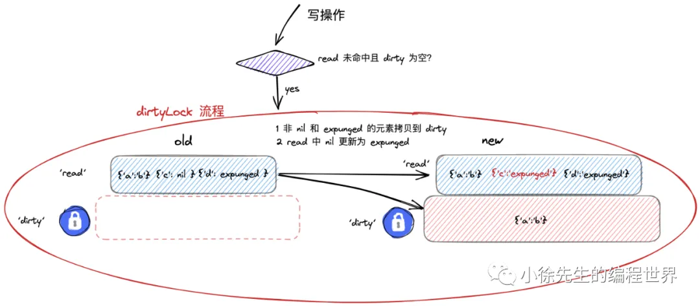

golang 中，map 不是并发安全的结构，并发读写会引发严重的错误.

## 1. 数据结构



```go
type Map struct {
    mu Mutex
    read atomic.Pointer[readOnly]  // readOnly
    dirty map[any]*entry  // 加锁处理的读写 map，是read的超集,且和read指向的entry是同一个
    misses int  // 访问 read 的失效次数，累计达到阈值时 dirty -> read 重构
}
```

关键前提：

- dirty map 是 read map 的超集；
- dirty map 中的 entry 和 read map 中的 entry 是同一个引用。

---

entry 及对应的几种状态

```go
type entry struct {
    p unsafe.Pointer
}
```

kv 对中的 value，统一采用 unsafe.Pointer 的形式进行存储，通过 entry.p 的指针进行链接。

`entry.p 的指向分为三种情况：`

1. 存活态：正常指向元素；
2. 软删除态：指向 nil；逻辑上该 key-entry 对已经被删除；
3. 硬删除态：指向固定的全局变量 expunged。硬删除，dirty map 中已不存在该 key-entry 对。

```go
var expunged = unsafe.Pointer(new(any))
```

---

```go
type readOnly struct {
    m       map[any]*entry
    amended bool // 与 dirty map 相比是否有新增或删除的 key
}
```

• m：真正意义上的 read map，实现从 key 到 entry 的映射；
• amended：标识 read map 中的 key-entry 对是否存在缺失，需要通过 dirty map 兜底.

## 2.读流程



```go
func (m *Map) Load(key any) (value any, ok bool) {
    read, _ := m.read.Load().(readOnly)
    e, ok := read.m[key]
    if !ok && read.amended {
        m.mu.Lock()
        // 加锁 double check
        read, _ = m.read.Load().(readOnly)
        e, ok = read.m[key]
        if !ok && read.amended {
            // 查询 dirty map
            e, ok = m.dirty[key]
            // 记录 read 失效次数
            m.missLocked()
        }
        m.mu.Unlock()
    }
    if !ok {
        return nil, false
    }
    return e.load()
}

func (e *entry) load() (value any, ok bool) {
	p := e.p.Load()
	if p == nil || p == expunged {
		return nil, false
	}
	return *p, true
}

// locked 后缀表示该方法在加锁状态下调用，内部可以直接访问临界区资源。
// 在读流程中，倘若未命中 read map，且由于 read map 内容存在缺失需要和 dirty map 交互时，会走进 missLocked 流程
func (m *Map) missLocked() {
    m.misses++
    if m.misses < len(m.dirty) {
        return
    }
    // miss 次数大于等于 dirty map 中存在的 key-entry 对数量，则使用 dirty map 覆盖 read map，并将 read map 的 amended flag 置为 false
    // dirty 拥有 read 的全量数据.
    m.read.Store(readOnly{m: m.dirty})
    m.dirty = nil
    m.misses = 0
}
```

## 3.写流程



```go
func (m *Map) Store(key, value any) {
	_, _ = m.Swap(key, value)
}


// Swap swaps the value for a key and returns the previous value if any.
// The loaded result reports whether the key was present.
func (m *Map) Swap(key, value any) (previous any, loaded bool) {
  read := m.loadReadOnly()
	if e, ok := read.m[key]; ok {
    // 更新而非插入，直接基于 CAS 操作进行 entry 值的更新
    // 注意dirty map中的entry是引用read map中的entry，所以这里的更新会同时影响到read map和dirty map
		if v, ok := e.trySwap(&value); ok {
			if v == nil {
				return nil, false
			}
			return *v, true
		}
	}

	m.mu.Lock()
  // 加锁 double check
	read = m.loadReadOnly()
	if e, ok := read.m[key]; ok {
    // 找到 entry → 若为 expunged → 恢复为 nil 并写入 dirty → 更新值
		if e.unexpungeLocked() {
			m.dirty[key] = e
		}
		if v := e.swapLocked(&value); v != nil {
			loaded = true
			previous = *v
		}
	} else if e, ok := m.dirty[key]; ok {
    // read 中不存在，dirty 中存在，直接更新值
		if v := e.swapLocked(&value); v != nil {
			loaded = true
			previous = *v
		}
	} else {
    // 新增键 → 初始化 dirty（若为空） → 写入新 entry
		if !read.amended {
			m.dirtyLocked()
			m.read.Store(&readOnly{m: read.m, amended: true})
		}
		m.dirty[key] = newEntry(value)
	}
	m.mu.Unlock()
	return previous, loaded
}

// 未删除或者软删除的 entry，进行值的替换.
// 硬删除的 entry，返回失败.
func (e *entry) trySwap(i *any) (*any, bool) {
	for {
		p := e.p.Load()
		if p == expunged {
			return nil, false
		}
		if e.p.CompareAndSwap(p, i) {
			return p, true
		}
	}
}

func (e *entry) unexpungeLocked() (wasExpunged bool) {
	return e.p.CompareAndSwap(expunged, nil)
}

func (e *entry) swapLocked(i *any) *any {
	return e.p.Swap(i)
}

// O(n) 将 read 中未删除的键浅拷贝到 dirty.
// 只有在dirty->read转移之后，第一次插入key时，才会触发dirtyLocked.
// 均摊复杂度为 O(1).
func (m *Map) dirtyLocked() {
	if m.dirty != nil {
		return
	}

	read := m.loadReadOnly()
	m.dirty = make(map[any]*entry, len(read.m))
	for k, e := range read.m {
    // 仅拷贝未被删除(软、硬)的kv对, 避免 dirty 包含大量无效键
		if !e.tryExpungeLocked() {
			m.dirty[k] = e
		}
	}
}

func (e *entry) tryExpungeLocked() (isExpunged bool) {
	p := e.p.Load()
	for p == nil {
    // read map 中的软删除更新为硬删除, 更新成功返回true
		if e.p.CompareAndSwap(nil, expunged) {
			return true
		}
		p = e.p.Load()
	}
	return p == expunged
}

```

## 4.删除流程



```go
func (m *Map) Delete(key any) {
	m.LoadAndDelete(key)
}

func (m *Map) LoadAndDelete(key any) (value any, loaded bool) {
	read := m.loadReadOnly()
	e, ok := read.m[key]
	if !ok && read.amended {
		m.mu.Lock()
		read = m.loadReadOnly()
		e, ok = read.m[key]
    // read中存在则标记删除, 否则从dirty中物理删除
		if !ok && read.amended {
			e, ok = m.dirty[key]
			delete(m.dirty, key)  // 物理删除
			m.missLocked()
		}
		m.mu.Unlock()
	}
	if ok {
		return e.delete()  // 标记为 nil
	}
	return nil, false
}

func (e *entry) delete() (value any, ok bool) {
	for {
		p := e.p.Load()
		if p == nil || p == expunged {
			return nil, false
		}
    // 标记为 nil，软删除
		if e.p.CompareAndSwap(p, nil) {
			return *p, true
		}
	}
}
```

## 5.遍历流程（Range）



```go
// 谨慎使用，高频调用 `Range` 可能影响写性能。
// 内部强制晋升操作会清空 `dirty`，导致下一次插入key的写操作触发 `dirtyLocked` 的全量拷贝。
func (m *Map) Range(f func(key, value any) bool) {
	read := m.loadReadOnly()
	if read.amended {
		m.mu.Lock()
		read = m.loadReadOnly()
		if read.amended {
			read = readOnly{m: m.dirty}  // 晋升 dirty
			m.read.Store(&read)
			m.dirty = nil
			m.misses = 0
		}
		m.mu.Unlock()
	}

	for k, e := range read.m {  // 只遍历 read
		v, ok := e.load()
		if !ok {
			continue
		}
		if !f(k, v) {
			break
		}
	}
}

func (e *entry) load() (value any, ok bool) {
	p := e.p.Load()
	if p == nil || p == expunged {
		return nil, false
	}
	return *p, true
}
```

## 6. 总结

1. entry 的 expunged 态
   Q：为什么需要使用 expunged 态来区分软硬删除呢？仅用 nil 一种状态来标识删除不可以吗？
   A：首先需要明确，无论是软删除(nil)还是硬删除(expunged), `都表示在逻辑意义上 key-entry 对已经从 sync.Map 中删除`，nil 和 expunged 的区别在于：

   - 软删除态（nil）：`read map 和 dirty map 在物理上仍保有该 key-entry 对`，因此倘若此时需要对该 entry 执行写操作，可以直接 CAS 操作恢复；
   - 硬删除态（expunged）：只会在 dirtyLocked 时出现该状态。`dirty map 中已经没有该 key-entry 对`，倘若执行写操作，必须加锁（dirty map 必须含有全量 key-entry 对数据），不能通过 CAS 操作恢复。
     > 大前提：dirty map 是 read map 的超集

   设计 expunged 和 nil 两种状态的原因，就是为了优化在 dirtyLocked 前，针对`同一个 key 先删后写`的场景. 通过 expunged 态额外标识出 dirty map 中是否仍具有指向该 entry 的能力，这样能够实现对一部分 nil 态 key-entry 对的解放，能够基于 CAS 完成这部分内容写入操作而无需加锁.

2. read map 和 dirty map 的数据流转

   - sync.Map 由两个 map 构成：
     
     • read map：访问时全程无锁；
     • dirty map：是兜底的读写 map，访问时需要加锁.
     除了 read 中 expunged 态的 entry 之外，read map 的内容为 dirty map 的子集

     之所以这样处理，是希望能根据对读、删、更新、写操作频次的探测，来实时动态地调整操作方式，`希望在读、更新、删频次较高时，更多地采用 CAS 的方式无锁化地完成操作`；在写操作频次较高时，则直接了当地采用加锁操作完成.
     因此， sync.Map 本质上采取了一种以空间换时间 + 动态调整策略的设计思路，下面对两个 map 间的数据流转过程进行详细介绍：

   - dirty map -> read map
     
     当 miss 次数达到阈值，则进入 missLocked 流程，进行新老 read/dirty 替换流程；此时将老 dirty 作为新 read，新 dirty map 则暂时为空，直到 dirtyLocked 流程完成对 dirty 的初始化
   - read map -> dirty map
     
     将 read 中未被删除的元素（非 nil 非 expunged）拷贝到 dirty 中(曲线救国，删除 readmap 元素)；会将 read 中所有此前被删的元素统一置为 expunged 态

## 7. 适用场景与注意问题

- sync.Map 适用于读多、更新多、删多、写(插入)少的场景；
- 倘若写(插入)操作过多，sync.Map 基本等价于互斥锁 + map；
- sync.Map 可能存在性能抖动问题，主要发生于在读/删流程 miss 只读 map 次数过多时（触发 missLocked 流程），下一次插入操作的过程当中（dirtyLocked 流程）.
  性能抖动是最坏时间复杂度不好导致的。
