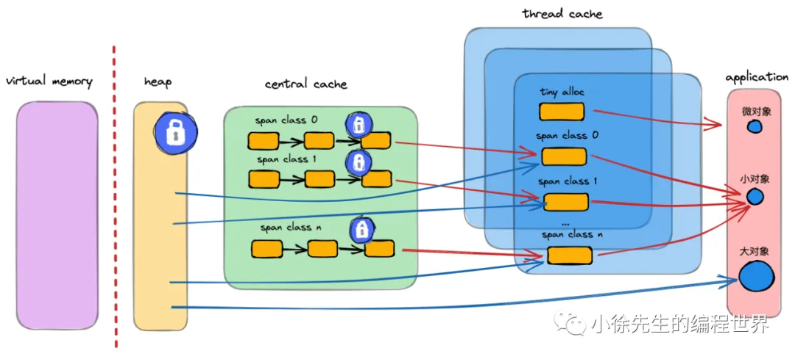
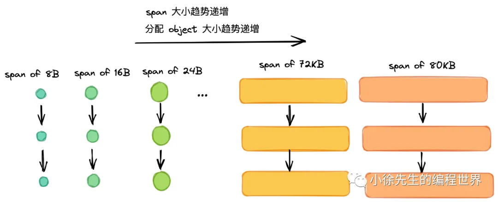
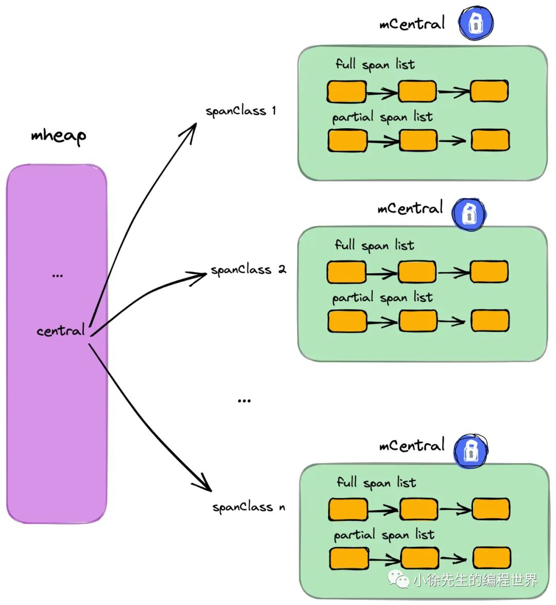
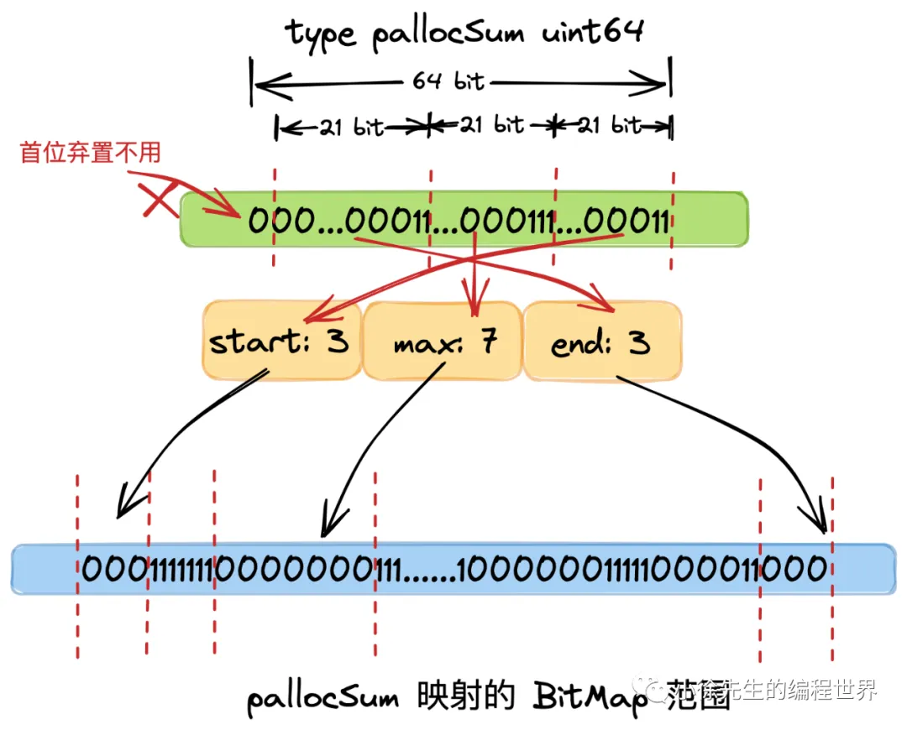

# Golang 内存模型与分配(Allocate)机制

https://mp.weixin.qq.com/s?__biz=MzkxMjQzMjA0OQ==&mid=2247483971&idx=1&sn=409fbc90cd37cd9856f470a0db884218

## 1. 内存模型

1. 操作系统存储模型
   
2. 虚拟内存与物理内存
   

   操作系统内存管理中，另一个重要概念是虚拟内存，其作用如下：
   • 在用户与硬件间添加中间代理层（`没有什么是加一个中间层解决不了的`）
   • 优化用户体验（进程感知到获得的内存空间是“连续”的）
   • “放大”可用内存（虚拟内存可以由物理内存+磁盘补足，并根据冷热动态置换，用户无感知）

3. 分页管理
   操作系统中通常会将虚拟内存和物理内存切割成固定的尺寸，于虚拟内存而言叫作“页”，于物理内存而言叫作“帧”。
   linux 页/帧的大小固定，为 4KB（这实际是由实践推动的经验值，太粗会增加碎片率，太细会增加分配频率影响效率）

   > 内部碎片是指分配给进程的内存块中未被实际使用而浪费掉的部分；
   > 外部碎片则是指虽然有空闲内存，但这些内存被分割成许多不连续的小块，无法满足新的内存分配请求。

4. Golang 内存模型
   

- 以空间换时间，一次缓存，多次复用
- 多级缓存，实现无/细锁化
  
  - mheap：全局的内存起源，访问要加全局锁
  - mcentral：每种对象大小规格（全局共划分为 68 种）对应的缓存，锁的粒度也仅限于同一种规格以内
  - mcache：每个 P（正是 GMP 中的 P）持有一份的内存缓存，访问时无锁
- 多级规格，提高利用率
  
  - page：最小的存储单元.
    Golang 借鉴操作系统分页管理的思想，每个最小的存储单元也称之为页 page，但大小为 8 KB
  - mspan：最小的管理单元.
    mspan 大小为 page 的整数倍，且从 8B 到 80 KB 被划分为 67 种不同的规格，分配对象时，会根据大小映射到不同规格的 mspan，从中获取空间.

## 2. 核心概念梳理

1. 内存管理单元 mspan
   

   - 同等级的 mspan 会从属同一个 mcentral，最终会被组织成链表，因此带有前后指针（prev、next）
   - 基于 bitMap 辅助快速找到空闲内存块（块大小为对应等级下的 object 大小）
     

   ```go
   type mspan struct {
       // 标识前后节点的指针
       next *mspan
       prev *mspan
       // ...
       // 起始地址
       startAddr uintptr
       // 包含几页，页是连续的
       npages    uintptr

       // 标识此前的位置都已被占用
       freeindex uintptr
       // 最多可以存放多少个 object
       nelems uintptr // number of object in the span.

       // bitmap 每个 bit 对应一个 object 块，标识该块是否已被占用
       allocCache uint64
       // ...
       // 标识 mspan 等级，包含 class 和 noscan 两部分信息
       spanclass             spanClass
       // ...
   }
   ```

2. 内存单元等级 spanClass
   mspan 根据空间大小和面向分配对象的大小，被划分为 67 种等级（1-67，实际上还有一种隐藏的 0 级，用于处理更大的对象，上不封顶）

   | class | bytes/obj | bytes/span | objects | tail waste | max waste |
   | :---: | :-------: | :--------: | :-----: | :--------: | :-------: |
   |   1   |     8     |    8192    |  1024   |     0      |  87.50%   |
   |   2   |    16     |    8192    |   512   |     0      |  43.75%   |
   |   3   |    24     |    8192    |   341   |     8      |  29.24%   |
   |   4   |    32     |    8192    |   256   |     0      |  21.88%   |
   |  ...  |    ...    |    ...     |   ...   |    ...     |    ...    |
   |  66   |   28672   |   57344    |    2    |     0      |   4.91%   |
   |  67   |   32768   |   32768    |    1    |     0      |  12.50%   |

   下面给出的表格中每一列的含义解释如下：

   | 列名           | 解释                                                                                                                                                                                                                                                                                      |
   | -------------- | ----------------------------------------------------------------------------------------------------------------------------------------------------------------------------------------------------------------------------------------------------------------------------------------- |
   | **class**      | 内存分配中不同的大小类别编号，每一类对应一种固定的分配单元大小（对象大小）。也就是说，不同“class”代表不同的对象分配尺寸。                                                                                                                                                                 |
   | **bytes/obj**  | 表示该类别中每个对象实际分配的字节数，也即内存分配器为该类对象预留的空间大小。由于分配是按固定块来进行的，可能会比用户实际请求的内存多，从而产生内部碎片。                                                                                                                                |
   | **bytes/span** | 该等级的 mspan 的总空间大小                                                                                                                                                                                                                                                               |
   | **objects**    | 该等级的 mspan 最多可以 new 多少个对象                                                                                                                                                                                                                                                    |
   | **tail waste** | 指的是在一个 span 中，因不能再完整放下一个对象而剩余的未使用字节数（即尾部剩余空间）。这部分空间无法用于存放完整对象，属于空间浪费。                                                                                                                                                      |
   | **max waste**  | 表示在该类别下单个对象可能出现的最坏情况（即最严重的内部碎片）所占的百分比。例如，当实际请求的内存略大于上一个类别的最大可用请求值时，为满足对齐要求，内存分配器会分配整个固定块（bytes/obj），从而造成多余空间浪费。此百分比反映了单个对象分配时内部碎片的最大浪费率。<br><br>举例来说： |

   - 对于 class 1，每个对象分配 8 字节，如果请求非常少（比如 1 字节），则浪费 7 字节，浪费比例 7/8 = 87.50%。
   - 对于 class 2，每个对象 16 字节，若最差情况浪费 7 字节，则浪费比例 7/16 = 43.75%。
   - 依此类推，不同类别由于分配单元大小不同，其最坏情况下的内部碎片比例也不同。 |

   这种表格通常用于描述内存分配器中各个尺寸类别的分配情况和内部碎片情况，帮助分析内存利用率以及可能存在的浪费问题。

   ***

   每个 object 还有一个重要的属性叫做 `noscan`，标识了 object 是否包含指针，在 gc 时是否需要展开标记(例如，如果object中没有指针，那么在 gc 时就不需要展开标记)。

   ```go
   // runtime/mheap.go

   type spanClass uint8

   // uint8 左 7 位为 mspan 等级，最右一位标识是否为 noscan
   func makeSpanClass(sizeclass uint8, noscan bool) spanClass {
       return spanClass(sizeclass<<1) | spanClass(bool2int(noscan))
   }

   func (sc spanClass) sizeclass() int8 {
       return int8(sc >> 1)
   }

   func (sc spanClass) noscan() bool {
       return sc&1 != 0
   }
   ```

3. 线程缓存 mcache
   

   - mcache 是每个 P 独有的缓存，因此交互无锁
   - mcache 将每种 spanClass 等级的 mspan 各缓存了一个，总数为 2（nocan 维度） x 68（大小维度）= 136
   - mcache 中还有一个为对象分配器 tiny allocator，用于处理小于 16B 对象的内存分配

   ```go
   // runtime/mcache.go
   const numSpanClasses = 136
   type mcache struct {
       // 微对象分配器相关
       tiny       uintptr
       tinyoffset uintptr
       tinyAllocs uintptr

       // mcache 中缓存的 mspan，每种 spanClass 各一个
       alloc [numSpanClasses]*mspan
       // ...
   }
   ```

4. 中心缓存 mcentral
   

   - 每个 mcentral 对应一种 spanClass，聚合了该 spanClass 下的 mspan
   - mcentral 下的 mspan 分为两个链表，分别为有空间 mspan 链表 partial 和满空间 mspan 链表 full
   - 每个 mcentral 一把锁

   ```go
   // runtime/mcentral.go
   type mcentral struct {
       // 对应的 spanClass
       spanclass spanClass
       // 有空位的 mspan 集合，数组长度为 2 是用于抗一轮 GC
       partial [2]spanSet
       // 无空位的 mspan 集合
       full    [2]spanSet
   }
   ```

5. 全局堆内存 mheap

- 对于 Golang 上层应用而言，堆是操作系统虚拟内存的抽象
- 以页（8KB）为单位，作为最小内存存储单元
- 通过 heapArena 聚合页，记录了页到 mspan 的映射信息
- 建立空闲页基数树索引 radix tree index，辅助快速寻找空闲页
- 是 mcentral 的持有者，持有所有 spanClass 下的 mcentral，作为自身的缓存
- 内存不够时，向操作系统申请，申请单位为 heapArena（64M）

```go
type mheap struct {
    // 堆的全局锁
    lock mutex

    // 空闲页分配器，底层是多棵基数树组成的索引，每棵树对应 16 GB 内存空间
    // 有 2^14 棵基数树，因此索引全面覆盖到 2^14 * 16 GB = 256 T 的内存空间
    // 基于 bitMap 标识内存中`各页`的使用情况，bit 位为 0 代表该页是空闲的，为 1 代表该页已被 mspan 占用
    pages pageAlloc

    // 记录了所有的 mspan. 需要知道，所有 mspan 都是经由 mheap，使用连续空闲页组装生成的
    allspans []*mspan

    // 记录了页到 mspan 的映射，是 mheap 向操作系统申请内存的单位
    // 每个 heapArena 包含 8192 个页，大小为 8192 * 8KB = 64 MB
    // heapAreana 数组，64 位系统下，二维数组容量为 [1][2^22]
    // 每个 heapArena 大小 64M，因此理论上，Golang 堆上限为 2^22*64M = 256T
    arenas [1 << arenaL1Bits]*[1 << arenaL2Bits]*heapArena

    // ...
    // 多个 mcentral，总个数为 spanClass 的个数
    central [numSpanClasses]struct {
        mcentral mcentral
        // 用于内存地址对齐
        pad      [cpu.CacheLinePadSize - unsafe.Sizeof(mcentral{})%cpu.CacheLinePadSize]byte
    }

    // ...
}
```

6. 空闲页索引 pageAlloc 基数树
   https://go.googlesource.com/proposal/+/master/design/35112-scaling-the-page-allocator.md

   理解：BitMap + 线段树
   

   - 每棵基数树聚合了 16 GB 内存空间中各页使用情况的索引信息
   - 基数树中，每个节点称为 PallocSum，是一个 uint64 类型，体现了索引的聚合信息，包含以下四部分：
     • start：最右侧 21 个 bit，标识了当前节点映射的 bitMap 范围中首端有多少个连续的 0 bit（空闲页），称之为 start；
     • max：中间 21 个 bit，标识了当前节点映射的 bitMap 范围中最多有多少个连续的 0 bit（空闲页），称之为 max；
     • end：左侧 21 个 bit，标识了当前节点映射的 bitMap 范围中最末端有多少个连续的 0 bit（空闲页），称之为 end.
     • 最左侧一个 bit，弃置不用

     > 可以理解为线段树的节点类型 type PallocSum uint64

   - 多级分层
     
     - 每个父 pallocSum 有 8 个子 pallocSum
     - **每棵树的内存大小为：2^21(页) x 8kb(页大小) = 16GB**

   ```go
   const summaryLevels = 5

   type pageAlloc struct {
       // 共有五层基数树，第一层有 2^14 个节点，因此共用 2^14棵基数树
       // 总空间大小为 2^14*16GB = 256T
       // 接下来每层的节点数为上层的 8 倍
       summary [summaryLevels][]pallocSum

       // ...
       // 类似于 tiny offset，小于此值的地址无锁检索，必然没有空间可用
       searchAddr offAddr

       // ...
   }

   // 基数树节点
   const(
    logMaxPackedValue = 21
    maxPackedValue    = 1 << logMaxPackedValue
   )

   type pallocSum uint64

   // 基于 start、max、end 组装成一个基数树节点 pallocSum
   func packPallocSum(start, max, end uint) pallocSum {
       // ...
       return pallocSum((uint64(start) & (maxPackedValue - 1)) |
           ((uint64(max) & (maxPackedValue - 1)) << logMaxPackedValue) |
           ((uint64(end) & (maxPackedValue - 1)) << (2 * logMaxPackedValue)))
   }

   // 当前节点对应区域内，首部连续空闲页的长度
   // 通过 uint64 最右侧 21 个 bit 标识
   func (p pallocSum) start() uint {
       // ...
       return uint(uint64(p) & (maxPackedValue - 1))
   }

   // 当前节点对应区域内，连续空闲页的最大长度
   // 通过 uint64 左数 23~43 个 bit 标识
   func (p pallocSum) max() uint {
       // ...
       return uint((uint64(p) >> logMaxPackedValue) & (maxPackedValue - 1))
   }

   // 当前节点对应区域内，尾部连续空闲页的长度
   // 通过 uint64 左数 2~22 个 bit 标识
   func (p pallocSum) end() uint {
       return uint((uint64(p) >> (2 * logMaxPackedValue)) & (maxPackedValue - 1))
   }
   ```

7. heapArena
   • 每个 heapArena 包含 8192 个页，大小为 8192 x 8KB = 64 MB
   • heapArena 记录了页到 mspan 的映射. 因为 GC 时，通过地址偏移找到页很方便，但找到其所属的 mspan 不容易. 因此需要通过这个映射信息进行辅助.
   • heapArena 是 mheap 向操作系统申请内存的单位（64MB）

   ```go
   const pagesPerArena = 8192

   type heapArena struct {
       // ...
       // 实现 page 到 mspan 的映射
       spans [pagesPerArena]*mspan

       // ...
   }
   ```

## 3. 对象分配流程

不论是以下哪种方式，最终都会殊途同归步入 `mallocgc` 方法中
• new(T)
• &T{}
• make(xxxx)

1. 分配流程总览
   
   Golang 中，依据 object 的大小，会将其分为下述三类：
   • tiny：小于 16B 的对象，通过 tiny allocator 分配
   • small：大于 16B 且小于 32KB 的对象，通过 mcache 分配
   • large：大于 32KB 的对象，通过 mheap 分配

   
   核心流程类似于读多级缓存的过程，由上而下，每一步只要成功则直接返回. 若失败，则由下层方法兜底

   1. 从 P 专属 mcache 的 tiny 分配器取内存（无锁）
   2. 根据所属的 spanClass，从 P 专属 mcache 缓存的 mspan 中取内存（无锁）
   3. 根据所属的 spanClass 从对应的 mcentral 中取 mspan 填充到 mcache，然后从 mspan 中取内存（spanClass 粒度锁）
   4. 根据所属的 spanClass，从 mheap 的页分配器 pageAlloc 取得足够数量空闲页组装成 mspan 填充到 mcache，然后从 mspan 中取内存（全局锁）
   5. mheap 向操作系统申请内存，更新页分配器的索引信息，然后重复（4）.

   微对象：1-5
   小对象：2-5
   大对象：4-5

2. 主干方法 mallocgc

```go
func mallocgc(size uintptr, typ *_type, needzero bool) unsafe.Pointer {
    // ...
    // 获取 m
    mp := acquirem()
    // 获取当前 p 对应的 mcache
    c := getMCache(mp)
    var span *mspan
    var x unsafe.Pointer
    // 根据当前对象是否包含指针，标识 gc 时是否需要展开扫描
    noscan := typ == nil || typ.ptrdata == 0
    // 是否是小于 32KB 的微、小对象
    if size <= maxSmallSize {
    // 小于 16 B 且无指针，则视为微对象
        if noscan && size < maxTinySize {
        // tiny 内存块中，从 offset 往后有空闲位置
          off := c.tinyoffset
          // 如果大小为 5 ~ 8 B，size 会被调整为 8 B，此时 8 & 7 == 0，会走进此分支
          if size&7 == 0 {
                // 将 offset 补齐到 8 B 倍数的位置
                off = alignUp(off, 8)
                // 如果大小为 3 ~ 4 B，size 会被调整为 4 B，此时 4 & 3 == 0，会走进此分支
           } else if size&3 == 0 {
           // 将 offset 补齐到 4 B 倍数的位置
                off = alignUp(off, 4)
                // 如果大小为 1 ~ 2 B，size 会被调整为 2 B，此时 2 & 1 == 0，会走进此分支
           } else if size&1 == 0 {
            // 将 offset 补齐到 2 B 倍数的位置
                off = alignUp(off, 2)
           }
            // 如果当前 tiny 内存块空间还够用，则直接分配并返回
            if off+size <= maxTinySize && c.tiny != 0 {
            // 分配空间
                x = unsafe.Pointer(c.tiny + off)
                c.tinyoffset = off + size
                c.tinyAllocs++
                mp.mallocing = 0
                releasem(mp)
                return x
            }
            // 分配一个新的 tiny 内存块
            span = c.alloc[tinySpanClass]
            // 从 mCache 中获取
            v := nextFreeFast(span)
            if v == 0 {
            // 从 mCache 中获取失败，则从 mCentral 或者 mHeap 中获取进行兜底
                v, span, shouldhelpgc = c.nextFree(tinySpanClass)
            }
// 分配空间
            x = unsafe.Pointer(v)
           (*[2]uint64)(x)[0] = 0
           (*[2]uint64)(x)[1] = 0
           size = maxTinySize
        } else {
          // 根据对象大小，映射到其所属的 span 的等级(0~66）
          var sizeclass uint8
          if size <= smallSizeMax-8 {
              sizeclass = size_to_class8[divRoundUp(size, smallSizeDiv)]
          } else {
              sizeclass = size_to_class128[divRoundUp(size-smallSizeMax, largeSizeDiv)]
          }
          // 对应 span 等级下，分配给每个对象的空间大小(0~32KB)
          size = uintptr(class_to_size[sizeclass])
          // 创建 spanClass 标识，其中前 7 位对应为 span 的等级(0~66)，最后标识表示了这个对象 gc 时是否需要扫描
          spc := makeSpanClass(sizeclass, noscan)
          // 获取 mcache 中的 span
          span = c.alloc[spc]
          // 从 mcache 的 span 中尝试获取空间
          v := nextFreeFast(span)
          if v == 0 {
          // mcache 分配空间失败，则通过 mcentral、mheap 兜底
             v, span, shouldhelpgc = c.nextFree(spc)
          }
          // 分配空间
          x = unsafe.Pointer(v)
          // ...
       }
       // 大于 32KB 的大对象
   } else {
       // 从 mheap 中获取 0 号 span
       span = c.allocLarge(size, noscan)
       span.freeindex = 1
       span.allocCount = 1
       size = span.elemsize
       // 分配空间
        x = unsafe.Pointer(span.base())
   }
   // ...
   return x
}
```

- tiny分配
  
  每个 P 独有的 mache 会有个微对象分配器，每 16B 成块，会向上取整为 2 的整数次幂进行空间补齐，然后进入分配流程.
- mcache 分配
  根据对象大小，映射到其所属的 span 的等级(0~66）, 获取 mcache 中的 span.
  在 mspan 中，基于 Ctz64 算法，根据 mspan.allocCache 的 bitMap 信息快速检索到空闲的 object 块，进行返回.
- mcentral 分配
  倘若 mcache 中对应的 mspan 空间不足，则会在 mcache.refill 方法中，向更上层的 mcentral 乃至 mheap 获取 mspan，填充到 mache 中
- mheap 分配
  mheap 空闲页分配器基数树 pageAlloc 分配空闲页
  `基数树寻页`核心源码位于 runtime/pagealloc.go 的 pageAlloc 方法中。

  ```go
  func (p *pageAlloc) find(npages uintptr) (uintptr, offAddr) {
    // 必须持有堆锁
    assertLockHeld(p.mheapLock)


    // current level.
    i := 0


    // ...
    lastSum := packPallocSum(0, 0, 0)
    lastSumIdx := -1


  nextLevel:
      // 1 ~ 5 层依次遍历
      for l := 0; l < len(p.summary); l++ {
          // ...
          // 根据上一层的 index，映射到下一层的 index.
          // 映射关系示例：上层 0 -> 下层 [0~7]
          //             上层 1 -> 下层 [8~15]
          //             以此类推
          i <<= levelBits[l]
          entries := p.summary[l][i : i+entriesPerBlock]
          // ...
          // var levelBits = [summaryLevels]uint{
          //   14,3,3,3,3
          // }
          // 由于第一层有 2^14 个节点，所以 heap 内存上限为 2^14 * 16G = 256T
          var base, size uint
          for j := j0; j < len(entries); j++ {
              sum := entries[j]
              // ...
              // 倘若当前节点对应内存空间首部即满足，直接返回结果
              s := sum.start()
              if size+s >= uint(npages) {
                  if size == 0 {
                      base = uint(j) << logMaxPages
                  }
                  size += s
                  break
              }
              // 倘若当前节点对应内存空间首部不满足，但是内部最长连续页满足，则到下一层节点展开搜索
              if sum.max() >= uint(npages) {
                  i += j
                  lastSumIdx = i
                  lastSum = sum
                  continue nextLevel
              }
              // 即便内部最长连续页不满足，还可以尝试将尾部与下个节点的首部叠加，看是否满足
              if size == 0 || s < 1<<logMaxPages {
                  size = sum.end()
                  base = uint(j+1)<<logMaxPages - size
                  continue
              }
              // The entry is completely free, so continue the run.
              size += 1 << logMaxPages
          }

      // 根据 i 和 j 可以推导得到对应的内存地址，进行返回
      ci := chunkIdx(i)
      addr := chunkBase(ci) + uintptr(j)*pageSize
      // ...
      return addr, p.findMappedAddr(firstFree.base)
  }
  ```

- 向操作系统申请
  倘若 mheap 中没有足够多的空闲页了，会发起 mmap 系统调用，向操作系统申请额外的内存空间.
