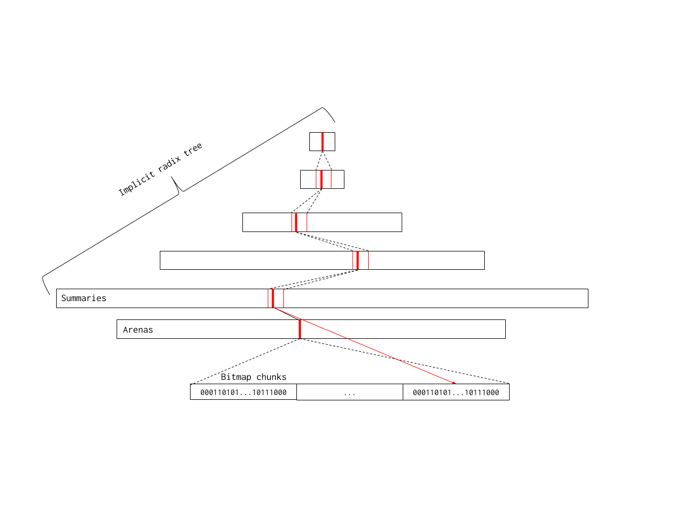

# Proposal: Scaling the Go page allocator

https://go.googlesource.com/proposal/+/master/design/35112-scaling-the-page-allocator.md
下面将对这份提案的各个部分做详细讲解，帮助你理解其背景、设计思路、关键技术以及预期的效果。

---

## 1. 问题背景

### 1.1 当前 Go 内存页分配器的瓶颈

- **高分配率与高并发**  
  Go 运行时的页分配器（即 \*mheap.alloc）在高分配率和高 GOMAXPROCS（即高并发）场景下存在明显的可扩展性问题。比如在 Kubernetes 的负载测试中，频繁的堆内存分配使得堆锁（heap lock）竞争异常激烈，从而导致整体吞吐量下降和尾部延迟增大。

- **堆锁的争用问题**  
  页分配过程中的所有操作都受堆锁保护。即使页分配本身操作不复杂，但在高并发环境下，频繁获取和释放堆锁成为系统瓶颈（甚至在 Go 1.11 中就已经出现了“抢占（barging）”现象）。

### 1.2 为什么需要改进

- **微小的回归导致巨大问题**  
  在 Go 1.12 版本中，因额外的工作和数据结构变动使得这一问题进一步恶化。在小对象（通常小于 32 KiB）的分配场景下，每 10 次左右的分配就需要访问页堆，堆锁争用就会显得尤为严重。

- **数据表明大部分分配都针对小对象**  
  来自 Kubernetes 及 Google 内部服务的数据表明，绝大多数 span 分配用于小对象（例如 1 KiB 或更小），因此需要优化的是常见的“小对象”分配路径，使其尽可能快且无锁。

---

## 2. 提案总体思路

提案主要围绕两点展开，以提升页分配器的可扩展性和性能：

1. **使用位图（Bitmap）替代传统的 span 结构管理空闲内存**

   - 取消对空闲 span 的概念，用位图来追踪每个页的状态（0 表示空闲，1 表示已使用）。
   - 位图的优势在于它占用空间小，而且现代 CPU 对位操作非常高效。

2. **允许每个 P（逻辑处理器）缓存一部分空闲页**
   - 通过让每个 P 保留一块本地缓存（从全局位图中抓取一段 64 页对齐的内存区域及其 64 位的位图），大部分小对象的分配可以在不获取全局堆锁的情况下完成。
   - 这一步既减少了堆锁争用，又能让常见的小页分配路径非常迅速（目标是 80% 以上的分配无锁完成）。

---

## 3. 使用位图管理空闲内存

### 3.1 位图基本原理

- **页的状态表示**  
  将整个堆内存划分为固定大小的页（例如 8 KiB）。每个页对应位图中的一个比特，约定 0 表示空闲，1 表示“占用”或“属于一个 span”。

- **取消空闲 span 的概念**  
  传统实现中，空闲内存以 span 形式存在；而在此方案中，直接用位图标识每个页是否被占用，使得管理更加简单、高效。

### 3.2 分块与汇总（chunk 和 summary）

- **分块设计**  
  为了快速遍历位图，提案将位图划分为多个较小的块（chunk），例如每块 512 比特，代表 4 MiB（8 KiB 页）的内存。512 位大约占用 2 个 CPU 缓存行，能较好地利用缓存局部性。

- **每个 chunk 的摘要信息**  
  为了避免逐个位扫描整个 chunk，每个块会附带三项汇总数据：

  - **start**：从该块起始位置开始连续的 0 位（即连续空闲页）的数量。
  - **end**：从该块末尾开始连续的 0 位数量。
  - **max**：该块内部最大的连续空闲页数。

  

  例如，一个块在低地址一侧有 3 个连续空闲页，在高地址一侧有 7 个连续空闲页，而块中最长的连续空闲区域有 10 页，则这三个字段分别记录 3、7、10。通过这三个值，可以快速判断一个块是否能满足特定大小的分配请求。

### 3.3 扩展：构建汇总树（Radix Tree）

- **问题**  
  如果仅仅遍历所有 chunk 的摘要，最坏情况下可能需要遍历整个堆（时间复杂度与堆大小线性相关），这在大堆内存下会很慢。

- **解决方案：构建汇总树**  
  提案建议将多个 chunk 的摘要构成一颗树，每个树节点代表若干子节点的摘要合并结果。树的叶节点是单个 chunk 的摘要，而内部节点则按固定扇出（例如 8）合并子节点数据：

  - 内部节点的值通过合并相邻摘要的 start、max、end 来计算，合并时会考虑相邻块之间的连续性（例如前块的 end 加上后块的 start）。
  - 这种树结构允许在高层次上快速排除掉不可能满足分配要求的区域。

- **地址空间的映射**  
  整个汇总树实际上是一个基于地址的 radix tree，每个节点对应一定范围的内存页。设计中给出了一个 5 层树的例子，根节点代表 2^21 个连续页（约 16 GiB），而叶节点则直接对应一个 chunk。

---

## 4. P 缓存的设计

### 4.1 目的

- **减少全局锁争用**  
  让大多数分配可以在 P 本地完成，而无需获取全局堆锁，从而大大降低并发分配时的争用。

### 4.2 实现方法

- **缓存结构**  
  每个 P 拥有一个页缓存，保存一个基地址和一个 64 位的局部位图。这里基地址对应一个 64 页对齐的块，64 位位图中的每一位表示该块中的一个页是否空闲。

- **分配流程**

  1. 当 P 需要分配一页时，首先检查自己的缓存位图。
  2. 如果缓存中存在空闲页，则直接分配，并更新该局部位图。
  3. 如果缓存用尽，则 P 从全局位图中扫描（利用汇总数据和 hint 地址来加速）找到下一个非空块，并填充自己的缓存。
  4. 对于超过一定页数（例如超过 16 页）的分配请求，则直接走全局分配路径，不使用 P 缓存。

- **优势**  
  这种设计大大降低了常见情况（小页分配）的锁争用，实验数据表明引入 P 缓存后，页分配的平均时间可以显著下降。

---

## 5. Scavenging（回收空闲页）的改进

### 5.1 传统方式

- 原有方案中，每个 span 有一个 “scavenged” 字段，表示该 span 是否已经回收内存。回收（scavenge）过程需要遍历堆中空闲 span 并进行系统调用释放内存。

### 5.2 新方案

- **采用 scavenged 位图**  
  每个 heapArena 除了管理空闲页的位图外，还维护一个与之对应的 scavenged 位图，标记哪些页已经被回收。
- **回收流程**

  1. 当页面被重新分配时，立即清除相应的 scavenged 位，避免在分配路径增加额外操作。
  2. Scavenger 线程（或 goroutine）会定期扫描全局位图与 scavenged 位图，通过按位“或”运算判断哪些页既空闲又未回收，然后对这些连续区域调用系统调用进行回收。
  3. 为了避免重复扫描，使用一个 hint 地址来记录上次扫描的位置，从而减少不必要的遍历。

- **优化点**
  - Scavenger 不再持有全局堆锁进行整个遍历，而是采用乐观遍历，只有在确认找到一段连续可回收页时，才短暂加锁。
  - 自我调节的回收速率：通过测量每次回收所耗时间，并采用 EWMA（指数加权移动平均）来调整休眠时间，确保回收操作不会占用过多 CPU 时间（目标是占用不超过 1% 的 CPU）。

---

## 6. 其他设计考量

### 6.1 巨页（Huge Page）支持

- **当前策略**  
  传统策略中优先回收巨页（Huge Page），以尽快释放大块内存。
- **提案思路**  
  提案中不再单独优先回收巨页，而是采用逐页回收的方法，同时通过时间测量自我调节释放速率。这样做既简化了设计，又能在大多数情况下达到类似效果。

### 6.2 内存碎片问题

- **潜在风险**  
  P 缓存的引入可能导致不同 P 间分配的不均衡，从而增加内存碎片。
- **权衡考量**  
  实验表明，这种碎片问题随着处理器数量的增加而有所增加，但在追求并发性能的场景下，这是一个可接受的权衡。总体来说，更多的并行性往往需要更多内存来支持。

### 6.3 兼容性与实现步骤

- **向后兼容**  
  该提案不会改变公开 API，所有改动都是在内部实现上的优化，因此对 Go 1 用户来说是向后兼容的。
- **实现步骤**
  - 首先修改 scavenger 使其自适应调节；
  - 将新设计（先不使用 P 缓存）以原型方式集成进运行时；
  - 在新旧分配器共存的基础上，通过一个小的切换改变来使用新分配器；
  - 最后删除旧代码，并为每个 P 增加 mspan 对象池和页缓存。

---

## 7. 总结

这份提案的主要改进点和创新之处在于：

- **消除或大幅降低全局堆锁争用**  
  通过用位图替代 span、引入汇总树结构以及 P 本地页缓存，使大部分小页分配可以在无锁或低锁争用情况下完成。

- **提高小对象分配效率**  
  数据显示绝大多数分配请求都针对小对象，优化这些常见路径将极大改善整体性能和延迟。

- **优化回收策略**  
  采用新的 scavenged 位图和自适应回收速率，既简化了回收算法，又保证了在大堆内存下的高效运行。

- **扩展性和未来优化空间**  
  新设计不仅解决当前的可扩展性问题，还为未来进一步优化（如更高效的并发分配、更低的碎片率等）提供了更大的改进空间。

总体而言，这个提案旨在为 Go 运行时的内存页分配器提供一种全新的、更高效的实现方式，确保在高并发、大规模内存分配的场景下能够保持极高的性能和低延迟，同时也为未来的优化和扩展打下坚实基础。
