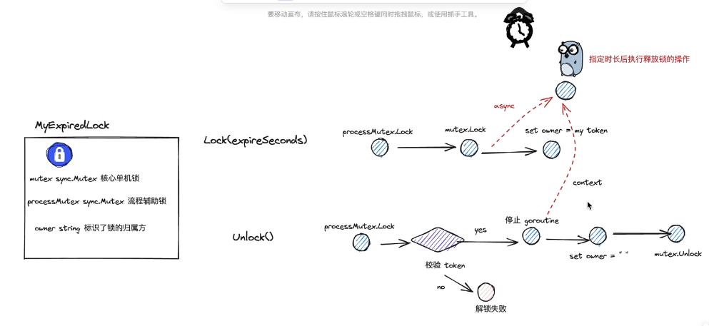

# golang context 并发编程实战考题——实现带有过期功能的单机锁

https://www.bilibili.com/video/BV1U14y167JP

redis => 分布式锁

避免死锁 => 有过期时间expire => setNEX

golang实现一款带有过期自动释放的单机锁
过期自动释放、解锁是进行身份合法性校验
context+goroutine并发编程实现

---

方案1：懒释放
方案2：异步释放版本

