# 浅谈 DDD 领域驱动设计架构

## 1 背景介绍

1. 严谨定义：
   DDD（全称 Domain-Driven Design）领域驱动设计，是一种项目设计方法论，通过关注业务领域（Domain）、拆分领域上下文（Bounded Context）、搭建领域模型（Domain Model），提高业务和开发之间的共识度与协作效率，保证项目准确反映出业务需求和规则.
   DDD 给出的是一套指导思想，一套方法框架.
   从项目常用到的经典三层结构（controller-service-dao）出发，介绍其演进至 DDD 四层结构的过程，进一步凸显出 DDD 的核心特征.

| 层级名称       | 职责定位                                                                        | 经典三层结构 | DDD 四层结构 |
| -------------- | ------------------------------------------------------------------------------- | ------------ | ------------ |
| presentation   | 渲染展示层，负责接口请求参数的接收与响应参数的组装（controller）                | ✅           | ✅           |
| application    | 业务应用层，负责对业务流程进行编排组织（service-1）                             | ✅           | ✅           |
| domain         | **业务领域层，内聚了某个特定业务领域的功能（service-2）**                       | -            | ✅           |
| infrastructure | 基础能力层，包含数据访问对象（dao）、第三方系统客户端（client）以及其他通用能力 | ✅           | ✅           |

• controller——presentation：渲染展示层
• service——application：业务应用层
• dao——infrastructure：基础能力层

2. 三层结构存在的问题
   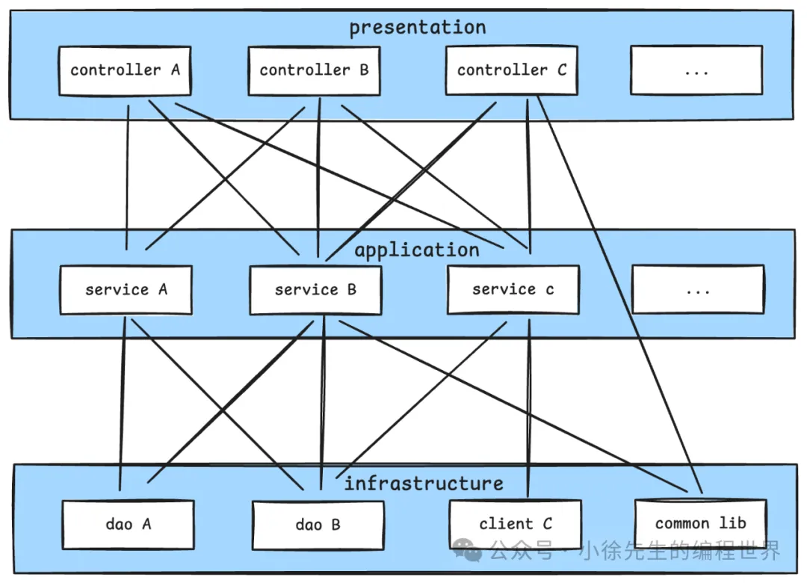
   核心问题就是技术建模和业务需求存在视角差异，导致项目模块边界不清晰、耦合度过高，随着项目的迭代演进，各层级与各模块之间可能存在交叉引用的情况。
   **如果需要按照业务功能进行拆分，将项目由单体服务转变为微服务，这一刀应该落在何处，是否有明确的切分轨迹，是否能够做到低成本实现？**

3. 从三层结构到 DDD
   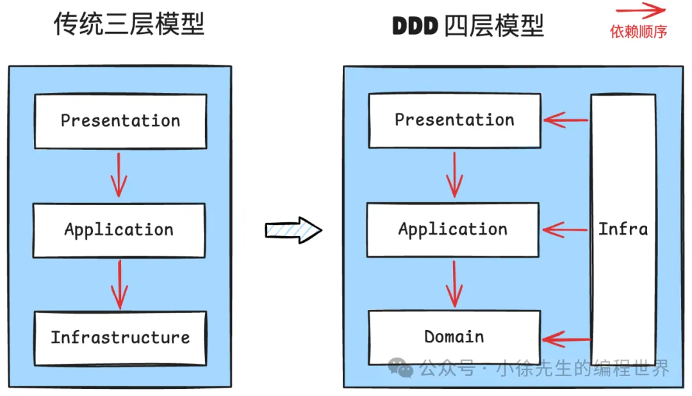
   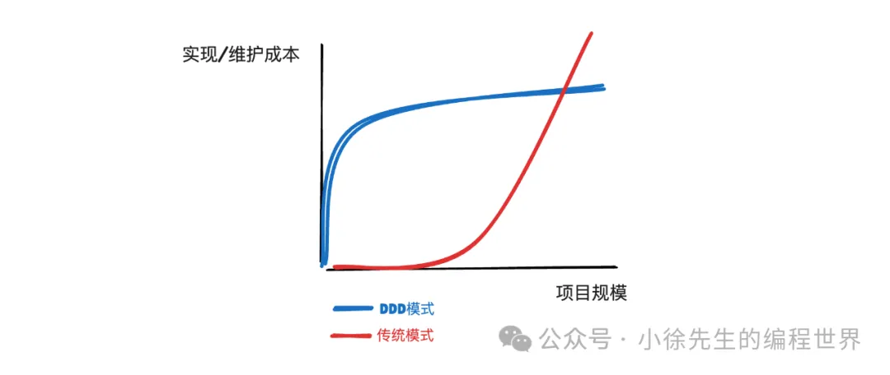
   核心差异：
   - 设计视角：架构设计环节中，需要从业务视角出发，根据业务功能归属，提前做好不同业务领域的拆分
   - 技术实现：加一层

## 2 架构拆解

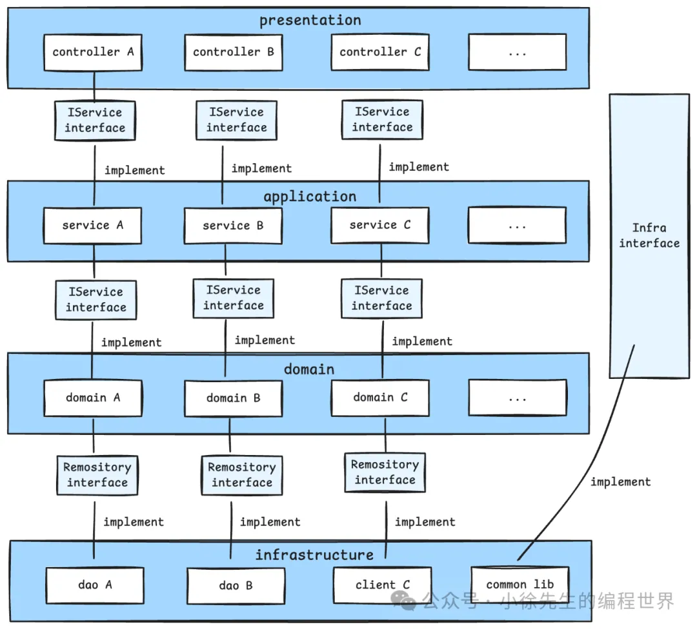
如上图，DDD 四层架构层级包含了：

• presentation 层：渲染展示层，定位是 bff（backend for frontend），负责感知处理`与前端对接`的协议细节
• application 层：业务应用层，调用 domain 层各业务子域实例，完成业务流程`编排`. 如果把 domain 层类比成一个积木市场的话，那么 application 层所做的事情就是“搭积木”——只需要按照预设图纸（业务需求）把积木拼接成对应的轮廓，而无需关心某个积木块内部的结构原理
• **domain 层：业务领域层，根据领域拆分出一系列业务子域实例（subdomain），在其中内聚该领域下的核心业务逻辑——作为一个又一个点状的积木组件，供 application 层使用**
• infrastructure：基础组件层，提供一系列`基础能力`，比如数据访问对象 dao（data access object），访问第三方系统的客户端 client，以及一系列通用能力

要点：
• domain 层 repository 定义：`domain 层定义了存储接口 repository（interface）`，定义好与业务数据底层存储交互的抽象接口，而具体实现则由 infrastructure 层中提供对应 dao 实例
• infrastructure 层依赖倒置原则：`infrastructrue 层逆向实现由上层定义的一系列通用能力的抽象接口`，以此保证其实现细节不会侵入到上层模块，能够实现低成本替换
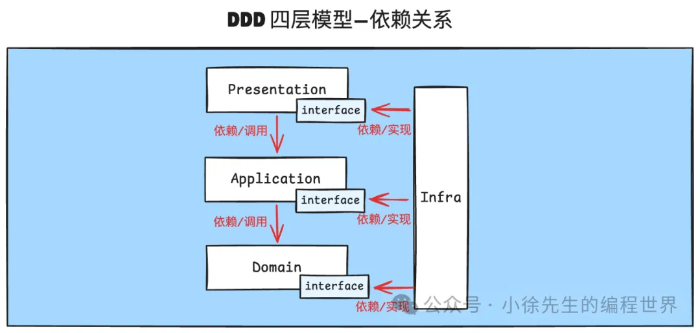

1. presentation
   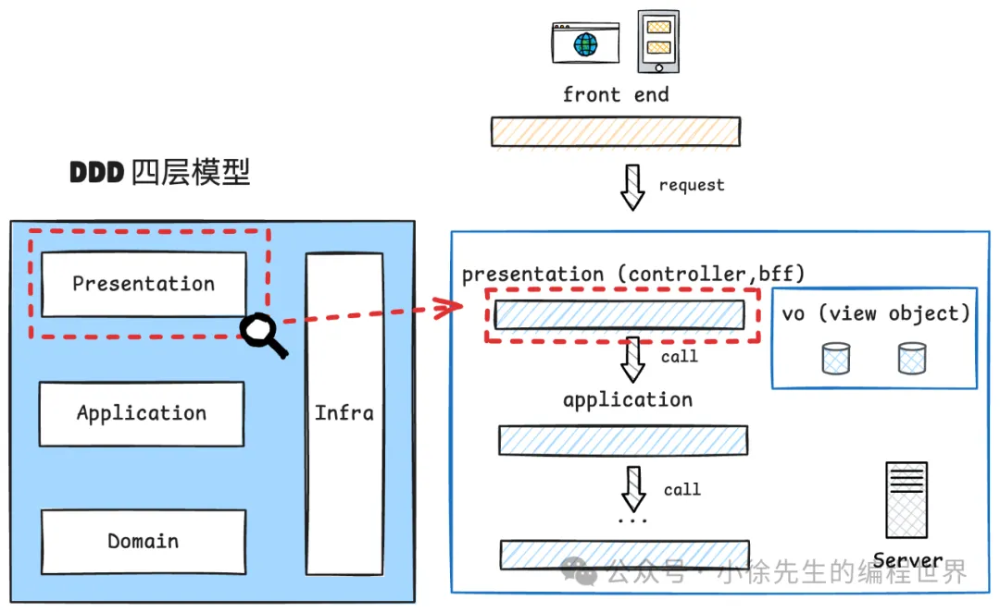
   presentation 层定位类似于传统三层结构中的 controller，其中需要：
   • 定义 **vo（view object）**，作为前后端交互的协议参数
   • 参数解析/转换/响应，解析和组装 api 请求与响应参数
   • 调用 application 层，执行业务流程`（需要将 view object 转换为 application 层使用的 dto）`

2. application
   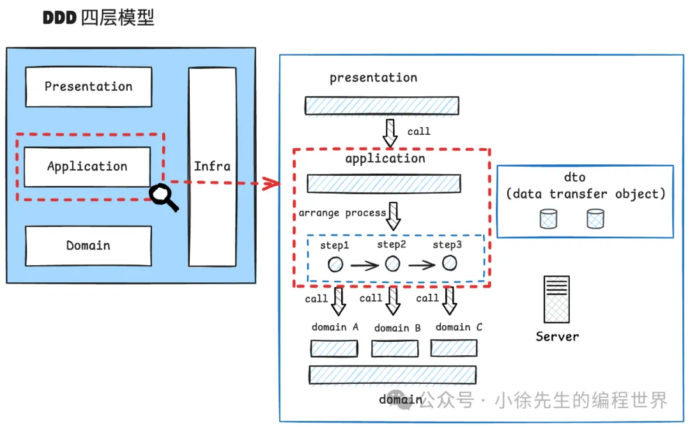
   `该层只负责流程编排，而不关心某个业务领域内的具体逻辑，比较薄`

   > 如果说执行一个业务流程类似于写一本书，那么 application 输出的内容就类似于一本书的目录，按照执行顺序把各章各节的标题以及对应页码罗列出来，至于某个具体章节的内容，`则需要根据页码跳转到对应位置（subdomain）来浏览更完整的上下文内容.`

   在 application 层中需要完成对数据转换对象 **dto（data transfer object）**的定义，dto 比较简单，用于在业务流程中传递，不包含具体业务逻辑.

3. domain
   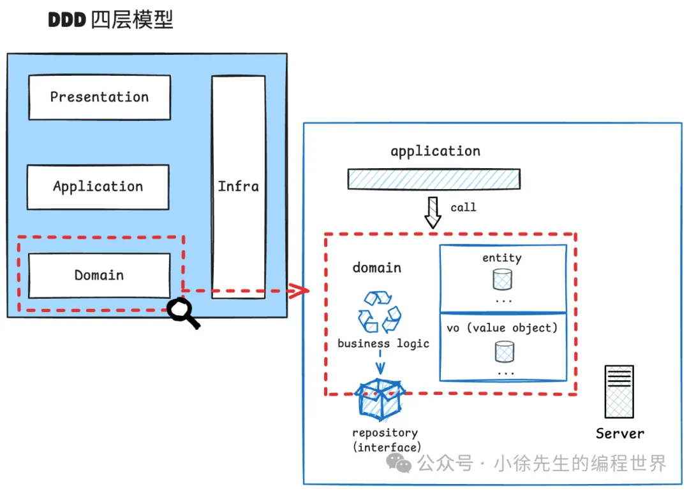

   domain 层是 DDD 架构的核心所在，在 DDD 模式落地实战过程中，决定成败的核心步骤就在于如何在 domain 层完成对业务领域的拆分，**保证拆分出来的每个业务子域（subdomain）能完全内聚该领域内的业务逻辑，尽可能降低子域之间存在的互相依赖程度.**
   在 domain 层中，`将各领域内的业务模型定义成 entity 和 vo（value object），并且基于面向对象的思想，将相关的业务逻辑封装到类的成员方法中，以形成所谓的“充血模型”.`

   > 贫血模型、充血模型：模型是否具有行为

   对于需要访问到的业务数据存储模型，子域中会定义出仓储接口 repository，并由 infrastructure 提供具体实现版本，这样能够对 domain 层屏蔽底层存储组件的具体实现细节，体现依赖倒置原则.
   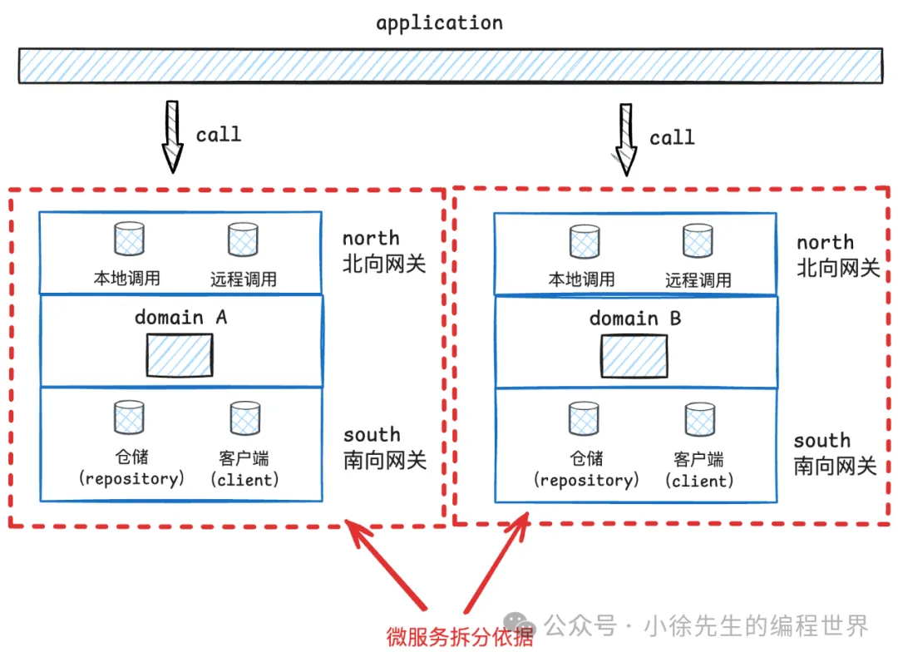

   `domain 层中针对各子域在实现上设置“北向网关”和“南向网关”，本质上是两个防腐层代码：北向实现接口，南向定义接口`

   随着项目的迭代演进，如何寻找将项目由单体服务拆分为微服务的拆分边界？
   在 DDD 模式下，如果对业务领域拆分得足够合理，那么我们可以`沿着每个业务子域（subdomain）南北向网关的边界`，将其拆分成一个个独立的微服务.

4. infrastructure
   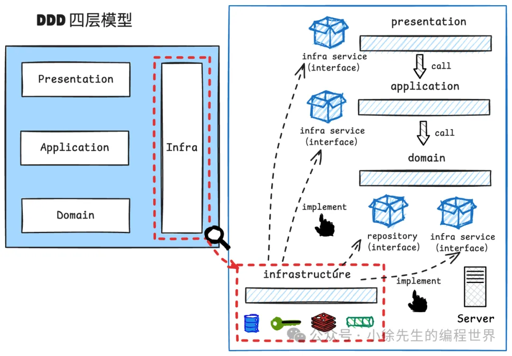
   infrastructure 层作为基础能力层，核心功能是为其他层提供通用技术支持，并且封装了与外部资源的交互实现细节。
   **上层模块不会感知到 infrastructure 层具体实现。**
   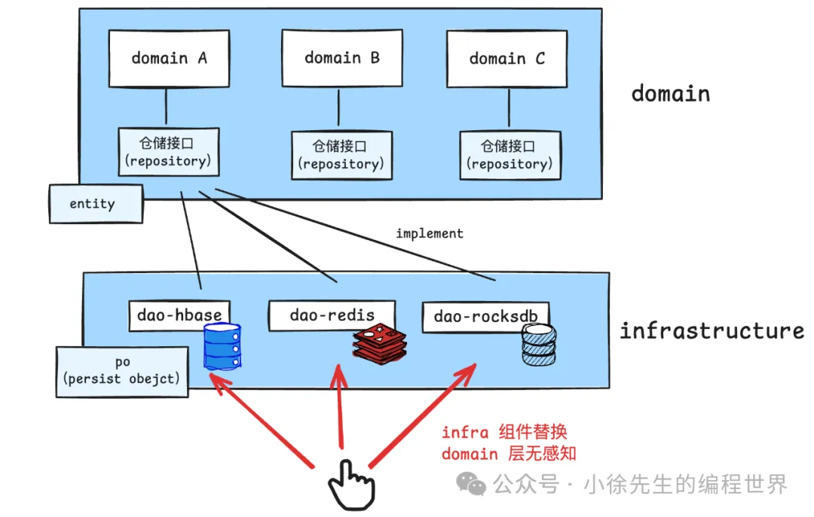

   `domain -> repository -> entity`
   `infrastructrue -> po(peristence object)`

## 3 概念拾遗

1. DDD 下各种模型
   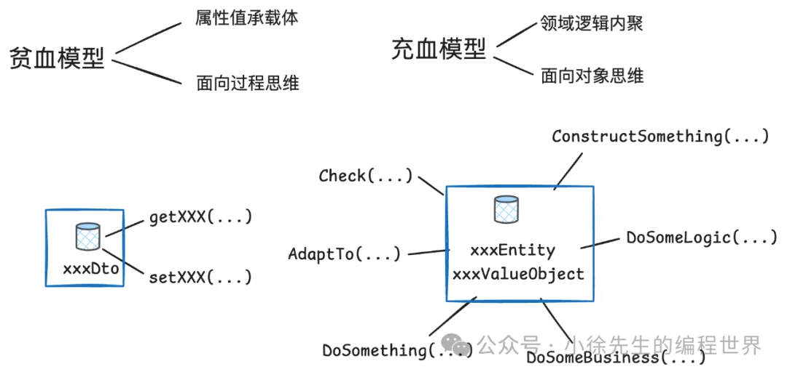
   • 贫血模型（Anemic Domain Model）：作为数据传输的载体，只包含简单的属性和基本的访问器方法（getter、setter 方法）而不包含业务逻辑，更偏向于面向过程的编程风格.
   • 充血模型（Rich Domain Model）：该类对象不仅包含数据属性，还封装了与自身相关的业务逻辑，更符合面向对象的设计原则，强调对象的行为和状态的统一

   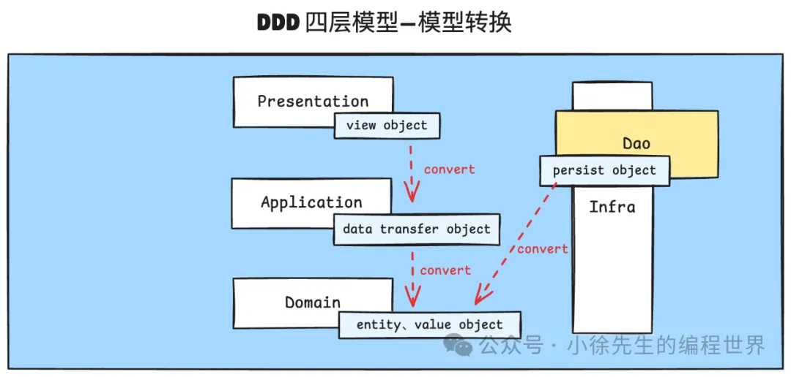

   - Vo（view object）视图对象：定义于 presentation 层的贫血模型，封装了展示层（前端）需要显示的数据
   - dto（data transfer object）数据传输对象：定义于 application 层的贫血模型，包含多个属性和相应 getter/setter 方法，用于在展示层与应用层传输数据
   - entity：定义于 domain 层的充血模型. 是具有唯一标识的业务对象，其身份在整个业务流转的生命周期内保持不变
   - vo（value object）：定义于 domain 层的充血模型. 是没有唯一标识的对象，其身份由其属性值而非唯一标识决定——有关 entity 与 value object 的差异，3.2 小节进一步展开
   - po（persistent object）：定义于 infrastructure 层的贫血模型，是反映底层存储结构的持久化对象

2. vo、entity 与 aggregate

   > Entity 与 VO 主要区别在于：

   - **Entity**：具有唯一标识符（ID），关注生命周期和身份，即使属性相同，不同实体也被视为不同，通常可变。
   - **Value Object (VO)**：以属性值来区分，相同值即为同一对象，通常为不可变，强调表达事物的属性。

   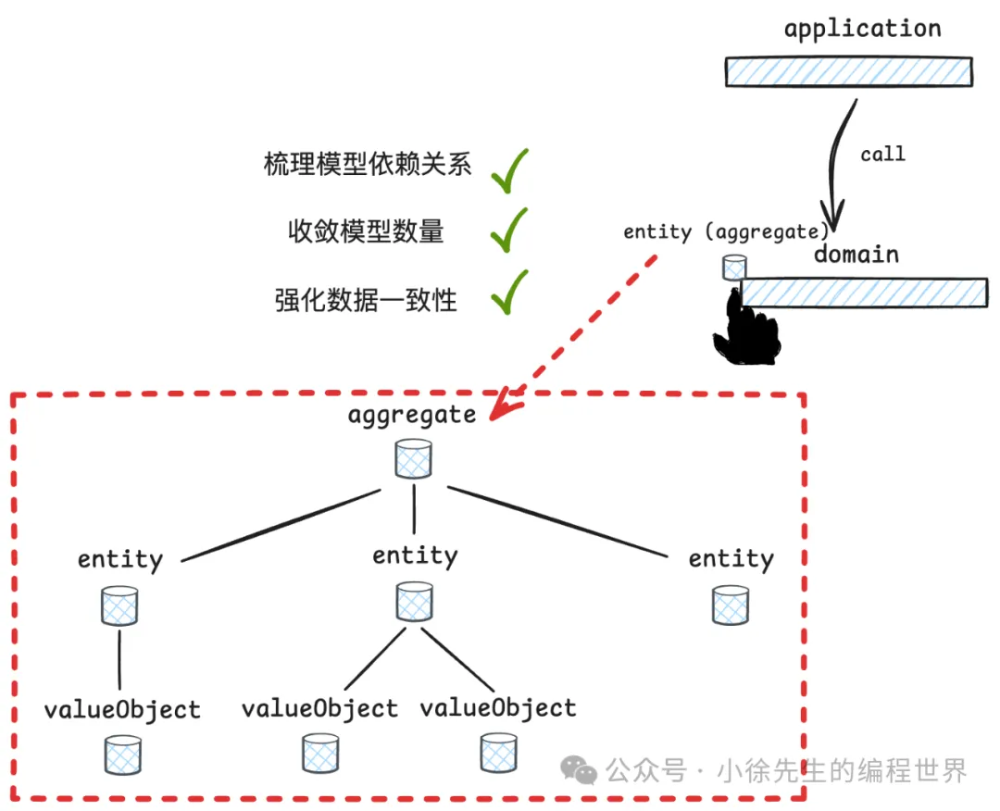
   `aggregate 用于将多个具有关联性的 entity 和 value object 组织在一起`，确保聚合内的对象在业务处理流程中保持数据的一致性

3. 限界上下文 bounded context
   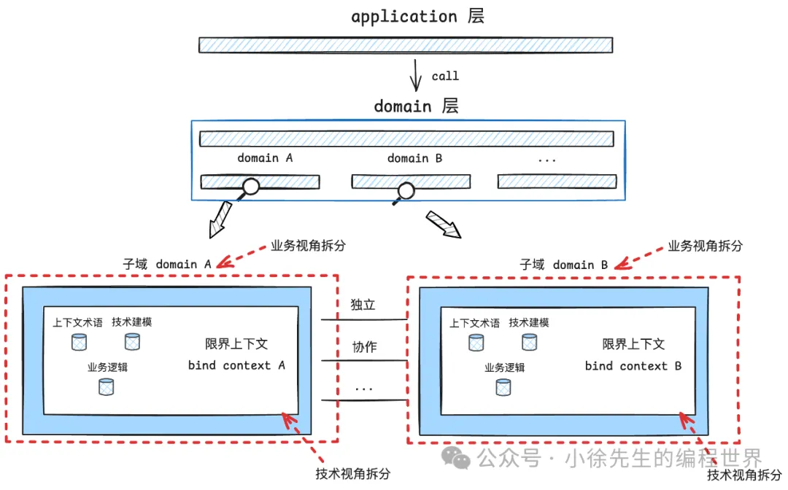
   限界上下文(bounded context)与业务子域(subdomain)是具有强关联性的两个概念.

   限界上下文就是把一个大而复杂的业务领域划分成多个小的、彼此独立的部分(子域)。每个部分都有自己明确的边界、语言和业务规则，就像不同的部门各自处理自己擅长的事情，内部沟通顺畅、外部交流时可以采用不同的表述方式，从而避免混乱和冲突。

## 4 小结

- 介绍了 DDD 四层结构：presentation-application-domain-infrastructure
- 强调在 domain 层完成对业务领域的拆分，在 application 层完成对宏观流程的编排
- 通过在 domain 层对充血模型 entity、value object 的定义，实现业务逻辑的高内聚
- 通过在 infrastructure 基于依赖倒置原则，降低底层能力实现细节对上层模块的侵扰度
