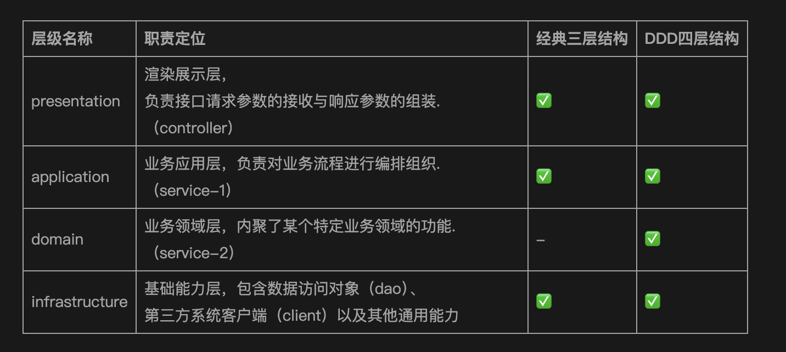

这是一篇关于 DDD 领域驱动设计非常出色的入门文章。文章结构清晰，由浅入深，通过对比经典三层架构引出 DDD 四层架构，并对每一层的职责、核心概念（如实体、值对象、聚合、限界上下文）进行了详细的阐述。文中的比喻（如“搭积木”、“书的目录”）非常贴切，有助于读者理解抽象的概念。

下面对文章内容进行更详细的分析，并提出一些可以深化探讨的方向。

### 核心优势分析

1.  **演进式讲解**：文章没有直接抛出 DDD 的复杂概念，而是从开发者熟悉的“三层架构”入手，分析其在复杂业务下的痛点（边界不清、耦合度高），然后自然地引出 DDD 作为解决方案，这种讲解方式非常符合认知规律，易于理解和接受。
2.  **职责划分清晰**：文章对 DDD 四层架构（展现层、应用层、领域层、基础设施层）的职责定位解释得非常清楚。特别是对`application`层和`domain`层的区分：
    - `application`层是“薄”的，负责流程`编排`（“搭积木”）。
    - `domain`层是“厚”的，内聚`核心业务逻辑`（“积木块”）。
      这是 DDD 区别于传统事务脚本模式的核心，文章准确地抓住了这一点。
3.  **强调依赖倒置**：文章明确指出了`infrastructure`层对`domain`层的依赖倒置原则（DIP），并解释了其价值——解耦上层业务逻辑与底层技术实现。这是实现 DDD 架构灵活性和可测试性的关键，也是很多初学者容易忽略的重点。
4.  **模型辨析透彻**：对贫血模型与充血模型的对比，以及对 VO、DTO、Entity、Value Object、PO 等不同对象的辨析非常到位。这解决了在实践中“我应该定义哪种对象，它应该放在哪一层”的常见困惑。
5.  **理论联系实践**：文章不仅停留在理论，还给出了实践层面的指导，例如：
    - 如何通过“南北向网关”在`domain`层建立防腐层。
    - DDD 如何为“单体拆分微服务”提供清晰的边界（沿着限界上下文）。
    - 各层之间推荐的`package`依赖关系。

### 可深化探讨的方向

在现有优秀内容的基础上，如果想让文章覆盖更广、深度更深，可以考虑补充以下几个 DDD 中的关键概念：

1.  **聚合根 (Aggregate Root)**
    文章提到了聚合（Aggregate），但可以进一步强调**聚合根**的角色。
    `聚合根是聚合的“管理者”`，是外部访问聚合内对象的唯一入口。任何对聚合内部状态的修改都必须通过聚合根来完成，由它来维护整个聚合的数据一致性。这能更好地解释为什么`application`层只与`aggregate`交互，而不是直接操作聚合内的某个`entity`。

2.  **领域服务 (Domain Service)**
    文章将业务逻辑主要归于`entity`和`value object`（充血模型）。但在实践中，有些业务逻辑不适合放在任何一个`entity`或`value object`中，因为它可能跨越了多个`entity`。这时就需要引入**领域服务**。

    - **与应用服务的区别**：应用服务（`application`层）负责编排流程、处理事务、安全认证等，而领域服务（`domain`层）封装的是纯粹的、无状态的核心业务规则。

3.  **领域事件 (Domain Event)**
    领域事件是 DDD 中实现限界上下文之间解耦的利器。当一个聚合（Aggregate）内部发生重要状态变更时（如“订单已支付”），可以发布一个领域事件。其他关心这个事件的限界上下文（如物流上下文、积分上下文）可以订阅并处理它。

    - **优势**：通过异步的事件机制，可以极大地降低不同业务模块间的耦合度，避免一个业务流程中同步调用过多的服务。

4.  **工厂 (Factory)**
    创建复杂`entity`或`aggregate`的过程本身可能就包含复杂的业务规则。直接使用`new`关键字可能会导致业务逻辑泄露。**工厂**的作用就是封装创建对象的复杂逻辑，确保创建出的对象是合法的、满足所有业务不变量的。
