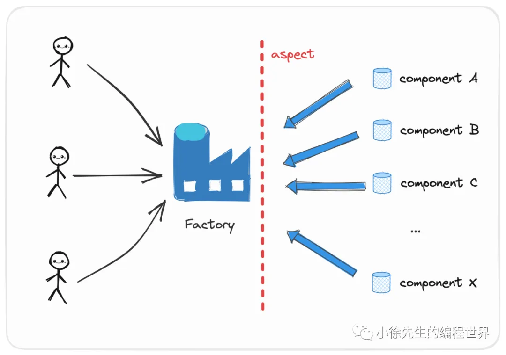
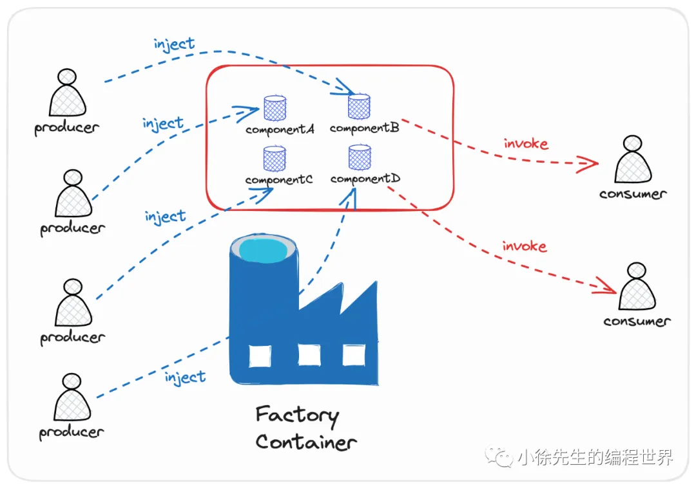

## 背景

Go 语言中没有针对类的构造器方法定义统一的规范，倘若每次需要创建类的实例时，都需要在业务方法中事无俱细地执行实例初始化的细节，那么会存在缺陷的包括：

- 业务方法和组件类之间产生过高的耦合度，需要了解到组件类的过多细节
- 倘若组件类的定义发生变更，那么散落在各处业务方法中对类的构造流程都需要配合改动

那么如何解决上述问题呢？
在编程世界中，`相当的一部分问题都可以通过增加一个中间层加以解决`. 我们在此处遵循工厂模式的设计思路，在业务方法和类之间添加一个防腐中间层——工厂类。

好处是：

- 实现类和业务方法之间的`解耦`，如果类的构造过程发生变更，可以统一收口在工厂类中进行处理，从而对业务方法屏蔽相关细节
- 倘若有多个类都聚拢在工厂类中进行构造，这样各个类的构造流程中就天然形成了一个`公共的切面`，可以进行一些公共逻辑的执行

## 简单工厂模式

- 改进
  对于拟构造的组件，需要依据其共性，抽离出一个公共 interface
  每个具体的组件类型对 interface 加以实现
  定义一个具体的工厂类，在构造器方法接受具体的组件类型，完成对应类型组件的构造
- 局限性——不利于实现类的扩展
  每当有新的水果实现类需要支持时，`需要在 FruitFactory 生产水果的 CreateFruit 方法中进行修改`，在 switch case 中增加新的分支，这样做是不符合代码设计规范中的开闭原则的（开闭原则：面向扩展开放，面向修改关闭）

## 工厂方法模式

- 改进：将工厂类 FruitFactory 由具体的实现类改为抽象的 interface
- 局限性
  需要为每个水果单独实现一个工厂类,代码冗余度较高
  原本构造多个水果类时存在的公共切面不复存在，一些通用的逻辑需要在每个水果工厂实现类中重复声明一遍

## 抽象工厂模式

好复杂

## 容器工厂模式 (Factory Container)

实现这种容器工厂模式，需要依赖到第三方依赖注入框架的能力.
这边笔者使用到的是 golang 开源 ioc 框架 dig：https://github.com/uber-go/dig.
