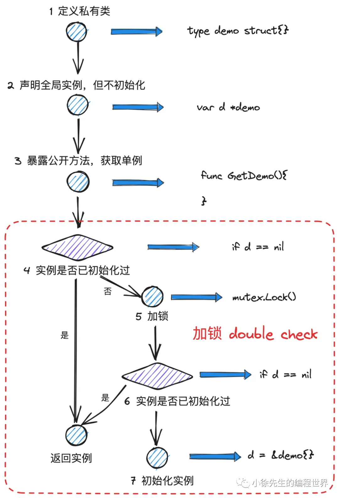
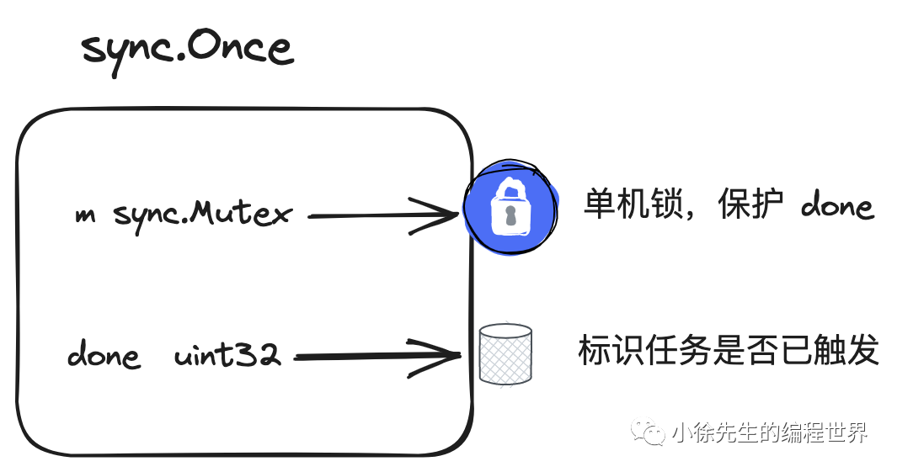

## 背景

单例模式的适用场景包括：

• 一些只允许存在一个实例的类，比如全局统一的监控统计模块

• 一些实例化时很耗费资源的类，比如协程池、连接池、和第三方交互的客户端等

• 一些入参繁杂的系统模块组件，比如 controller、service、dao 等

## 饿汉式单例模式

https://stackoverflow.com/questions/21470398/return-an-unexported-type-from-a-function
在不可导出单例类 singleton 的基础上包括一层接口 interface，将其作为对对导出方法 GetInstance 的返回参数类型

```go
type Instance interface {
    Work()
}

func GetInstance() Instance {
    return s
}
```

## 懒汉式单例模式

改进流程：
并发问题 -> 加锁 -> 避免不必要的加锁，double check -> sync.Once



---

注意这种写法有问题，会初始化多次：

```go
func GetInstance() Instance {
	if s != nil {
		return s
	}
	mux.Lock()
	defer mux.Unlock()
	s = newSingleton()
	return s
}
```

`需要double check`：

```go
func GetInstance() Instance {
	if s != nil {
		return s
	}
	mux.Lock()
	defer mux.Unlock()
	if s != nil {  // double check
		return s
	}
	s = newSingleton()
	return s
}
```

饿汉式的缺点是，无法提前暴露问题。

## sync.Once 单例模式


