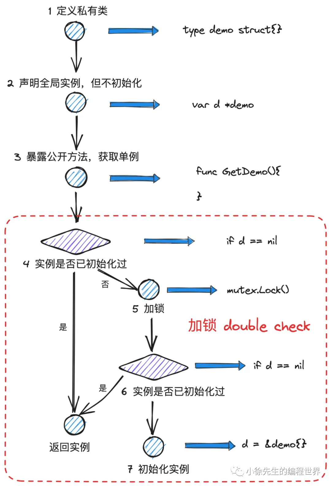
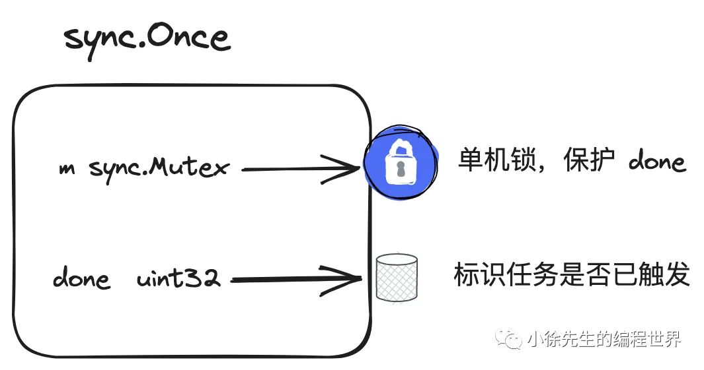
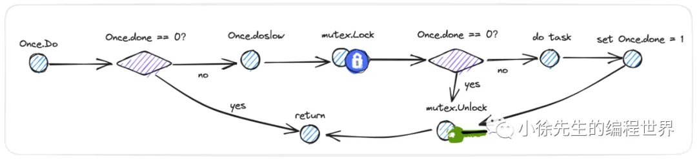

## 背景

单例模式的适用场景包括：

• 一些只允许存在一个实例的类，比如全局统一的监控统计模块

• 一些实例化时很耗费资源的类，比如协程池、连接池、和第三方交互的客户端等

• 一些入参繁杂的系统模块组件，比如 controller、service、dao 等

## 饿汉式单例模式

https://stackoverflow.com/questions/21470398/return-an-unexported-type-from-a-function
在不可导出单例类 singleton 的基础上包括一层接口 interface，将其作为对对导出方法 GetInstance 的返回参数类型

```go
type Instance interface {
    Work()
}

func GetInstance() Instance {
    return s
}
```

## 懒汉式单例模式

改进流程：
并发问题 -> 加锁 -> 避免不必要的加锁，double check -> sync.Once



---

注意这种写法有问题，会初始化多次：

```go
func GetInstance() Instance {
	if s != nil {
		return s
	}
	mux.Lock()
	defer mux.Unlock()
	s = newSingleton()
	return s
}
```

`需要double check`：

```go
func GetInstance() Instance {
	if s != nil {
		return s
	}
	mux.Lock()
	defer mux.Unlock()
	if s != nil {  // double check
		return s
	}
	s = newSingleton()
	return s
}
```

## sync.Once 单例模式



sync.Once 本质上也是通过加锁 double check 机制，实现了任务的全局单次执行

这段代码是 Go 语言标准库中`sync.Once`的实现，用于确保某个函数在多线程环境下仅执行一次。其核心机制结合了**原子操作**和**互斥锁**，通过双重检查锁定模式（Double-Checked Locking）实现高效且线程安全的单次执行。以下是关键分析：

---

### 一、结构体设计

```go
type Once struct {
    done uint32  // 标记位（是否已执行）
    m    Mutex   // 互斥锁
}
```

- **`done`字段**：
  - 类型为`uint32`，位于结构体首位。
  - **作用**：原子标记函数是否已执行（1 表示已执行）。
  - **优化意义**：作为热路径（hot path）字段，高频访问时内存对齐更友好，某些架构下能生成更紧凑的指令（如 x86 的`MOV`指令直接操作内存地址），减少指令数。
- **`m`字段**：
  - 标准互斥锁，用于保护临界区。
  - **作用**：确保只有一个 goroutine 执行函数，并建立内存同步屏障。

---

### 二、Do 方法实现

```go
func (o *Once) Do(f func()) {
    if atomic.LoadUint32(&o.done) == 0 {
        o.doSlow(f)
    }
}

func (o *Once) doSlow(f func()) {
    o.m.Lock()
    defer o.m.Unlock()
    if o.done == 0 {
        defer atomic.StoreUint32(&o.done, 1)
        f()
    }
}
```

#### 1. **快速路径（Fast Path）**

- **原子读取`done`**：  
  使用`atomic.LoadUint32`无锁检查`done`是否为 0，避免锁竞争带来的性能损耗。
- **意义**：  
  在无竞争或函数已执行的情况下，直接返回，性能接近 O(1)。

#### 2. **慢速路径（Slow Path）**

- **加锁与二次检查**：  
  通过`Mutex`确保只有一个 goroutine 进入临界区，二次检查`done`防止重复执行。
- **原子写入`done`**：  
  在`defer`中通过`atomic.StoreUint32`原子更新`done`为 1，确保即使`f()`发生 panic，标记位仍会被更新。
- **内存同步**：  
  互斥锁的`Unlock`操作与后续`Lock`操作形成同步屏障，保证`f()`的执行结果对其他 goroutine 可见。

---

### 三、关键特性

#### 1. **线程安全**

- **原子操作**：`done`的读写通过原子操作保证可见性。
- **互斥锁**：确保临界区串行化，防止多个 goroutine 同时执行`f()`。

#### 2. **Panic 处理**

若`f()`发生 panic：

- `defer atomic.StoreUint32(&o.done, 1)`仍会执行，标记为已执行。
- 后续调用直接返回，不再执行`f()`。

#### 3. **不可复制性**

- **`Once`实例禁止复制**：  
  因内部包含`Mutex`（不可复制），复制后可能导致状态不一致。
- 若复制已使用的`Once`，可能引发竞态条件。

---

### 四、错误实现对比

注释中提到的错误实现：

```go
if atomic.CompareAndSwapUint32(&o.done, 0, 1) {
    f()
}
```

- **问题**：  
  仅通过 CAS（Compare-and-Swap）标记`done`，无法保证其他 goroutine 等待`f()`执行完成。
- **后果**：  
  若两个 goroutine 同时调用`Do()`，一个执行`f()`，另一个立即返回，可能导致后者在`f()`未完成时访问未初始化的资源。

---

### 五、性能优化

- **热路径优化**：  
  `done`作为第一个字段，减少 CPU 指令数（某些架构下访问结构体首字段的指令更短）。
- **双重检查锁定**：  
  减少锁竞争，无竞争时性能接近无锁。

---

### 六、内存模型保证

- **Happens-Before 规则**：  
  `f()`的返回“同步于”所有`once.Do(f)`的返回，通过互斥锁的`Lock/Unlock`操作建立内存屏障，确保`f()`的内存修改对其他 goroutine 可见。

---

### 总结

`sync.Once`通过**原子操作+互斥锁+双重检查**实现高效的单次执行：

1. **原子操作**：无锁检查标记位，优化高频访问。
2. **互斥锁**：确保临界区互斥，建立内存同步。
3. **双重检查**：减少锁竞争，提升性能。

该设计平衡了性能与正确性，是并发编程中双重检查锁定模式的经典应用。

---

为什么需要用原子操作 done 变量？
在 Go 语言的`sync.Once`实现中，**必须使用原子操作（`atomic.LoadUint32`）读取`done`字段**，原因如下：

---

### 一、内存可见性（Memory Visibility）

#### 1. **缓存一致性**：

- **问题**：  
  在并发场景下，不同 CPU 核心的缓存可能持有`done`的不同副本。若直接读取`done`（非原子操作），可能读到过期的旧值。
- **示例**：
  - Goroutine A 执行`Do()`，将`done`从 0 改为 1（通过原子操作），但其他核心的缓存未同步。
  - Goroutine B 读取`done`时，可能仍看到 0，导致错误地尝试执行`f()`。

#### 2. **原子操作的保证**：

- `atomic.LoadUint32`强制从主内存读取最新值，绕过 CPU 缓存，确保所有 goroutine 看到的`done`值一致。
- 普通读取（非原子）可能从寄存器或缓存中读取旧值。

---

### 二、指令重排（Instruction Reordering）

#### 1. **编译器/CPU 优化**：

- 编译器和 CPU 可能对代码进行指令重排以提高性能。例如：
  ```go
  if o.done == 0 {  // 普通读取
      o.doSlow(f)
  }
  ```
  可能被重排为：
  ```go
  tmp := o.done
  if tmp == 0 {
      o.doSlow(f)
  }
  ```
  若`o.done`在后续被修改，`tmp`可能保存旧值。

#### 2. **原子操作的内存屏障**：

- `atomic.LoadUint32`插入**内存屏障**（Memory Barrier），禁止编译器和 CPU 将原子操作前后的指令重排。
- 确保`done`的读取操作不会被重排到其他内存操作之后。

---

### 三、正确性验证（正确 vs 错误实现）

#### 1. **错误实现（非原子读取）**：

```go
func (o *Once) Do(f func()) {
    if o.done == 0 {  // 非原子读取
        o.doSlow(f)
    }
}
```

- **风险**：
  - 多个 goroutine 可能同时看到`done == 0`，进入`doSlow`。
  - 虽然互斥锁会阻止并发执行`f()`，但会导致大量锁竞争，降低性能。

#### 2. **正确实现（原子读取）**：

```go
func (o *Once) Do(f func()) {
    if atomic.LoadUint32(&o.done) == 0 {  // 原子读取
        o.doSlow(f)
    }
}
```

- **优势**：
  - 快速路径（Fast Path）无锁，性能高。
  - 原子操作确保只有一个 goroutine 进入慢速路径（Slow Path）。

---

### 四、性能优化

#### 1. **减少锁竞争**：

- 原子操作允许快速路径（`done == 1`）直接返回，无需锁操作。
- 若使用非原子读取，大量 goroutine 可能同时进入`doSlow`，导致锁竞争。

#### 2. **代码内联优化**：

- `atomic.LoadUint32`是简单的内存操作，可被编译器内联。
- 非原子读取可能涉及复杂的内存访问逻辑，影响内联优化。

---

### 五、架构兼容性

#### 1. **跨平台一致性**：

- 在 x86 架构中，普通 32 位整数读取可能是原子的，但 ARM 等架构需要显式原子指令。
- `atomic.LoadUint32`封装了平台相关的原子操作，确保代码在所有架构上一致。

---

### 六、实验验证

#### 1. **并发测试**：

```go
var once sync.Once
var count int

func main() {
    for i := 0; i < 1000; i++ {
        go once.Do(func() { count++ })
    }
    time.Sleep(time.Second)
    fmt.Println(count)  // 输出1（正确实现）或>1（错误实现）
}
```

- **错误实现**：非原子读取可能导致`count > 1`。
- **正确实现**：保证`count == 1`。

---

### 总结

| **操作类型**     | **原子操作（`atomic.LoadUint32`）** | **非原子操作（直接读取）**       |
| ---------------- | ----------------------------------- | -------------------------------- |
| **内存可见性**   | 强制从主内存读取最新值              | 可能读取到过期的缓存值           |
| **指令重排**     | 禁止重排，确保顺序                  | 可能被编译器或 CPU 重排          |
| **性能**         | 快速路径无锁，性能高                | 可能引发锁竞争，性能下降         |
| **跨平台兼容性** | 所有架构一致                        | x86 可能正常，ARM 等架构可能出错 |
| **正确性**       | 保证单次执行                        | 可能重复执行或锁竞争             |

**必须使用原子操作读取`done`**，以确保并发安全、内存可见性和跨平台正确性。
