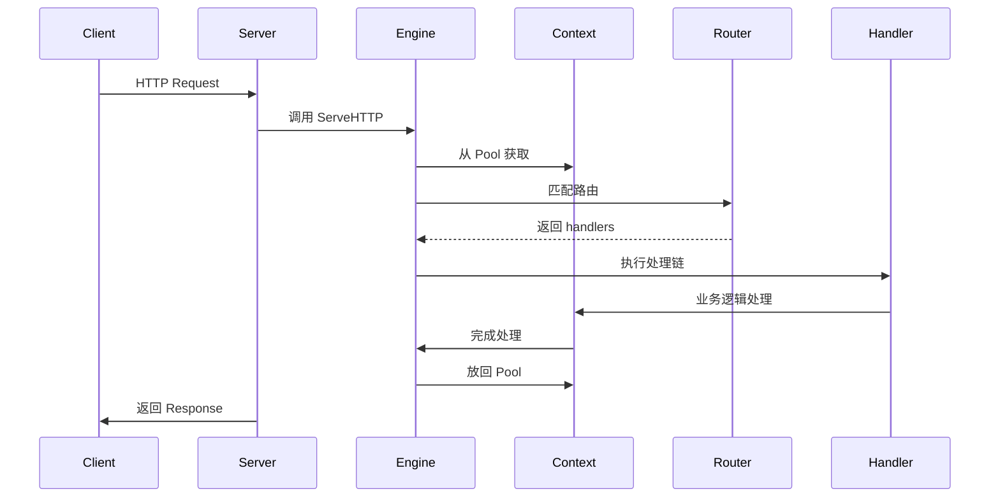

嗯，用户让我解析Gin框架的底层原理，看来他对Gin有一定的使用经验，但想更深入理解其内部机制。首先，我需要回忆一下Gin的基本结构和工作流程。Gin是基于Go的net/http包封装的，所以必须从net/http的Handler接口说起。用户提供的文章已经覆盖了Engine、RouterGroup、路由树、Context等核心部分，我需要确保自己理解这些组件之间的关系。

用户可能想知道Gin如何处理路由注册和匹配，特别是压缩前缀树（radix tree）的实现。这部分需要详细解释路由树的结构，比如节点如何分裂和合并，以及如何处理不同的HTTP方法。另外，中间件链（HandlersChain）的执行顺序和Context的管理也是重点，尤其是Context的复用机制，使用sync.Pool来减少GC压力。

用户可能还关心Gin的性能优势，比如为什么选择radix tree而不是简单的map，这里需要提到路径匹配的模糊性（如尾斜线和通配符）以及公共前缀的优势。同时，中间件的执行流程，如何通过index控制处理链的顺序，以及Abort方法如何中断链式调用，都是关键点。

需要检查是否有遗漏的部分，比如错误处理、参数解析、中间件的具体使用案例等，但用户提供的文章已经覆盖了主要部分。可能还需要补充一些代码示例，比如路由注册的具体过程或中间件的实现，但用户给出的示例已经足够。最后，确保总结部分涵盖了所有核心点，帮助用户形成完整的知识框架。

---

Gin 框架作为 Go 语言中最流行的 Web 框架之一，其底层实现原理可以概括为以下几个关键点：

### 一、架构基础

1. **基于 net/http 封装**

- 通过实现 `http.Handler` 接口，将 `gin.Engine` 作为核心处理器
- 兼容 Go 标准库的 `http.Server` 和 `http.Handler` 体系

2. **中间件机制**

- 采用 HandlersChain 结构（`[]HandlerFunc`）管理处理链
- 支持中间件嵌套和路由组共享中间件
- 通过 `c.Next()` 控制处理流程，支持前处理和后处理逻辑

### 二、核心数据结构

1. **Engine**

- 路由组容器（RouterGroup）
- 路由树集合（9 棵方法路由树）
- 上下文对象池（sync.Pool）
- 配置项（如 HTML 模板、中间件等）

2. **路由树实现**

- 基于 **压缩前缀树（Radix Tree）** 实现高效路由匹配
- 9 棵独立路由树对应 HTTP 方法（GET/POST 等）
- 节点设计：
  ```go
  type node struct {
      path      string       // 节点路径
      indices   string       // 子节点首字母索引
      children  []*node      // 子节点列表
      handlers  HandlersChain // 处理链
      priority  uint32       // 路由优先级
  }
  ```

### 三、路由注册原理

1. **路径处理**

- 路由组路径拼接（`joinPaths`）
- 中间件继承（`combineHandlers`）

2. **树形结构构建**

- 最长公共前缀匹配（LCP）
- 节点分裂与合并策略
- 子节点优先级排序（高频路由优先）

3. \*\*路由注册示例流程：

```go
// 1. 创建路由组
router.Group("/api/v1")

// 2. 拼接完整路径
absolutePath = "/api/v1/users"

// 3. 合并处理链
handlers = combine(groupHandlers, routeHandlers)

// 4. 插入路由树
tree.addRoute("GET", absolutePath, handlers)
```

### 四、请求处理流程

1. **上下文管理**

- 使用 sync.Pool 实现 Context 对象池
- 处理流程：
  ```go
  c := engine.pool.Get().(*Context)  // 获取上下文
  defer engine.pool.Put(c)          // 放回对象池
  c.Reset()                         // 重置状态
  ```

2. **处理链执行**

- 基于索引的链式调用（`c.index`）
- 支持熔断机制（`c.Abort()`）

```go
func (c *Context) Next() {
    c.index++
    for c.index < int8(len(c.handlers)) {
        c.handlers[c.index](c)
        c.index++
    }
}
```

### 五、性能优化策略

1. **路由匹配优化**

- 快速失败机制（优先匹配高频路由）
- 尾斜线自动重定向处理
- 路径参数缓存（Params pool）

2. **内存管理**

- 上下文对象池减少 GC 压力
- 路由树节点复用
- 零内存拷贝的路径处理

3. **并发安全**

- 路由树只读特性（注册完成后不变）
- 上下文独立存储（per-request context）

### 六、核心优势解析

1. **高效路由**

- 压缩前缀树时间复杂度：O(k)（k为路径长度）
- 对比标准库的 map 实现：
  | 特性 | Map 路由 | Radix Tree |
  |------------|---------------|----------------|
  | 静态路由 | O(1) | O(k) |
  | 动态路由 | 不支持 | 原生支持 |
  | 内存占用 | 高 | 低（公共前缀复用）|

2. **中间件生态**

- 支持洋葱模型中间件
- 灵活的错误处理机制
- 可扩展的上下文存储

### 七、典型处理流程



### 八、设计启示

1. **层次化设计**

- 基础层：兼容 net/http
- 核心层：路由管理 + 上下文
- 扩展层：中间件生态

2. **性能取舍**

- 内存 vs 速度：选择压缩前缀树
- 灵活性 vs 性能：中间件链式调用

3. **并发模型**

- 无锁路由读取
- 请求级上下文隔离

通过这种设计，Gin 在保持 Go 语言简洁哲学的同时，提供了高性能的 Web 服务开发体验。其核心思想是通过合理的数据结构选择和内存管理策略，在保证功能完整性的基础上实现极致性能。
