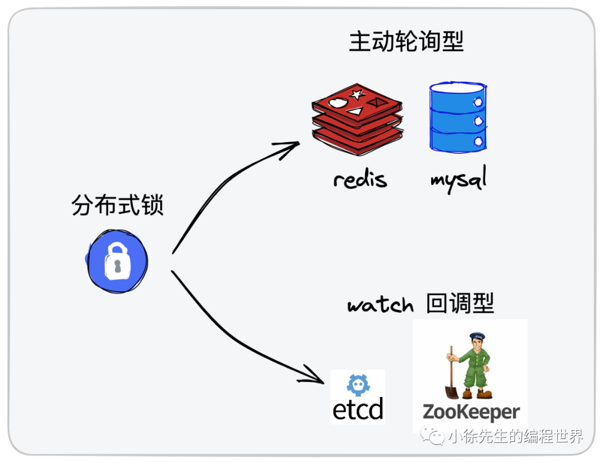
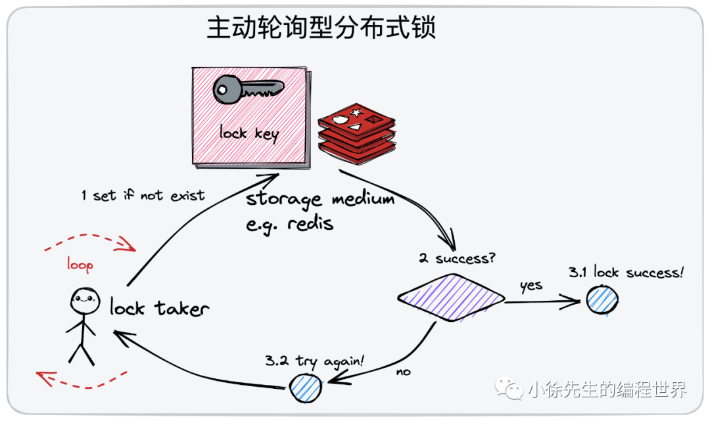

# Golang 分布式锁技术攻略

https://mp.weixin.qq.com/s/KYiZvFRX0CddJVCwyfkLfQ

## 0. 前言

- etcd 的 watch 机制，这是一项可以应用于实现分布式锁的核心能力
- 单机锁的升级版本——Golang 分布式锁技术
  1. 通过 redis 实现`主动轮询模型下的分布式锁`
  2. 使用 etcd 实现 watch `回调模型下的分布式锁`

## 1. 分布式锁

1. 使用背景
   - 在并发场景中，为了保证临界资源的数据一致性，我们会经常使用到“锁”这个工具对临界资源进行保护，`让混乱的并发访问行为退化为秩序的串行访问行为.`；
   - 在本地环境中，由于多线程之间能够`共享进程的数据`，因此可以比较简单地实现进程内的互斥锁；
   - 在分布式场景中，有时我们需要`跨多个物理节点执行加锁操作`，因此我们就需要依赖到类似于 redis、mysql 这样的`状态存储组件`，在此基础之上实现所谓的“分布式锁”技术.
2. 核心性质
   - 独占性(exclusive)
   - 健壮性(robust)
     不能产生死锁
   - 对称性(symmetric)
     加锁和解锁的使用方必须为同一身份. 不允许非法释放他人持有的分布式锁
   - 高可用(availability)
     应对故障能力强
3. 实现类型
   

   - 主动轮询型(redis、mysql)
     该模型类似于单机锁中的主动轮询 + cas 乐观锁模型，取锁方会持续对分布式锁发出尝试获取动作;
     如果锁已被占用则会不断发起重试，直到取锁成功为止.（自旋）
   - `watch 回调型(etcd、zookeeper)`
     在取锁方发现锁已被他人占用时，会创建 watcher 监视器订阅锁的释放事件，随后不再发起主动取锁的尝试；
     当锁被释放后，取锁方能通过之前创建的 watcher 感知到这一变化，然后再重新发起取锁的尝试动作 （挂起）

4. 理解
   - 分布式场景中”轮询“这一动作的成本相比于单机锁而言要高很多，背后存在的行为可能是一次甚至多次网络 IO 请求；
   - watch 机制在实现过程中需要建立长连接完成 watch 监听动作，也会存在一定的资源损耗，有多个尝试取锁的使用方 watch 监听同一把锁时，一次锁的释放事件可能会引发“惊群效应”
   - **在并发激烈程度较高时倾向于 watch 回调型分布式锁；反之，主动轮询型分布式锁可能会是更好的选择.**

## 2. 主动轮询型

## 3. watch 回调型
