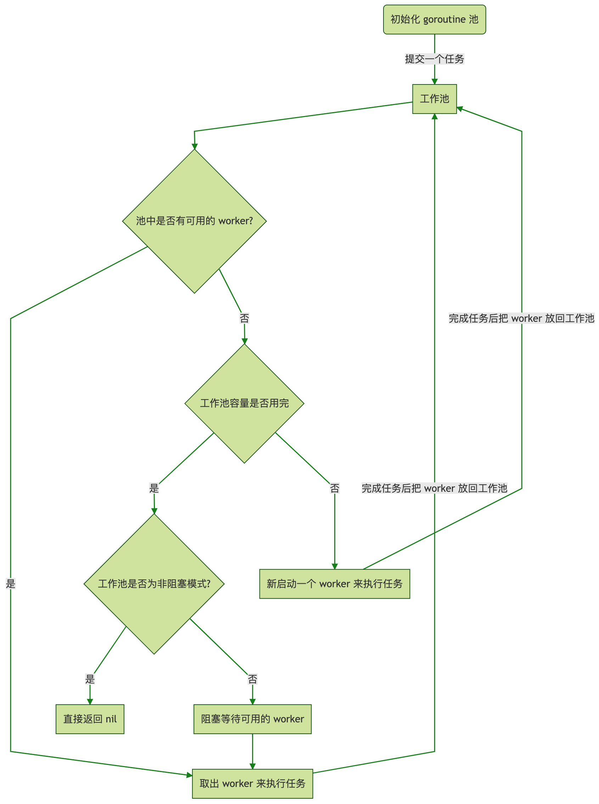

# Golang 协程池 Ants 实现原理

https://www.bilibili.com/video/BV1wk4y1h7k7
https://mp.weixin.qq.com/s/Uctu_uKHk5oY0EtSZGUvsA

## 1. 前置知识点

1. sync.Locker
   在 ants 中，作者不希望使用 Mutex 这种重锁，而是自定义实现了一种轻量级的自旋锁 `spinLock`。
   

   加锁通过 for 循环 + cas 操作实现自旋，无需操作系统介入执行 park 操作；
   通过变量 backoff 反映抢锁激烈度，每次抢锁失败，执行 backoff 次让 cpu 时间片动作；
   backoff 随失败次数逐渐升级，封顶 16.

   ```go
   type spinLock uint32
   const maxBackoff = 16  // 最大退避次数

   func (sl *spinLock) Lock() {
       backoff := 1
       for !atomic.CompareAndSwapUint32((*uint32)(sl), 0, 1) {
           // 调用 runtime.Gosched() 主动让出 CPU，避免忙等待浪费资源
           for i := 0; i < backoff; i++ {
               runtime.Gosched()
           }
           if backoff < maxBackoff {
               backoff <<= 1
           }
       }
   }

   func (sl *spinLock) Unlock() {
       atomic.StoreUint32((*uint32)(sl), 0)
   }
   ```

2. sync.Cond
   

   ```go
   type Cond struct {
       noCopy noCopy

       // L is held while observing or changing the condition
       L Locker

       notify  notifyList
       checker copyChecker
   }
   ```

   • 成员变量 noCopy + checker 是一套组合拳，保证 Cond 在第一次使用后不允许被复制；

   • 核心变量 L，一把锁，用于实现阻塞操作；

   • 核心变量 notify，阻塞链表，分别存储了调用 Cond.Wait() 方法的次数、goroutine 被唤醒的次数、一把系统运行时的互斥锁以及链表的头尾节点.

   ```go
   type notifyList struct {
       wait   uint32
       notify uint32
       lock   uintptr // key field of the mutex
       head   unsafe.Pointer
       tail   unsafe.Pointer
   }
   ```

   - Cond.Wait
   - Cond.Signal
   - Cond.Broadcast

3. sync.Pool 回收站
   golang 标准库下`并发安全的对象池`；**不需要关心缓存回收(例如，过期时间等)**，回收由 GC 自动完成；适用于高频创建和销毁的场景；
   类似**windows回收站**

   - Get
     
   - Put
     
   - 回收机制
     存入 pool 的对象会不定期被 go 运行时回收，因此 pool 没有容量概念，即便大量存入元素，也不会发生内存泄露.
     具体回收时机是在 gc 时执行的：
     对象可能在 GC 时被回收，不适用于持久化资源（如数据库连接）。
     

     最多两轮 gc，pool 内的对象资源将会全被回收.

## 2. Ants

https://github.com/panjf2000/ants/blob/dev/README_ZH.md


1. 为什么用协程池？
   • `提升性能`：主要面向一类场景：大批量轻量级并发任务，任务执行成本与协程创建/销毁成本量级接近；
   • 有一个并发`资源控制`的概念：研发能够明确系统全局并发度以及各个模块的并发度上限；防止研发不加节制；
   • 协程`生命周期`控制：实时查看当前全局并发的协程数量；
   • 有一个`统一`的紧急入口释放全局协程.
2. 核心数据结构

- Pool
  

```go
type Pool struct {
    capacity int32  // 协程池容量
    running int32  // 当前运行的协程数量
    waiting int32  // 阻塞等待任务的协程数量
    state int32  // 协程池状态，0-打开；1-关闭

    locker sync.Locker  // 自制的自旋锁
    cond *sync.Cond  // 并发协调器，用于阻塞模式下，挂起和唤醒等待资源的协程
    workers workerArray  // goWorker 列表，即“真正意义上的协程池”
    workerCache sync.Pool  // 协程回收站(逻辑删除)

    heartBeatDone int32  // 标识回收协程是否关闭
    stopHeartBeat context.CancelFunc  // 用于关闭回收协程的控制器函数

    options *Options  // 配置项
}
```

- goWorker

一个长时间运行而不回收的协程(的封装)，用于反复处理用户提交的异步任务

```go
type goWorker struct {
    pool *Pool  // 所属的协程池
    task chan func()  // 用于接收异步任务包的管道(常驻工人)
    recycleTime time.Time  // 回收到协程池的时间
}
```

- options

```go
type Options struct {
    DisablePurge bool  // 是否允许回收空闲 goWorker
    ExpiryDuration time.Duration  // 空闲 goWorker 回收时间间隔；仅当 DisablePurge 为 false 时有效
    MaxBlockingTasks int  // 阻塞模式下，最多阻塞等待的协程数量
    Nonblocking bool  // 是否设置为非阻塞模式，若是，goWorker 不足时不等待，直接返回 err
    PanicHandler func(interface{})  // 提交任务发生 panic 时的处理逻辑
}
```

- workerArray 承载 goWorker
  workerArray 是一个 interface，其实现包含 stack 栈版本和 queue 队列包含；
  该 interface 主要定义了作为数据集合的几个通用 api，以及用于回收过期 goWorker 的 api.

  ```go
  type workerArray interface {
      len() int
      isEmpty() bool
      insert(worker *goWorker) error
      detach() *goWorker
      retrieveExpiry(duration time.Duration) []*goWorker  // 一次性回收过期 goWorker，查找可以根据过期时间二分
      reset()
  }
  ```

1. 核心 api

- pool 构造器方法

```go
func NewPool(size int, options ...Option) (*Pool, error) {
    opts := loadOptions(options...)
    // 读取用户配置，做一些前置校验，默认值赋值等前处理动作...

    p := &Pool{
        capacity: int32(size),
        lock:     internal.NewSpinLock(),
        options:  opts,
    }
    p.workerCache.New = func() interface{} {
        return &goWorker{
            pool: p,
            task: make(chan func(), workerChanCap),
        }
    }

    p.workers = newWorkerArray(stackType, 0)
    p.cond = sync.NewCond(p.lock)

    var ctx context.Context
    ctx, p.stopHeartbeat = context.WithCancel(context.Background())
    go p.purgePeriodically(ctx)  // 异步启动 goWorker 过期销毁协程
    return p, nil
}
```

- pool 提交任务
  • 从 Pool 中取出一个可用的 goWorker；
  • 将用户提交的任务包添加到 goWorker 的 channel 中

  ```go
    func (p *Pool) Submit(task func()) error {
        var w *goWorker
        if w = p.retrieveWorker(); w == nil {
            return ErrPoolOverload
        }
        w.task <- task
        return nil
    }

    func (p *Pool) retrieveWorker() (w *goWorker) {
      // 从对象池 workerCache 中获取 goWorker
      spawnWorker := func() {
          w = p.workerCache.Get().(*goWorker)
          w.run()
      }

      p.lock.Lock()

      w = p.workers.detach()
      if w != nil {
          p.lock.Unlock()
      } else if capacity := p.Cap(); capacity == -1 || capacity > p.Running() {
          p.lock.Unlock()
          spawnWorker()
      } else {
          // 池子容量超限
          if p.options.Nonblocking {
              p.lock.Unlock()
              return
          }
          // 池子容量超限，且池子为阻塞模式，则基于并发协调器 cond 挂起协程阻塞等待
      retry:
          if p.options.MaxBlockingTasks != 0 && p.Waiting() >= p.options.MaxBlockingTasks {
              p.lock.Unlock()
              return
          }
          // 用Cond阻塞等待
          p.addWaiting(1)
          p.cond.Wait() // block and wait for an available worker
          p.addWaiting(-1)

          var nw int
          if nw = p.Running(); nw == 0 { // awakened by the scavenger 这里是被gc唤醒的
              p.lock.Unlock()
              spawnWorker()
              return
          }
          if w = p.workers.detach(); w == nil {
              if nw < p.Cap() {
                  p.lock.Unlock()
                  spawnWorker()
                  return
              }
              goto retry
          }
          p.lock.Unlock()
      }
      return
  }
  ```

- goWorker 运行

  - 循环 + 阻塞等待，直到获取到用户提交的异步任务包 task 并执行;
  - 执行完成 task 后，会将自己`放回`给协程池;
  - 倘若放回协程池失败，或者用户提交了一个空的任务包，则该 goWorker 会被`销毁`，销毁方式是将自身放回协程池的对象池 workerCache. 并且会调用协调器 cond 唤醒一个阻塞等待的协程.

  ```go
  func (w *goWorker) run() {
    w.pool.addRunning(1)
    go func() {
        defer func() {
            // 销毁到对象池（workerCache）
            w.pool.addRunning(-1)
            w.pool.workerCache.Put(w)
            if p := recover(); p != nil {
                // panic 后处理
            }
            w.pool.cond.Signal()
        }()

        for f := range w.task {
            if f == nil {  // 伏笔：空任务包会销毁 goWorker
                return
            }
            f()
            // 放回协程池（workerArray）
            if ok := w.pool.revertWorker(w); !ok {
                return
            }
        }
    }()
  ```

- pool 回收协程

  ```go
  // revertWorker puts a worker back into free pool, recycling the goroutines.
  func (p *Pool) revertWorker(worker *goWorker) bool {
      // 回收时更新 goWorker 销毁时间，用于 goWorker 的定期销毁
      worker.recycleTime = time.Now()
      p.lock.Lock()
      err := p.workers.insert(worker)
      if err != nil {
          p.lock.Unlock()
          return false
      }

      p.cond.Signal()  // 唤醒下一个阻塞等待的协程
      p.lock.Unlock()
      return true
  }
  ```

- 定期回收过期 goWorker
  - 内部开启了一个 ticker，按照用户预设的过期时间间隔轮询销毁过期的 goWorker
  - 销毁的方式是`往对应 goWorker 的 channel 中注入一个空值(任务)`，goWorker 将会自动将自身放回协程池的对象池 workerCache 当中；
  - 倘若当前存在空闲的 goWorker 且有协程阻塞等待，会唤醒所有阻塞协程

```go
func (p *Pool) purgePeriodically(ctx context.Context) {
    heartbeat := time.NewTicker(p.options.ExpiryDuration)
    defer func() {
        heartbeat.Stop()
        atomic.StoreInt32(&p.heartbeatDone, 1)
    }()

    for {
        select {
        case <-heartbeat.C:
        case <-ctx.Done():
            return
        }

        if p.IsClosed() {
            break
        }

        p.lock.Lock()
        expiredWorkers := p.workers.retrieveExpiry(p.options.ExpiryDuration)  // 找到过期的 goWorker 们
        p.lock.Unlock()

        for i := range expiredWorkers {
            expiredWorkers[i].task <- nil
            expiredWorkers[i] = nil
        }

        // 回收之后，大赦天下
        if p.Running() == 0 || (p.Waiting() > 0 && p.Free() > 0) {
            p.cond.Broadcast()
        }
}
```
