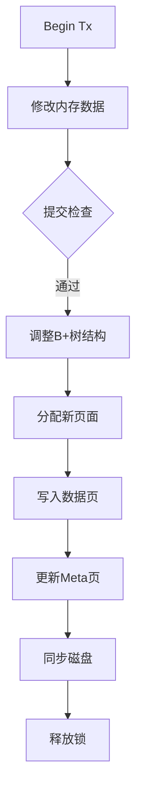

# etcd 存储引擎之主干框架

首先，我要确定这篇文章的结构和核心内容。文章分为几个部分：前言、核心概念、使用示例、主流程走读和展望。核心概念部分介绍了 boltdb 在 etcd 中的定位、存储设计、page 结构、B+树实现、bucket 概念以及事务处理。使用示例展示了如何通过代码操作 boltdb，主流程走读则深入源码分析启动、建 bucket、数据 CRUD 等过程。

用户可能希望了解 boltdb 的整体架构，特别是 B+树的应用、事务处理机制以及存储设计的细节。他们可能对 boltdb 如何保证数据一致性、高效读写以及如何与 etcd 集成感兴趣。此外，用户可能对源码分析部分感兴趣，想了解 boltdb 的具体实现细节，比如 mmap 的使用、page 管理、事务提交过程等。

接下来，我需要考虑如何将这篇技术文章转化为更易懂的讲解。可能需要先概述 boltdb 的整体架构，然后分模块详细解释每个部分的设计和实现。重点包括 B+树在 boltdb 中的具体应用、事务的 ACID 特性保证、存储层的 mmap 和 pwrite 机制，以及 bucket 的概念和作用。

需要注意的是，用户可能对某些技术术语不太熟悉，比如 mmap、B+树、事务隔离级别等，可能需要适当的解释。同时，源码分析部分需要简明扼要，突出关键流程，避免陷入过多细节而让读者迷失。

另外，用户提供的文章中有多个代码示例和流程图，可能需要用更简洁的方式呈现，或者用文字描述这些图表的内容，确保在没有图表的情况下读者也能理解。

最后，用户提到的“展望”部分提到后续文章将深入存储设计、B+树实现和事务处理，因此当前的讲解应为基础，为后续内容做铺垫，保持逻辑连贯性。

### 深入解析 etcd 存储引擎 boltdb 技术架构

#### 一、boltdb 核心定位

作为 etcd 的存储引擎，boltdb 是典型的单机版嵌入式 KV 数据库，具有三大核心特性：

1. **磁盘持久化存储**：数据直接写入磁盘文件
2. **B+树索引结构**：基于改进型 B+树实现高效检索
3. **ACID 事务支持**：通过 MVCC 实现事务隔离
4. **零运维设计**：无服务端进程，通过文件操作直接交互

#### 二、存储架构设计精要

##### 1. 文件组织模型


数据库文件由四类 page 组成：

- **Meta Page (x2)**：存储数据库元信息（版本号/空闲页 ID/根 Bucket 位置）
- **Freelist Page**：管理空闲页的链表结构
- **Branch Page**：B+树非叶子节点
- **Leaf Page**：B+树叶子节点

采用双 Meta Page 实现写时复制（COW）机制，确保事务原子性。

##### 2. 内存映射技术

通过 mmap 系统调用实现零拷贝读取：

```go
func (db *DB) mmap(sz int) error {
    b, err := syscall.Mmap(db.fd, 0, sz, syscall.PROT_READ, syscall.MAP_SHARED)
    db.data = (*[maxMapSize]byte)(unsafe.Pointer(&b[0]))
}
```

数据修改采用 pwrite 系统调用：

```go
func (tx *Tx) write() error {
    _, err := syscall.Pwrite(tx.db.fd, buf, offset)
    syscall.Fdatasync(tx.db.fd) // 强制刷盘
}
```

##### 3. B+树创新实现


与传统 B+树的主要差异：

- **延迟平衡**：仅在提交时调整树结构
- **游标遍历**：通过栈记录遍历路径实现范围查询
- **批量写入**：事务提交时统一处理页面分裂

#### 三、事务处理机制

##### 1. 事务类型对比

| 特性       | 读写事务         | 只读事务   |
| ---------- | ---------------- | ---------- |
| 并发数量   | 全局唯一         | 无限制     |
| 数据可见性 | 最新提交版本     | 快照版本   |
| 锁机制     | 排他锁（rwlock） | 无锁       |
| 持久化方式 | WAL + COW        | 无写入操作 |

##### 2. 事务提交流程



关键源码实现：

```go
func (tx *Tx) Commit() error {
    tx.root.rebalance()  // 树结构调整
    tx.root.spill()      // 数据溢出处理
    tx.writePages()      // 脏页写入
    tx.writeMeta()       // 元数据更新
    tx.db.rwtx = nil    // 释放事务
}
```

#### 四、Bucket 设计哲学

##### 1. 逻辑结构


- 每个 Bucket 对应独立的 B+树
- 支持无限层级嵌套
- 根 Bucket 存储在 Meta Page

##### 2. 创建过程源码解析

```go
func (b *Bucket) CreateBucket(key []byte) (*Bucket, error) {
    c := b.Cursor()
    k, _, flags := c.seek(key)

    // 检查键是否存在
    if bytes.Equal(key, k) {
        return nil, ErrBucketExists
    }

    // 创建新Bucket结构体
    newBucket := &Bucket{
        rootNode:    &node{isLeaf: true},
        FillPercent: 0.5,
    }

    // 序列化存储
    value := newBucket.write()
    b.tx.pagePool.Put(value)

    // 插入B+树
    c.node().put(key, value, bucketLeafFlag)
}
```

#### 五、性能优化策略

1. **页面对象池**：

   ```go
   type DB struct {
       pagePool sync.Pool {
           New: func() interface{} {
               return make([]byte, db.pageSize)
           }
       }
   }
   ```

   复用页面内存，减少 GC 压力

2. **批量写入**：

   - 事务期间所有修改缓存在内存
   - 提交时按页面 ID 顺序批量写入

3. **冷热数据分离**：
   - 热点数据保留在 Branch Page
   - 历史数据下沉到 Leaf Page

#### 六、典型应用场景

1. **配置中心**：

   ```go
   db.View(func(tx *bolt.Tx) error {
       b := tx.Bucket([]byte("configs"))
       v := b.Get([]byte("server.port"))
       fmt.Printf("Port: %s\n", v)
       return nil
   })
   ```

2. **会话存储**：

   ```go
   db.Update(func(tx *bolt.Tx) error {
       sessions, _ := tx.CreateBucketIfNotExists([]byte("sessions"))
       return sessions.Put([]byte(sessionID), sessionData)
   })
   ```

3. **时序数据存储**：
   ```go
   func storeMetric(tx *bolt.Tx, metric Metric) error {
       bucket, _ := tx.CreateBucketIfNotExists([]byte(metric.Name))
       return bucket.Put([]byte(metric.Timestamp), metric.Value)
   }
   ```

#### 七、设计启示录

1. **COW 与数据一致性**：

   - 通过双 Meta Page 实现原子提交
   - 旧事务继续访问历史数据版本
   - 新事务基于新 Meta Page 操作

2. **B+树工程化实践**：

   - 节点大小与 page 对齐（默认 4KB）
   - 批量平衡策略降低调整频率
   - 游标机制优化范围查询

3. **零拷贝设计哲学**：
   - mmap 实现读路径零拷贝
   - 写路径通过 page 对象池复用内存
   - 避免数据在用户态与内核态间复制

该存储引擎的设计展现了工业级存储系统的核心要素：在保证数据可靠性的前提下，通过精巧的算法设计和系统级优化，实现高性能的持久化存储。其设计理念对构建现代存储系统具有重要参考价值。
