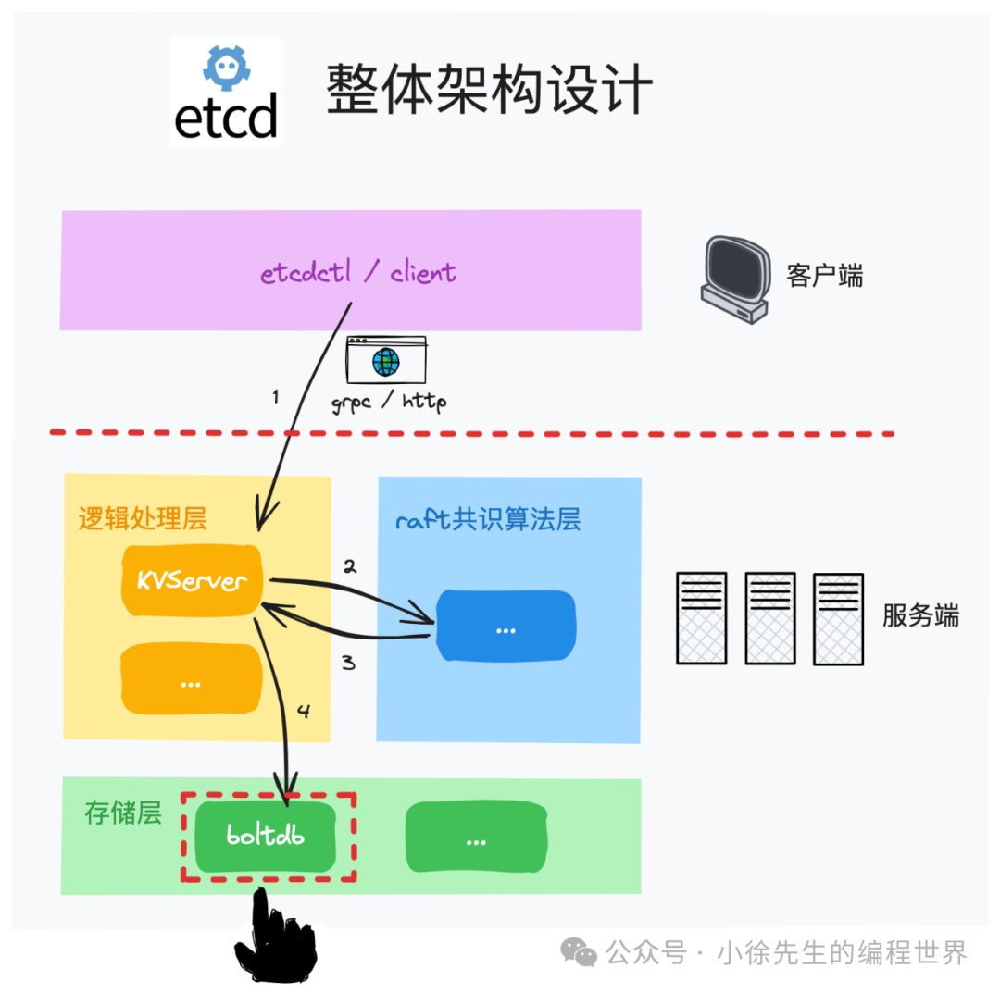
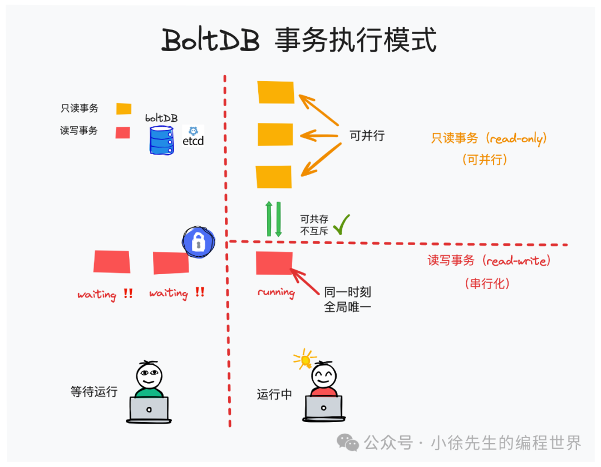
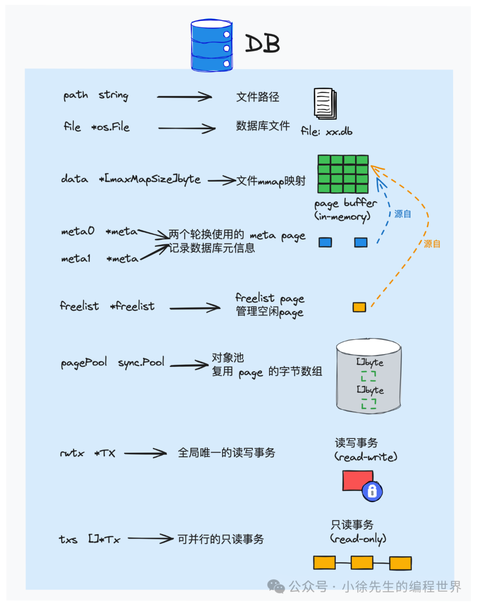
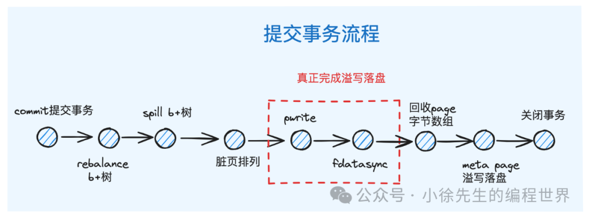

# etcd 存储引擎之主干框架

好的，我们来深入剖析这篇关于 etcd 存储引擎 boltdb 的文章。这篇文章结构清晰，由浅入深，从宏观概念到底层实现，为我们描绘了 boltdb 的核心框架。

### 深度剖析

#### **第一部分：核心概念 (Core Concepts)**

这部分是理解 boltdb 的基石。文章介绍了 boltdb 的定位、存储设计和事务模型。

**1.1 bolt 之于 etcd (定位)**

- **文章要点**: boltdb 是一个单机、嵌入式、基于磁盘的 KV 存储引擎。它没有网络交互，直接操作本地文件。
- **深度剖析**:
  - **嵌入式 (Embedded)**: 这意味着 boltdb 不是一个独立运行的服务（像 MySQL 或 Redis Server），而是一个库 (`.a` 或 `.so` 文件)。应用程序通过 API 调用直接在自己的进程空间内使用它。这带来了极高的性能（无网络开销、无序列化/反序列化开销），但也意味着它不具备分布式能力。
  - **单机**: boltdb 自身不处理分布式一致性问题。在 etcd 中，分布式一致性由上层的 Raft 协议保证。Raft 保证了各个节点的操作日志是一致的，而 boltdb 负责将这些确认过的日志（状态机指令）可靠地、原子地应用到本地磁盘上。etcd 将 Raft Log 和状态机（KV 数据）都存储在 boltdb 中。
  - **KV 存储**: boltdb 的模型非常简单，就是 `(key, value)` 对。但通过 `Bucket` 的设计，它实现了类似关系型数据库中 "表" 的概念，甚至支持嵌套，提供了更灵活的数据组织方式。

**1.2 存储设计 (Storage Design)**
这是 boltdb 的精髓所在。

- **读写机制**:

  - **读 (mmap)**: `mmap` (Memory-mapping) 是一种操作系统调用，它将一个文件或者其它对象映射到进程的地址空间，实现文件磁盘地址和进程虚拟地址空间中一段虚拟地址的一一对映关系。
    - **优势**: 应用程序可以像访问内存一样直接访问文件内容，无需 `read()`、`write()` 等系统调用，减少了内核空间和用户空间之间的数据拷贝次数。操作系统负责处理缺页中断，按需将文件内容从磁盘加载到物理内存。这对于读取操作非常高效，尤其是对于缓存命中率高的场景。
    - **boltdb 的实践**: boltdb 将整个数据库文件映射到内存。当一个只读事务开始时，它会获得一个指向当前 `meta page` 的引用，这个 `meta page` 指向了 B+ 树的根。事务期间的所有读取操作都是基于这个固定的数据快照，即使后续有写事务提交了新数据，该只读事务看到的数据也不会变，这就是 **MVCC (多版本并发控制)** 的基础。
  - **写 (pwrite + fdatasync)**:
    - **pwrite**: 这是一个原子操作，可以在指定的文件偏移量 (`offset`) 写入数据，而不会移动文件的当前读写指针。这对于多线程/并发写入同一个文件而互不干扰至关重要。
    - **fdatasync**: 将文件数据（不包括元数据如修改时间等）强制刷写到磁盘。相比 `fsync`（数据和元数据都刷），`fdatasync` 开销更小，但同样能保证数据落盘的持久性。
    - **boltdb 的实践**: boltdb 采用 **写时复制 (Copy-on-Write, COW)** 策略。当一个写事务需要修改一个 page 时，它不会在原来的 page 上修改，而是：
      1.  复制一个新的 page。
      2.  在新 page 上进行修改。
      3.  更新父节点，使其指向这个新的 page。这个更新过程会级联向上，直到根节点。
      4.  事务提交时，所有这些新创建的、修改过的 "脏页" 会通过 `pwrite` 写入到文件末尾的新位置，然后通过 `fdatasync` 确保落盘。最后，更新 `meta page` 指向新的 B+ 树根，并原子地将 `meta page` 刷盘。这种方式保证了即使在写入过程中发生崩溃，旧版本的数据依然是完整和一致的，数据库不会损坏。

- **Page (页)**:

  - **文章要点**: 数据库文件组织的基本单位，分为 `meta`, `freelist`, `branch`, `leaf` 四种。
  - **深度剖析**:
    - `meta page`: 数据库的“引导扇区”。它存储了数据库的“魔数”（用于识别文件类型）、版本、pageSize、根 bucket 的位置、freelist page 的位置以及当前已提交的事务 ID。文章提到有两个 `meta page`，这是为了实现原子更新和故障恢复。写事务提交时，会轮流更新这两个 page。例如，当前活动的是 `meta0`，事务 ID 是 5。新事务提交后，会创建事务 ID 为 6 的新数据结构，并更新 `meta1`。更新成功后，`meta1` 成为活动 page。下次启动时，boltdb 会读取两个 `meta page`，选择事务 ID 较大的那个作为有效数据。
    - `freelist page`: 空闲页管理器。当事务删除数据或通过 COW 产生不再被引用的旧 page 时，这些 page 的 ID 会被记录在 `freelist` 中。新的写事务需要分配 page 时，会优先从 `freelist` 中获取，实现空间复用。这避免了数据库文件无限增长。
    - `branch` & `leaf page`: B+ 树的节点。`branch` 是内部节点，只存 key 和指向下一层节点的 page ID。`leaf` 是叶子节点，存储 `(key, value)` 对。

- **B+ 树**:

  - **文章要点**: boltdb 的核心数据结构，并提到了两个改造点。
  - **深度剖析**:
    - **为何选择 B+ 树**: B+ 树是一种为磁盘等块设备优化的数据结构。它的特点是：1) 树的高度很低，通常 3-4 层就能索引上亿条数据，这意味着从根节点到叶子节点的磁盘 I/O 次数非常少。2) 数据都存在叶子节点，内部节点只做索引，使得内部节点可以存储更多的 key，进一步降低树高。3) 叶子节点通常用链表连接，便于范围查询。
    - **改造点 1 (游标)**: boltdb 的叶子节点**没有**用链表连接。这是它与经典 B+ 树的一个重要区别。为了实现范围扫描（`ForEach`），boltdb 引入了 `Cursor` (游标)。游标内部维护了一个栈，记录了从根节点到当前叶子节点的路径（经过的所有 branch page 和在其中的位置）。当需要移动到下一个元素时，如果当前 page 还有元素，直接移动；如果没有，游标会通过栈回溯到父节点，然后找到下一个兄弟节点，再深入到该兄弟节点的第一个元素。这种方式虽然比链表略复杂，但避免了在 COW 模型下维护双向链表的复杂性。
    - **改造点 2 (延迟调整)**: 经典 B+ 树在每次插入/删除后都可能触发节点的分裂/合并来维持平衡。boltdb 为了性能，将这个过程延迟了。在写事务中，数据的插入 (`Put`) 可能会导致 page 溢出，但它并不会立即分裂，而是标记该 page。直到事务提交前的 `spill()` 阶段，才会递归地处理所有溢出的 page，进行分裂。同理，删除数据后 page 利用率过低，会在 `rebalance()` 阶段进行合并。这种批处理的方式减少了 B+ 树结构调整的次数，提高了写入吞吐量。

- **Bucket (桶)**:
  - **文章要点**: 类似数据库的表，可嵌套。
  - **深度剖析**: 在实现上，一个 bucket 本身就是 B+ 树。而一个子 bucket 是如何存储在父 bucket 里的呢？父 bucket 的 B+ 树中，有一条特殊的 KV 数据：`key` 是子 bucket 的名字，`value` 存储的是子 bucket 的元数据（主要是其 B+ 树根节点的 page ID）。当你通过 `Bucket.Bucket("sub")` 访问子 bucket 时，boltdb 实际上是在父 bucket 的 B+ 树中查找名为 "sub" 的 key，解析其 value，找到子 bucket 的根 page，从而操作子 bucket 的 B+ 树。这种设计非常巧妙，用一套 B+ 树机制同时管理了用户数据和 bucket 结构本身。

**1.3 事务执行 (Transaction)**

- **文章要点**: 分为只读和读写事务，以及它们的并发规则。
- **深度剖析**:
  - **并发模型**: boltdb 的并发控制模型是：**一个全局写锁，多个读锁**。
    - `db.Update()` 会获取一个全局的、排他的写锁 (`rwlock`)。这意味着在任何时刻，整个数据库实例中最多只能有一个读写事务在执行。
    - `db.View()` 会获取一个读锁。多个只读事务可以同时执行。
    - 读写事务和只读事务可以并行执行。这是通过 MVCC 实现的。当读写事务正在进行时，只读事务仍然可以基于上一个已提交的版本（快照）进行读取，互不干扰。
  - **ACID 保证**:
    - **原子性 (Atomicity)**: 通过 COW 和最后原子更新 `meta page` 来保证。如果事务中途失败，只需回滚（`rollback`），丢弃所有新分配的 page 即可，数据库文件本身不会处于中间状态。
    - **一致性 (Consistency)**: 由应用程序逻辑和 boltdb 的原子性共同保证。事务要么完全成功，要么完全失败，数据库不会从一个一致状态变成不一致状态。
    - **隔离性 (Isolation)**:
      - 写事务之间是**串行**的，隔离性最强（Serializable）。
      - 读事务之间是并行的，因为它们都操作不可变快照。
      - 读写事务之间，读事务看到的是写事务开始前的快照，实现了**快照隔离 (Snapshot Isolation)**。
    - **持久性 (Durability)**: 通过 `pwrite` + `fdatasync` 保证。一旦 `Commit` 方法返回 `nil`，所有数据（包括 meta page）都已确认落盘。

#### **第二部分：使用示例**

这部分代码清晰地展示了 boltdb 的核心 API：`Open`, `Close`, `Update`, `View`, `CreateBucketIfNotExists`, `Bucket`, `Put`, `Get`, `Delete`。

- **深度剖析**:
  - `db.Update(fn)` 和 `db.View(fn)` 是推荐的使用方式。它们内部处理了事务的开始 (`Begin`)、提交 (`Commit`) 或回滚 (`Rollback`)。用户只需在传入的闭包函数中专注业务逻辑即可。这种设计简化了事务管理，避免了忘记提交或回滚导致的锁泄露等问题。
  - 注意 `tx.Bucket()` 和 `bucket.Put()` 等操作返回的 `[]byte` 切片。这些切片直接指向 `mmap` 的内存区域。在事务结束之后，这块内存随时可能被新的写事务覆盖或解除映射。因此，**如果你需要在事务外使用这些数据，必须显式地将它们拷贝出来**，例如使用 `copy()` 函数。这是一个非常重要且容易出错的点。

#### **第三部分：主流程走读**

这部分深入源码，验证了核心概念中的设计。

- **DB 定义**: `DB` 结构体是所有状态的集合。注意其中的锁：

  - `rwlock`: 控制读写事务的并发，保证写事务的唯一性。
  - `metalock`: 专门保护两个 `meta page` 的访问。
  - `mmaplock`: 在需要重新 `mmap`（例如文件增长时）时使用的锁。

- **启动 (`Open`)**:

  - `db.init()`: 关键在于初始化了 4 个 page。这 4 个 page 是一个最小可用数据库的全部内容。`meta0` 和 `meta1` 指向同一个根（page 3），`freelist`（page 2）是空的，根 bucket（page 3）是一个空的 `leaf page`。
  - `db.mmap()`: `unix.Mmap` 是核心系统调用。`syscall.PROT_READ` 参数说明了 boltdb 默认将文件映射为只读内存。这是安全的，因为所有写操作都是通过 `pwrite` 系统调用，而不是直接修改 mmap 区域。`syscall.MAP_SHARED` 意味着对映射区域的修改（如果可写的话）会写回文件，并且对其他映射该文件的进程可见。

- **Bucket 创建与查找**:

  - 源码验证了之前的剖析：创建 bucket 就是在父 bucket 的 B+ 树中 `put` 一个特殊的 KV 对（`flag` 为 `bucketLeafFlag`）。查找 bucket 就是 `seek` 这个 key，然后反序列化 value。
  - `b.buckets` 缓存：这是一个优化。`Bucket` 对象是对底层 page 数据的反序列化和封装。为了避免重复的反序列化开销，父 bucket 会缓存已经打开过的子 bucket 对象。这个缓存的生命周期与事务相同。

- **数据 CRUD**:

  - 源码再次确认，所有操作都委托给了 `Cursor`。`c.seek(key)` 是所有操作的第一步，它将游标移动到 key 所在或应该插入的位置，并返回该位置的信息。然后 `c.node().put()` 或 `c.node().del()` 在该节点上执行具体操作。

- **数据落盘 (`Commit`)**:
  - `rebalance()` 和 `spill()`: 这两个函数是实现延迟调整 B+ 树平衡性的关键。`spill` 处理因插入导致节点过满的情况（分裂），`rebalance` 处理因删除导致节点太空的情况（合并）。它们在所有脏页写入磁盘前执行，确保写入的 B+ 树结构是平衡的。
  - `tx.write()`: 这个函数是 COW 的最终体现。它收集事务期间产生的所有脏页 (`tx.pages`)，排序后（按 page ID 排序有助于磁盘顺序写入），通过 `pwrite` 写入文件。最后调用 `fdatasync` 确保数据持久化。
  - `pagePool`: 写入完成后，那些标准大小的 page 的内存会被归还到 `sync.Pool` 中，供下次分配 page 时复用，减少了 GC 压力和内存分配开销。

### 总结与展望

这篇文章是一篇优秀的 boltdb 入门和框架概述文章。它准确地抓住了 boltdb 的几个核心设计要点：

1.  **文件布局与 Page**: 以 Page 为基本单位组织文件。
2.  **核心数据结构**: 改造过的 B+ 树，用于高效索引。
3.  **并发控制**: MVCC + 单写多读模型。
4.  **事务与持久化**: COW + `mmap` + `pwrite` 保证了 ACID。

作者为后续文章留下的“待填坑”部分，正是深入理解 boltdb 所必须攻克的难点：

- **存储设计**: 会更详细地讲解 page 的具体二进制结构、freelist 的实现机制（hashmap vs array）、文件增长策略等。
- **B+树实现**: 会深入 `node` 结构、`spill` 和 `rebalance` 的详细算法、`Cursor` 的移动逻辑。
- **事务实现**: 会剖析 `Tx` 结构、MVCC 如何通过 `meta` 和 `txid` 实现、只读事务如何获取快照等。

总而言之，这篇文章为你打开了 boltdb 的大门，而我在此基础上进行的深度剖析，希望能帮助你更透彻地理解门后的世界。如果你对某个具体点仍有疑问，我们可以继续深入探讨。
