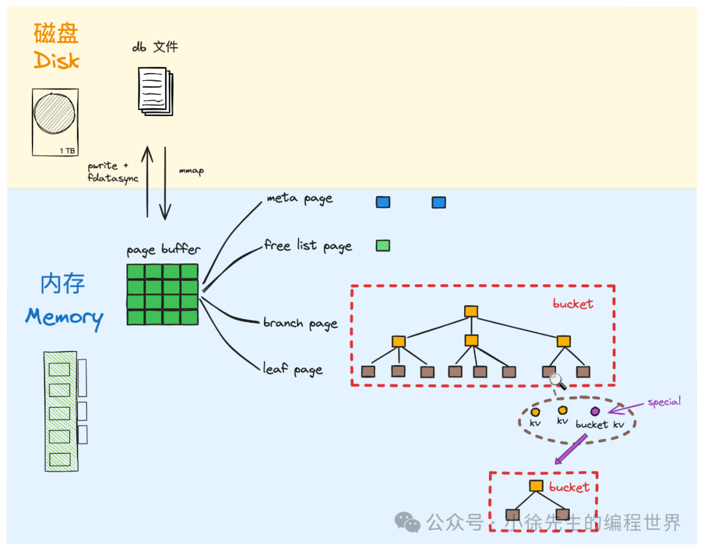

• 单文件存储：基于本地单个磁盘文件进行数据持久存储，存储数据均为 kv 形式

• mmap：基于 mmap（memory-mapping file）技术，将 db 文件内容映射到内存指定区域（我们称之为 page buffer），于读流程中屏蔽磁盘 io 细节

• pwrite+fdatasync：基于 file writeAt + fdatasync 技术，支持于文件指定 offset 写入数据，并保证同步等待设备 io 结果

• 存储分 page：借鉴局部性原理，以 page 作为存储交换的最小单位，向操作系统看齐

• page 分类：page 分为 meta、freelist、branch 和 leaf 四类，前两者偏向全局维度的元信息记录；后两者与实际数据存储相关

• b+ tree：数据存储采用 b+ 树模型. branch page 和 leaf page 分别对应 b+ 树的枝干和叶子节点. 其在需要修改时，会基于懒加载机制在内存中反序列化为 node 实例模型

• copy-on-write： 采取以空间换时间策略，全程基于写时复制技术，实现脏数据副本拷贝处理，直到落盘完成才对原数据进行覆盖，以此保证数据安全性

• bucket：定位为相互隔离的数据组，可以简单类比于表. 每个 bucket 对应一棵独立 b+ 树，bucket 之间也通过 b+ 树模型建立父子层级拓扑关系
