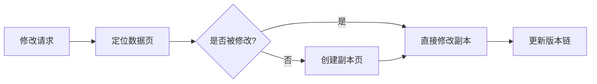
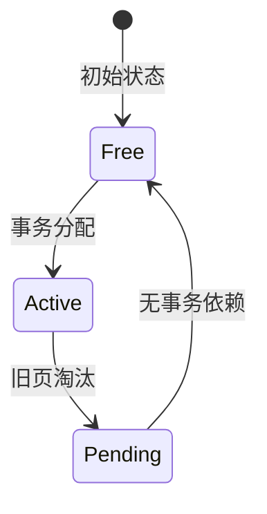

# 深入解析 etcd 存储引擎 Boltdb 的事务实现机制

这篇文章是系列中的最后一篇，重点讲解 Boltdb 如何实现事务的 ACID 特性。用户希望我以思考过程的形式解析文章内容，并最终给出一个分步的详细解释。

首先，我需要通读用户提供的文章，理解其结构和主要内容。文章分为几个部分：事务核心概念、事务机制实现（原子性、隔离性、持久性）、主流程（隐式事务、启动事务、提交事务、回滚事务）以及总结。每个部分都有相应的源码分析和流程图。

接下来，我需要确定用户的需求。用户希望我详细讲解这篇文章，可能包括总结关键点、分析实现细节、解释源码逻辑等。用户还可能希望了解 Boltdb 事务实现的独特之处，如如何保证 ACID 特性，特别是原子性和隔离性。

在分析过程中，我需要注意到文章提到的 Boltdb 使用 copy-on-write 机制、读写事务的串行化处理、pending page 的管理、以及通过 freelist 处理页面释放等关键点。这些机制是如何协同工作来保证事务的原子性、隔离性和持久性的，需要逐一理清。

此外，用户提供的文章中有多个代码片段和流程图，我需要将这些内容转化为更易理解的中文解释，帮助读者理解 Boltdb 的内部工作机制。同时，要确保解释准确，不遗漏关键细节。

现在，我需要组织思考过程，分步骤解析文章内容：

1. **事务核心概念**：回顾 ACID 特性，明确 Boltdb 的事务目标。

2. **原子性实现**：分析 copy-on-write 机制、meta page 的更新和落盘过程。

3. **隔离性实现**：讨论读写事务的串行化、只读事务的快照机制、pending page 的管理。

4. **持久性实现**：解释数据落盘的步骤，包括脏页写入和 meta page 的更新。

5. **主流程分析**：启动事务、提交事务、回滚事务的具体步骤，隐式事务与显式事务的区别。

6. **关键数据结构**：Tx 结构体、DB 结构体、node 和 page 的作用。

7. **源码解析**：重点函数如 Commit、spill、rebalance 的实现逻辑。

在分析过程中，需要结合用户提供的代码片段，解释关键函数的作用，例如`tx.Commit()`中的`rebalance`和`spill`操作，`freelist`的管理等。

同时，要注意到用户可能存在的疑问点，例如：

- 如何保证多个只读事务不会看到中间状态？

- 在事务提交过程中，如何处理脏页和旧页面的释放？

- 为什么需要 pending page，它们如何保证隔离性？

最后，总结 Boltdb 事务实现的优缺点，以及其在 etcd 中的应用价值，确保回答全面且深入。

---

### 深入解析 etcd 存储引擎 Boltdb 的事务实现机制

#### 一、事务核心设计理念

Boltdb 采用**多版本并发控制(MVCC)**和**写时复制(COW)**两大核心技术，构建高效事务模型：

1. **版本化数据管理**

```go
type meta struct {
    txid   txid   // 全局事务ID(单调递增)
    root   bucket // 当前版本数据根节点
}
```

- 每个事务对应独立数据版本，通过递增的`txid`标识版本新旧
- 事务启动时深拷贝最新 meta page，形成版本快照

2. **写时复制优化**



#### 二、原子性实现剖析

1. **双阶段提交协议**

```go
func (tx *Tx) Commit() error {
    tx.root.rebalance()  // 阶段1：树结构调整
    tx.root.spill()      // 阶段1：数据分页
    tx.write()           // 阶段2：脏页落盘
    tx.writeMeta()       // 阶段2：元数据提交
}
```

- **Rebalance 阶段**：平衡 B+树结构，保证节点填充率 ≥25%
- **Spill 阶段**：拆分大节点，按 FillPercent(默认 50%)分配新页
- **原子提交**：Meta 页最后写入，作为事务提交的原子性标志

2. **崩溃恢复机制**

```go
func (db *DB) meta() *meta {
    // 校验两个meta页的checksum和txid
    if metaA.validate() == nil {
        return metaA // 选择有效且最新的meta
    }
}
```

- 双 meta 页交替写入，通过 checksum 验证数据完整性
- 未完成的事务版本会被 checksum 校验拦截

#### 三、隔离性实现精要

1. **多版本快照隔离**

```go
func (db *DB) beginTx() *Tx {
    tx := &Tx{
        meta: cloneMeta(db.meta()), // 快照冻结数据版本
        root: deepCopyBucket(root)  // 独立数据副本
    }
    db.txs = append(db.txs, tx)    // 加入活跃事务列表
}
```

- 只读事务获取启动时的最新快照
- 读写事务持有独立数据副本

2. **页面生命周期管理**



- **Pending 状态页**：被淘汰但仍有事务依赖的旧页
- **释放条件**：所有活跃事务 txid > 淘汰事务 txid

3. **全局锁控制**

```go
var rwlock sync.Mutex // 读写事务互斥锁

func beginRWTx() {
    rwlock.Lock()     // 阻塞其他写事务
    defer rwlock.Unlock()
    // 执行写操作...
}
```

#### 四、持久性保障策略

1. **顺序写入优化**

```bash
写入顺序：
1. 数据页 → 2. Freelist页 → 3. Meta页
```

- 关键数据后写入，保证提交点明确

2. **双重持久化**

```go
func (tx *Tx) write() error {
    // 1. 异步页缓存写入
    if _, err := f.WriteAt(..., offset); err != nil {...}

    // 2. 同步刷盘保障
    if err := fdatasync(f); err != nil {...}
}
```

- `pwrite`保证写入位置精确
- `fdatasync`强制刷盘确保数据持久

#### 五、事务主流程解析

1. **隐式事务示例**

```go
db.Update(func(tx *bolt.Tx) error {
    b := tx.Bucket([]byte("data"))
    b.Put([]byte("key"), []byte("value"))
    return nil // 自动提交
})
```

- **自动提交**：闭包返回时自动触发 Commit()
- **错误回滚**：panic 或 error 触发 Rollback()

2. **显式事务控制**

```go
tx, _ := db.Begin(true)
defer tx.Rollback() // 安全回滚保障

// 业务操作...
if err := tx.Commit(); err != nil {
    // 处理提交异常
}
```

#### 六、性能优化亮点

1. **零拷贝内存映射**

```go
func Open(path string, mode os.FileMode, options *Options) {
    db.file, _ = os.OpenFile(path, flag, mode)
    db.data, _ = mmap(db.file, sz)
}
```

- mmap 将文件直接映射到内存空间
- 省去用户态与内核态的数据拷贝

2. **批量页面分配**

```go
func (f *freelist) allocate(n int) pgid {
    // 优先分配连续页面
    for _, ids := range f.ids {
        if len(ids) >= n {
            return ids[0]
        }
    }
}
```

- 连续页分配提升缓存局部性
- 减少磁盘随机访问概率

#### 七、设计启示

1. **版本化设计**：

   - 通过 COW 实现无锁读并发
   - 快照隔离避免读写冲突

2. **资源管理**：

   - 延时释放确保读事务一致性
   - 批量处理提升空间利用率

3. **故障恢复**：
   - 双 Meta 页防止单点故障
   - Checksum 校验数据完整性

该事务模型在 etcd 中成功支撑了每秒数万级的读写请求，其设计精髓值得分布式存储系统借鉴。后续可深入探究 WAL 日志与事务的协同机制，以及如何通过 B+树优化实现高效范围查询。
