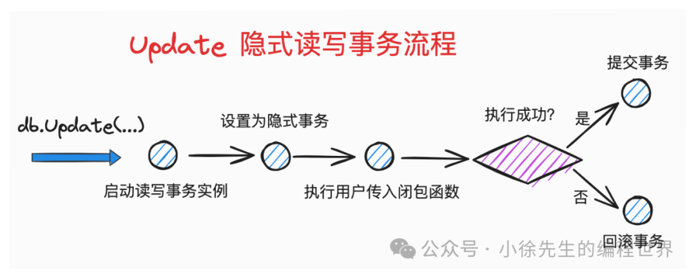

好的，我们来对这篇《etcd 存储引擎之事务实现》进行深入、详细的剖析。这篇文章是系列的收官之作，它将前面章节铺垫的存储设计、B+树、COW 等机制串联起来，解释了 boltdb 如何实现 ACID 事务，这是数据库的灵魂所在。

我将遵循文章的脉络，对每个核心概念和流程进行深度讲解，揭示其背后的设计哲学和实现精髓。

### **深度剖析**

#### **第一章：事务核心概念**

这部分是理论基础，文章准确地介绍了 ACID 四大特性，并为后续 boltdb 的实现提供了理论框架。

- **深度剖析**:
  - **boltdb 的隔离级别**: 文章将其定位为“介于可重复读和串行化之间”，这是一个非常精准的描述。
    - **为什么不是纯粹的串行化 (Serializable)**？因为 boltdb 允许一个写事务和多个读事务**并行**执行。纯粹的串行化意味着所有事务（无论读写）都像排队一样一个接一个执行，这会严重影响读的并发性。
    - **为什么满足可重复读 (Repeatable Read)**？因为每个事务（无论是读还是写）在启动时，都会获得一个基于特定 `txid` 的数据库**快照**。事务的整个生命周期内，所有读取操作都基于这个固定不变的快照，因此多次读取同一个 key 的结果必然相同。
    - **为什么没有幻读 (Phantom Read)**？幻读特指在一个事务内，两次执行相同的范围查询，但第二次查询返回了第一次没有的“幻影”行（由其他事务插入并提交导致）。boltdb 的快照隔离机制天然地避免了幻读。因为事务的视图是固定的，它看不到在它启动之后其他事务所做的任何修改，自然也就不会看到新插入的数据。因此，boltdb 实际上提供了比标准“可重复读”更强的隔离性，达到了**快照隔离 (Snapshot Isolation)** 级别。

#### **第二章：事务机制实现**

这是本文的核心，详细阐述了 boltdb 如何在代码层面兑现 ACID 的承诺。

**2.1 类定义 (`Tx` & `DB`)**

- **文章要点**: 展示了 `Tx` 和 `DB` 结构体中与事务相关的核心字段。
- **深度剖析**:
  - `Tx` 结构体是事务状态的载体。`meta` 和 `root` 字段是**事务级副本**，是 COW 和 MVCC 的内存体现。`pages` map 则是事务的“脏页缓冲区”，记录了所有新创建或修改过的 page。
  - `DB` 结构体是全局状态的管理者。`rwtx` 和 `txs` 分别代表了“唯一的写事务”和“多个读事务”，`rwlock` 则是实现“单写”机制的物理保障。`meta0` 和 `meta1` 是持久化层面的数据版本控制核心。

**2.2 原子性 (Atomicity)**

- **文章要点**: 通过 COW 机制，将所有修改先在副本上进行，最后通过原子地更新 `meta` 页来一次性生效。
- **深度剖析**:
  - **原子性的“两阶段”实现**:
    1.  **内存阶段**: 所有 `Put`、`Delete`、`CreateBucket` 操作都不会直接修改 `mmap` 的内存。它们通过 `node()` 方法将 page 反序列化为内存中的 `node` 对象（如果尚未加载），然后对 `node` 对象进行修改。这个过程可能会触发 `node` 的分裂（`spill`）或合并（`rebalance`）的**计划**，但真正的 page 分配和写入都发生在提交阶段。
    2.  **提交阶段 (`Commit`)**: 这是原子性的关键。
        a. `spill()`: 递归地将内存中所有被修改过的 `node` 序列化到**新分配**的 page 中（这些新 page 就是 `tx.pages` 里的脏页）。旧的 page ID 被记录下来，准备放入 `freelist`。
        b. `tx.write()`: 将所有脏页通过 `pwrite` 写入文件。此时，数据库文件包含了新旧两个版本的数据，但对外可见的仍然是旧版本，因为 `meta` 页还没更新。
        c. `tx.writeMeta()`: **这是原子性的“引爆点”**。它将包含新 B+树根节点、新 `freelist` 位置和新 `txid` 的 `meta` 副本，通过 `pwrite` + `fdatasync` 原子地写入到两个 `meta` page 中的一个。
  - **一旦 `writeMeta` 成功，事务就不可逆转地成功了**。如果在此之前的任何一步失败（例如 `write` 脏页时断电），由于 `meta` 页没有被更新，数据库下次启动时会完全忽略这些写入的“垃圾”脏页，自动回滚到事务开始前的状态。

**2.3 隔离性 (Isolation)**

- **文章要点**: 通过 `rwlock` 实现写串行化，通过 COW + `pending` 机制实现读写并行和可重复读。
- **深度剖析**:
  - **`rwlock` 的作用**: `db.beginRWTx()` 获取写锁，`tx.close()` 释放写锁。这把粗粒度的锁保证了任何时刻只有一个进行中的写事务，从根本上杜绝了“写-写”冲突。
  - **`pending` 机制的再剖析 (MVCC 的核心)**:
    - **谁在保护旧数据？** 正在运行的只读事务。每个只读事务都持有一个 `txid`，代表它所能看到的数据版本。
    - **`freelist.free()`**: 当写事务提交并释放一个旧 page 时，它调用 `free()`。这个函数并不真的“释放”页面，而是将这个 page ID 和当前的写事务 `txid` 关联起来，放入 `pending` map。这相当于给这个旧 page 贴上一个标签：“我在 `txid`=N 这个版本被废弃了”。
    - **`freelist.release()`**: 当一个新的写事务启动时，它会检查当前所有活跃的只读事务，找到其中最小的 `txid` (minReadTxID)。然后，它调用 `release(minReadTxID - 1)`，告诉 `freelist`：“所有 `txid` 小于 minReadTxID 的版本都已不再被任何事务所需要，你们可以把这些版本废弃的 page 真正地释放（移入 `ids` 列表）了”。
    - **这个设计精妙地将数据版本生命周期管理与事务管理结合起来，用最小的代价实现了快照隔离。**

**2.4 持久性 (Durability)**

- **文章要点**: 通过 `pwrite` + `fdatasync` 保证数据落盘。
- **深度剖析**:
  - `tx.write()` 和 `tx.writeMeta()` 都依赖于底层的 `writeAt`（即 `pwrite`）和 `fdatasync`。
  - **`pwrite`**: 保证了写入操作的原子性和线程安全，可以直接在文件的任意偏移量写入，而不会影响其他线程。
  - **`fdatasync`**: 这是对操作系统发出的强制命令：“立即将文件缓冲区的数据写入物理磁盘，并等待磁盘确认完成”。它只保证数据落盘，不保证文件元数据（如修改时间）落盘，因此比 `fsync` 更高效。
  - **两步 `fdatasync`**: boltdb 在 `tx.write()` 和 `tx.writeMeta()` 后都可能调用 `fdatasync`。关键在于 `writeMeta` 之后的 `fdatasync`。只有它成功返回，才能宣告事务的持久化成功。

#### **第三章：主流程**

这部分从用户视角出发，串联了事务的完整生命周期。

**3.1 隐式事务 (`Update` & `View`)**

- **文章要 ة 点**: `Update` 和 `View` 是推荐的用法，它们自动管理事务的生命周期。
- **深度剖析**:
  - **`defer` 的妙用**: `Update` 和 `View` 中的 `defer` 语句是健壮性的保证。它确保了无论用户提供的闭包函数 `fn` 是否 `panic` 或返回 `error`，事务最终都会被正确地回滚（除非它已经被成功 `Commit`）。这极大地简化了用户的资源管理负担。
  - **`View` 为何也 `Rollback`**: 只读事务不对数据做任何修改，它的结束只是意味着释放其持有的数据快照。`Rollback` 操作对于只读事务来说，就是清理事务对象、从 `db.txs` 列表中移除自身的过程，没有任何数据层面的回滚，因此用 `Rollback` 来结束一个只读事务是完全正确且高效的。

**3.2 启动事务 (`Begin`)**

- **文章要点**: `beginRWTx` 和 `beginTx` 的流程对比。
- **深度剖析**:
  - **核心差异**:
    1.  **锁**: `beginRWTx` 加 `rwlock`，`beginTx` 不加。
    2.  **`txid`**: `beginRWTx` 会将 `meta` 副本的 `txid` 加一，为新版本做准备。`beginTx` 只是拷贝当前的 `txid`。
    3.  **`freelist` 清理**: `beginRWTx` 会触发 `freePages()`，这是一个垃圾回收的时机。而 `beginTx` 不会，因为它不产生垃圾。

**3.3 提交事务 (`Commit`)**

- **文章要点**: 梳理了 `Commit` 的完整步骤。
- **深度剖析**:
  - 这是一个精心编排的序列，顺序至关重要：
    1.  **内存整理 (`rebalance`, `spill`)**: 先在内存中把 B+树的结构最终确定下来。
    2.  **`freelist` 更新**: `spill` 过程会产生新的空闲页，需要更新 `freelist` 的状态。
    3.  **数据落盘 (`write`)**: 先把所有数据页写入磁盘。
    4.  **元数据落盘 (`writeMeta`)**: 最后写入 `meta` 页，完成“官宣”。
    5.  **内存清理 (`close`)**: 释放锁，清理事务对象。
  - 这个顺序保证了任何一步失败，都不会破坏数据库的一致性。

**3.4 回滚事务 (`Rollback`)**

- **文章要点**: 回滚操作非常简单，只需清理 `pending` 列表。
- **深度剖析**:
  - **COW 的巨大优势**: 因为写事务的所有修改都发生在新的 page 上，旧的数据版本完好无损。回滚一个未提交的事务，本质上就是**放弃所有新分配的 page**。
  - `freelist.rollback(txid)` 的作用就是：找到 `pending` map 中为这个 `txid` 准备的空闲页列表，然后直接把它删掉。这意味着这些本应被释放的旧 page，现在又回到了“正在使用”的状态（因为新版本被废弃了），而那些为新版本分配的 page，因为从未被任何 `meta` 页引用过，它们在 `freelist` 的视角里仍然是空闲的。整个过程无需任何磁盘 I/O，极其高效。

### **总结**

这篇文章非常出色地剖析了 boltdb 事务实现的核心。boltdb 通过一系列经典而又巧妙的设计组合，构建了一个健壮、高效的事务系统：

- **宏观上**: 采用 **MVCC + 单写多读** 的并发模型，兼顾了读性能和实现简洁性。
- **微观上**:
  - **原子性与持久性**: 依赖 **COW + 双 `meta` 页 + `pwrite`/`fdatasync`**。
  - **隔离性**: 依赖 **数据快照（`txid`） + `pending` 列表**。

整个系列由宏观到微观，从框架到存储，再到 B+树和事务，完整地勾勒出了一个工业级嵌入式 KV 数据库的骨架和血肉。理解了 boltdb 的事务实现，就等于掌握了其设计的精髓。

---

**事务可以分为显式和隐式两类.**
所谓显式事务，是使用方手动通过 begin 操作启动的事务，使用方需要通过 commit 或者 rollback 操作来将事务执行结果推向终态.
而隐式事务(managed)则是将事务生命周期托管给 db，由 db 来决策何时应该 commit 或 rollback 事务，使用方无需关心.


```go
// Update 启动隐式读写事务
func (db *DB) Update(fn func(*Tx) error) error {
    // 启动一个新的读写事务实例
    t, err := db.Begin(true)
    // ...
    // 兜底保证进行回滚. 如果事务正常提交成功的话，必然会将 db 引用指针为 nil
    defer func() {
        if t.db != nil {
            t.rollback()
        }
    }()

    // 标记读写事务为隐式事务，不允许由使用方手动提交或者回滚
    t.managed = true

    // 执行使用方传入的闭包函数
    err = fn(t)
    t.managed = false
    // 中途发生错误，则进行回滚
    if err != nil {
        _ = t.Rollback()
        return err
    }
 
    // 闭包函数未发生错误，提交事务
    return t.Commit()
}

// View 启动隐式只读事务
func (db *DB) View(fn func(*Tx) error) error {
    // 启动只读事务
    t, err := db.Begin(false)

    // 兜底保证进行回滚. 如果事务正常结束的话，必然会将 db 引用指针为 nil 
    defer func() {
        if t.db != nil {
            t.rollback()
        }
    }()

    // 标记事务为隐式事务
    t.managed = true

    // 执行使用方传入的闭包函数
    err = fn(t)
    t.managed = false
    
    // 倘若闭包函数发生错误，进行事务回滚
    if err != nil {
        _ = t.Rollback()
        return err
    }

    // 因为是只读事务，不会对数据状况发生变化，因此事务可以通过回滚来结束
    return t.Rollback()
}
```
