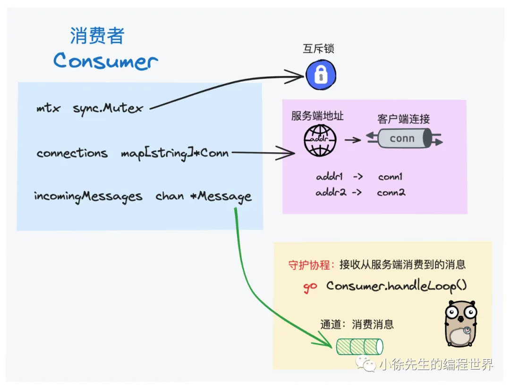

# 万字解析 go 语言分布式消息队列 nsq

- nsq 客户端：https://github.com/nsqio/go-nsq . 本文走读源码版本为：v1.1.0.
- nsq 服务端：https://github.com/nsqio/nsq . 本文走读源码版本为：v1.2.1.

## 1 架构介绍

1. 整体架构
   

   - nsqd：最核心的消息队列后端模块，负责接收、存储和发送消息
   - nsqlookupd：nsq 中的服务发现与注册中心，负责管理 nsqd 节点、topic、channel 之间拓扑映射关系
   - nsqadmin：提供了用于实时监控 nsq 集群的 web 可视化界面

   > nsqd 中的 "d" 表示 "daemon"，即作为守护进程运行的 nsq 后端服务。

2. 核心概念
   

   - topic：人为定义的消息主题，所有被生产出来的消息首先指定其被发往哪个主题.
   - channel：消费方定义的消息频道. `channel 与 topic 是多对一关系`，每个 channel 都会拥有一份 topic 下的全量完整数据
   - producer：消息生产方，`生产消息时需要显式指定其从属的 topic`
   - consumer：消息消费方. `消费消息时需要显式指定主题 topic 以及频道 channel`

   channel 可以与其他消费队列组件中的 `consumer group` 消费者组的概念类比来看：
   

   - 首先，channel 与 topic 是一对多关系，每当 topic 有新消息到达时，都会拷贝成多份，逐一发送到每个 channel 当中，保证每个 channel 拥有独立完整的一份数据
   - 其次，所有 consumer 在发起订阅时，都需要显式指定 topic + channel 的二维信息
   - 最后，**channel 下的每一条消息会被`随机`推送给订阅了该 channel 的 1 名 consumer**

   `所有 subcribe 了相同 channel 的 consumer 之间自动形成了一种类似消费者组的机制，大家各自消费 topic 下数据的一部分，形成数据分治与负载均衡.`
   倘若某个 consumer 需要获取到 topic 中的全量数据，那也容易，只需要 `subscribe 一个不与他人共享的 channel 即可.`
   nsq 与其他消息队列组件的另一大差异是，其中的 `topic 和 channel 采用的都是懒创建的机制`.

## 2 使用教程

1. 启动服务端
   通过 nohup 指令以守护进程的方式分别启动 nsqlookupd、nsqd 和 nsqadmin 进程

   > nohup 是 Unix/Linux 下的一个命令，用于在终端关闭或用户注销时继续运行指定的程序。

   在 nsqadmin 启动后，即可进入 http://localhost:4171 页面浏览 topic、channel 相关信息：
   
   • nsqlookupd： tcp 端口：4160，用于 nsqd 集群广播；http 端口：4161，用于客户端访问
   • nsqd： tcp 端口: 4150，用于生产者、消费者访问；http 端口: 4151，用于生产者访问
   • nsqadmin： 端口：4171

2. 运行客户端

```go
package main

import (
    "fmt"
    "sync"
    "testing"
    "time"

    "github.com/nsqio/go-nsq"
)

const (
    // 用于测试的消息主题
    testTopic = "my_test_topic"
    // nsqd 服务端地址
    nsqdAddr  = "localhost:4150"
    // 订阅 channelGroupA 的消费者 A1
    consumerA1 = "consumer_a1"
    // 订阅 channelGroupA 的消费者 A2
    consumerA2 = "consumer_a2"
    // 单独订阅 channelGroupB 的消费者 B
    consumerB  = "consumer_b"
    // testTopic 下的 channelA
    channelGroupA = "channel_a"
    // testTopic 下的 channelB
    channelGroupB = "channel_b"
)

// 建立 consumer 与 channel 之间的映射关系
// consumerA1、consumerA2 -> channelA
// consumerB -> channelB
var consumerToChannelGroup = map[string]string{
    consumerA1: channelGroupA,
    consumerA2: channelGroupA,
    consumerB:  channelGroupB,
}

func Test_nsq(t *testing.T) {
    // 消费者消费到消息后的执行逻辑
    msgCallback := func(consumerName string, msg []byte) error {
        t.Logf("i am %s, receive msg: %s", consumerName, msg)
        return nil
    }

    // 运行 producer
    if err := runProducer(); err != nil {
        t.Error(err)
        return
    }

    // 并发运行三个 consumer
    var wg sync.WaitGroup
    for consumer := range consumerToChannelGroup {
        // shadow
        wg.Add(1)
        go func(consumer string) {
            defer wg.Done()
            if err := runConsumer(consumer, msgCallback); err != nil {
                t.Error(err)
            }
        }(consumer)
    }
    wg.Wait()
}

// 运行生产者
func runProducer() error {
    // 通过 addr 直连 nsqd 服务端
    producer, err := nsq.NewProducer(nsqdAddr, nsq.NewConfig())
    if err != nil {
        return err
    }
    defer producer.Stop()

    // 通过 producer.Publish 方法，往 testTopic 中发送三条消息
    for i := 0; i < 3; i++ {
        msg := fmt.Sprintf("hello xiaoxu %d", i)
        if err := producer.Publish(testTopic, []byte(msg)); err != nil {
            return err
        }
    }
    return nil
}

// 用于处理消息的 processor，需要实现 go-nsq 中定义的 msgProcessor interface，核心是实现消息回调处理方法：func HandleMessage(msg *nsq.Message) error
type msgProcessor struct {
    // 消费者名称
    consumerName string
    // 消息回调处理函数
    callback     func(consumerName string, msg []byte) error
}

func newMsgProcessor(consumerName string, callback func(consumerName string, msg []byte) error) *msgProcessor {
    return &msgProcessor{
        consumerName: consumerName,
        callback:     callback,
    }
}

// 消息回调处理
func (m *msgProcessor) HandleMessage(msg *nsq.Message) error {
    // 执行用户定义的业务处理逻辑
    if err := m.callback(m.consumerName, msg.Body); err != nil {
        return err
    }
    // 倘若业务处理成功，则调用 Finish 方法，发送消息的 ack
    msg.Finish()
    return nil
}

// 运行消费者
func runConsumer(consumerName string, callback func(consumerName string, msg []byte) error) error {
    // 根据消费者名获取到对应的 channel
    channel, ok := consumerToChannelGroup[consumerName]
    if !ok {
        return fmt.Errorf("bad name: %s", consumerName)
    }

    // 指定 topic 和 channel，创建 consumer 实例
    consumer, err := nsq.NewConsumer(testTopic, channel, nsq.NewConfig())
    if err != nil {
        return err
    }
    defer consumer.Stop()

    // 添加消息回调处理函数
    consumer.AddHandler(newMsgProcessor(consumerName, callback))

    // consumer 连接到 nsqd 服务端，开启消费流程
    if err = consumer.ConnectToNSQD(nsqdAddr); err != nil {
        return err
    }

    <-time.After(5 * time.Second)
}
```

## 3 客户端

1.  连接交互
    在与服务端交互时，都是通过客户端定义类 `Conn` 来封装表示两端之间建立的连接.
    

    > inFlight 指的是某条消息已经被客户端接收到，但是还未给予服务端 ack 的状态

    ```go
    type Conn struct {
        // 记录了有多少消息处于未 ack 状态
        messagesInFlight int64
        // 互斥锁，保证临界资源一致性
        mtx sync.Mutex
        // 真正的 tcp 连接
        conn    *net.TCPConn
        // 连接的服务端地址
        addr    string

        // 读入口
        r io.Reader
        // 写出口
        w io.Writer

        // writeLoop goroutine 用于接收用户指令的 channel
        cmdChan         chan *Command
        // write goroutine 通过此 channel 接收来自客户端的响应，发往服务端
        msgResponseChan chan *msgResponse
        // 控制 write goroutine 退出的 channel
        exitChan        chan int

        // 并发等待组，保证所有 goroutine 及时回收，conn 才能关闭
        wg        sync.WaitGroup
    }
    ```

2.  创建连接
    • 通过 net 包向服务端发起 tcp 连接
    • 将 Conn 下的 writer 和 reader 设置为这笔 tcp 连接
    • 异步启动 Conn 伴生的 readLoop 和 writeLoop goroutine，持续负责接收和发送与服务端之间的往来数据

    ```go
    func (c *Conn) Connect() (*IdentifyResponse, error) {
        dialer := &net.Dialer{
            LocalAddr: c.config.LocalAddr,
            Timeout:   c.config.DialTimeout,
        }

        conn, err := dialer.Dial("tcp", c.addr)
        c.conn = conn.(*net.TCPConn)
        c.r = conn
        c.w = conn
        // var MagicV2 = []byte("  V2")
        _, err = c.Write(MagicV2)
        c.wg.Add(2)

        // 接收来自服务端的响应
        go c.readLoop()
        // 发送发往服务端的请求
        go c.writeLoop()
        return resp, nil
    }
    ```

3.  生产者
    在客户端视角下，生产者 producer 向服务端生产消息的 publish 流程
    

    一把锁，一个连接，五个 chan

4.  消费者
    
    每当用户注册消息回调处理函数 handler 时，consumer 就会启动一个 handleLoop goroutine，负责接收消息并调用相应的处理函数.倘若用户注册了多个 handler，最终每条消息只会随机被其中一个 handler 处理.
    consumer 在被创建出来时，就需要明确指定其订阅的 topic 以及 chanel.

    ```go
    type Consumer struct {
        // 互斥锁
        mtx sync.RWMutex

        // 消费者标识 id
        id      int64
        // 消费者订阅的 topic
        topic   string
        // 消费者订阅的 channel
        channel string

        // 用于接收消息的 channel
        incomingMessages chan *Message

        pendingConnections map[string]*Conn
        connections        map[string]*Conn

        // 连接的 nsqd 地址
        nsqdTCPAddrs []string
    }
    ```

    为防止消息丢失，nsq 中同样支持了 consumer ack 机制.
    consumer 在接收到消息并成功调用 handler 回调处理函数后，可以通过调用 Message.Finish() 方法，向服务端发送 ack 指令，确认消息已成功接收.
    倘若服务端超时未收到 ack 响应，则会默认消息已丢失，会重新推送一轮消息.

## 4 服务端

1. 核心类

   - nsqd
     
     NSQD 类对应于一个 nsqd 节点，其中封装了各类重要信息：

     • topicMap： 当前 nsqd 节点下包含的 topic 集合
     • lookupPeers：倘若启用集群模式，该字段标识出集群中其他节点的信息
     • tcpServer： nsqd 节点下的 tcp 服务，用于接收处理来自客户端的各种请求指令

   - topic
     
     Topic 对应为一个消息主题，其下包含核心字段：

     • channelMap：topic 下的 channel 集合
     • memoryMsgChan： 有新消息到达时，在内存中通过此通道向 topic 传递消息
     • backend：当 memoryMsgChan 容量达到上限时，则通过磁盘文件向 topic 传递消息
     • nsqd：从属的 nsqd 模块
     在 topic 被构造出来时，会调用 Topic.messagePump(...) 方法，异步启动一个 goroutine，负责持续接收分配给该 topic 的消息，并将消息逐一发送给该 topic 下的每个 channel

   - channel
     
     Channel 对应为一个消息频道，

     • memoryMsgChan： 有新消息到达时，在内存中通过此通道向 channel 传递消息
     • backend：当 memoryMsgChan 容量达到上限时，则通过磁盘文件向 channel 传递消息
     • clients: 订阅该 channel 的 consumer 集合
     • deferredPQ： channel 下的`延时消息队列`，基于小顶堆实现
     • inFlightPQ： channel 下的`待 ack 确认消息队列`，基于小顶堆实现

2. 服务运行
   
   nsq 使用了 go-svc 脚手架：https://github.com/judwhite/go-svc .
   在 svc 框架中，会分别调用 program 的 Init() 和 Start() 方法，用于初始化和运行 nsqd 后台程序.

   - 在 program.Init() 方法中，会读取用户输入的配置，然后构造出 nsqd 实例；
   - 在 program.Start() 方法中，会异步调用 NSQD.Main() 方法，并分别在其中启动几个异步任务。
     • 启动 tcp server： 面向客户端提供服务，处理各种请求指令
     • 启动 http/https server：面向客户端提供生产消息部分服务
     • 启动 queueScanLoop： 执行延时队列、待 ack 队列的扫描任务
     • 启动 lookupLoop：与 nsqlookupd 交互，更新元数据信息

3. publish 流程
   
   
4. subscribe 流程
   consumer 向 nsqd 服务端发起 subscribe 指令的流程
   
5. inFlight&ack 机制
6. deferred 机制
   **定时轮询延时队列**，找到满足时间条件的消息，调用 Channel.put(...) 方法发送消息

---

go-svc 脚手架是一个用于快速构建 Go 语言守护进程服务的框架。它主要提供以下功能：

- **生命周期管理**：统一管理服务的启动、关闭、重载等逻辑。
- **信号处理**：内置对 Unix 信号（如 SIGINT、SIGTERM 等）的处理，方便实现平滑停止或重启。
- **配置管理和日志处理**：提供了一些基础的配置读取和日志记录机制，帮助开发者快速构建稳定的服务应用。

NSQ 在服务端使用 go-svc 脚手架来管理服务的各项后台任务和连接，确保整个服务可以在守护进程模式下稳定运行。
