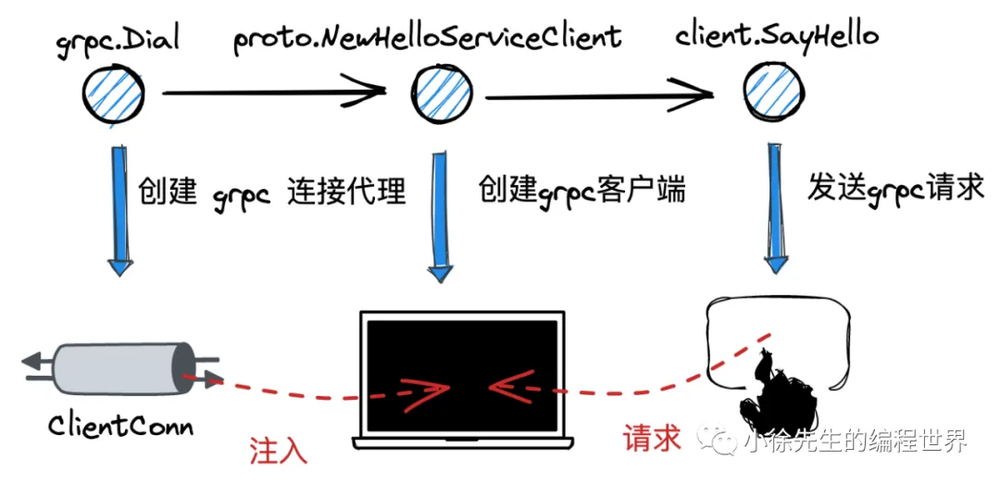
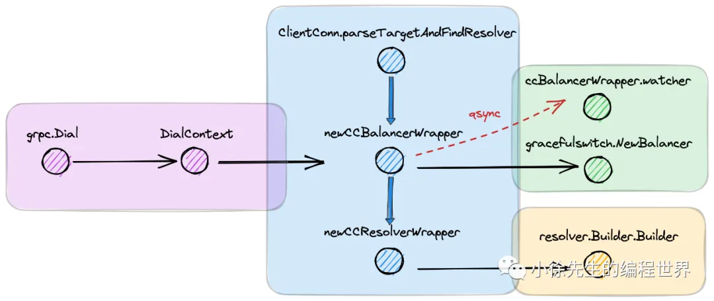

# grpc-go 客户端源码走读

https://mp.weixin.qq.com/s?__biz=MzkxMjQzMjA0OQ==&mid=2247484161&idx=1&sn=ec088c67d556acb922f291f1b74e5282

这篇文章主要分为几个部分：
客户端代码示例、核心数据结构、grpc.Dial流程、grpc.Invoke流程以及小结。
文章结构如下：

1. 客户端代码示例

- main函数示例
- proto文件定义

2. 核心数据结构

- ClientConn
- ccBalancerWrapper
- ccResolverWrapper
- ClientStream和csAttempt

3. grpc.Dial流程

- 创建ClientConn
- 解析target和查找resolver
- 创建ccBalancerWrapper和ccResolverWrapper
- 启动resolver和负载均衡器

4. grpc.Invoke流程

- 创建clientStream
- 使用重试机制发送请求
- 获取transport和创建stream
- 发送和接收消息

5. 小结

接下来，我需要理解每个部分的关键点，尤其是源码中的主要数据结构和函数调用流程。例如，ClientConn的作用是什么，ccBalancerWrapper如何管理负载均衡，ccResolverWrapper如何处理服务发现，以及ClientStream如何管理请求的发送和接收。
在分析过程中，需要注意一些关键函数如grpc.Dial的具体实现，它如何初始化ClientConn，如何解析服务地址，如何启动负载均衡器和解析器。另外，grpc.Invoke的流程涉及到clientStream的创建、重试机制、transport的获取和消息的编解码，这也是需要重点理解的。
可能遇到的理解难点包括负载均衡器和解析器的交互机制，以及ClientStream如何处理重试和错误恢复。需要仔细阅读相关源码部分的解释，确保对这些机制有准确的理解。
最后，整理总结时要确保逻辑连贯，层次分明，突出gRPC-Go客户端在建立连接、服务发现、负载均衡、请求处理等方面的设计思路和实现细节。同时，注意使用用户提供的专业术语和代码结构，保持与原文一致的技术深度和准确性。

---

### 详细总结：gRPC-Go客户端源码分析

---

#### **一、客户端代码示例**



1. **main函数示例**

   ```go
   func main() {
       conn, _ := grpc.Dial("localhost:8093", grpc.WithTransportCredentials(insecure.NewCredentials()))
       defer conn.Close()
       client := proto.NewHelloServiceClient(conn)
       resp, _ := client.SayHello(context.Background(), &proto.HelloReq{Name: "xiaoxuxiansheng"})
       fmt.Printf("resp: %+v", resp)
   }
   ```

   - **核心步骤**：
     - `grpc.Dial`：建立与服务端的连接代理`ClientConn`。
     - `proto.NewHelloServiceClient`：通过桩代码创建客户端实例。
     - `client.SayHello`：发起RPC请求。

2. **Proto文件定义**
   ```protobuf
   service HelloService {
       rpc SayHello (HelloReq) returns (HelloResp);
   }
   message HelloReq { string name = 1; }
   message HelloResp { string reply = 1; }
   ```
   - 生成桩代码（`_grpc.pb.go`）包含客户端接口与实现。

---

#### **二、核心数据结构**

1. **ClientConn**

   - **作用**：管理客户端连接，包含连接池、负载均衡器、解析器等。
   - **关键字段**：
     - `target`：目标服务地址。
     - `balancerWrapper`：负载均衡器封装。
     - `resolverWrapper`：服务地址解析器。
     - `conns`：子连接（`addrConn`）池。

2. **ccBalancerWrapper**

   ```go
   type Balancer interface {
       UpdateClientConnState(ClientConnState) error  // 更新 ClientConn 的连接状态
       UpdateSubConnState(SubConn, SubConnState)  // 更新子连接 Subconn 状态
       ResolverError(error)  // 错误后处理
       Close()  // 关闭负载均衡器
   }
   ```

   - **职责**：封装负载均衡器（如`pickfirst`），通过事件驱动更新连接状态。
   - **关键机制**：
     - 监听`updateCh`处理状态变更事件（如`ccStateUpdate`、`scStateUpdate`）。
     - 默认使用`pickfirst`策略，选择第一个可用子连接。

   在默认情况下，grpc客户端框架会为我们提供一个默认的负载均衡器 pickfirstBalance

3. **ccResolverWrapper**

   ```go
   type Resolver interface {
       // 解析 target
       ResolveNow(ResolveNowOptions)
       // 关闭 resolver
       Close()
   }
   ```

   - **职责**：管理服务地址解析器（如`passthroughResolver`），解析目标地址。
   - **默认解析器**：`passthrough`直接透传地址，无复杂解析逻辑。

   resolver本身是一个接口，核心的方法是 ResolveNow：通过 target 解析出实际的客户端地址
   grpc客户端为我们提供了一个默认的resolver：passthroughResolver：

4. **ClientStream与csAttempt**
   在 grpc 客户端发起请求时，会首先创建出一个 ClientStream.
   并依赖其核心方法 SendMsg 和 RecvMsg 进行请求的发送和响应的接受.

   ```go
   type ClientStream interface {
       // 获取元数据
       Header() (metadata.MD, error)
       // 获取上下文
       Context() context.Context
       // 发送消息
       SendMsg(m interface{}) error
       // 接收消息
       RecvMsg(m interface{}) error
   }
   ```

   - **ClientStream**：管理RPC请求的发送与接收，封装编解码、压缩等逻辑。
   - **csAttempt**：单次RPC尝试的生命周期管理，包括Transport获取、Stream创建。

---

#### **三、grpc.Dial流程**



```go
func Dial(target string, opts ...DialOption) (*ClientConn, error) {
    return DialContext(context.Background(), target, opts...)
}

func DialContext(ctx context.Context, target string, opts ...DialOption) (conn *ClientConn, err error) {
    cc := &ClientConn{
        target:            target,
        csMgr:             &connectivityStateManager{},
        conns:             make(map[*addrConn]struct{}),
        dopts:             defaultDialOptions(),
        blockingpicker:    newPickerWrapper(),
        czData:            new(channelzData),
        firstResolveEvent: grpcsync.NewEvent(),
    }

    // ...
    // Determine the resolver to use.
    resolverBuilder, err := cc.parseTargetAndFindResolver()
    // ...
    cc.balancerWrapper = newCCBalancerWrapper(cc, balancer.BuildOptions{
        DialCreds:        credsClone,
        CredsBundle:      cc.dopts.copts.CredsBundle,
        Dialer:           cc.dopts.copts.Dialer,
        Authority:        cc.authority,
        CustomUserAgent:  cc.dopts.copts.UserAgent,
        ChannelzParentID: cc.channelzID,
        Target:           cc.parsedTarget,
    })
    // ...
    rWrapper, err := newCCResolverWrapper(cc, resolverBuilder)
    // ...
    cc.mu.Lock()
    cc.resolverWrapper = rWrapper
    cc.mu.Unlock()
    // ...
    return cc, nil
}
```

1. **创建ClientConn**

   ```go

   cc := &ClientConn{
       target: target,
       conns: make(map[*addrConn]struct{}),
       dopts: defaultDialOptions(),
   }
   ```

- 初始化连接池、状态管理器、负载均衡器等。

2. **解析Target与加载Resolver**

   - **parseTargetAndFindResolver**：根据目标地址的`scheme`（如`passthrough`）选择解析器。
   - **默认解析器**：`passthroughResolver`直接返回原始地址。

3. **初始化负载均衡器（ccBalancerWrapper）**

   - **newCCBalancerWrapper**：启动守护协程监听事件（如连接状态变更）。
   - **默认负载均衡器**：`pickfirst`策略，选择第一个可用子连接。

4. **启动Resolver与地址解析**

   - **resolver.start()**：触发地址解析，更新`ClientConn`状态。
   - **passthroughResolver.start()**：透传地址到`ClientConn`。

5. **子连接（addrConn）创建与连接**
   - **newAddrConn**：创建子连接并加入连接池。
   - **addrConn.connect()**：异步建立TCP连接，更新状态为`Ready`。

---

#### **四、grpc.Invoke流程**

在grpc-go客户端通过pb桩代码发起请求时，内部会调用 ClientConn.Invoke 方法，核心步骤分为三部分：

- 调用 newClientStream 方法构造一个 clientStream 用于与服务端的通信交互
- 调用 clientStream.SendMsg 方法发送请求
- 调用 clientStream.RecvMsg 方法接收响应

```go
func (c *helloServiceClient) SayHello(ctx context.Context, in *HelloReq, opts ...grpc.CallOption) (*HelloResp, error) {
    out := new(HelloResp)
    err := c.cc.Invoke(ctx, "/pb.HelloService/SayHello", in, out, opts...)
    // ...
    return out, nil
}

func (cc *ClientConn) Invoke(ctx context.Context, method string, args, reply interface{}, opts ...CallOption) error {
    // ...
    return invoke(ctx, method, args, reply, cc, opts...)
}

func invoke(ctx context.Context, method string, req, reply interface{}, cc *ClientConn, opts ...CallOption) error {
    cs, err := newClientStream(ctx, unaryStreamDesc, cc, method, opts...)
    // ...
    if err := cs.SendMsg(req); err != nil {
        return err
    }
    return cs.RecvMsg(reply)
}
```

1. **创建clientStream**

   ```go
   cs, _ := newClientStream(ctx, desc, cc, method, opts...)
   ```

   - **newClientStreamWithParams**：初始化编解码器、压缩模块、重试策略。

2. **重试机制（withRetry）**

   - **核心逻辑**：通过闭包函数`op`尝试获取Transport和创建Stream。
   - 失败时根据配置（如`failFast`）决定是否重试。

3. **获取Transport与创建Stream**

   - **getTransport**：通过负载均衡器选择子连接，获取其`transport.ClientTransport`。
   - **NewStream**：创建HTTP/2 Stream，用于发送请求帧。

4. **发送请求（SendMsg）**

   - **prepareMsg**：序列化请求数据，添加头部（如压缩标识）。
   - **Write**：通过Transport发送数据帧。

   ```go
   func (cs *clientStream) SendMsg(m interface{}) (err error) {
       // ...
       // 消息前处理，包括编码、压缩等细节
       hdr, payload, data, err := prepareMsg(m, cs.codec, cs.cp, cs.comp)
       // ...
       // 通过 csAttempt 发送请求
       op := func(a *csAttempt) error {
           return a.sendMsg(m, hdr, payload, data)
       }
       err = cs.withRetry(op, func() { cs.bufferForRetryLocked(len(hdr)+len(payload), op) })
       // ...
       return err
   }
   ```

5. **接收响应（RecvMsg）**
   - **recvAndDecompress**：读取响应帧，解压并反序列化。
   - **Unmarshal**：将二进制数据解析为响应对象。

---

#### **五、关键设计亮点**

1. **连接管理**

   - **连接池（addrConn）**：支持多子`连接，由负载均衡器动态`选择。
   - **状态机**：通过`connectivity.State`管理连接生命周期（Idle→Connecting→Ready→TransientFailure）。

2. **负载均衡与解析器**

   - **插件化设计**：支持自定义Resolver和Balancer（如DNS解析、Round-Robin策略）。
   - **事件驱动**：通过`updateCh`实现异步状态更新，减少阻塞。

3. **流式处理**
   - **ClientStream封装**：统一处理编解码、压缩、重试，简化业务逻辑。
   - **多路复用（HTTP/2）**：单TCP连接支持多个并发Stream。

---

#### **六、总结**

- **连接建立**：`grpc.Dial`通过Resolver解析地址，由Balancer选择子连接，最终建立TCP连接。
- **请求处理**：`grpc.Invoke`通过ClientStream封装编解码、重试逻辑，依赖HTTP/2 Stream实现高效通信。
- **扩展性**：模块化设计（如Resolver、Balancer）允许用户自定义服务发现与负载均衡策略。
- **性能优化**：连接池、多路复用、异步事件机制保障高并发场景下的性能。

后续可深入分析HTTP/2帧处理、流量控制、拦截器链等高级特性。
