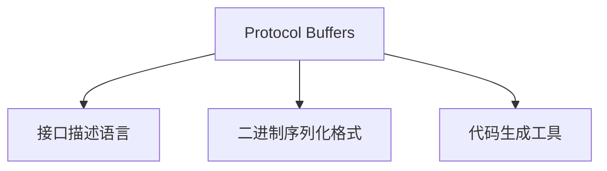
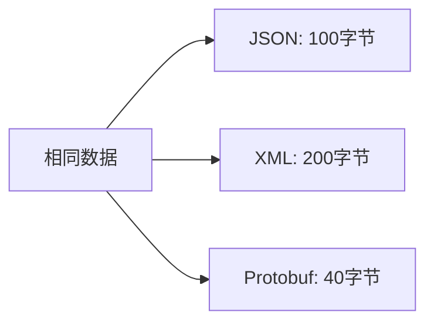

# Protocol Buffers 详解

## Protocol Buffers 是什么？

Protocol Buffers (简称 protobuf) 是 Google 开发的一种与语言、平台无关的、可扩展的机制，用于序列化结构化数据。它是一个接口描述语言(IDL)和二进制序列化格式，主要用于定义数据结构以及不同服务之间的通信协议。



## 工作原理

### 1. 定义消息格式(.proto文件)

```protobuf
syntax = "proto3";

package tutorial;

message Person {
  string name = 1;
  int32 id = 2;
  string email = 3;

  enum PhoneType {
    MOBILE = 0;
    HOME = 1;
    WORK = 2;
  }

  message PhoneNumber {
    string number = 1;
    PhoneType type = 2;
  }

  repeated PhoneNumber phones = 4;
}
```

### 2. 编译生成代码

使用`protoc`编译器生成各种语言的代码：

```bash
protoc --java_out=./java ./person.proto
protoc --cpp_out=./cpp ./person.proto
protoc --python_out=./python ./person.proto
protoc --go_out=./go ./person.proto
```

### 3. 使用生成的代码

```go
// Go语言示例
person := &tutorial.Person{
    Name: "John Doe",
    Id: 1234,
    Email: "jdoe@example.com",
    Phones: []*tutorial.Person_PhoneNumber{
        {Number: "555-4321", Type: tutorial.Person_HOME},
    },
}

// 序列化
data, err := proto.Marshal(person)
if err != nil {
    log.Fatal("Marshaling error: ", err)
}

// 反序列化
newPerson := &tutorial.Person{}
if err := proto.Unmarshal(data, newPerson); err != nil {
    log.Fatal("Unmarshaling error: ", err)
}
```

## Protocol Buffers 的主要特点

### 1. 紧凑高效的二进制格式

Protocol Buffers 使用二进制格式存储数据，比文本格式(如JSON、XML)更紧凑：



编码原理：

- 使用标记-值(tag-value)对
- 通过标记号(field number)识别字段
- 使用变长编码(Varint)减少整数存储空间
- 对字符串、重复字段等有特殊处理

### 2. 强类型定义

```protobuf
// 明确定义字段类型和约束
message Transaction {
  string transaction_id = 1;
  int64 amount = 2;  // 以分为单位的金额
  uint32 status = 3;
  google.protobuf.Timestamp timestamp = 4;
}
```

### 3. 向前/向后兼容性

Protocol Buffers 设计为支持数据结构演进：

- **字段编号不变**：字段标识使用数字而非名称
- **可选字段**：新增字段可设为可选，旧客户端可忽略
- **未知字段处理**：不识别的字段会被保留(proto3需特殊配置)

```protobuf
// 原始版本
message User {
  string name = 1;
  string email = 2;
}

// 新版本 (向后兼容)
message User {
  string name = 1;
  string email = 2;
  string phone = 3;      // 新增字段
  repeated string roles = 4;  // 新增字段
}
```

### 4. 跨语言支持

Protocol Buffers 支持多种编程语言：

- C++
- Java
- Python
- Go
- C#
- JavaScript
- Ruby
- PHP
- Dart
- Rust
- 更多...

### 5. 与 gRPC 完美结合

```protobuf
// 定义服务接口
service UserService {
  rpc GetUser(GetUserRequest) returns (User);
  rpc ListUsers(ListUsersRequest) returns (ListUsersResponse);
  rpc CreateUser(CreateUserRequest) returns (User);
}

message GetUserRequest {
  string user_id = 1;
}

message ListUsersRequest {
  int32 page_size = 1;
  string page_token = 2;
}

message ListUsersResponse {
  repeated User users = 1;
  string next_page_token = 2;
}
```

## 编码细节

Protocol Buffers 使用高效编码机制：

### 1. 变长整数编码 (Varint)

对整数使用可变长度编码，小数值占用更少字节：

```
数值 1 -> 编码为 0000 0001 (1字节)
数值 127 -> 编码为 0111 1111 (1字节)
数值 128 -> 编码为 1000 0000 0000 0001 (2字节)
```

### 2. 字段编码格式

每个字段编码为：`(field_number << 3) | wire_type` + 字段值

```
wire_type:
0 = Varint (int32, int64, bool等)
1 = 64位 (fixed64, double等)
2 = 长度前缀 (string, bytes, 内嵌消息等)
5 = 32位 (fixed32, float等)
```

### 3. 重复字段优化

`repeated`字段在proto3中默认使用packed编码，减少开销：

```
// 非packed编码 (proto2默认)
field_tag + value1 + field_tag + value2 + ...

// packed编码 (proto3默认)
field_tag + total_size + value1 + value2 + ...
```

## 与其他序列化格式对比

| 特性     | Protocol Buffers | JSON              | XML       | Avro       |
| -------- | ---------------- | ----------------- | --------- | ---------- |
| 大小     | 非常小           | 中等              | 大        | 小         |
| 解析速度 | 非常快           | 中等              | 慢        | 快         |
| 可读性   | 差(二进制)       | 好                | 好        | 差(二进制) |
| 向后兼容 | 良好             | 有限              | 有限      | 良好       |
| 语言支持 | 广泛             | 几乎所有          | 几乎所有  | 有限       |
| 模式支持 | 严格             | 可选(JSON Schema) | 严格(XSD) | 严格       |
| 工具支持 | 好               | 非常好            | 非常好    | 有限       |

## Protocol Buffers 使用场景

- **微服务通信**：特别是与gRPC结合
- **高性能API**：要求低延迟、高吞吐量
- **存储序列化数据**：高效保存结构化数据
- **大规模数据交换**：减少网络带宽和解析开销
- **多语言环境**：需要在不同语言间共享数据结构

## 限制和注意事项

- 二进制格式不易读(调试困难)
- 需要额外的编译步骤
- 对于简单应用可能过于复杂
- 需要维护模式定义
- 动态语言使用体验不如静态类型语言

## 结论

Protocol Buffers 是一个强大的数据序列化工具，特别适合需要高性能、跨语言通信和严格类型定义的应用场景。它是构建现代分布式系统和微服务架构的重要基础设施。## 与其他序列化格式对比

| 特性     | Protocol Buffers | JSON              | XML       | Avro       |
| -------- | ---------------- | ----------------- | --------- | ---------- |
| 大小     | 非常小           | 中等              | 大        | 小         |
| 解析速度 | 非常快           | 中等              | 慢        | 快         |
| 可读性   | 差(二进制)       | 好                | 好        | 差(二进制) |
| 向后兼容 | 良好             | 有限              | 有限      | 良好       |
| 语言支持 | 广泛             | 几乎所有          | 几乎所有  | 有限       |
| 模式支持 | 严格             | 可选(JSON Schema) | 严格(XSD) | 严格       |
| 工具支持 | 好               | 非常好            | 非常好    | 有限       |
