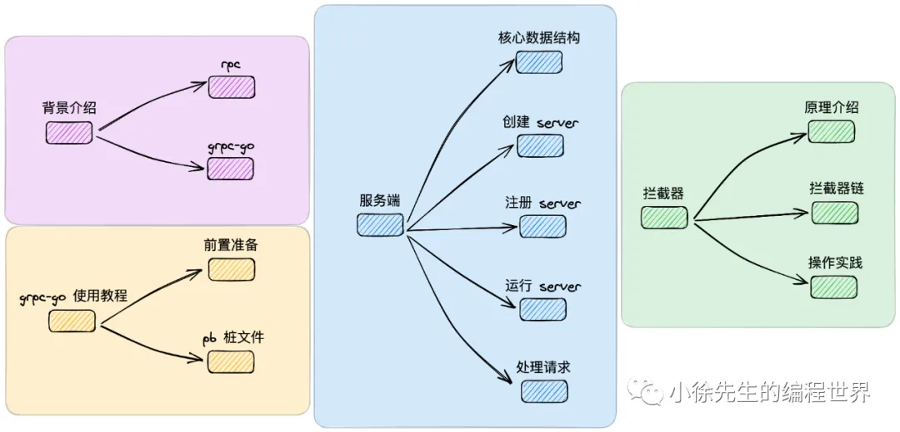

# grpc-go 服务端使用介绍及源码分析

https://mp.weixin.qq.com/s?__biz=MzkxMjQzMjA0OQ==&mid=2247484144&idx=1&sn=5e60c1e17d7c905c3e92fa9774e0331c


文章分为几个部分：背景介绍、使用教程、服务端源码分析、拦截器使用以及展望。用户希望得到详细的总结，所以我要确保每个部分都涵盖到，并且重点突出。

在背景介绍部分，用户解释了RPC和gRPC的优势，以及gRPC-go的基本情况。这部分需要简明扼要地概括，强调为什么使用gRPC。

使用教程部分包括前置准备、PB桩文件的生成、服务端和客户端的代码示例。我需要将这些步骤分点列出，注意代码示例的作用和生成过程。

源码分析部分涉及服务端的核心数据结构、创建Server、注册Service、运行Server和处理请求的流程。这部分可能需要用流程图或结构图来帮助理解，但用户要求文本总结，所以需要用文字详细描述各组件之间的关系和调用流程。

拦截器部分需要解释其原理、链式调用机制以及实际操作示例。这里要强调拦截器的执行顺序和作用，如何通过拦截器实现预处理和后处理逻辑。

展望部分提到未来可能讨论的内容，这部分可以简要提及，保持总结的完整性。

需要注意术语的准确性，比如gRPC、protobuf、拦截器等，确保技术细节正确。同时，保持段落清晰，使用适当的标题和子标题来组织内容，便于阅读。

可能遇到的难点是源码分析部分，需要准确描述Server结构体、serviceInfo、MethodDesc等组件的作用，以及它们之间的交互。需要确认每一步流程的正确性，如服务注册、请求处理的调用链是否正确。

另外，拦截器的链式调用部分需要详细解释getChainUnaryHandler函数如何递归包装拦截器，形成处理链。这部分可能需要用步骤分解来说明拦截器的执行顺序。

### 详细总结：gRPC-go服务端使用介绍及源码分析

---

#### **一、背景介绍**

1. **RPC与gRPC**

   - **RPC（远程过程调用）**：微服务架构下的通信模式，允许调用远程服务像本地方法一样透明。
   - **gRPC优势**：
     - 基于HTTP/2协议，支持双向流、多路复用。
     - 使用Protobuf（PB）作为接口定义语言（IDL）和序列化协议，高效且强类型。
     - 跨语言支持，与Golang深度集成。
   - **对比HTTP**：
     - 优势：性能更高、接口规范严格、生成强类型桩代码。
     - 劣势：灵活性较低，适合内部服务通信。

2. **gRPC-go**
   - Google官方实现的Go语言gRPC框架，基于Protobuf和HTTP/2，提供高性能的RPC通信能力。

---

#### **二、使用教程**

1. **前置准备**

   - **安装依赖**：
     ```bash
     go get google.golang.org/grpc@latest
     go install google.golang.org/protobuf/cmd/protoc-gen-go@v1.28
     go install google.golang.org/grpc/cmd/protoc-gen-go-grpc@v1.2
     ```
   - **Protobuf编译器**：下载对应系统的`protoc`并配置环境变量。

2. **定义Proto文件**

   - **示例`hello.proto`**：

     ```protobuf
     syntax = "proto3";
     option go_package = ".";
     package pb;

     service HelloService {
       rpc SayHello (HelloReq) returns (HelloResp);
     }
     message HelloReq { string name = 1; }
     message HelloResp { string reply = 1; }
     ```

3. **生成桩代码**

   - **生成命令**：
     ```bash
     protoc --go_out=. --go-grpc_out=. pb/hello.proto
     ```
   - **生成文件**：
     - `hello.pb.go`：数据结构的序列化/反序列化代码。
     - `hello_grpc.pb.go`：客户端和服务端的接口与注册代码。

4. **服务端实现**

   - **业务逻辑实现**：
     ```go
     type HelloService struct { proto.UnimplementedHelloServiceServer }
     func (s *HelloService) SayHello(ctx context.Context, req *proto.HelloReq) (*proto.HelloResp, error) {
       return &proto.HelloResp{Reply: "Hello " + req.Name}, nil
     }
     ```
   - **启动服务端**：
     ```go
     listener, _ := net.Listen("tcp", ":8093")
     server := grpc.NewServer()
     proto.RegisterHelloServiceServer(server, &HelloService{})
     server.Serve(listener)
     ```

5. **客户端调用**
   ```go
   conn, _ := grpc.Dial("localhost:8093", grpc.WithTransportCredentials(insecure.NewCredentials()))
   client := proto.NewHelloServiceClient(conn)
   resp, _ := client.SayHello(context.Background(), &proto.HelloReq{Name: "Alice"})
   fmt.Println(resp.Reply) // 输出：Hello Alice
   ```

---

#### **三、服务端源码分析**

1. **核心数据结构**

   - **`Server`结构体**：
     - 管理服务注册（`services map`）、连接池（`conns`）、拦截器链等。
   - **`serviceInfo`**：存储服务名、方法映射（`methods map`）及实现类。
   - **`MethodDesc`**：方法描述，包含方法名和处理函数（`Handler`）。

2. **启动流程**

   - **创建Server**：`grpc.NewServer()`初始化配置和拦截器链。
   - **注册服务**：`RegisterService`将服务添加到`services`映射。
   - **监听端口**：`Serve()`循环接受连接，每个连接启动goroutine处理。

3. **请求处理流程**
   - **连接处理**：`handleRawConn`封装HTTP/2 Transport。
   - **流处理**：`serveStreams`解析请求路径（`service/method`）。
   - **方法路由**：`handleStream`根据服务名和方法名路由到对应`MethodDesc.Handler`。
   - **业务逻辑执行**：反序列化请求→调用拦截器链→执行业务方法→序列化响应。

---

#### **四、拦截器（Interceptor）**

1. **原理**

   - **定义**：在业务方法前后插入通用逻辑（如认证、日志、熔断）。
   - **类型**：`UnaryServerInterceptor`函数签名：
     ```go
     type UnaryServerInterceptor func(ctx context.Context, req interface{}, info *UnaryServerInfo, handler UnaryHandler) (resp interface{}, err error)
     ```

2. **拦截器链**

   - **链式调用**：通过递归包装形成拦截器链，按注册顺序执行。
   - **示例**：
     ```go
     func chainInterceptors(interceptors []UnaryServerInterceptor) UnaryServerInterceptor {
       return func(ctx context.Context, req interface{}, info *UnaryServerInfo, handler UnaryHandler) (interface{}, error) {
         chain := getChainHandler(interceptors, 0, info, handler)
         return interceptors[0](ctx, req, info, chain)
       }
     }
     ```

3. **使用示例**
   - **定义拦截器**：
     ```go
     func LoggingInterceptor(ctx context.Context, req interface{}, info *grpc.UnaryServerInfo, handler grpc.UnaryHandler) (interface{}, error) {
       log.Printf("Pre-Processing: %s", info.FullMethod)
       resp, err := handler(ctx, req)
       log.Printf("Post-Processing: %s", info.FullMethod)
       return resp, err
     }
     ```
   - **注册拦截器**：
     ```go
     server := grpc.NewServer(grpc.ChainUnaryInterceptor(LoggingInterceptor, AuthInterceptor))
     ```

---

#### **五、总结与展望**

- **总结**：gRPC-go通过Protobuf和HTTP/2实现高效通信，服务端核心围绕`Server`结构体和拦截器链展开。
- **展望**：后续可深入探讨序列化优化、服务发现、负载均衡及Streaming RPC等高级特性。
