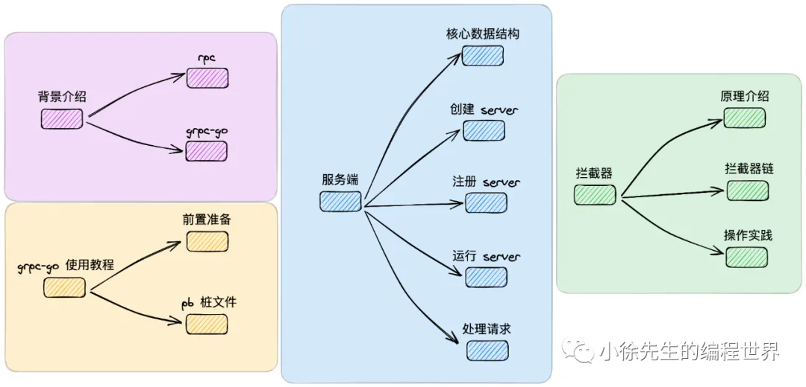
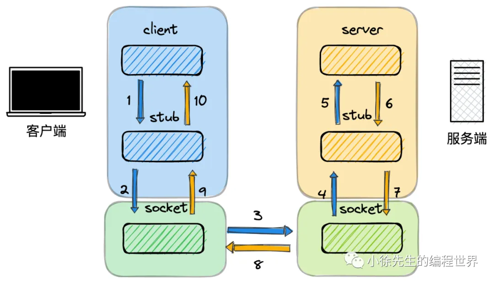
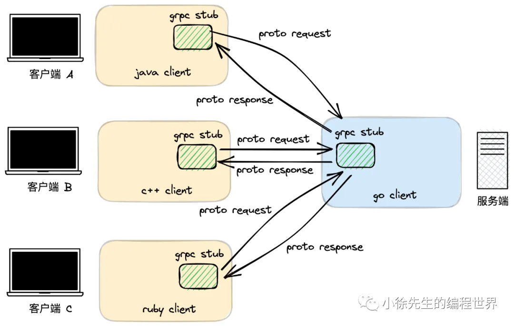
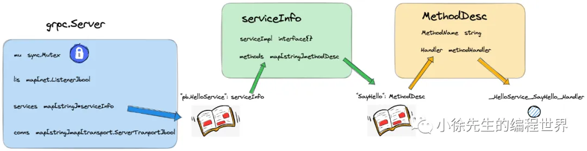
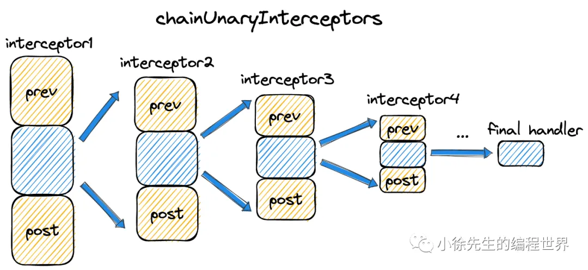

# grpc-go 服务端使用介绍及源码分析



## 1 背景介绍

1. rpc
   
   rpc，全称 remote process call（远程过程调用），是微服务架构下的一种通信模式. 这种通信模式下，一台服务器在调用远程机器的接口时，能够获得像调用本地方法一样的良好体验.

   - rpc 调用基于 sdk 方式，调用方法和出入参协议固定，stub 文件本身还能起到接口文档的作用，很大程度上优化了通信双方约定协议达成共识的成本.
   - rpc 在传输层协议 tcp 基础之上，可以由实现框架自定义填充应用层协议细节，理论上存在着更高的上限

   从另一个角度看，rpc 相较于 http 存在如下缺点：

   - 基于 sdk 方式调用，灵活度低、开发成本高，更多地`适合用于系统内部模块间的通信交互，不适合对外`
   - 用户自定义实现应用层协议，下限水平也很不稳定

2. grpc-go
   
   grpc-go 以 HTTP2 作为应用层协议，使用 protobuf （下文可能简称 pb）作为数据序列化协议以及接口定义语言。

## 2 grpc-go 使用教程

### 前置准备

1. `安装 grpc`
2. `安装 protocol buffer`
3. `安装 protobuf -> pb.go 插件`
   基于 .proto 文件一键生成 \_pb.go 文件，对应内容为通信请求/响应参数的`对象模型`.
4. `安装 protobuf -> grpc.pb.go 插件`
   基于 .proto 文件生成 \_grpc.pb.go，对应内容为`通信服务框架代码`

### pb 桩文件

1. 编写 protobuf 文件

```proto
syntax = "proto3"; // 固定语法前缀

option go_package = ".";  // 指定生成的Go代码在你项目中的导入路径

package pb; // 包名

// 定义服务
service HelloService {
    // SayHello 方法
    rpc SayHello (HelloReq) returns (HelloResp) {}
}

// 请求消息
message HelloReq {
    string name = 1;
}

// 响应消息
message HelloResp {
    string reply = 1
}
```

2. 生成 pb.go 文件
   
   - 基于 .proto 文件生成了客户端的桩代码，后续作为用户使用 grpc 客户端模块的 sdk 入口.
   - 基于 .proto 文件生成了服务端的服务注册桩代码，后续作为用户使用 grpc 服务端模块的 sdk 入口
   - 基于 .proto 文件生成了业务处理服务（pb.HelloService）的描述符，每个描述符内部会建立基于方法名（SayHello）到具体处理函数（\_HelloService_SayHello_Handler）的映射关系

### 服务端

```go
package main

import (
    "context"
    "fmt"
    "net"

    "github.com/grpc_demo/proto"
    "google.golang.org/grpc"
)

// 业务处理服务
type HelloService struct {
    proto.UnimplementedHelloServiceServer
}

// 实现具体的业务方法逻辑
func (s *HelloService) SayHello(ctx context.Context, req *proto.HelloReq) (*proto.HelloResp, error) {
    return &proto.HelloResp{
        Reply: fmt.Sprintf("hello name: %s", req.Name),
    }, nil
}

func main() {
    // 创建 tcp 端口监听器
    listener, err := net.Listen("tcp", ":8093")
    if err != nil {
        panic(err)
    }

    // 创建 grpc server
    server := grpc.NewServer()
    // 将自定义的业务处理服务注册到 grpc server 中
    proto.RegisterHelloServiceServer(server, &HelloService{})
    // 运行 grpc server
    if err := server.Serve(listener); err != nil {
        panic(err)
    }
}

```

### 客户端

```go
import (
    "context"
    "fmt"

    "github.com/grpc_demo/proto"
    "google.golang.org/grpc"
    "google.golang.org/grpc/credentials/insecure"
)

func main() {
    // 通过指定地址，建立与 grpc 服务端的连接
    conn, err := grpc.Dial("localhost:8093", grpc.WithTransportCredentials(insecure.NewCredentials()))
    // ...
    // 调用 .grpc.pb.go 文件中预生成好的客户端构造器方法，创建 grpc 客户端
    client := proto.NewHelloServiceClient(conn)

    // 调用 .grpc.pb.go 文件预生成好的客户端请求方法，使用 .pb.go 文件中预生成好的请求参数作为入参，向 grpc 服务端发起请求
    resp, err := client.SayHello(context.Background(), &proto.HelloReq{
        Name: "xiaoxuxiansheng",
    })
    // ...
    // 打印取得的响应参数
    fmt.Printf("resp: %+v", resp)
}
```

## 3 服务端

1. 核心数据结构
   
   server->service->method

```go
type methodHandler func(srv interface{}, ctx context.Context, dec func(interface{}) error, interceptor UnaryServerInterceptor) (interface{}, error)


// 示例：如何使用methodHandler
func (s *MyService) SayHello(ctx context.Context, req *HelloRequest) (*HelloResponse, error) {
    return &HelloResponse{Message: "Hello " + req.Name}, nil
}

// gRPC框架内部会创建一个包装器：
handler := func(
    srv interface{},
    ctx context.Context,
    dec func(interface{}) error,
    interceptor UnaryServerInterceptor,
) (interface{}, error) {
    // 解码请求，调用闭包函数 dec，将请求内容反序列化到请求入参 in 当中
    in := new(HelloRequest)
    if err := dec(in); err != nil {
        return nil, err
    }

    if interceptor == nil {
        // 直接调用实现方法
        return srv.(*MyService).SayHello(ctx, in)
    }

    // 使用拦截器, 将业务处理方法 HelloServiceServer.SayHello 闭包封装到一个 UnaryHandler 当中
    info := &UnaryServerInfo{
        Server:     srv,
        FullMethod: "/myservice/SayHello",
    }

    handler := func(ctx context.Context, req interface{}) (interface{}, error) {
        return srv.(*MyService).SayHello(ctx, req.(*HelloRequest))
    }

    // 调用 intercetor 方法，分别执行拦截器和 handler 的处理逻辑
    return interceptor(ctx, in, info, handler)
}
```

2. 创建 server
   `chainUnaryServerInterceptors`
3. 注册 service
   使用桩代码中预生成好的 RegisterXXXServer 方法，业务处理服务 service 模块注入到 server 当中.
4. 运行 server
   每当有新的连接到达后，服务端会开启一个 goroutine，调用对应的 Server.handleRawConn 方法对请求进行处理.
5. 处理请求

## 4 拦截器

1. 原理介绍
   [text](拦截器.md)
   grpc 中对于一个拦截器函数的具体定义

```go
// 其中几个入参的含义分别为：
// req：请求参数
// info：当前所属的业务服务 service
// handler：真正的业务处理方法
type UnaryServerInterceptor func(ctx context.Context, req interface{}, info *UnaryServerInfo, handler UnaryHandler) (resp interface{}, err error)

// 一个拦截器函数的使用模式应该是：
var myInterceptor1 = func(ctx context.Context, req interface{}, info *grpc.UnaryServerInfo, handler grpc.UnaryHandler) (resp interface{}, err error) {
    // 前处理校验
    if err := preLogicCheck();err != nil{
       // 前处理校验不通过，则拦截，不调用业务方法直接返回
       return nil,err
    }

     // 前处理校验通过，正常调用业务方法
     resp, err = handle(ctx,req)
     if err != nil{
         return nil,err
     }

      // 后置处理校验
      if err := postLogicCheck();err != nil{
         // 后置处理校验不通过，则拦截结果，包装错误返回
         return nil,err
      }

      // 正常返回结果
      return resp,nil
}
```

2. 拦截器链
   

```go
func chainUnaryInterceptors(interceptors []UnaryServerInterceptor) UnaryServerInterceptor {
    return func(ctx context.Context, req interface{}, info *UnaryServerInfo, handler UnaryHandler) (interface{}, error) {
        return interceptors[0](ctx, req, info, getChainUnaryHandler(interceptors, 0, info, handler))
    }
}


func getChainUnaryHandler(interceptors []UnaryServerInterceptor, curr int, info *UnaryServerInfo, finalHandler UnaryHandler) UnaryHandler {
    if curr == len(interceptors)-1 {
        return finalHandler
    }
    return func(ctx context.Context, req interface{}) (interface{}, error) {
        return interceptors[curr+1](ctx, req, info, getChainUnaryHandler(interceptors, curr+1, info, finalHandler))
    }
}
```
