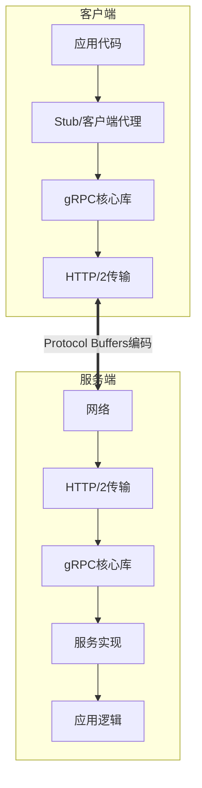
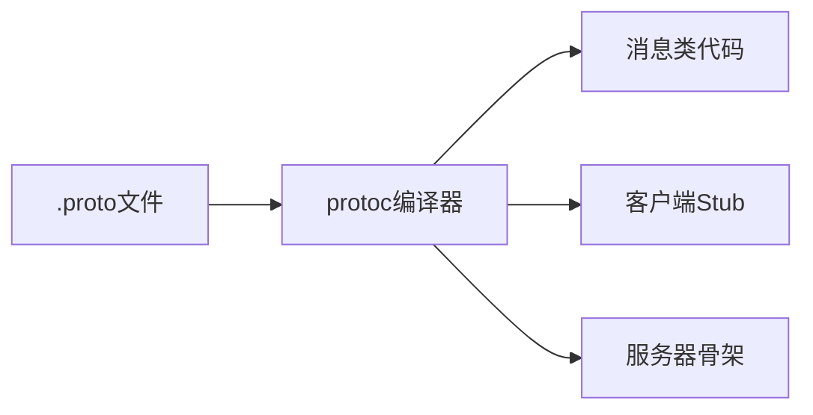
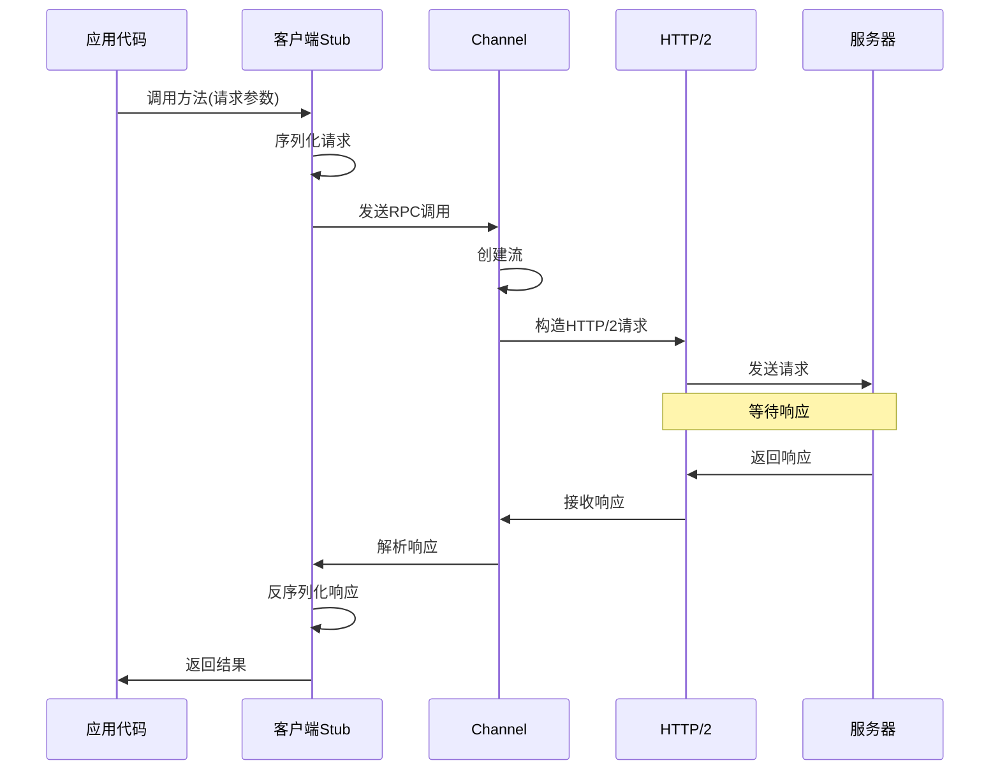
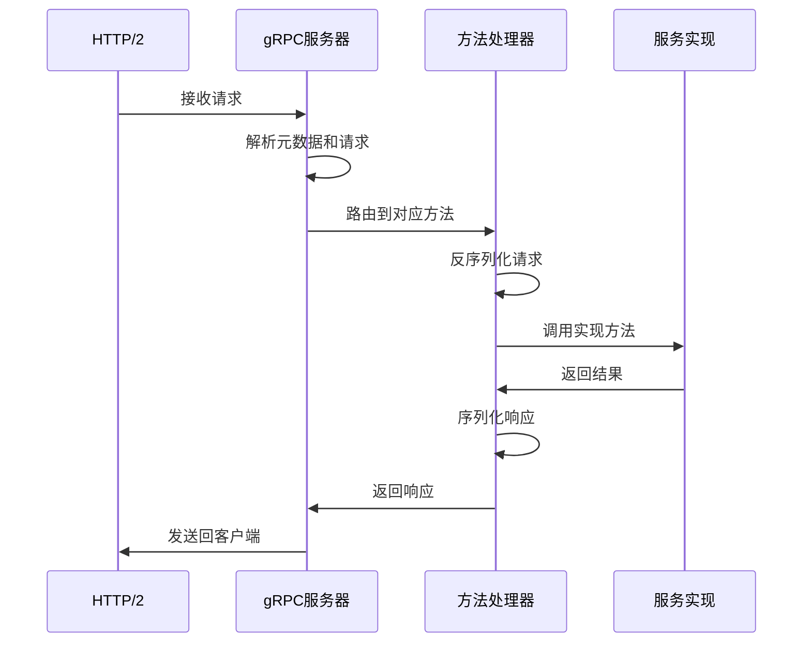
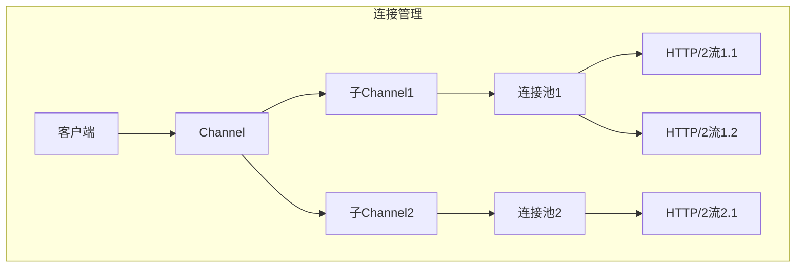
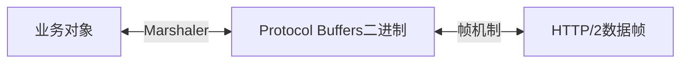
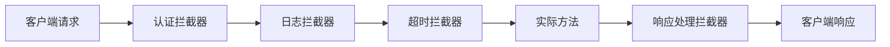

# gRPC 实现原理详解

gRPC 是一个高性能、通用的开源 RPC (远程过程调用) 框架，它使用 Protocol Buffers 作为接口描述语言。下面深入解析其实现原理。

## 核心架构



## 工作原理与流程

### 1. 接口定义 (.proto 文件)

```protobuf
syntax = "proto3";

package helloworld;

service Greeter {
  rpc SayHello(HelloRequest) returns (HelloReply) {}
}

message HelloRequest {
  string name = 1;
}

message HelloReply {
  string message = 1;
}
```

### 2. 代码生成

执行`protoc`命令后，gRPC 生成多个关键组件：



- **消息类**：请求和响应的数据结构
- **客户端Stub**：远程调用的代理
- **服务器骨架**：服务实现的接口和注册机制

### 3. 客户端调用流程



### 4. 服务端处理流程



## 关键实现技术

### 1. HTTP/2 传输层

gRPC 使用 HTTP/2 作为传输协议，提供核心优势：

- **多路复用**：单一 TCP 连接上处理多个请求
- **头部压缩**：减少网络开销
- **双向流**：支持服务器推送和流式 RPC
- **流量控制**：避免资源过度使用

### 2. 方法调用实现细节

客户端 Stub 代码如何工作：

```go
// 生成的客户端代码示例（Go）
func (c *greeterClient) SayHello(ctx context.Context, in *HelloRequest, opts ...grpc.CallOption) (*HelloReply, error) {
    // 构造请求描述符
    desc := &grpc.StreamDesc{
        StreamName:    "SayHello",
        ServerStreams: false,
        ClientStreams: false,
    }

    // 准备输出参数
    out := new(HelloReply)

    // 调用底层统一方法
    err := c.cc.Invoke(
        ctx,               // 上下文
        "/helloworld.Greeter/SayHello",  // 方法全限定名
        in,                // 请求参数
        out,               // 返回参数
        opts...            // 调用选项
    )

    return out, err  // 返回响应和错误
}
```

服务器端方法处理器实现：

```go
// methodHandler 如何适配实际的服务方法
func _Greeter_SayHello_Handler(srv interface{}, ctx context.Context, dec func(interface{}) error, interceptor grpc.UnaryServerInterceptor) (interface{}, error) {
    // 1. 解码请求
    in := new(HelloRequest)
    if err := dec(in); err != nil {
        return nil, err
    }

    // 2. 处理拦截器或直接调用
    if interceptor == nil {
        // 直接调用原始实现方法
        return srv.(GreeterServer).SayHello(ctx, in)
    }

    // 带拦截器调用的处理流程
    info := &grpc.UnaryServerInfo{
        Server:     srv,
        FullMethod: "/helloworld.Greeter/SayHello",
    }

    handler := func(ctx context.Context, req interface{}) (interface{}, error) {
        return srv.(GreeterServer).SayHello(ctx, req.(*HelloRequest))
    }

    // 使用拦截器链式调用
    return interceptor(ctx, in, info, handler)
}
```

### 3. 连接和通道管理



- **Channel**：客户端的逻辑连接，可管理多个子通道
- **连接池**：维护和复用 TCP 连接
- **流(Stream)**：HTTP/2 连接上的逻辑通道，真正传输请求/响应

### 4. 负载均衡

gRPC 支持多种负载均衡策略：

- **客户端负载均衡**：客户端直接选择连接的服务实例
- **代理负载均衡**：通过中间代理分发请求
- **Look-aside 负载均衡**：客户端向负载均衡器查询服务地址

### 5. 消息编解码



- **序列化**：将语言对象转换为二进制格式
- **分帧**：大消息被拆分为多个 HTTP/2 数据帧
- **压缩**：可选的消息压缩机制

## 调用类型支持

gRPC 支持四种调用模式：

1. **一元 RPC (Unary)**：传统请求-响应模式
2. **服务端流式 RPC**：客户端发送单个请求，服务器回复多个响应
3. **客户端流式 RPC**：客户端发送多个请求，服务器回复单个响应
4. **双向流式 RPC**：两端都可以独立发送多个消息

## 拦截器与中间件机制

拦截器是 gRPC 的核心扩展机制：



拦截器允许插入横切关注点，如：

- 认证和授权
- 监控和指标收集
- 日志记录
- 错误处理
- 限流和熔断

## 总结

gRPC 的核心实现原理是：

1. 通过 Protocol Buffers 定义服务接口和消息结构
2. 生成各语言的客户端和服务器代码
3. 使用 HTTP/2 作为高效传输层
4. 提供拦截器机制支持中间件功能
5. 封装复杂性，提供简洁API

这一设计使 gRPC 成为一个高性能、跨语言、可扩展的 RPC 框架，适用于微服务和分布式系统。
