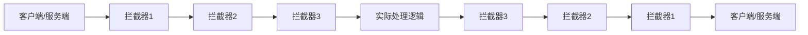
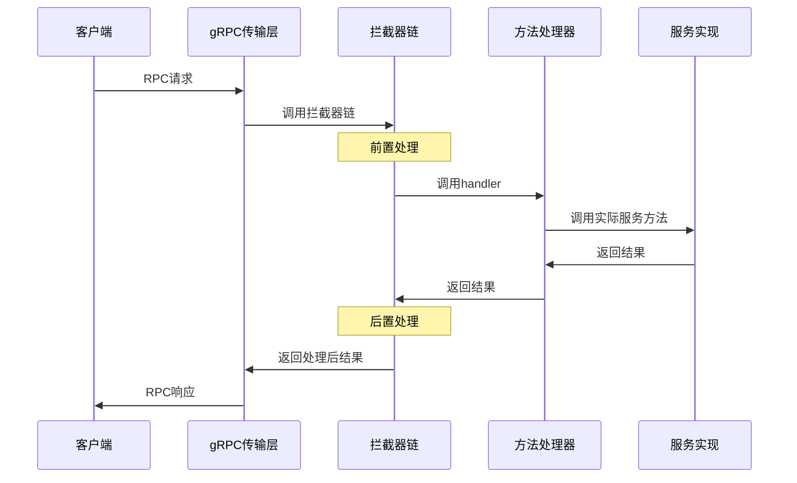
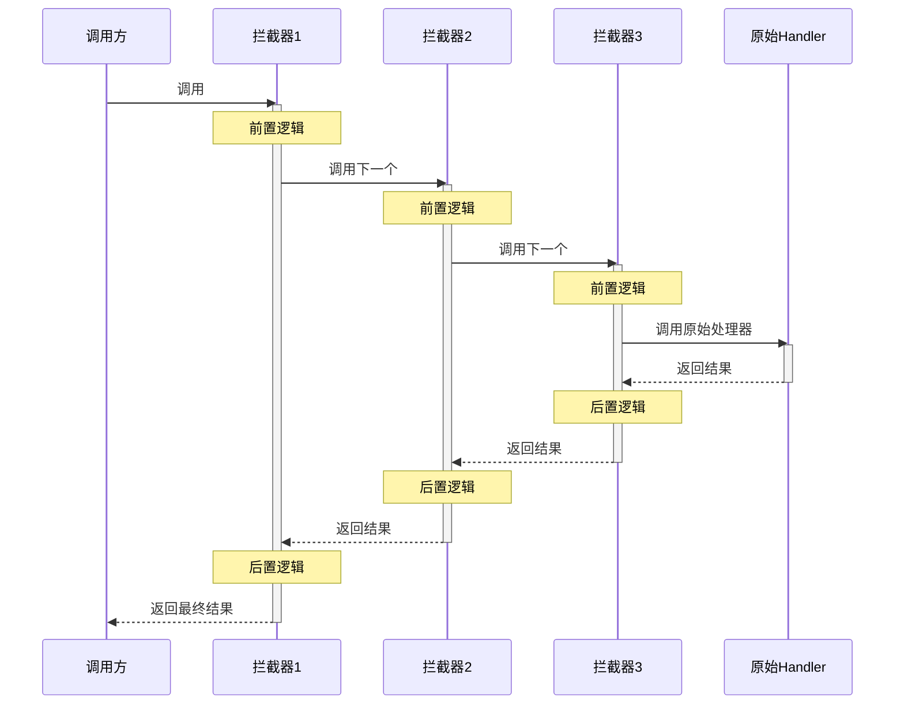
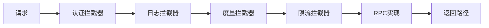

# gRPC 拦截器实现原理详解

拦截器是 gRPC 中的一个强大特性，允许开发者在 RPC 调用的执行路径中注入自定义逻辑。本文将深入解析其实现原理。

## 拦截器概念模型



gRPC 支持四种类型的拦截器：

- 一元客户端拦截器 (UnaryClientInterceptor)
- 流式客户端拦截器 (StreamClientInterceptor)
- 一元服务端拦截器 (UnaryServerInterceptor)
- 流式服务端拦截器 (StreamServerInterceptor)

## 一元服务端拦截器

### 定义与接口

在 Go 中，一元服务端拦截器的定义：

```go
type UnaryServerInterceptor func(
    ctx context.Context,
    req interface{},
    info *UnaryServerInfo,
    handler UnaryHandler
) (resp interface{}, err error)

type UnaryHandler func(ctx context.Context, req interface{}) (interface{}, error)

type UnaryServerInfo struct {
    Server interface{}
    FullMethod string
}
```

### 实现原理



在 gRPC 内部，拦截器是如何挂载的？

```go
// 简化的gRPC服务端注册实现
func (s *Server) RegisterService(sd *ServiceDesc, impl interface{}) {
    // 为每个方法创建处理器
    for _, method := range sd.Methods {
        // 创建方法处理器，并包装拦截器链
        handler := method.Handler

        // 应用拦截器
        if s.unaryInt != nil { // 如果有拦截器
            handler = func(srv interface{}, ctx context.Context, dec func(interface{}) error, interceptor UnaryServerInterceptor) (interface{}, error) {
                // 创建内部处理函数
                innerHandler := func(ctx context.Context, req interface{}) (interface{}, error) {
                    // 调用原始方法处理器
                    return method.Handler(srv, ctx, dec, nil)
                }

                // 通过拦截器调用内部处理函数
                return s.unaryInt(ctx, dec(nil), &UnaryServerInfo{
                    Server: srv,
                    FullMethod: method.MethodName,
                }, innerHandler)
            }
        }

        // 注册包装后的处理器
        s.handlers[method.MethodName] = handler
    }
}
```

### 多拦截器链式调用

gRPC 支持链式组合多个拦截器，实现类似中间件的功能：

```go
// ChainUnaryServer创建一个拦截器调用链
func ChainUnaryServer(interceptors ...UnaryServerInterceptor) UnaryServerInterceptor {
    // 如果拦截器为空，返回空拦截器
    n := len(interceptors)
    if n == 0 {
        return func(ctx context.Context, req interface{}, info *UnaryServerInfo, handler UnaryHandler) (interface{}, error) {
            return handler(ctx, req)
        }
    }

    // 创建一个递归调用链
    return func(ctx context.Context, req interface{}, info *UnaryServerInfo, handler UnaryHandler) (interface{}, error) {
        // 构建嵌套执行链
        var chainHandler UnaryHandler

        // 递归构建调用链，从最后一个拦截器开始
        chainHandler = func(currentInterceptor UnaryServerInterceptor, currentHandler UnaryHandler) UnaryHandler {
            return func(currentCtx context.Context, currentReq interface{}) (interface{}, error) {
                return currentInterceptor(currentCtx, currentReq, info, currentHandler)
            }
        }(interceptors[0], handler)

        // 按顺序组合其他拦截器
        for i := 1; i < n; i++ {
            chainHandler = func(currentInterceptor UnaryServerInterceptor, currentHandler UnaryHandler) UnaryHandler {
                return func(currentCtx context.Context, currentReq interface{}) (interface{}, error) {
                    return currentInterceptor(currentCtx, currentReq, info, currentHandler)
                }
            }(interceptors[i], chainHandler)
        }

        // 执行整个调用链
        return chainHandler(ctx, req)
    }
}
```

### 实际调用流程

当多个拦截器链接在一起时，调用流程：



## 一元客户端拦截器

### 定义与接口

```go
type UnaryClientInterceptor func(
    ctx context.Context,
    method string,
    req, reply interface{},
    cc *ClientConn,
    invoker UnaryInvoker,
    opts ...CallOption
) error

type UnaryInvoker func(
    ctx context.Context,
    method string,
    req, reply interface{},
    cc *ClientConn,
    opts ...CallOption
) error
```

### 实现原理

客户端拦截器在 gRPC 客户端内部实现：

```go
// 简化的gRPC客户端拦截器应用逻辑
func (cc *ClientConn) Invoke(
    ctx context.Context,
    method string,
    args, reply interface{},
    opts ...CallOption
) error {
    // 创建调用者函数
    var invoke = func(ctx context.Context, method string, args, reply interface{}, cc *ClientConn, opts ...CallOption) error {
        // 实际RPC调用逻辑
        return sendRequest(ctx, cc, method, args, reply, opts...)
    }

    // 如果有拦截器，包装调用者
    if cc.dopts.unaryInt != nil {
        // 通过拦截器调用
        return cc.dopts.unaryInt(ctx, method, args, reply, cc, invoke, opts...)
    }

    // 直接调用
    return invoke(ctx, method, args, reply, cc, opts...)
}
```

## 流式拦截器

### 服务端流式拦截器

```go
type StreamServerInterceptor func(
    srv interface{},
    ss ServerStream,
    info *StreamServerInfo,
    handler StreamHandler
) error

type StreamHandler func(srv interface{}, stream ServerStream) error

type StreamServerInfo struct {
    FullMethod     string
    IsClientStream bool
    IsServerStream bool
}
```

### 实现机制

流式拦截器的关键是包装流对象，拦截流操作：

```go
// 流拦截器的包装器
type wrappedServerStream struct {
    ServerStream
    ctx context.Context
}

func (w *wrappedServerStream) Context() context.Context {
    return w.ctx
}

// 流拦截器实现
func (s *Server) streamInterceptor(
    srv interface{},
    stream ServerStream,
    info *StreamServerInfo,
    handler StreamHandler,
) error {
    // 前置处理
    ctx := stream.Context()

    // 增强上下文或日志等
    enhancedCtx := addValuesToContext(ctx)

    // 包装流以传递增强的上下文
    wrappedStream := &wrappedServerStream{
        ServerStream: stream,
        ctx:          enhancedCtx,
    }

    // 调用实际处理器
    err := handler(srv, wrappedStream)

    // 后置处理
    if err != nil {
        logStreamError(err)
    }

    return err
}
```

## 拦截器实现的核心技术模式

### 1. 功能装饰器模式

拦截器本质上使用了装饰器模式，增强原始调用：

```go
// 装饰器模式示例
func loggingInterceptor(
    ctx context.Context,
    req interface{},
    info *UnaryServerInfo,
    handler UnaryHandler,
) (interface{}, error) {
    // 前置处理
    log.Printf("Before RPC: %s", info.FullMethod)
    startTime := time.Now()

    // 调用原始方法
    resp, err := handler(ctx, req)

    // 后置处理
    duration := time.Since(startTime)
    if err != nil {
        log.Printf("RPC failed: %v", err)
    }
    log.Printf("After RPC: %s (took %v)", info.FullMethod, duration)

    return resp, err
}
```

### 2. 责任链模式

多个拦截器的链式调用实现了责任链模式：



### 3. 函数闭包与上下文传递

拦截器大量使用闭包和上下文来传递状态：

```go
func withAuthInterceptor(authClient *AuthClient) UnaryServerInterceptor {
    // 闭包捕获authClient
    return func(ctx context.Context, req interface{}, info *UnaryServerInfo, handler UnaryHandler) (interface{}, error) {
        // 从上下文获取元数据
        md, ok := metadata.FromIncomingContext(ctx)
        if !ok {
            return nil, status.Error(codes.Unauthenticated, "no metadata")
        }

        // 获取认证令牌
        token := extractToken(md)

        // 验证令牌
        userInfo, err := authClient.Validate(token)
        if err != nil {
            return nil, status.Error(codes.Unauthenticated, err.Error())
        }

        // 将用户信息添加到上下文
        newCtx := context.WithValue(ctx, "user_info", userInfo)

        // 使用增强的上下文调用下一个处理器
        return handler(newCtx, req)
    }
}
```

## 典型拦截器应用场景

### 1. 认证授权

```go
func authInterceptor(ctx context.Context, req interface{}, info *UnaryServerInfo, handler UnaryHandler) (interface{}, error) {
    // 提取认证信息
    md, ok := metadata.FromIncomingContext(ctx)
    if !ok {
        return nil, status.Error(codes.Unauthenticated, "missing metadata")
    }

    // 验证token
    tokens := md.Get("authorization")
    if len(tokens) == 0 {
        return nil, status.Error(codes.Unauthenticated, "missing token")
    }

    // 验证通过，继续处理
    return handler(ctx, req)
}
```

### 2. 日志追踪

```go
func loggingInterceptor(ctx context.Context, req interface{}, info *UnaryServerInfo, handler UnaryHandler) (interface{}, error) {
    requestID := uuid.New().String()
    method := info.FullMethod

    // 增加请求ID到上下文
    ctx = context.WithValue(ctx, "request_id", requestID)

    log.Printf("[%s] Request: method=%s", requestID, method)

    start := time.Now()
    resp, err := handler(ctx, req)
    duration := time.Since(start)

    if err != nil {
        log.Printf("[%s] Error: method=%s, error=%v, duration=%v", requestID, method, err, duration)
    } else {
        log.Printf("[%s] Success: method=%s, duration=%v", requestID, method, duration)
    }

    return resp, err
}
```

### 3. 超时控制

```go
func timeoutInterceptor(timeout time.Duration) UnaryServerInterceptor {
    return func(ctx context.Context, req interface{}, info *UnaryServerInfo, handler UnaryHandler) (interface{}, error) {
        // 创建带超时的上下文
        ctx, cancel := context.WithTimeout(ctx, timeout)
        defer cancel()

        // 使用超时上下文调用处理器
        return handler(ctx, req)
    }
}
```

### 4. 重试机制

```go
func retryInterceptor(maxRetries int) UnaryClientInterceptor {
    return func(ctx context.Context, method string, req, reply interface{}, cc *ClientConn, invoker UnaryInvoker, opts ...CallOption) error {
        var lastErr error
        for attempt := 0; attempt <= maxRetries; attempt++ {
            if attempt > 0 {
                // 等待一段时间再重试
                backoffDuration := time.Duration(math.Pow(2, float64(attempt))) * 100 * time.Millisecond
                time.Sleep(backoffDuration)
                log.Printf("Retrying %s, attempt %d", method, attempt)
            }

            // 调用RPC
            err := invoker(ctx, method, req, reply, cc, opts...)
            if err == nil {
                return nil // 成功无需重试
            }

            // 检查错误是否可重试
            if isRetryable(err) {
                lastErr = err
                continue
            }

            // 不可重试的错误直接返回
            return err
        }

        return lastErr
    }
}

// 判断错误是否可重试
func isRetryable(err error) bool {
    if err == nil {
        return false
    }

    code := status.Code(err)
    switch code {
    case codes.Unavailable, codes.Aborted, codes.DeadlineExceeded, codes.ResourceExhausted:
        return true
    default:
        return false
    }
}
```

## 总结

gRPC 拦截器是一个优雅而强大的设计，通过函数组合、装饰器模式和责任链模式，实现了在 RPC 调用路径上插入自定义逻辑的能力。其核心实现依赖于：

1. **函数作为一等公民**：拦截器本身就是函数，可以被传递和组合
2. **闭包和上下文**：状态和配置通过闭包捕获和上下文传递
3. **链式调用**：多个拦截器可以组成调用链，形成中间件管道
4. **调用包装**：通过包装原始处理函数实现前后逻辑注入

理解拦截器的实现原理，有助于开发者更好地利用这一机制构建健壮、可扩展的 gRPC 应用。
