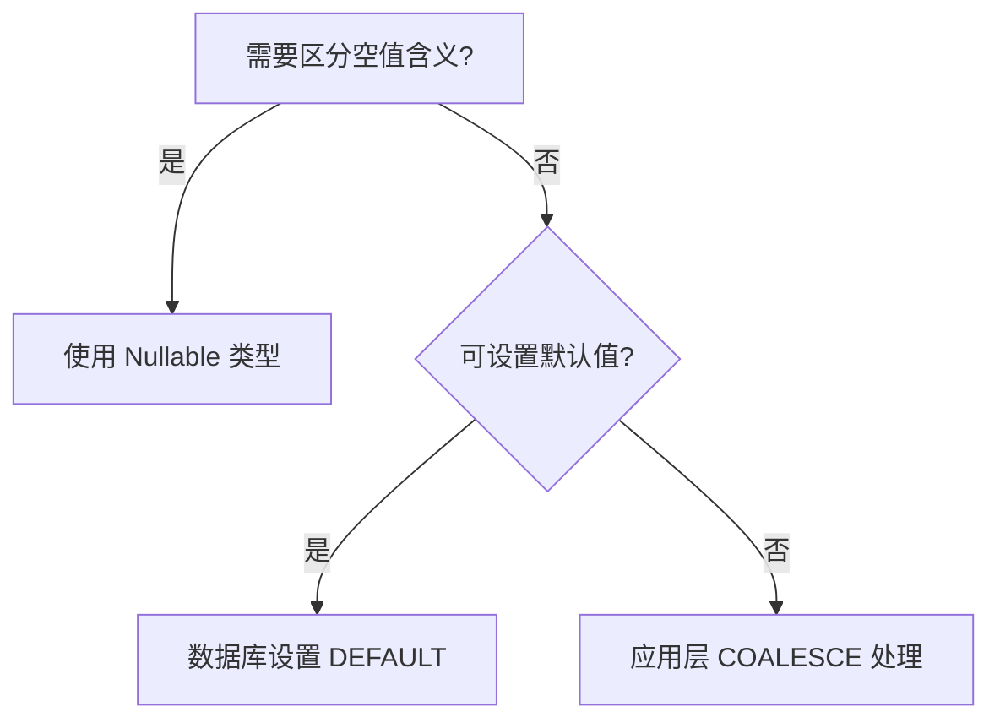

---
# Go 语言处理数据库 NULL 值的核心策略

以下是在 Go 中处理数据库 NULL 值的完整解决方案，包含最佳实践与深度技术分析：
---

## 一、标准库方案 (`sql.Null*` 类型)

### 1. 内置可空类型一览

| 标准类型  | 对应 Nullable 类型 | 数据范围         |
| --------- | ------------------ | ---------------- |
| string    | sql.NullString     | Valid 标记有效性 |
| int64     | sql.NullInt64      |                  |
| float64   | sql.NullFloat64    |                  |
| bool      | sql.NullBool       |                  |
| time.Time | sql.NullTime       |                  |

### 2. 标准使用模板

```go
var (
    id   int64
    name sql.NullString
    age  sql.NullInt64
)

err := rows.Scan(&id, &name, &age)
if name.Valid {
    fmt.Println("用户姓名:", name.String)
} else {
    fmt.Println("姓名为空")
}

if age.Valid {
    calcRetirement(age.Int64)
}
```

🔔 **关键要点**：

- 必须通过 `<Type>.Valid` 判断有效性后才能取值
- 空值场景明确且需单独处理的场景推荐使用

---

## 二、自定义可空类型方案

### 1. 扩展缺失类型示例 (NullUint64)

```go
type NullUint64 struct {
    Uint64 uint64
    Valid  bool
}

func (n *NullUint64) Scan(value interface{}) error {
    if value == nil {
        n.Uint64, n.Valid = 0, false
        return nil
    }
    n.Valid = true
    return convert.ConvertAssign(&n.Uint64, value)
}
```

### 2. 驱动接口实现要点

- 实现 `sql.Scanner` 接口
- 类型转换处理需兼容数据库驱动

---

## 三、数据库层优化方案

### 1. COALESCE 函数消除 NULL

```sql
SELECT
    COALESCE(nickname, '匿名用户') AS nickname,
    COALESCE(age, 18) AS age
FROM users
```

对应 Go 接收：

```go
var (
    nickname string // 直接使用基本类型
    age      int
)
rows.Scan(&nickname, &age)
```

⚡ **优势**：

- 统一代码中的数据类型处理
- 减少业务层判空逻辑
- 50+ 字段表结构处理效率提升明显

---

## 四、核心设计原则

### 1. NULL 回避优先策略

- **表设计规范**：所有字段默认 `NOT NULL`
- **空值替代方案**：
  ```sql
  ALTER TABLE products
    ADD COLUMN size INT NOT NULL DEFAULT 0;
  ```

### 2. 类型选择决策树



---

## 五、深度性能优化

### 1. 指针方案对比分析

```go
type User struct {
    Name *string  // 可能为 nil
    Age  *int
}

// Scan 示例:
var namePtr *string
if rawName != nil {
    name := string(rawName)
    namePtr = &name
}
```

✅ **适用场景**：结构体字段多且有动态处理需求  
⚠️ **隐患**：指针嵌套增加代码复杂度

### 2. 批量处理优化技巧

```go
// 预分配 Null 类型切片
users := make([]struct {
    Name sql.NullString
    Age  sql.NullInt64
}, 0, 1000)

for rows.Next() {
    var u struct{...}
    rows.Scan(&u.Name, &u.Age)
    users = append(users, u)
}
```

---

## 六、错误模式与规避

### ❌ 错误：直接使用基础类型接收

```go
var description string
err := row.Scan(&description) // 若数据库存 NULL 会报错！
```

### ✅ 正确：防御性转换

```go
var desc interface{}
row.Scan(&desc)
if desc != nil {
    description = string(desc.([]byte))
}
```

---

## 七、评估指标对照表

| 方案             | 代码复杂度 | 性能开销 | 可维护性 | 适用场景                 |
| ---------------- | ---------- | -------- | -------- | ------------------------ |
| sql.Null\* 类型  | 中         | 低       | 高       | 少量需要区分 NULL 的字段 |
| COALESCE 转换    | 低         | 极低     | 中       | 字段多且语义统一         |
| 自定义 Null 类型 | 高         | 中       | 中       | 特殊类型需求             |
| 指针方案         | 高         | 高       | 低       | 动态结构处理             |

通过合理运用这些策略，可在保证类型安全的前提下最大化代码简洁性与执行效率。
