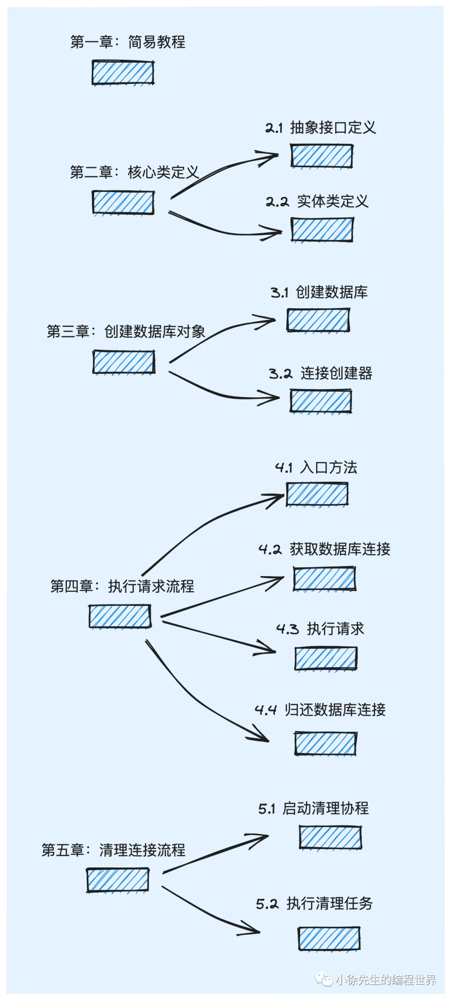

# Golang sql 标准库源码解析

https://mp.weixin.qq.com/s/ojDRfrotU8ByOTIYFZxF0g

## 1 简易教程

- 注册数据库驱动：使用数据库类型为 mysql，通过匿名导入 package:github.com/go-sql-driver/mysql，在该 pkg 的 init 函数中完成驱动的注册操作（这部分内容将在下期展开）

- 定义数据模型： 创建一个 user 表，里面包含一个 int64 类型的 userID 字段

- 创建数据库实例： 调用 database/sql 库的 Open 方法，填入 mysql 的 dsn（包含用户名、密码、ip、端口、数据库名等信息），完成数据库实例创建 （注意：sql.Open 方法只创建db 实例，还未执行任何连接操作，如需测试网络、鉴权等信息，可以调用 ping 方法）

- 执行查询 sql： 调用 db.QueryRowContext，执行 sql，并通过 row 返回结果

- 解析查询结果： 调用 row.Scan 方法，解析查询结果赋值给 user 实例

## 2 核心类定义

## 3 创建数据库对象

## 4 执行请求流程

## 5 清理连接流程

## 6 总结
