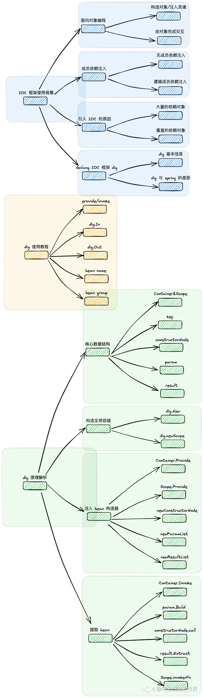
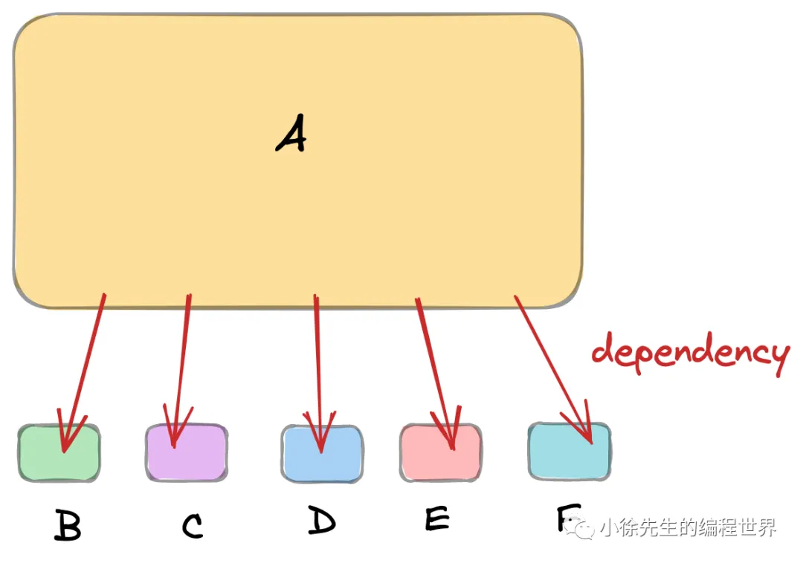
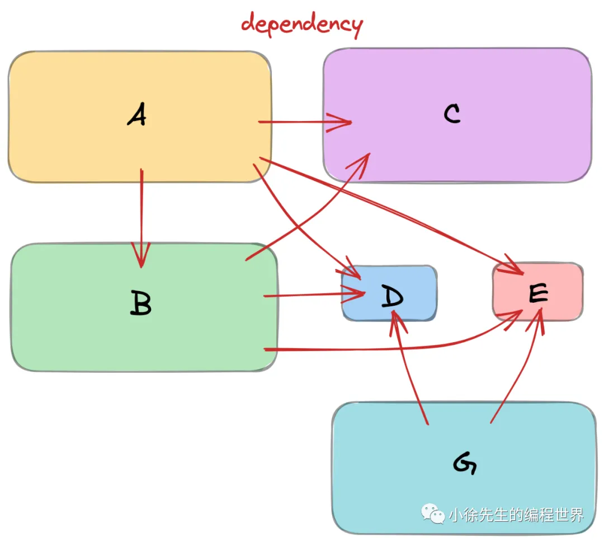
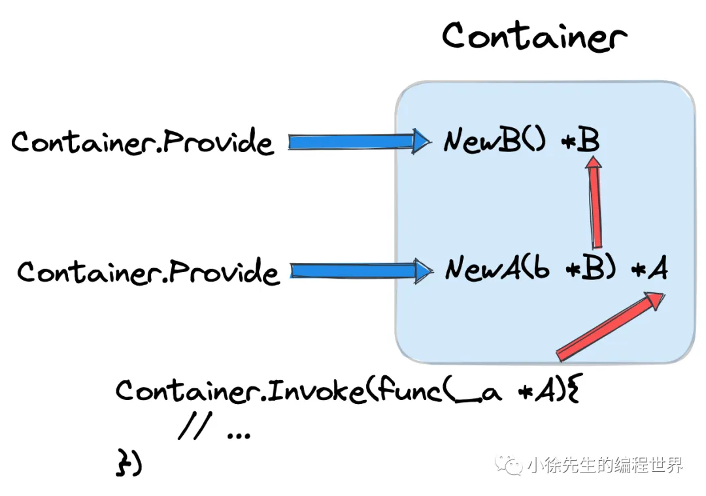
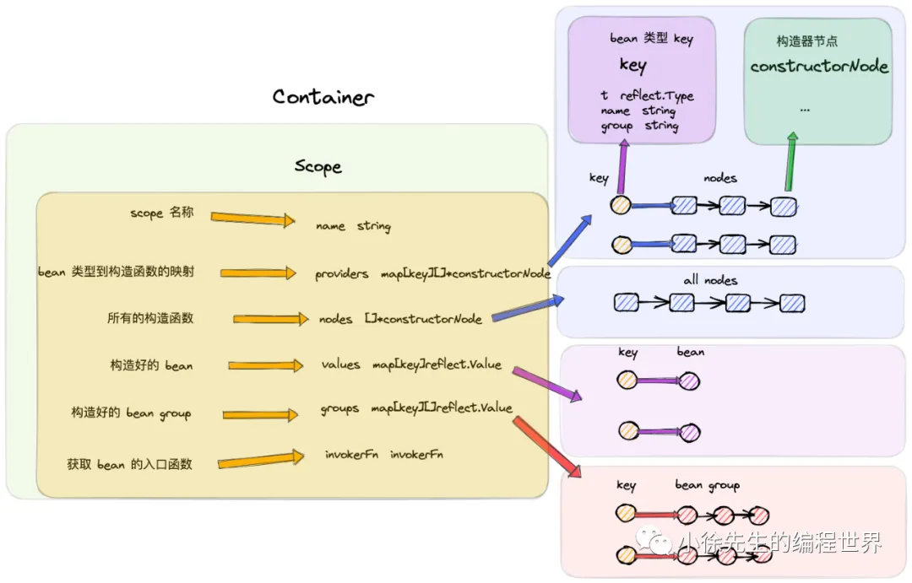
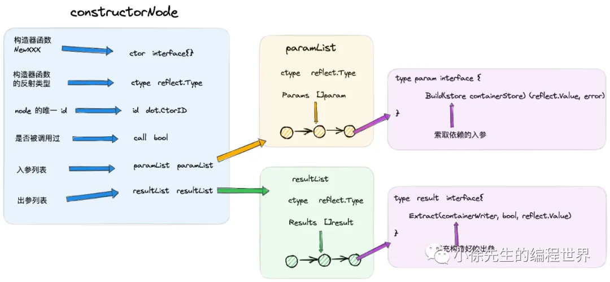
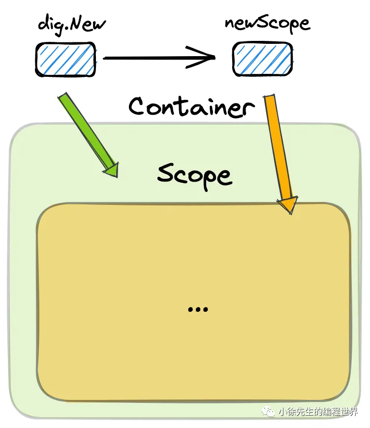
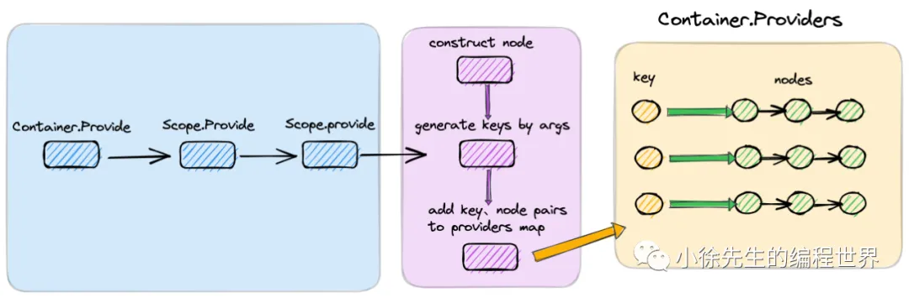
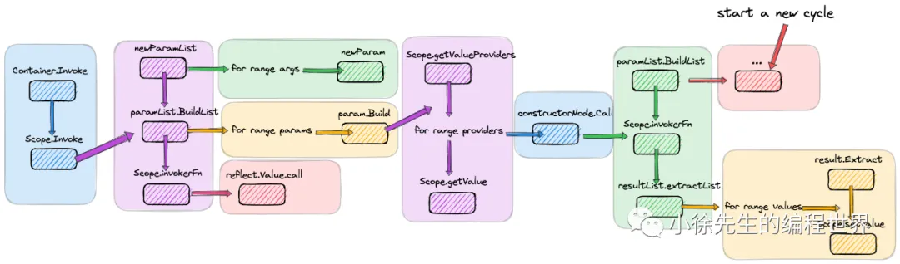

# 低配 Spring—Golang IOC 框架 dig 原理解析

https://mp.weixin.qq.com/s/bireIkWWTQUdgc-UJEhN5g


## 1. IOC 框架使用背景

1. 面向对象编程
   把大象装进冰箱需要几步？

   - 在`面向过程`编程的视角下：
     解决问题的核心是化整为零，把大问题拆解为一个个小问题，再针对小问题进行逐个击破.
     我们在编写代码时需要注重的是`步骤的拆分与流程的串联.`
   - 在`面向对象`编程的视角之下：
     一切皆为对象.

   ```go
   // 面向过程编程
   func putElephantIntoFridge(){
      // 打开冰箱门
      openFridge()
      // 把大象放进冰箱
      putElephant()
      // 关闭冰箱门
      openFridge()
   }

   // 面向对象编程
   func main(){
      // new 一只大象
      elephant := NewElephant()
      // new 一个冰箱
      fridge := NewFridge()
      // 冰箱装大象
      fridge.PutSomethingIn(elephant.Name, elephant)
   }
   ```

2. 成员依赖注入
   在日常业务代码的编写中，我个人会比较推崇面向对象的代码风格，原因如下：

   • 面向对象编程具有`封装、多态、继承`的能力，有利于系统模块之间的联动
   • 将系统各`模块划分`为一个个对象，划分边界、各司其职，使得`系统架构层级分明、边界清晰`
   • 对象中的核心成员属性能够被`复用`，避免重复构造

   上述的第三点需要基于`面向对象编程+成员依赖注入`的代码风格加以保证.

   ***

   依赖注入（Dependency Injection，简称 DI）流程为：
   当对象A需要依赖于另一个对象B协助完成工作时，不会在代码中临时创建对象B的实例，而是遵循以下几个步骤：

   • 前置将对象B声明为对象A的成员属性
   • 在初始化对象A的构造函数暴露出A对B的依赖。`B是接口。`
   • 于是在A初始化前，先压栈完成B的初始化工作
   • 将初始化后的B注入A的构造函数，完成A的初始化
   • 在A的生命周期内，完成对成员属性B的复用，不再重复创建

   倘若我们需要编写模块的单测代码，还可以实现 mock 成员变量的注入，从而实现外置依赖的代码逻辑的打桩，让单测逻辑能够好地聚焦在 Service 领域的业务代码.

3. 引入 IOC 的原因
   IOC，全称 Inversion of Control 控制反转，指的是将业务组件的创建、复制、管理工作`委托给业务代码之外的容器进行统一管理. 我们通常把容器称为 container，把各个业务组件称为 bean.`

- 大量的依赖对象
  
- 重复的依赖对象
  

↓↓↓

• 需要有一个全局的容器，实现对各个组件进行缓存复用
• 需要有一个全局管理对象，为我们梳理各对象间的依赖路径，依次完成依赖注入的工作

倘若 container 发现存在组件缺失，导致 bean 的依赖路径无法达成，则会抛出错误终止流程. `通常这个流程会在编译阶段或者程序启动之初执行，因此倘若依赖项存在缺失，也能做到尽早抛错、及时止损`，引导开发人员提前解决代码问题.

4. Golang IOC 框架 dig
   由 uber 开源的 dig，git开源地址为：https://github.com/uber-go/dig

   dig 能够为研发人员提供到前文提及的两项核心能力：
   • bean 单例管理
   • bean 依赖路径梳理

## 2 dig 使用教程

1. provide/invoke
   

   - `dig.New()`：创建一个新的容器
   - `Provide(constructor)`：注册对象的构造函数(依赖的有向边)
   - `Invoke(function)`：执行函数，自动注入所需依赖

   ```go
   // bean A，内部又依赖了 bean B
   type A struct {
       b *B
   }

   // bean A 构造器函数
   func NewA(b *B) *A {
       return &A{
           b: b,
       }
   }

   // bean B
   type B struct {
       Name string
   }

   // bean B 构造器函数
   func NewB() *B {
       return &B{
           Name: "i am b",
       }
   }

   // 使用示例
   func Test_dig(t *testing.T) {
       // 创建一个容器
       c := dig.New()

       // 注入各个 bean 的构造器函数
       _ = c.Provide(NewA)
       _ = c.Provide(NewB)

       // 注入 bean 获取器函数，并通过闭包的方式从中取出 bean
       var a *A
       _ = c.Invoke(func(_a *A) {
           a = _a
       })
       t.Logf("got a: %+v, got b: %+v", a, a.b)
   }
   ```

2. dig.In
   通过内置 dig.In 标识的方式替代构造函数，标志出 A 中所有可导出的成员变量均为依赖项.

   `可以不用构造函数加边，而是通过将依赖声明在结构体内，然后通过 dig.In 标识出来，dig 会自动识别出依赖项.`
   类似`@Inject`

   ```go
   // 标识A的依赖项B
   type A struct {
       dig.In
       B *B
   }

   type B struct {
       Name string
   }

   func NewB() *B {
       return &B{
           Name: "i am b",
       }
   }

   func Test_dig(t *testing.T) {
       // 创建一个容器
       c := dig.New()

       // 注入各个 bean 的构造器函数
       _ = c.Provide(NewB)

       // 使用 bean A 的 struct 形式，与 container 进行 Invoke 交互
       var a A
       _ = c.Invoke(func(_a A) {
           a = _a
       })

       t.Logf("got a: %+v, got b: %+v", a, a.B)
   }
   ```

3. dig.Out
   我们可以通过 dig.Out 声明，在 Provide 流程中将某个类的所有可导出成员属性均作为 bean 注入到 container 中.
   相当于手动注入bean。
   类似`@Injectable`

   ```go
   type A struct {
       dig.In
       B *B
       C *C
   }

   type B struct {
       Name string
   }

   func NewB() *B {
       return &B{
           Name: "i am b",
       }
   }

   type C struct {
       Age int
   }

   func NewC() *C {
       return &C{
           Age: 10,
       }
   }

   // 内置了 dig.Out
   type OutBC struct {
       dig.Out
       B *B
       C *C
   }

   // 返回 struct 类型，不得使用 pointer
   func NewOutBC() OutBC {
       return OutBC{
           B: NewB(),
           C: NewC(),
       }
   }

   func Test_dig(t *testing.T) {
       // 创建一个容器
       c := dig.New()

       // 注入各 dig.Out 的构造器函数，需要是 struct 类型
       _ = c.Provide(NewOutBC)

       var a A
       _ = c.Invoke(func(_a A) {
           a = _a
       })

       t.Logf("got a: %+v, got b: %+v, got c: %+v", a, a.B, a.C)
   }
   ```

4. bean name
   倘若存同种类型存在`多个不同的 bean 实例，上层需要进行区分使用`，此时 container 要如何进行标识和管理呢，答案就是通过 `name 标签`对 bean 进行标记

   ```go
   type A struct {
       dig.In
       // 分别需要名称为 b1 和 b2 的 bean
       B1 *B `name:"b1"`
       B2 *B `name:"b2"`
   }


   type OutB struct {
       dig.Out
       // 分别提供名称为 b1 和 b2 的 bean
       B1 *B `name:"b1"`
       B2 *B `name:"b2"`
   }
   ```

5. bean group
   依赖的是 bean list 该如何处理，这就需要用到 dig 中的 group 标签

   ```go
   type A struct {
       dig.In
       // 依赖的 bean list
       Bs []*B `group:"b_group"`
   }

   type B struct {
       Name string
   }

   func NewB1() *B {
       return &B{
           Name: "i am b111111",
       }
   }

   func NewB2() *B {
       return &B{
           Name: "i am b222222",
       }
   }

   type BGroup struct {
       dig.Out
       // 提供 bean list
       Bs []*B `group:"b_group,flatten"`
   }

   // 返回提供 bean list 的构造器函数
   func NewBGroupFunc(bs ...*B) func() BGroup {
       return func() BGroup {
           group := BGroup{
               Bs: make([]*B, 0, len(bs)),
           }
           group.Bs = append(group.Bs, bs...)
           return group
       }
   }

   func Test_dig(t *testing.T) {
       // 创建一个容器
       c := dig.New()

       // 注入各个 bean 的构造器函数
       _ = c.Provide(NewBGroupFunc(NewB1(), NewB2()))

       var a A
       _ = c.Invoke(func(_a A) {
           a = _a
       })

       t.Logf("got a: %+v, got b1: %+v, got b2: %+v", a, a.Bs[0], a.Bs[1])
   }
   ```

## 3. dig 原理解析

要点：

- 基于注入构造函数的方式，实现 bean 的创建
- 基于反射的方式，实现 bean 类型到到构造函数的映射
- 在运行时而非编译时实现 bean 的依赖路径梳理

1. 核心数据结构
   

- Container&Scope

```go
// 容器
type Container struct {
    // root Scope 节点
    scope *Scope
}

// 范围块
type Scope struct {
    // 一个 scope 块名称
    name string

    // 注册到该 scope块中的所有构造器函数
    nodes []*constructorNode

    // 构造器函数集合. key 是由 bean 类型和名称/组名构成的唯一键，val 是构造器函数列表. 可以看出，同一个 key 下，可能有多个构造器函数重复注入，但最终只会使用首个
    providers map[key][]*constructorNode

    // bean 缓存集合. key 的概念同 providers 中的介绍. val 为 bean 单例.
    values map[key]reflect.Value

    // bean group 缓存集合. key 的概念同 providers 中的介绍. val 为 相同 key 下的 bean 数组.
    groups map[key][]reflect.Value

    // ...
    // 从 scope 块中获取 bean 时的入口函数
    invokerFn invokerFn

    // 父 scope
    parentScope *Scope

    // 子 scope 列表
    childScopes []*Scope
}
```

- Key
  key 是容器中的唯一标识键, (type, name or group)

  ```go
  // 唯一标识键.
  type key struct {
      // bean 的类型
      t reflect.Type

      // 以下二者只会其一失效
      // bean 名称
      name  string
      // bean group 名称
      group string
  }
  ```

- constructorNode
  
  构造器函数的封装节点

```go
// 构造器节点
type constructorNode struct {
    // 构造器函数
    ctor  interface{}
    // 构造器函数类型
    ctype reflect.Type

    // 构造器函数的位置信息，比如包、文件、代码行数等
    location *digreflect.Func

    // 节点 id
    id dot.CtorID

    // 构造器函数是否被执行过了
    called bool

    // 入参 list
    paramList paramList

    // 出参 list
    resultList resultList

    // ...
}
```

2. 构造全局容器
   

```go
func newScope() *Scope {
    s := &Scope{
        providers:       make(map[key][]*constructorNode),
        // ...
        values:          make(map[key]reflect.Value),
        // ...
        groups:          make(map[key][]reflect.Value),
        // ...
        invokerFn:       defaultInvoker,
        // ...
    }
    // ...
    return s
}

func defaultInvoker(fn reflect.Value, args []reflect.Value) []reflect.Value {
    return fn.Call(args)
}
```

3. 注入 bean 构造器
   
   在 dig 中，将 bean 注入的方式有两类：
   • 一种是在 bean 中内置 dig.In 标识，执行一次 Invoke 方法会自动完成 bean 的注入工作
   • 另一种是通过 Container.Provide 方法，传入 bean 的构造器函数.

   核心方法 `Scope.provide`

   ```go
   func (s *Scope) provide(ctor interface{}, opts provideOptions) (err error) {
       // ...
       // 将构造器封装成一个节点
       n, err := newConstructorNode(
           // 构造器函数
           ctor,
           s,
           // 创建构造器时，可以通过 dig.Option 实现对 bean 或者 bean group 的命名设置
           constructorOptions{
               ResultName:  opts.Name,
               ResultGroup: opts.Group,
               // ...
           },
       )

       // 根据构造器的响应参数类型，构造出一系列的 key
       keys, err := s.findAndValidateResults(n.ResultList())

       // 创建一个 oldProviders map 用于在当前这次 Provide 操作发生错误时进行回滚
       oldProviders := make(map[key][]*constructorNode)
       for k := range keys {
           oldProviders[k] = s.providers[k]
           // 将本次 Provide 操作新生成的 key 和 node 注入到 Scope 的 providers map 当中
           s.providers[k] = append(s.providers[k], n)
       }

       // 循环依赖检测，倘若报错，会将 providers map 进行回滚，并抛出错误
       for _, s := range allScopes {
           // ...
       }

       // 将新生成的 node 添加到全局 nodes 数组当中
       s.nodes = append(s.nodes, n)

       // ...
       return nil
   }
   ```

4. 提取 bean
   

   ```go
   func (s *Scope) Invoke(function interface{}, opts ...InvokeOption) error {
       // 检查 bean 获取器函数类型
       ftype := reflect.TypeOf(function)
       if ftype == nil {
           return errors.New("can't invoke an untyped nil")
       }
       if ftype.Kind() != reflect.Func {
           return errf("can't invoke non-function %v (type %v)", function, ftype)
       }


       // 根据 bean 获取器函数的入参，获取其所需要的 param list(bean list)
       pl, err := newParamList(ftype, s)

       // 检查容器是否拥有足以构造出 bean 的完整链路，若有缺失的内容，则报错
       if err := shallowCheckDependencies(s, pl); err != nil {
           return errMissingDependencies{
               Func:   digreflect.InspectFunc(function),
               Reason: err,
           }
       }

       // 从容器中获取对应的 bean list
       // 先从缓存values中获取，如果没有则取providers中的构造器函数进行递归构建
       args, err := pl.BuildList(s)

       // 调用 bean Scope.invokerFn 方法，在内部会执行用户传入的 bean 获取器函数，在函数中会真正地取得 bean.
       returned := s.invokerFn(reflect.ValueOf(function), args)
       // ...
   }
   ```
