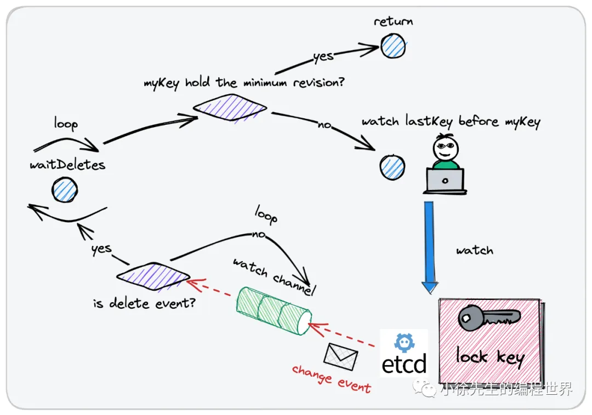

# Golang 分布式锁技术攻略

https://mp.weixin.qq.com/s/KYiZvFRX0CddJVCwyfkLfQ

## 0. 前言

- etcd 的 watch 机制，这是一项可以应用于实现分布式锁的核心能力
- 单机锁的升级版本——Golang 分布式锁技术
  1. 通过 redis 实现`主动轮询模型下的分布式锁`
  2. 使用 etcd 实现 watch `回调模型下的分布式锁`

## 1. 分布式锁

1. 使用背景
   - 在并发场景中，为了保证临界资源的数据一致性，我们会经常使用到“锁”这个工具对临界资源进行保护，`让混乱的并发访问行为退化为秩序的串行访问行为.`；
   - 在本地环境中，由于多线程之间能够`共享进程的数据`，因此可以比较简单地实现进程内的互斥锁；
   - 在分布式场景中，有时我们需要`跨多个物理节点执行加锁操作`，因此我们就需要依赖到类似于 redis、mysql 这样的`状态存储组件`，在此基础之上实现所谓的“分布式锁”技术.
2. 核心性质
   - 独占性(exclusive)
   - 健壮性(robust)
     不能产生死锁
   - 对称性(symmetric)
     加锁和解锁的使用方必须为同一身份. 不允许非法释放他人持有的分布式锁
   - 高可用(availability)
     应对故障能力强
3. 实现类型
   

   - `主动轮询型(redis、mysql)`
     该模型类似于单机锁中的主动轮询 + cas 乐观锁模型，取锁方会持续对分布式锁发出尝试获取动作;
     如果锁已被占用则会不断发起重试，直到取锁成功为止.`（类似自旋+cas）`
   - `watch 回调型(etcd、zookeeper)`
     在取锁方发现锁已被他人占用时，会创建 watcher 监视器订阅锁的释放事件，随后不再发起主动取锁的尝试；
     当锁被释放后，取锁方能通过之前创建的 watcher 感知到这一变化，然后再重新发起取锁的尝试动作 `（类似阻塞/唤醒）`

4. 理解
   - 分布式场景中”轮询“这一动作的成本相比于单机锁而言要高很多，背后存在的行为可能是一次甚至多次网络 IO 请求；
   - watch 机制在实现过程中需要建立长连接完成 watch 监听动作，也会存在一定的资源损耗，有多个尝试取锁的使用方 watch 监听同一把锁时，一次锁的释放事件可能会引发“惊群效应”
   - **在并发激烈程度较高时倾向于 watch 回调型分布式锁；反之，主动轮询型分布式锁可能会是更好的选择.**

## 2. 主动轮询型

1. 实现思路
   

   - 一个 Key 对应一把锁
   - SETNX 视为加锁操作，DEL 视为解锁操作
   - 插入该条数据时，发现数据已经存在（锁已被他人持有），则持续轮询，直到数据被他人删除（他人释放锁），并由自身完成数据插入动作为止（取锁成功）

   SETNX : 检查 Key 是否存在，如果不存在则插入数据；要求是一个原子操作；在 redis 中是 set only if not exist —— SETNX 操作

2. 技术选型
   redis 和 mysql

   - redis
     redis 基于内存实现数据的存储，因此足够高轻便高效.
     此外，redis 基于单线程模型完成数据处理工作，支持 SETNX 原子指令（set only if not exist），能够很方便地支持分布式锁的加锁操作.
     redis 还支持使用 lua 脚本自定义组装同一个 redis 节点下的多笔操作形成一个具备原子性的事务
   - mysql
     key 为 mysql 表的唯一键；
     使用 innodb 引擎事务保证操作的原子性。

3. 死锁问题

   - redis 的 expire time (EX) 机制防止死锁
     - 即便使用方因为异常原因导致无法正常解锁，锁对应的数据项也会在达到过期时间阈值后被自动删除，实现释放分布式锁的效果.
       缺点是，无法预先知道锁的过期时间，可能会导致`锁提前释放`的问题，其他取锁方可能取锁成功，`最终引起数据不一致的并发问题.`
     - `分布式锁工具 redisson 中给出了解决方案——看门狗策略（watch dog strategy）`：
       在锁的持有方未完成业务逻辑的处理时，会持续对分布式锁的过期阈值进行延期操作

4. 弱一致性问题
   为避免单点故障问题，redis 会基于`主从复制的方式实现数据备份`.

   > （以哨兵机制为例，哨兵会持续监听 master 节点的健康状况，倘若 master 节点发生故障，哨兵会负责扶持 slave 节点上位，以保证整个集群能够正常对外提供服务）.

   此外，在 CAP 体系中，`redis 走的是 AP 路线`，为保证服务的吞吐性能，`主从节点之间的数据同步是异步延迟进行的.`
   如果加锁时宕机，就出现了一把锁被多方同时持有的问题。
   关于这个问题，一个比较经典的解决方案是：**redis 红锁（redlock，全称 redis distribution lock）**

## 3. watch 回调型

1. 实现思路
   
   
2. 技术选型
3. 死锁问题
   
   
   倘若分布式锁的持有者出现异常状况导致无法正常解锁，则可以通过租约的过期机制完成对分布式锁的释放，死锁问题因此得以规避.
4. 惊群效应
   羊群中一旦有某只羊出现异动，其他的羊也会不假思索地一哄而上跑动起来，全然不估计附近可能有狼或者何处有更好的草源等客观问题.
   etcd 中提供了前缀 prefix 机制以及版本 revision 机制，和 zookeeper 的临时顺序节点功能有些类似
   

---

## redis 分布式锁

1. sdk 介绍
   redigo 开源地址：https://github.com/gomodule/redigo
   https://github.com/xiaoxuxiansheng/redis_lock
2. 源码介绍

- redis 客户端
  • 在 redigo 的基础之上，封装实现了一个 redis 客户端 Client，内置了一个连接池 redis.pool 进行 redis 连接的复用
  • 客户端 Client 对外暴露了 SetNEX 方法，语义是 set with expire time only if key not exist. 用于支持分布式锁的加锁操作
  • 客户端 Client 对外暴露了 Eval 方法，用以执行 lua 脚本，后续用来支持分布式锁的解锁操作
- redis 分布式锁

```go
// 基于 redis 实现的分布式锁，不可重入，但保证了对称性
type RedisLock struct {
    LockOptions
    key    string
    token  string
    client *Client
}
```

- 非阻塞模式加锁
  • 倘若锁处于非阻塞模式，则只会执行一次 tryLock 方法进行尝试加锁动作，倘若失败，就直接返回错误
  • tryLock 操作基于 redis 的 setNEX 操作实现，即基于原子操作实现 set with expire time only if key not exist 的语义
- 阻塞模式加锁
  

  ```go
  func (r *RedisLock) blockingLock(ctx context.Context) error {
      // 阻塞模式等锁时间上限
      timeoutCh := time.After(time.Duration(r.blockWaitingSeconds) * time.Second)
      // 轮询 ticker，每隔 50 ms 尝试取锁一次
      ticker := time.NewTicker(time.Duration(50) * time.Millisecond)
      defer ticker.Stop()

      for range ticker.C {
          select {
          // ctx 终止了
          case <-ctx.Done():
              return fmt.Errorf("lock failed, ctx timeout, err: %w", ctx.Err())
              // 阻塞等锁达到上限时间
          case <-timeoutCh:
              return fmt.Errorf("block waiting time out, err: %w", ErrLockAcquiredByOthers)
          // 放行
          default:
          }

          // 尝试取锁
          err := r.tryLock(ctx)
          if err == nil {
              // 加锁成功，返回结果
              return nil
          }

          // 不可重试类型的错误，直接返回
          if !IsRetryableErr(err) {
              return err
          }
      }

      return nil
  }
  ```

- 解锁
  • 解锁动作基于 lua 脚本执行
  • lua 脚本执行内容分为两部分：【（1）校验当前操作者是否拥有锁的所有权（2）倘若是，则释放锁】

## etcd 分布式锁

1. sdk 介绍
   https://github.com/etcd-io/etcd
   etcd 作者在 etcd 的 concurrency 包下，基于 watch 机制结合 revision 机制实现了一款通用的 etcd 分布式锁
2. 实现源码
   

- Session
  一次session就是一次会话，对应一笔租约lease。

• 通过 client.Grant 方法申请到一个 lease id
• 调用 client.KeepAlive 方法持续对租约进行续期
• 构造一个会话 session 实例
• 异步开启一个守护协程，进行租约续期响应参数的处理（keepAlive）

```go
const defaultSessionTTL = 60

// Session represents a lease kept alive for the lifetime of a client.
// Fault-tolerant applications may use sessions to reason about liveness.
type Session struct {
    client *v3.Client
    opts   *sessionOptions
    id     v3.LeaseID

    cancel context.CancelFunc
    donec  <-chan struct{}
}

// NewSession gets the leased session for a client.
func NewSession(client *v3.Client, opts ...SessionOption) (*Session, error) {
    lg := client.GetLogger()
    ops := &sessionOptions{ttl: defaultSessionTTL, ctx: client.Ctx()}
    for _, opt := range opts {
        opt(ops, lg)
    }

    id := ops.leaseID
    if id == v3.NoLease {
        resp, err := client.Grant(ops.ctx, int64(ops.ttl))
        if err != nil {
            return nil, err
        }
        id = resp.ID
    }

    ctx, cancel := context.WithCancel(ops.ctx)
    keepAlive, err := client.KeepAlive(ctx, id)
    if err != nil || keepAlive == nil {
        cancel()
        return nil, err
    }

    donec := make(chan struct{})
    s := &Session{client: client, opts: ops, id: id, cancel: cancel, donec: donec}

    // keep the lease alive until client error or cancelled context
    go func() {
        defer close(donec)
        for range keepAlive {
            // eat messages until keep alive channel closes
        }
    }()

    return s,nil
}

// Close orphans the session and revokes the session lease.
func (s *Session) Close() error {
    s.Orphan()
    // if revoke takes longer than the ttl, lease is expired anyway
    ctx, cancel := context.WithTimeout(s.opts.ctx, time.Duration(s.opts.ttl)*time.Second)
    _, err := s.client.Revoke(ctx, s.id)
    cancel()
    return err
}

// Orphan ends the refresh for the session lease. This is useful
// in case the state of the client connection is indeterminate (revoke
// would fail) or when transferring lease ownership.
func (s *Session) Orphan() {
    s.cancel()
    <-s.donec
}
```

- Mutex

Mutex 是 etcd 分布式锁的类型

```go
// Mutex implements the sync Locker interface with etcd
type Mutex struct {
    s *Session

    pfx   string  // 分布式锁的公共前缀
    myKey string  // 当前锁使用方完整的 lock key，由 pfx 和 lease id 两部分拼接而成
    myRev int64  // 当前锁使用方 lock key 在公共锁前缀 pfx 下对应的版本 revision
    hdr   *pb.ResponseHeader
}

func NewMutex(s *Session, pfx string) *Mutex {
    return &Mutex{s, pfx + "/", "", -1, nil}
}
```

- `TryLock`
  

  • 调用 Mutex.tryAcquire 方法插入 my key（已存在则查询），获取到 my key 对应的 revision 以及当前锁的实际持有者
  • 倘若锁 pfx 从未被占用过，或者锁 pfx 下存在的 revision 中，自身的 revision 是其中最小的一个，则说明自己加锁成功
  • 倘若锁已经被其他人占用，则删除自己加锁时创建的 kv 对记录，然后返回锁已被他人占用的错误

- `Lock`
  
  阻塞加锁

  • 倘若锁已被他人占用，调用 waitDeletes 方法，watch 监听 revision 小于自己且最接近于自己的锁记录数据的删除事件
  • 当接收到解锁事件后，会再检查一下自身的租约有没有过期，如果没有，则说明加锁成功

  ```go
  // Lock locks the mutex with a cancelable context. If the context is canceled
  // while trying to acquire the lock, the mutex tries to clean its stale lock entry.
  func (m *Mutex) Lock(ctx context.Context) error {
    resp, err := m.tryAcquire(ctx)
    if err != nil {
        return err
    }
    // if no key on prefix / the minimum rev is key, already hold the lock
    ownerKey := resp.Responses[1].GetResponseRange().Kvs
    if len(ownerKey) == 0 || ownerKey[0].CreateRevision == m.myRev {
        m.hdr = resp.Header
        return nil
    }
    client := m.s.Client()
    // wait for deletion revisions prior to myKey
    // TODO: early termination if the session key is deleted before other session keys with smaller revisions.
    _, werr := waitDeletes(ctx, client, m.pfx, m.myRev-1)
    // release lock key if wait failed
    if werr != nil {
        m.Unlock(client.Ctx())
        return werr
    }

    // make sure the session is not expired, and the owner key still exists.
    gresp, werr := client.Get(ctx, m.myKey)
    if werr != nil {
        m.Unlock(client.Ctx())
        return werr
    }

    if len(gresp.Kvs) == 0 { // is the session key lost?
        return ErrSessionExpired
    }
    m.hdr = gresp.Header

    return nil
  }
  ```

- `tryAcquire`
  

  ```go
  func (m *Mutex) tryAcquire(ctx context.Context) (*v3.TxnResponse, error) {
      s := m.s
      client := m.s.Client()
      m.myKey = fmt.Sprintf("%s%x", m.pfx, s.Lease())
      cmp := v3.Compare(v3.CreateRevision(m.myKey), "=", 0)

      // put self in lock waiters via myKey; oldest waiter holds lock
      put := v3.OpPut(m.myKey, "", v3.WithLease(s.Lease()))
      // reuse key in case this session already holds the lock
      get := v3.OpGet(m.myKey)
      // fetch current holder to complete uncontended path with only one RPC
      getOwner := v3.OpGet(m.pfx, v3.WithFirstCreate()...)

      resp, err := client.Txn(ctx).If(cmp).Then(put, getOwner).Else(get, getOwner).Commit()
      if err != nil {
          return nil, err
      }

      m.myRev = resp.Header.Revision
      if !resp.Succeeded {
          m.myRev = resp.Responses[0].GetResponseRange().Kvs[0].CreateRevision
      }
      return resp, nil
  }
  ```

- `waitDeletes`
  
  • 基于一个 for 循环实现自旋
  • 每轮处理中，会获取 revision 小于自己且最接近于自己的取锁方的 key
  • 倘若 key 不存在，则说明自己的 revision 已经是最小的，直接取锁成功
  • 倘若 key 存在，则调用 waitDelete 方法阻塞监听这个 key 的删除事件

- `unlock`
  解锁时`直接删除自己的 kv 对记录`即可
