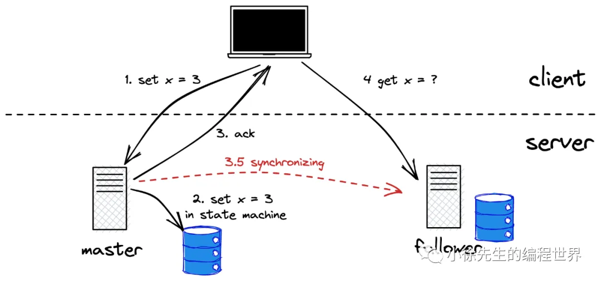
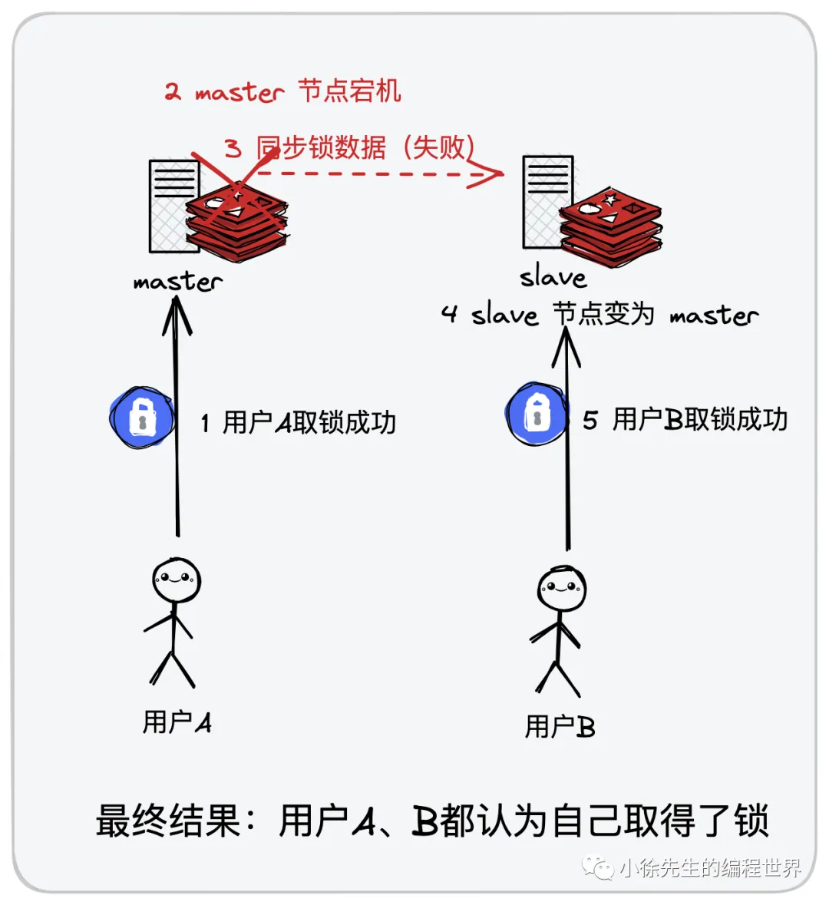
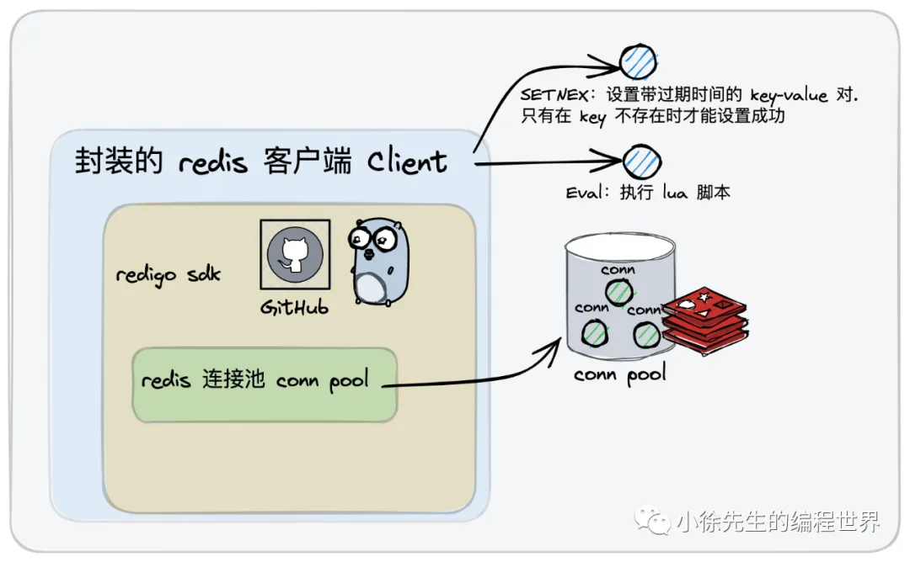
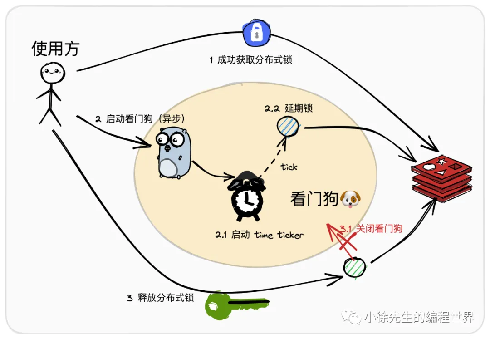
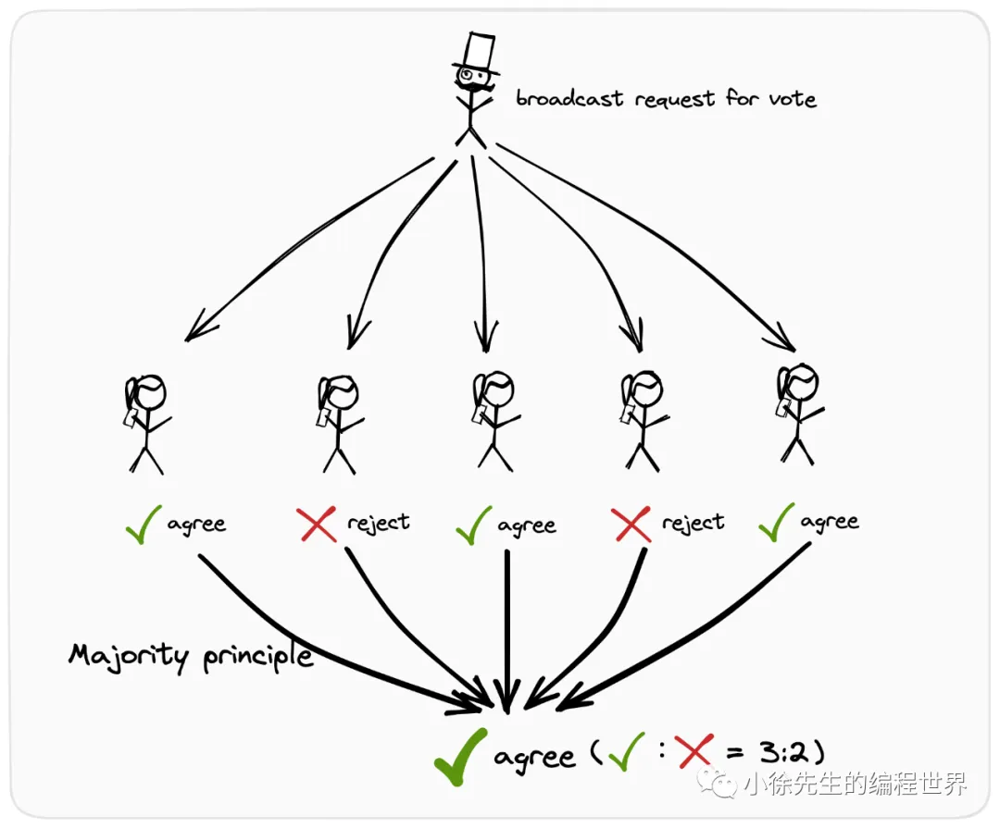

# Redis分布式锁进阶篇

https://mp.weixin.qq.com/s/3zuATaua6avMuGPjYEDUdQ
https://github.com/981377660LMT/redis_lock.git

## 1 redis 分布式锁实现原理

1. 基本思路：
   SETNX + EXPIRE 加锁，Lua脚本解锁。
2. 死锁 -> 过期时间不精准问题
   分布式锁工具 redisson 中给出了解决方案——看门狗策略（watch dog strategy）：在锁的持有方执行业务逻辑处理的过程中时，需要异步启动一个`看门狗守护协程，持续为分布式锁的过期阈值进行延期操作`
3. 数据弱一致性问题
   
   
   
   一个比较经典的解决方案是：redis 红锁（redlock，全称 redis distribution lock）. redLock 的策略是通过增加锁的数量并基于多数派准则来解决这个问题.

## 2 redis 分布式锁实现源码

[在 golang redis 客户端 redigo 基础上实现的 redis 分布式锁开源框架](https://github.com/xiaoxuxiansheng)


## 3 watch dog 实现原理、源码解析

1. 续约机制
   异步协程续约的好处：
   • 使用方规避了因为业务逻辑处理过长，导致租约数据（包含了分布式锁）提前过期释放的问题（因为有续约协程持续进行续约）
   • 规避了因锁持有方宕机导致租约数据无法释放，内部包含的分布式锁产生死锁问题（倘若持有方宕机了，那续约协程也就停止工作了，续约工作未正常执行，租约会在下一个过期时间节点被回收，包含的锁数据也就释放了）
2. redisson
   watchDog 这种思路的出处，是源自于一款基于 java 编写的 redis 分布式锁工具 redisson 当中
3. 看门狗 watchDog
   

## 4 red lock 实现原理、源码解析

1. 多数派原则
   
2. 红锁 redLock
   红锁 Redlock 全称 redis distribution lock，是 redis 作者 antirez 提出的一种分布式锁实现方案.

   • 每次客户端尝试进行加锁操作时，会同时对2N+1个节点发起加锁请求
   • 每次客户端向一个节点发起加锁请求时，会设定一个很小的请求处理超时阈值
   • 倘若加锁请求成功数量大于等于N+1（多数派），则视为红锁加锁成功
   • 倘若加锁请求成功数量小于N+1，视为红锁加锁失败，此时会遍历2N+1个节点进行解锁操作，有利于资源回收，提供后续使用方的取锁效率

3. 实现源码

```go
package redis_lock

import (
	"context"
	"errors"
	"sync"
	"time"
)

// 红锁中每个节点默认的处理超时时间为 50 ms
const DefaultSingleLockTimeout = 50 * time.Millisecond

type RedLock struct {
	mu           sync.Mutex
	locks        []*RedisLock
	successLocks []*RedisLock
	RedLockOptions
}

// 用户在创建红锁时，需要通过传入一个 SingleNodeConf 列表的方式，显式指定每个 redis 锁节点的地址信息
func NewRedLock(key string, confs []*SingleNodeConf, opts ...RedLockOption) (*RedLock, error) {
	// 红锁必须有3 个节点以上
	if len(confs) < 3 {
		return nil, errors.New("ERROR: Can not use RedLock less than 3 nodes")
	}

	r := RedLock{}
	for _, opt := range opts {
		opt(&r.RedLockOptions)
	}

	repairRedLock(&r.RedLockOptions)
	if r.expireDuration > 0 && time.Duration(len(confs))*r.singleNodesTimeout*10 > r.expireDuration {
		// 要求所有节点累计的超时阈值要小于分布式锁过期时间的十分之一
		return nil, errors.New("ERROR: expire thresholds of single node is too long")
	}

	r.locks = make([]*RedisLock, 0, len(confs))
	r.successLocks = make([]*RedisLock, 0, len(confs))
	for _, conf := range confs {
		client := NewClient(conf.Network, conf.Address, conf.Password, conf.Opts...)
		r.locks = append(r.locks, NewRedisLock(key, client, WithExpireSeconds(int64(r.expireDuration.Seconds()))))
	}

	return &r, nil
}

func (r *RedLock) Lock(ctx context.Context) error {
	r.mu.Lock()

	successCount := 0
	for _, lock := range r.locks {
		startTime := time.Now()
		err := lock.Lock(ctx)
		cost := time.Since(startTime)
		if err == nil && cost <= r.singleNodesTimeout {
			r.successLocks = append(r.successLocks, lock)
			successCount++
		}
	}

	// 超过半数失败了
	if successCount < (len(r.locks)>>1 + 1) {
		// 对之前成功加锁的内容进行回滚
		for _, lock := range r.successLocks {
			lock.Unlock(ctx)
		}
		r.mu.Unlock()

		return errors.New("ERROR: RedLock lock failed")
	}

	r.mu.Unlock()
	return nil
}

func (r *RedLock) UnLock(ctx context.Context) error {
	r.mu.Lock()
	defer r.mu.Unlock()

	var err error
	// 只处理加锁成功的部分
	for _, lock := range r.successLocks {
		if _err := lock.Unlock(ctx); _err != nil {
			err = _err
		}
	}

	return err
}


```
