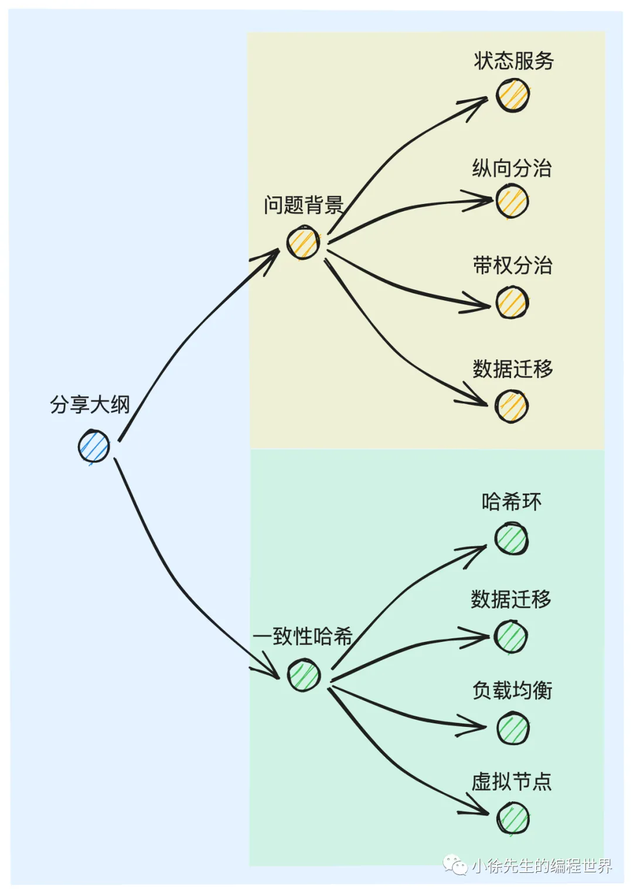
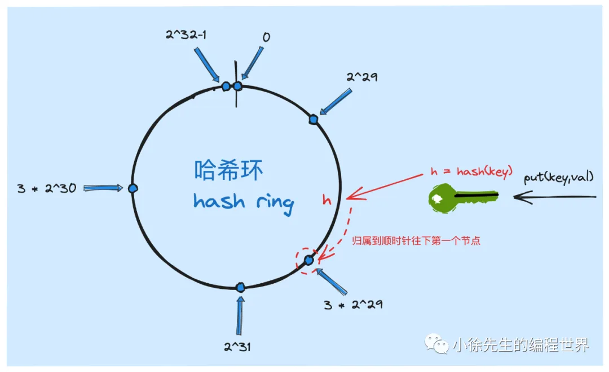
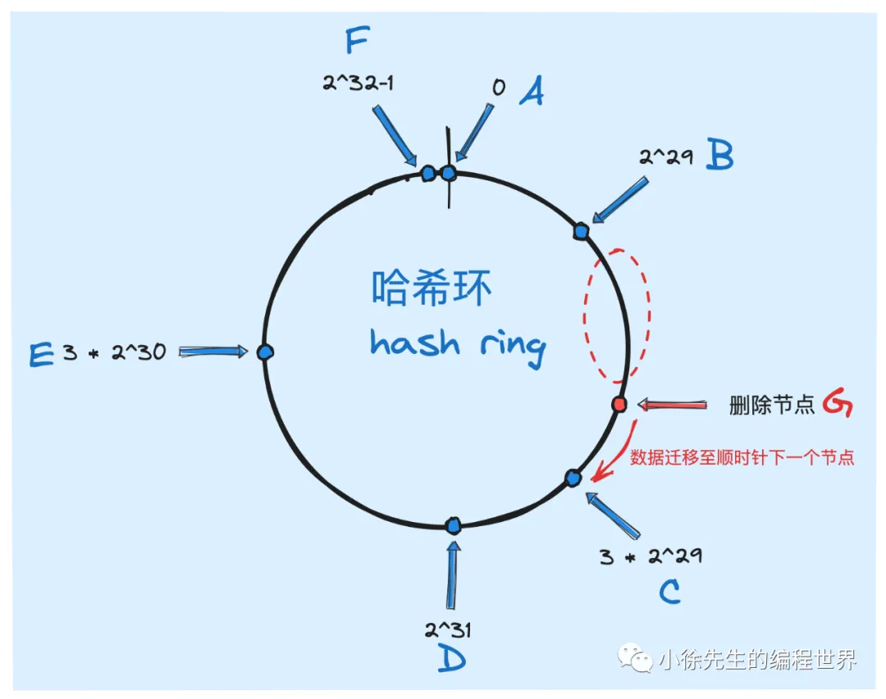
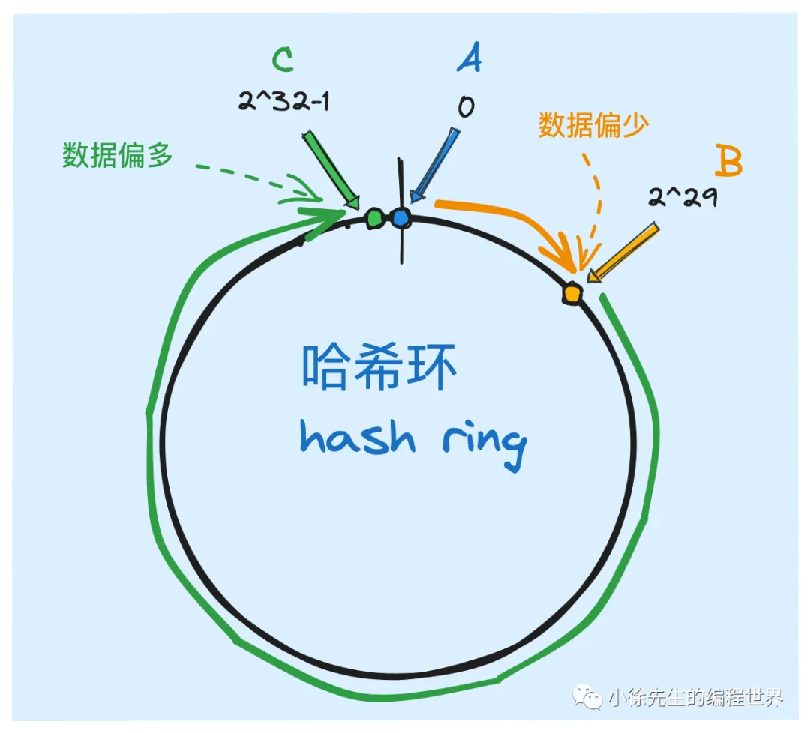
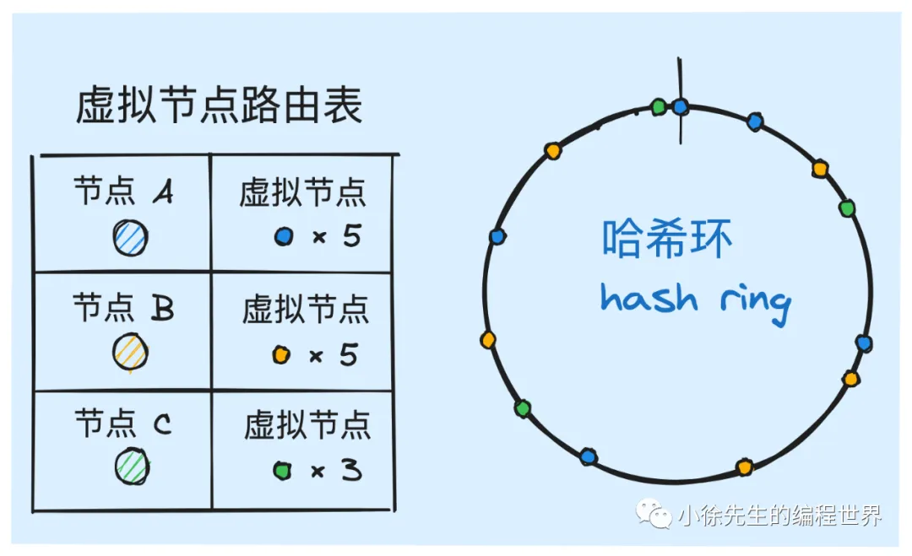

https://mp.weixin.qq.com/s?__biz=MzkxMjQzMjA0OQ==&mid=2247484641&idx=1&sn=764f69ab47ba7b3450f6300fde4f34a5

# 一致性哈希算法原理解析

一致性哈希最大的优势是，在集群节点数量发生变更时，只需要承担局部小范围的数据迁移成本。

## 1. 问题背景

1. 状态服务

- 有状态服务：指的是一类本身需要通过内存或磁盘实现状态数据存储的服务. 比如数据库、消息队列等组件都属于有状态服务.

2. 纵向分治
3. 带权分治
   让性能好的节点多完成一些任务，性能差的节点少承担一些工作. 此时，我们可以给每个节点设置一个权重值，用于反映其性能水平的强弱.
   `每个节点根据其权重值大小在轴上占据对应的比例分区`
   **前缀和+二分**
4. 数据迁移
   一旦集群需要执行扩缩容流程，集群节点数量变更后，原有的映射关系就会被破坏. 为了继续维护这份映射规则，`我们需要执行数据迁移操作，将旧数据迁移到能够满足新映射关系的对应位置`. 这必然会是一个很重的迁移流程，涉及影响的范围是全量的旧节点.

## 2. 一致性哈希

1. 哈希环

   - `[0, 2^32)`的哈希值空间
   - 入环的方式是，针对于节点的标识键 index 取 hash 值，然后使用该 hash 值对 2^32 取模，最后得到的结果就是该节点在哈希环上对应的位置

2. 数据迁移

   - 新增节点
     
   - 新增数据
     通过取哈希并对环长度取模，然后找到顺时针往下的第一个节点，作为操作的目标节点
   - 删除节点
     

   本质上是因为这种环状结构加 ceiling（向上开放寻址） 的方式，使得数据所`从属的节点 index 不再与集群的节点总数强相关，而仅仅取决于数据与节点在哈希环上的拓扑结构`

3. 负载均衡
   
   倘若集群节点数量很少，那么就很可能出现节点位置分布不均匀的情况。
   根本原因：数据样本不够大。
4. 虚拟节点
   1. 误差弥合
      
      合理设置好真实节点到虚拟节点之间数量的放大倍数，那么最终位于哈希环上的`代理节点的数量就会足够多`，这一系列节点在哈希环上的位置就会越均匀，负载均衡的效果就会越好.
   2. 带权分治
      各个节点的性能水平，为其设置一个不同的权重值，保证`性能强的节点拥有更高数量的虚拟节点`，未来就有能力抢占到更多的数据。
