# gin框架底层技术原理剖析

https://mp.weixin.qq.com/s/x8i9HvAzIHNbHCryLw5icg

类似node.js中的koa框架.

## 1 Gin 与 HTTP

1. 背景
   支撑研发团队选择 Gin 作为 web 框架的原因包括：

- 支持中间件操作（ handlersChain 机制 ）
- 更方便的使用（ gin.Context ）
- 更强大的路由解析能力（ radix tree 路由树 ）

2. Gin 与 net/http 标准库的关系
   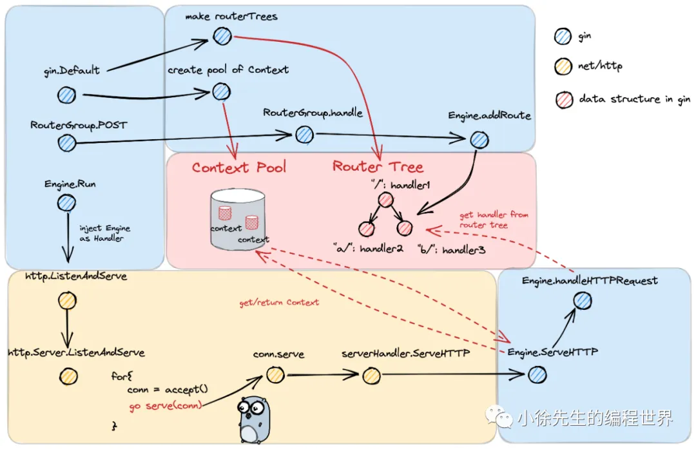
   在 net/http 的既定框架下，gin 所做的是提供了一个 gin.Engine 对象作为 Handler 注入其中，从而`实现路由注册/匹配、请求处理链路的优化.`
3. Gin 框架使用示例

```go
import "github.com/gin-gonic/gin"

func main() {
    // 创建一个 gin Engine，本质上是一个 http Handler
    mux := gin.Default()
    // 注册中间件
    mux.Use(myMiddleWare)
    // 注册一个 path 为 /ping 的处理函数
    mux.POST("/ping", func(c *gin.Context) {
        c.JSON(http.StatusOK, "pone")
    })

    // 运行 http 服务
    if err := mux.Run(":8080"); err != nil {
        panic(err)
    }
}
```

## 2 注册 handler 流程

1. 三大核心数据结构
   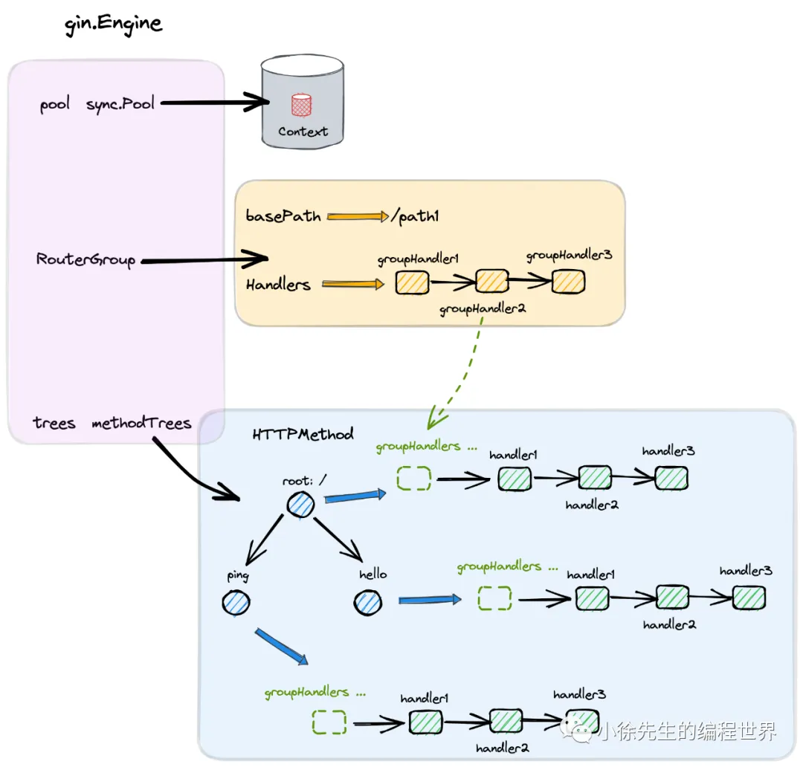
   - pool
   - RouterGroup
   - tree

- gin.Engine

```go
type Engine struct {
   // 路由组
    RouterGroup
    // context 对象池
    pool             sync.Pool
    // 九棵方法路由树
    trees            methodTrees
    // ...
}

// net/http 包下的 Handler interface
type Handler interface {
    ServeHTTP(ResponseWriter, *Request)
}


// engine 可以作为handler注入到http.Server中
func (engine *Engine) ServeHTTP(w http.ResponseWriter, req *http.Request) {
    // ...
}
```

- RouterGroup 路由组
  其中的配置将被从属于该路由组的所有路由复用

  ```go
  type RouterGroup struct {
      Handlers HandlersChain  // 共享中间件
      basePath string       // 组路径前缀
      engine *Engine  // 反向指针
      root bool  // 路由组是否位于 Engine 的根节点
  }
  ```

- HandlersChain
  中间件链，是一个 Handler 的切片

  ```go
  type HandlersChain []HandlerFunc
  type HandlerFunc func(*Context)
  ```

2. 流程入口
3. 初始化 Engine
   gin.Default -> gin.New
   ```go
   func New() *Engine {
       // ...
       // 创建 gin Engine 实例
       engine := &Engine{
           // 路由组实例
           RouterGroup: RouterGroup{
               Handlers: nil,
               basePath: "/",
               root:     true,
           },
           // ...
           // 9 棵路由压缩前缀树，对应 9 种 http 方法
           trees:                  make(methodTrees, 0, 9),
           // ...
       }
       engine.RouterGroup.engine = engine
       // gin.Context 对象池
       engine.pool.New = func() any {
           return engine.allocateContext(engine.maxParams)
       }
       return engine
   }
   ```
4. 注册 middleware
   Engine.Use
5. 注册 handler
   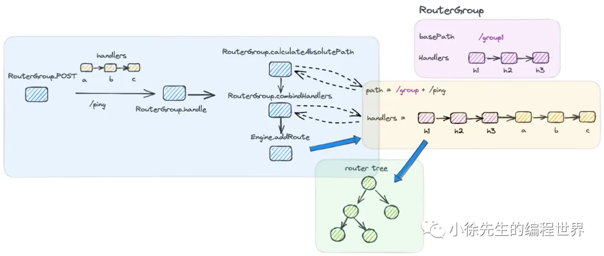

   - 拼接出待注册方法的完整路径 absolutePath
   - 拼接出代注册方法的完整处理函数链 handlers
   - 以 absolutePath 和 handlers 组成 kv 对添加到路由树中

   ```go
   func (group *RouterGroup) handle(httpMethod, relativePath string, handlers HandlersChain) IRoutes {
       absolutePath := group.calculateAbsolutePath(relativePath)
       handlers = group.combineHandlers(handlers)
       group.engine.addRoute(httpMethod, absolutePath, handlers)
       return group.returnObj()
   }
   ```

## 3 启动服务流程

1. 流程入口
2. 启动服务
   一键启动 Engine.Run 方法后，`底层会将 gin.Engine 本身作为 net/http 包下 Handler interface 的实现类`，并调用 http.ListenAndServe 方法启动服务.

```go
func (engine *Engine) Run(addr ...string) (err error) {
    // ...
    err = http.ListenAndServe(address, engine.Handler())
    return
}
```

ListenerAndServe 方法本身会基于主动轮询 + IO 多路复用的方式运行，因此程序在正常运行时，会始终阻塞于 Engine.Run 方法，不会返回.

3. 处理请求

- 对于每笔 http 请求，会为其分配一个 gin.Context，在 handlers 链路中持续向下传递;
- 调用 Engine.handleHTTPRequest 方法，从路由树中获取 handlers 链，然后遍历调用;
- 处理完 http 请求后，会将 gin.Context 进行回收. 整个回收复用的流程基于对象池管理

```go
func (engine *Engine) ServeHTTP(w http.ResponseWriter, req *http.Request) {
    // 从对象池中获取一个 context
    c := engine.pool.Get().(*Context)

    // 重置/初始化 context
    c.writermem.reset(w)
    c.Request = req
    c.reset()  // 清空Context中的数据

    // 处理 http 请求
    engine.handleHTTPRequest(c)

    // 把 context 放回对象池
    engine.pool.Put(c)
}
```

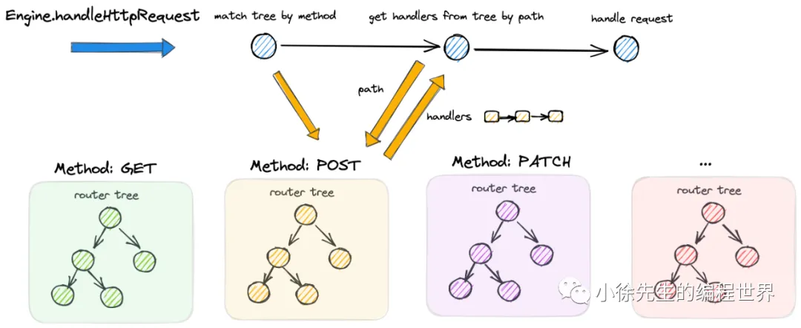

```go
func (engine *Engine) handleHTTPRequest(c *Context) {
    httpMethod := c.Request.Method
    rPath := c.Request.URL.Path

    // ...
    t := engine.trees
    for i, tl := 0, len(t); i < tl; i++ {
        // 获取对应的方法树
        if t[i].method != httpMethod {
            continue
        }
        root := t[i].root
        // 从路由树中寻找路由
        value := root.getValue(rPath, c.params, c.skippedNodes, unescape)
        if value.params != nil {
            c.Params = *value.params
        }
        if value.handlers != nil {
            c.handlers = value.handlers
            c.fullPath = value.fullPath
            c.Next()  // 执行中间件链
            c.writermem.WriteHeaderNow()  // 写入响应数据
            return
        }
        // ...
        break
    }
    // ...
}
```

## 4 Gin的路由树

1. 策略与原理
   - 为什么使用压缩前缀树(而不是HashMap)?
     `匹配动态路由`：path 匹配时不是完全精确匹配，比如末尾 ‘/’ 符号的增减、全匹配符号 `'*'` 的处理等，map 无法胜任
   - 补偿策略
     在组装路由树时，会将注册路由句柄(handler)数量更多的 child node 摆放在 children 数组更靠前的位置.
     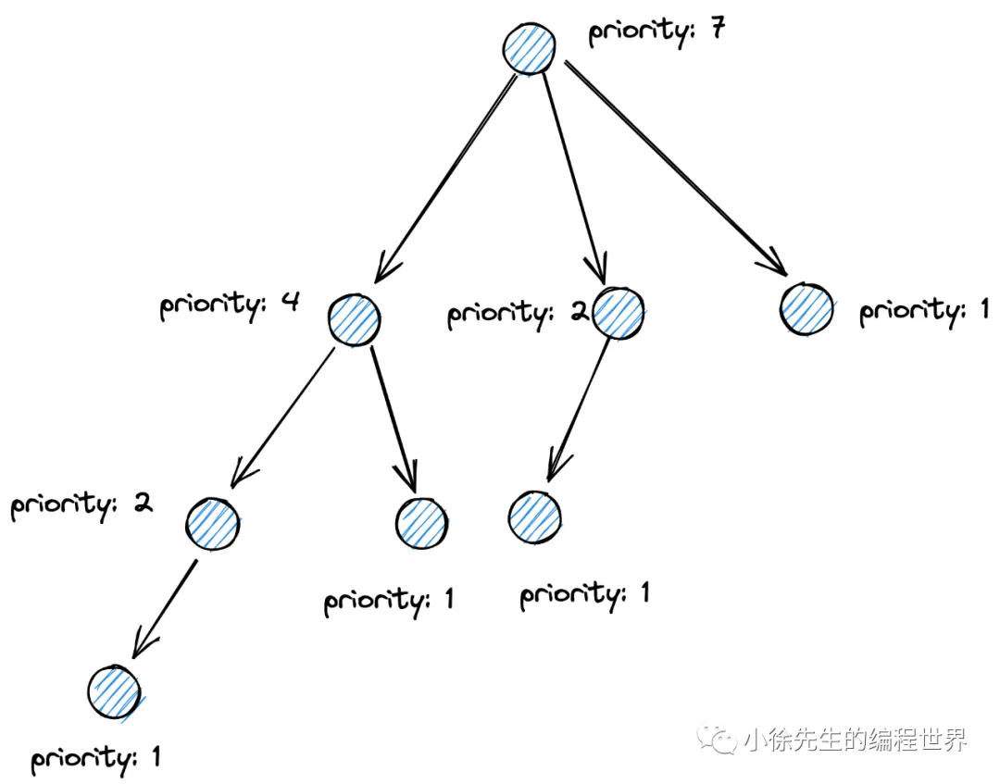
2. 核心数据结构
   对应于 9 种 http method，共有 9 棵 methodTree. 每棵 methodTree 会通过 root 指向 radix tree 的根节点.

```go
type node struct {
    path      string        // 当前节点相对路径
    fullPath string         // path 拼接上前缀后的完整路径
    indices   string        // 子节点首字母索引
    children  []*node       // 子节点列表
    handlers  HandlersChain // 处理链
    priority  uint32        // 路由权重，每有一个新路由经过此节点，priority 都要加 1，incrementChildPrio 中调整
}
```

3. 注册到路由树
   将一组 path + handlers 添加到 radix tree
4. 检索路由树

```go
// 从路由树中获取 path 对应的 handlers
func (n *node) getValue(path string, params *Params, skippedNodes *[]skippedNode, unescape bool) (value nodeValue) {
    var globalParamsCount int16

// 外层 for 循环断点
walk:
    for {
        prefix := n.path
        // 待匹配 path 长度大于 node.path
        if len(path) > len(prefix) {
            // node.path 长度 < path，且前缀匹配上
            if path[:len(prefix)] == prefix {
                // path 取为后半部分
                path = path[len(prefix):]
                // 遍历当前 node.indices，找到可能和 path 后半部分可能匹配到的 child node
                idxc := path[0]
                for i, c := range []byte(n.indices) {
                    // 找到了首字母匹配的 child node
                    if c == idxc {
                        // 将 n 指向 child node，调到 walk 断点开始下一轮处理
                        n = n.children[i]
                        continue walk
                    }
                }

                // ...
            }
        }

        // 倘若 path 正好等于 node.path，说明已经找到目标
        if path == prefix {
            // ...
            // 取出对应的 handlers 进行返回
            if value.handlers = n.handlers; value.handlers != nil {
                value.fullPath = n.fullPath
                return
            }

            // ...
        }

        // 倘若 path 与 node.path 已经没有公共前缀，说明匹配失败，会尝试重定向，此处不展开
        // ...
 }
```

## 5 Gin.Context

1. 核心数据结构
   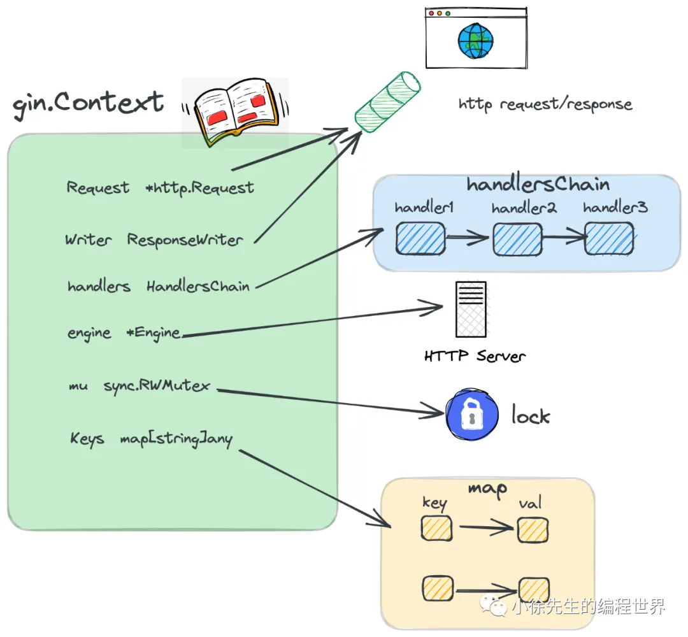
   gin.Context 的定位是对应于一次 http 请求，贯穿于整条 handlersChain 调用链路的上下文，其中包含了如下核心字段

```go
type Context struct {
    // http 请求参数
    Request   *http.Request
    // http 响应 writer
    Writer    ResponseWriter
    // 处理函数链
    handlers HandlersChain
    // 当前的处理进度，即处理链路处于函数链的索引位置
    index    int8
    engine       *Engine
    // 用于保护 map 的读写互斥锁
    mu sync.RWMutex
    // 缓存 handlers 链上共享数据的 map
    Keys map[string]any
    // ..
}
```

2. 复用策略
   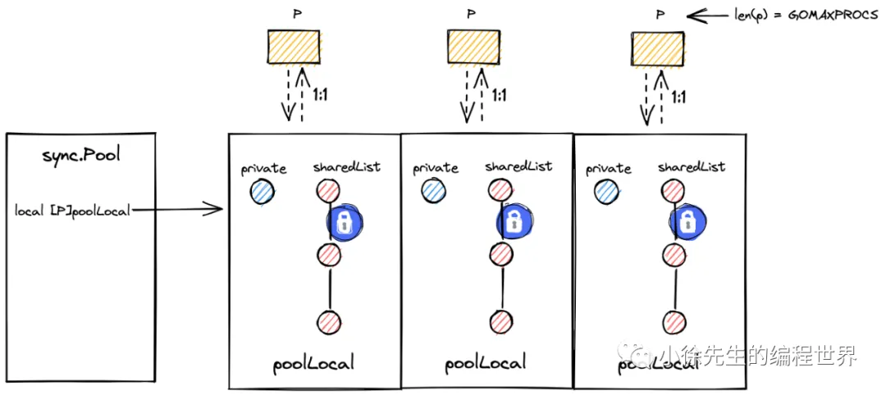
   gin 中采用对象池(回收站) sync.Pool 进行 Context 的缓存复用
3. 分配和回收
   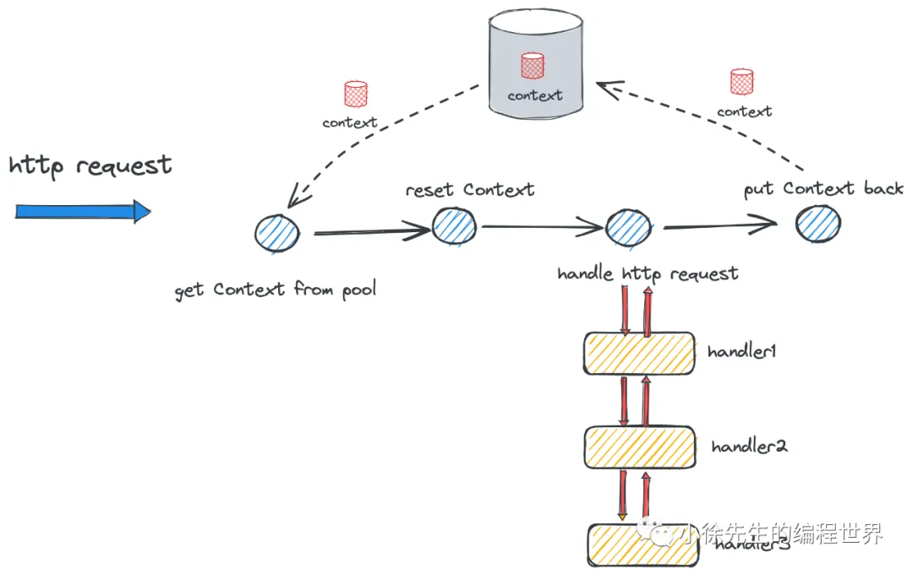
4. 使用时机

- handlesChain 入口
  handleHTTPRequest中，会通过 path 从 methodTree 中获取到对应的 handlers 链，然后将 handlers 注入到 Context.handlers 中，然后启动 Context.Next 方法开启 handlers 链的遍历调用流程
- **handlesChain 遍历调用**
  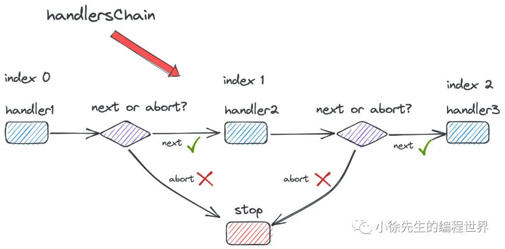
  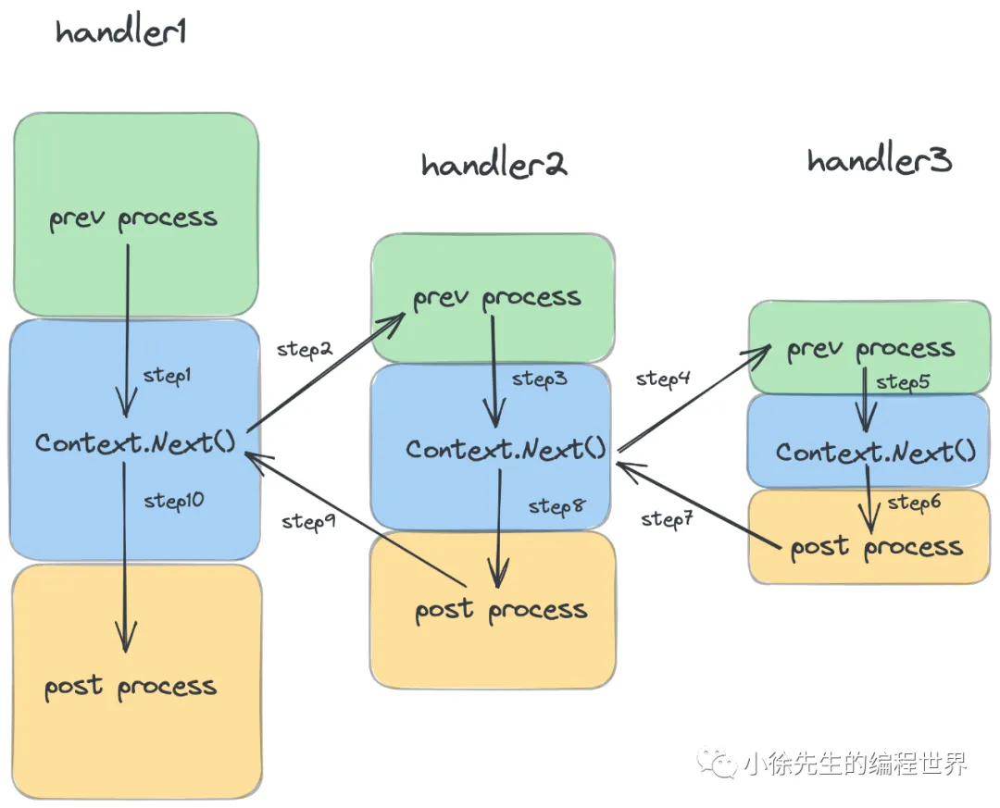
  用户可以在某个 `handler 中通过手动调用 Context.Next 的方式来打断当前 handler 的执行流程，提前进入下一个 handler 的处理中`

  ```go
  func (c *Context) Next() {
      c.index++
      for c.index < int8(len(c.handlers)) {
          c.handlers[c.index](c)
          c.index++
      }
  }
  ```

  ```go
  func myHandleFunc(c *gin.Context){
    // 前处理
    preHandle()
    c.Next()
    // 后处理
    postHandle()
  }
  ```

  用户可以在某个 handler 中通过调用 Context.Abort 方法实现 handlers 链路的提前熔断.

  ```go
  const abortIndex int8 = 63

  func (c *Context) Abort() {
      c.index = abortIndex
  }
  ```

  注册 handlers，倘若 handlers 链长度达到 63，则combineHandlers 会 panic.

- 共享数据存取
  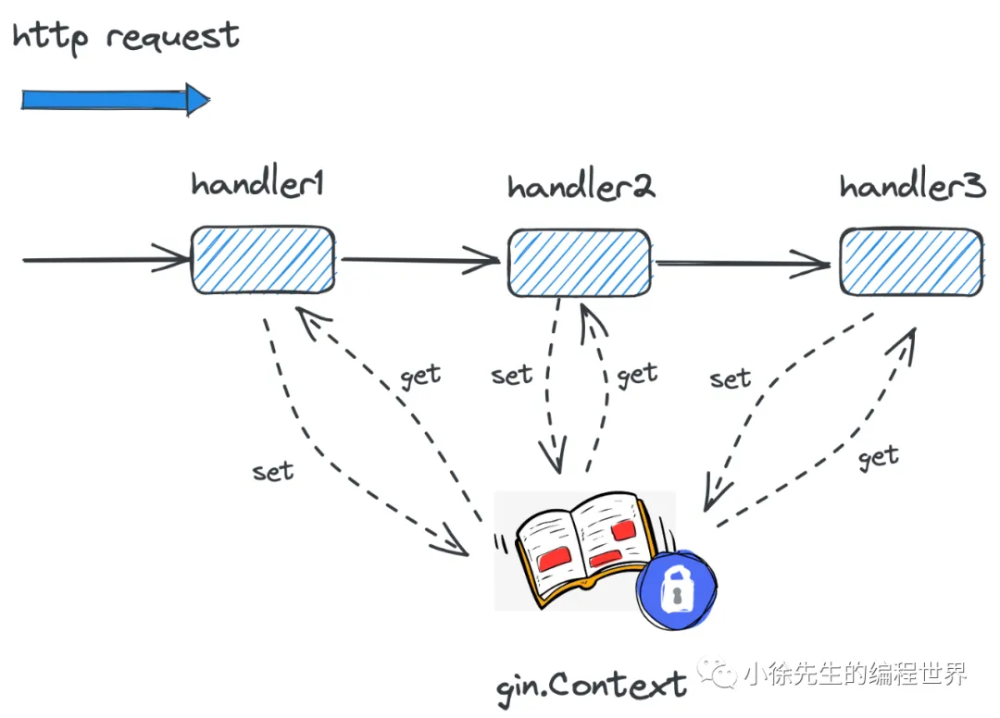

## 6 总结

- gin 将 Engine 作为 http.Handler 的实现类进行注入，从而融入 Golang net/http 标准库的框架之内
- gin 中基于 handler 链的方式实现中间件和处理函数的协调使用
- gin 中基于压缩前缀树的方式作为路由树的数据结构，对应于 9 种 http 方法共有 9 棵树
- gin 中基于 gin.Context 作为一次 http 请求贯穿整条 handler chain 的核心数据结构
- gin.Context 是一种会被频繁创建销毁的资源对象，因此使用对象池 sync.Pool 进行缓存复用
