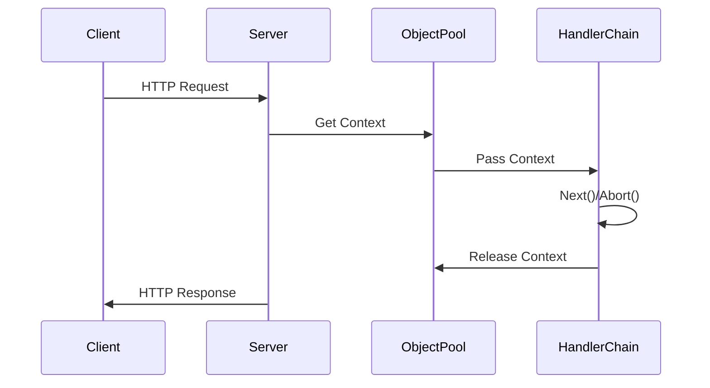

好的，我现在要详细解析Gin框架的底层原理。首先，我需要理解用户提供的文章内容，然后根据这些内容进行深入的思考和总结。文章主要分为几个部分：Gin与HTTP标准库的关系、注册handler的流程、启动服务流程、Gin的路由树原理以及Gin.Context的设计。

首先，我需要确认自己对Gin框架的基本概念和结构是否清楚。Gin是基于net/http的封装，提供了路由、中间件等功能。核心结构包括Engine、RouterGroup、Context以及路由树等。路由树使用压缩前缀树（radix tree）来高效处理路由匹配，Context用于处理请求的上下文，中间件通过HandlersChain来管理。

接下来，我需要分析每个部分的实现细节。比如，注册handler时，如何将路径和处理器添加到路由树中；启动服务时，Engine如何作为Handler注入到net/http的Server中；路由树的具体结构，节点如何分裂和合并；Context如何通过对象池复用，中间件链如何执行等。

在路由树部分，需要深入理解radix tree的结构和操作，包括插入路由和匹配路由的过程。对于Context，要了解其生命周期，如何通过sync.Pool进行复用，以及中间件链的执行流程，特别是Next()和Abort()方法的实现原理。

此外，需要注意一些细节，比如中间件的执行顺序，路由的优先级处理，以及如何处理路径参数和通配符等。可能还需要比较Gin与其他框架（如Echo或标准库）的差异，理解其设计选择的优劣。

在思考过程中，可能会遇到一些问题，比如路由树的具体实现代码逻辑，节点分裂的条件，或者Context在并发下的安全性。这时需要回顾源码或相关资料，确保正确理解每个步骤。

最后，需要将这些知识点系统地组织起来，形成一个完整的解析，涵盖Gin的核心组件和它们之间的协作方式。确保解释清楚每个部分的作用、实现原理以及设计考量，从而全面解析Gin框架的底层机制。

---

Gin 框架是 Go 语言中广泛使用的高性能 Web 框架，其底层设计融合了多种优化策略。以下从核心结构、路由机制、上下文管理和请求处理流程四个维度深入解析其原理：


### 一、核心结构体系

1. **Engine 引擎**

- 继承自 RouterGroup，作为全局路由入口
- 维护九棵方法路由树（GET/POST等）
- 通过 sync.Pool 实现 Context 对象池
- 实现 ServeHTTP 接口兼容 net/http

2. **路由分组机制**

```go
type RouterGroup struct {
    Handlers HandlersChain // 共享中间件
    basePath string        // 组路径前缀
    engine   *Engine       // 反向指针
}
```

- 支持嵌套分组形成树状结构
- 中间件和路径前缀的继承机制

### 二、路由树实现

1. **压缩前缀树优化**

- 节点结构：

```go
type node struct {
    path      string        // 当前节点路径
    indices   string        // 子节点首字母索引
    children  []*node       // 子节点列表
    handlers  HandlersChain // 处理链
    priority  uint32        // 路由权重
}
```

- 动态合并策略：单子节点合并到父节点
- 优先级排序：高频路径前置提升匹配效率

2. \*\*路由注册示例分析

```text
注册路由：
GET /user/list
GET /user/detail
POST /order/create

生成的树结构：
▼ (root)
├─ GET
│  └─ user/
│     ├─ list   (handlers1)
│     └─ detail (handlers2)
└─ POST
   └─ order/create (handlers3)
```

### 三、上下文管理

1. **Context 生命周期**



2. **中间件执行模型**

- 链式调用：通过 index 游标控制执行进度
- 中断机制：设置 abortIndex 跳过后续处理

```go
func (c *Context) Next() {
    c.index++
    for c.index < int8(len(c.handlers)) {
        c.handlers[c.index](c)
        c.index++
    }
}
```

### 四、请求处理全流程

1. **启动阶段**

```go
func (engine *Engine) Run() {
    http.ListenAndServe(address, engine)
}
```

- 将 Engine 作为标准 Handler 注入

2. **请求处理时序**

```
1. 从对象池获取 Context
2. 重置上下文状态
3. 路由匹配（radix tree 查找）
4. 执行中间件链
5. 写入响应数据
6. 回收 Context 对象
```

3. **性能优化要点**

- 路由树使用非递归遍历算法
- Path参数预分配内存池
- 避免处理过程中的内存分配

### 五、设计哲学解析

1. **层次化设计**

- 基础层：兼容 net/http 标准
- 路由层：高效树形结构
- 抽象层：中间件和上下文

2. **性能取舍**

- 内存换速度：对象池化策略
- 时间复杂度：O(path_length) 路由匹配
- 空间压缩：公共前缀合并

通过这种架构设计，Gin 在保持 API 简洁的同时，实现了接近原生 net/http 的性能表现。其核心价值在于通过工程化的设计平衡了开发效率与运行时性能，成为 Go Web 开发的标杆框架。
