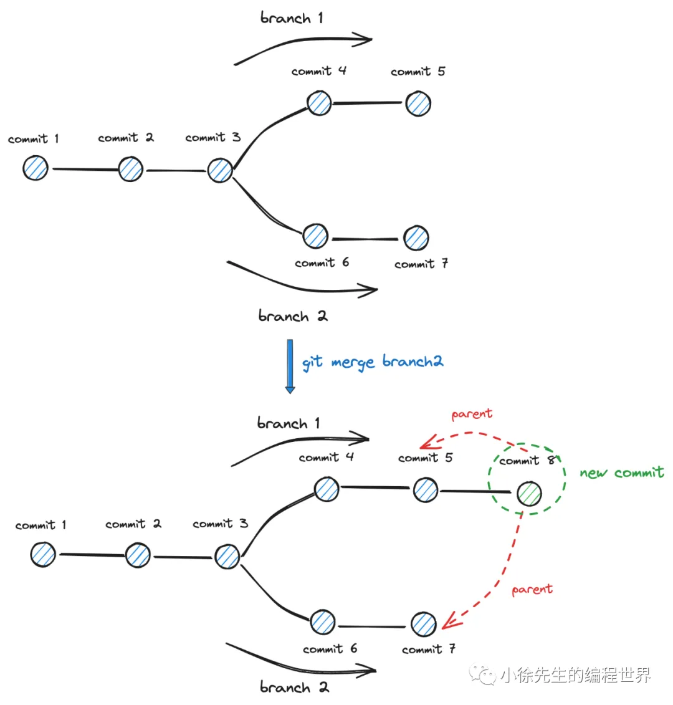
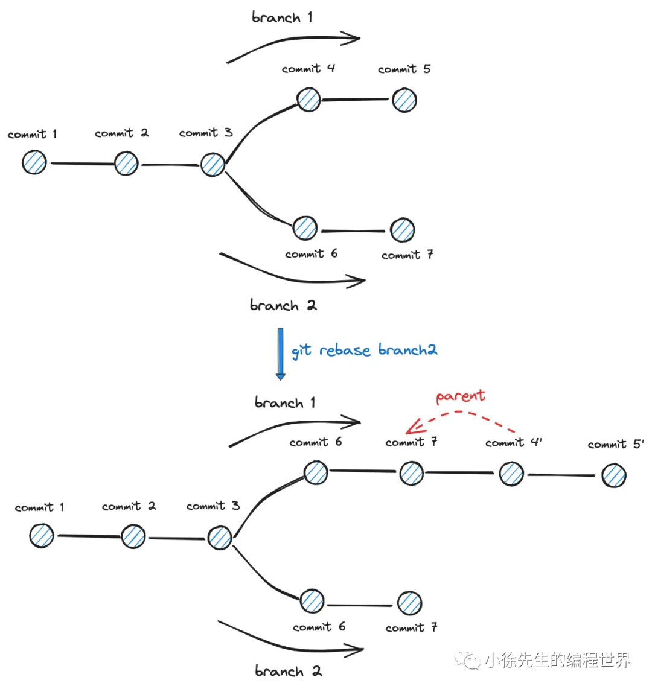
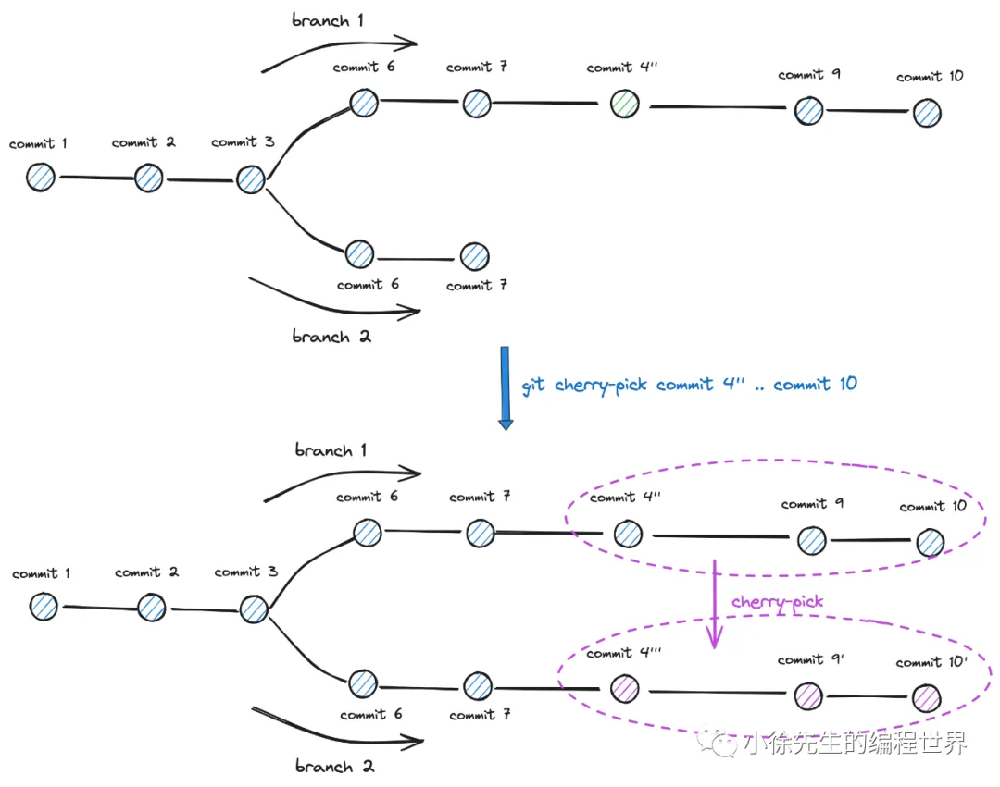

# 万字串讲 git 版本控制底层原理及实战分享

https://mp.weixin.qq.com/s/R73aUyUHJy_j4tMnq4qXGw

## 1 核心概念串讲

1. git
   开源版本控制工具
2. 中央仓库
   存储介质包括托管在`远端集群的中央仓库（如 github）`以及拉取到`单机的本地仓库`.

   中央仓库（remoting repository） 下存储的项目内容可以理解为`达成全局共识的最终结果`，而本地仓库存储的项目内容可以理解为一份临时缓存，内容可能在中央仓库的标准版本的基础上进行一些本地修改，最终需要在遵循规则的前提下才能汇总合并到中央仓库中.
   

3. 本地仓库
   本地仓库（local repository） 在逻辑意义上可以分为：工作区（workspace）、暂存区（stage）、仓库（repository） 三个部分，各自含义展示如下：
   

   - 工作区（workspace）：对应为磁盘中实际存在的项目文件内容
   - 暂存区（stage）：存储修改后还未提交到仓库的一些临时变更
   - 仓库（repository）：存储执行提交操作后进入 git 本地版本链中的内容

4. 提交&分支
   
   所谓`版本，对应的就是一笔 commit 记录；`版本控制指的是在由一系列有明确先后顺序的 commit 组成的版本链的基础上进行的一系列操作，比如向后延伸、向前回溯、平行分叉等.
   `分支，指的是在版本链上的一条独立开发线`. 不同的研发哪怕复用相同仓库，也可以通过拉分支的方式对版本链进行平行分叉，最后再执行合并操作，实现不同 feature 的并行开发.
5. 几个问题

- 问题一：每笔提交需要有一个全局的 commit id 进行唯一性标识，在中央仓库的分布式模型下，`如何保证每笔 commit id 的全局唯一性？`

- 问题二：commit 模型如何实现？`如何实现版本链的延伸、回溯、分叉操作？`

- 问题三：branch 模型如何实现？`拉取分支、合并分支的操作如何实现？`

## 2 底层存储形式探测

- step1：初始化一个 git 项目

```shell
git init git-example
```

- step2：创建监听任务，持续观察 .git 文件夹的变化

```shell
watch -n .5 tree .git
```

- step3：master 分支提交

- step4：test 分支提交
  
- step5：master 分支二次提交

- step6：master merge test
  
  原本版本链基础上衍生出一个新的 commit，并且该 commit 拥有两个 parent 父指针
  

小结：

- git 底层存储放在 `.git/objects` 文件夹下，分为 `commit、tree、blob 三类 object`
- 每个 object 以key-value 形式存在：key（文件名） 是基于 value 生成的哈希字符串
- commit object： 对应于每一次的提交行为，内容包含指向前一个 commit object 的 key，当前 commit 下 tree 的 key；此外还记录了提交人、时间、摘要等信息
- tree object： 对应于每个文件夹，记录了文件夹下子 object 的信息. tree 之间可以进行嵌套
- blob object： 对应为每个文件. value 是文件内容，key 是以文件内容生成的 hash 字符串
- branch head： 对应为每个分支的头指针，指向该分支下一个 commit object 的 key

## 3 实现原理总结串讲

• git 存储模型本质上是一个依赖于`哈希算法的 kv 数据库`

• git 版本控制框架在纵向上是以 `commit object 组成的链表`，在横向上是以 commit object、tree object、blob object 组成的`多叉树`


1. commit 链
   commit 版本链是一种类似于【区块链】 的设计

   - 每个 commit object 的 key 基于 value 通过 SHA-1 算法生成
   - 每个 commit object 的 value 包含 parent 字段，是指向 parent commit object 的 key

   1. 内容安全性(防篡改)
   2. **commit id 全局唯一性**
      commit object 的 key 又称为 commit id. 由于其是`基于提交人、提交时间戳、提交摘要、parent commit id、tree object key 的五维信息取 SHA-1 生成`，因此但凡上述任何一项内容有差异，生成的 commit id 都是不同的.

      对于处在远端的中央仓库，我们每次尝试通过 push 向远端推送一个 commit 时，远端仓库都会对提交版本的正确性进行校验，校验方式是沿拟提交 commit object 的 parent 指针向前遍历，`倘若能再本地找到某个 parent commit object 和远端分支上最后一个 commit object 的 key 值相同，才可能允许这次 push 行为`，以此保证**版本链的连贯性**.
      

      本地不能落后于远端，远端才能接受本地的 push 行为。本地分支需要先执行 merge 或者 rebase 操作，保证本地分支先同步到远端分支的变更后，再尝试进行 push 操作。
      

2. 三层结构
   
   commit 表示一个版本，内部包含tree的根节点；
   tree 是一个`structual sharing`的数据结构；
   blob 是真正的文件内容。

   只要一个 object value 不变，那么 object key 就不变，这个 object 就能得到复用.
   打个比方，只要文件内容相同，不管其文件名是否相同，是否从属于不同的 commit 不同的 branch，其对应的 blob object 都是同一个，都能得到复用；同理，只要一个文件夹下所有子 object 的名称、类型和内容均相同，则其对应的 tree object 就能得到复用.

3. 分支
   
   branch 理解为一条独立的 commit 版本链（ 每次拉分支就是在 commit 链上进行分叉 ） ，`branch HEAD 体现为在 commit 版本链上移动的指针，其指向了分支链上某个特定 commit object 的 key.`

## 4 实用指令

1. git log --graph
   展示版本链拓扑结构

   ```shell
   git log --graph --oneline


   *   8e4b529 (HEAD -> master) Merge branch 'test'
   |\
   | * a24e6d8 (test) second commit
   * | dfa7be2 second commit
   |/
   * 3a3ad28 first commit
   ```

2. git merge 与 git rebase
   

   ```shell
   git log --oneline --graph

   *   b79e36c (HEAD -> master) commit 8
   |\
   | * 9a75b57 (branch2) commit 7
   | * fad3156 commit 6
   * | c440186 commit 5
   * | 3d1198d commit 4
   |/
   * 5845278 commit 3
   * 10f4b01 commit 2
   * 0d3a41d commit 1
   ```

   
   如图所示，切换到 branch1，branch HEAD 指向 commit5，然后执行 git rebase branch2 指令；
   branch1 会复用 `branch2 的 commit6 和 commit7 作为基点`， 然后将对应于 commit4 和 commit5 的两次提交挂载在 commit7 之后；
   `需要强调的是，执行完 rebase 操作后，新追加的两个 commit 应该称为 commit4' 和 commit5' 更为合适一些`，虽然其提交的内容和 commit4、commit5 相同，但此时需要和 commit6、commit7 进行合并并解决可能存在的冲突，且其指向的 parent 也由 commit3 变为了 commit7，因此本质上是两批独立的 commit.

   ```shell
   git log --oneline --graph

   * 19b585d (HEAD -> master) commit 5'
   * 64c93c4 commit 4'
   * 9a75b57 (branch2) commit 7
   * fad3156 6th commit 6
   * 5845278 3rd commmit 3
   * 10f4b01 2nd commit 2
   * 0d3a41d 1st commit 1
   ```

   在 rebase 过程中，倘若变基操作发生冲突，可以在手动修复冲突后执行 git add/rm 操作后，进一步执行 rebase continue 指令推进 rebase 流程：

   ```shell
   git rebase --continue
   ```

   倘若 rebase 过程中发生错误，需要回滚本次操作，可以执行 abort 操作进行回滚：

   ```shell
   git rebase --abort
   ```

   rebase 受推崇的原因：

   - 保持版本链的线性
   - git rebase -i 的交互式变基操作更加灵活

3. 交互式 git rebase
   交互变基的过程会自动打开 vim 模式，让用户能够手动编辑变基过程中所涉及到的一系列 commit：
   - pick commit：正常使用一个 commit
   - squash commit：压缩一个 commit
   - drop commit：弃用一个 commit
4. git cherry-pick
   
   在 git cherry-pick 的过程很可能会发生内容冲突，此时需要手动修复冲突，通过 git add/rm 指令将修复后的内容进行添加或者移除，并在此之后执行 continue 指令继续推进 cherry-pick 进程：

   ```shell
   git cherry-pick --continue
   ```

   倘若本次 cherry-pick 操作需要回滚，执行 abort 指令即可：

   ```shell
   git cherry-pick --abort
   ```

## 5 总结

- git 底层存储介质是一个 kv 数据库，key 是基于 value 通过 SHA-1 算法生成的摘要字符串

- git kv 数据库中包含 3 类 object，commit、tree、blob：

  - blob object：与仓库下的一个文件一一对应. value 是文件内容，key 是哈希摘要

  - tree object：与仓库的一个文件夹一一对应. value 是文件夹下的子 object 信息，key 是哈希摘要

  - commit object：与一次提交行为一一对应. value 包含了前一次提交的 key（parent）；整个仓库文件夹的 key（tree）；以及提交行为信息（committer、note 等）

- 所谓【git版本控制】，概念拆解后得到：

  - 其中的【版本】，对应为一次提交行为及其生成的 commit object

  - 其中的【版本控制】，是在基于 commit 版本链的基础上进行延伸、修改和移动操作

  - 【版本控制】过程中的复用策略是，能复用所有 value 值未发生变化的 object
